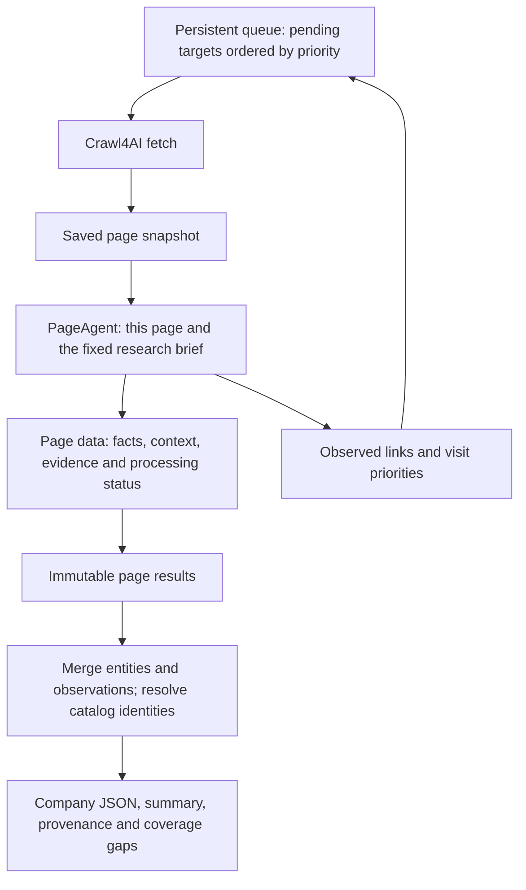

# One page as the unit of analysis and testing

16 September 2026. **Standalone page unit and pilot completed; main runtime not
changed.** Read [results](../page_agent_lab/RESULTS.md). DSPy RLM remains postponed.
Preserve the 0.15.2 baseline for the future autonomous comparison.

**Latest technology boundary:** collect source-name mentions and referenced text
sections per page; classify their company relationships after crawling. See
[the mention-first design](TECHNOLOGY_MENTION_DESIGN.md). This supersedes the
technology-signal portions below that ask the page agent for final classifications.
The new contract is a design; it has not yet been implemented or benchmarked.

Compare two internal implementations: a combined extraction request and a router
followed by objective-specific extractors. Both retain the same page input and
`data`/`links` outputs. See [the two-pass experiment and prompt examples](PAGE_AGENT_TWO_PASS.md).

## Boundary

A concrete `PageAgent` receives one saved page and returns two values:

```python
analysis = await page_agent.analyze(page_input)
page_results.save(analysis.data)
crawl_queue.upsert(analysis.links)
```

This is crawler-integration pseudocode. The standalone lab passes explicit mode
and output arguments and returns a dictionary. Here, `analysis.data` is
the complete page result, including provenance, extracted records and processing
status. `analysis.links` contains observed destinations and their assessments.
The coordinator uses ordinary Python to persist results, update the existing
frontier, claim eligible pages by priority and dispatch work to Crawl4AI and the
page agent. It does not need a separate LLM conversation.



Several page agents can run concurrently when the queue has eligible work. Each
has its own page context, output directory and call accounting. Start with the
existing configured concurrency rather than introducing another hidden default.

## Page input

The factual input is one page: requested/final URL, capture time, content hash,
native Crawl4AI cleaned HTML, and a complete inventory of links and relevant
navigation controls observed in that same capture. Preserve available structured
data such as `JobPosting` separately with its provenance. Rendered HTML supplies
link placement/nearby context that cleanup may remove.

The agent also receives the fixed research brief: target URL, objectives,
technology inclusion rules and scoring rubric. An optional target name is a
search target, not proof that the page operator, job employer or every mentioned
company is that entity. Any origin-page hint for an external job ad is labelled as
such, never silently promoted into evidence from the ad.

Do not supply accumulated company findings, previous agents' narratives, the
entire crawl queue or conversation history. If the page cannot establish an actor
or relationship, retain the ambiguity. Cross-page reconciliation belongs to merge.
This makes inputs reproducible and prevents one page's guesses contaminating
another page's extraction.

The agent does not fetch other pages. It returns navigation recommendations for
the controller. Catalog identities can be resolved after collecting page results,
using the existing catalog search/MCP functionality and a frozen catalog snapshot.

## Data output

Reuse the existing objective and source concepts. A page result contains:

| Attribute | Content |
|---|---|
| `source` | Page ID, requested/final URL, capture time and content hash. |
| `page_context` | Page kind, language, stated operator/employer and a concise source-grounded description. Unknowns remain null. |
| `company_profile` | Legal/trading identities, identifiers and descriptions stated on this page. |
| `products_services` | Named services/products with descriptions of what the company offers. |
| `jobs` | Job identities, titles, stated employer, location, requirements and application URLs. |
| `technology_mentions` | Source names and referenced original sections/context; final eligibility and company relationships are decided after collection. |
| `certifications_compliance` | Attributed credential/compliance claims, with scope, dates and document references when present. |
| `people`, `company_contacts`, `locations` | Named people and roles, exact business contact values/owners, addresses and offices. |
| `company_relationships` | Source-supported relationships with entity identities, direction, dates and ownership basis where stated. |
| `document_links` | Financial reports, certificates and other relevant documents, with period and discovery context. Contents remain unexamined. |
| `external_links` | Every external occurrence, its full URL and surrounding context; optional assessments remain separate from verified corporate facts. |
| `processing` | Per-objective and per-component completion, unprocessed sections, errors/review items, prompt/model versions, call IDs, tokens and elapsed time. |

Do not create a competing set of synonymous runtime fields simply to match this
table. Keep `Findings`, `Source`, `ExternalLink` and existing objective names where
they fit; introduce a page-result envelope with a versioned contract.

Each finding preserves source wording and exact evidence fragments, alongside a
useful description. Technology mentions preserve the original sections needed to
interpret actors, dates, job requirements and alternatives. A separate final
classifier produces technology findings with supported actor, scope and
relationships. Do not turn a job requirement into a company-wide deployment claim.
Services, regulations and generic categories retain their source context; final
eligibility determines whether a name belongs in the specific-technology catalog.

Evidence fragments can be disjoint when intervening text exists. Validate their
positions and their combined semantic support; do not invent a contiguous quote.
Programmatic provenance checks and semantic attribution checks remain distinct.

An empty array means none extracted from examined content, not that the company
lacks that information. Data and link processing have independent status: failed
record validation must not discard successful link recommendations, and failed
link scoring must not discard useful extracted data. Pending items remain visible.

## Link output and ordering

Every link assessment is joined to an observed link ID. The host supplies full
URLs and context from the captured page and rejects invented IDs/destinations.
Repeated occurrences stay available even when they share one crawl target.

| Field | Meaning |
|---|---|
| `link_id` | Identifier for the observed occurrence. |
| `url` | Full destination URL; preserve the original href separately. |
| `source_page_id` | Where it was found. |
| `anchor_text`, `region`, `context` | Page-local evidence for its interpretation. |
| `priority` | Integer 0–100 from a fixed agent scoring rubric; null means unassessed. This is an ordering heuristic, not a calibrated probability. |
| `objectives` | Which research objectives the destination might help and whether it is direct evidence or a navigation hub. |
| `reason` | Short explanation grounded in this page's link context. |
| `target_relevance` | Target company, evidence about the target, related company, unrelated or unknown. |
| `link_purpose` | Recruitment, group information, report archive, support, social profile and similar navigation roles. |
| `relationship_hint` | Separate optional company relationship; distinguish explicit text, contextual inference and unknown. |
| `assessment_status` | Assessed, unassessed or failed, independent of visit eligibility. |

All agents receive the same rubric and objective priorities. A direct vacancy list
or ownership page should rank above another general product page when those are
high-priority objectives. Links can have several useful objectives; the chosen
priority must be explainable from the recorded assessment.

The initial queue policy is straightforward: process eligible pending targets by
their agent-produced priority, using deterministic tie-breaking. On duplicate
discoveries, use the maximum applicable assessed priority and retain all source
assessments. Link frequency alone must not increase priority, because repeated
footers would dominate. Keep the policy explicit and testable; do not introduce
another model or invisible semantic reranking in the coordinator.

Normalize URLs for crawl identity while keeping full observed URLs in provenance.
Preserve query parameters that change page content, such as pagination. Redirects
and already-claimed targets must not cause duplicate work. Distinguish pending,
in-flight, fetched/analyzed, retryable failure and excluded targets; a failed fetch
is not successful coverage. Retry extraction against a saved page without refetching.

Eligibility remains a host responsibility: configured scope, public HTTP(S) pages,
document-only handling, budgets and retry limits still apply. High priority cannot
establish ownership or permission to expand into an unrelated site. Retain excluded
links and the reason. The coordinator stops at an explicit configured condition and
records it. Do not manually stop a benchmark early and call it a completed crawl.

## Sitemap, pagination and embedded pages

Sitemap discovery seeds the queue; it is not evidence of page contents. Seed entries
may receive a documented provisional priority from metadata. Once a page supplies
an observed contextual assessment, it updates that candidate. Preserve the scoring
basis so seed hints and page assessments are distinguishable.

Include iframe sources and URL-based pagination in the observed navigation
inventory. Some next-page/load-more controls have no URL. Represent those as a
typed navigation action referencing a host-observed control ID and source page
state, in the same visit-target collection. The fetcher validates and executes the
bounded action and returns another page snapshot. Do not let the model invent
arbitrary browser code or silently lose these controls because they are not anchors.

Store every external-link occurrence, including destinations not selected for
crawling. An external recruitment platform can contain target-company evidence;
its own vendors and footer contacts are not automatically the target's vendors
and contacts. A source page may describe several distinct companies.

## Small agent does not mean an unbounded workflow

For a normal-sized page, use one structured request containing records and link
assessments as a baseline. Compare it with routing plus specialized extraction;
do not assume either architecture is better before testing. Run deterministic
schema, source and observed-ID checks, with a bounded correction only for failed
items. Do not rerun correct records because another objective or link failed.

For long pages, split by document structure, carry page/section context into each
request and use overlap at boundaries. Combine results within the page agent and
track section coverage. A large link inventory can use additional page-local
batches, but must remain explicit in call accounting; returning both outputs does
not guarantee one model request. Do not silently truncate HTML or omit link tails.

The current implementation spends many calls reviewing evidence and technology
metadata synchronously before the next page. Merely wrapping that implementation
in an `Agent` class would preserve the cost. Benchmark the smaller request contract
and retain targeted semantic checks where actual errors justify them.

Keep every source-supported technology observation even if catalog metadata is
pending. After collecting pages, resolve repeated technology names together, using
name plus disambiguating context and catalog version as the lookup identity. A
name-only cache would misresolve ambiguous abbreviations. New proposals still need
the existing category/description contract and administrator approval.

## Merge

Persist immutable page results as they finish. Final merge groups established
entity/technology identities, deduplicates equivalent observations and combines
their evidence references. Preserve different actors, dates, alternatives and
signals as distinct observations. Do not flatten subsidiary evidence into a parent
company's own use, or convert several job requirements into confirmed deployment.

Retain source names and evidence independently of canonical catalog IDs. Catalog
failures do not erase facts. Contradictions and unresolved identities remain
reviewable. A later company summary may use a model over these structured records,
but each factual summary claim must reference its supporting record IDs.

## Unit of testing

A semantic test case consists of one frozen page snapshot, its link/control
inventory, the fixed brief, expected supported records, explicit negative cases
and expected relative link priorities. Model/prompt settings and any catalog
snapshot must be pinned. Test inputs do not contain earlier company findings.

| Fixture | What it establishes |
|---|---|
| Careers landing page | Returns navigation to real vacancies even when it contains no individual openings; ranks the vacancy destination above routine footer links. |
| Job detail | Captures title, employer, technologies and attributable business contacts with complete evidence; distinguishes use from candidate requirements. |
| Team expertise in a job ad | Preserves team scope for Azure Pipelines instead of forcing role scope. |
| Ab Initio source | Retains the supported observation while canonical catalog metadata is pending. |
| DORA/WCAG/VPN/XML/JSON negatives | Prevents regulations, standards, generic categories and formats from entering the project's specific-technology catalog. |
| Contact page | Retains phones/emails with supported owners; uses unknown attribution when necessary; still examines every other objective. |
| Ownership/group page | Extracts direction, named parties and dated percentages without equating voting rights with equity. |
| External job-platform page | Separates the employer's claims from platform/map-provider footer information. |
| Long page | Preserves claims spanning section boundaries and reports any unexamined sections. |
| Paginated listing/embedded report archive | Returns the observed next target/control/iframe; document links do not become parsed financial facts. |
| Partial malformed response | Keeps valid data and links, marks missing items explicitly and retries only bounded failures. |

Separate deterministic contract/provenance tests from paid semantic evaluations.
For LLM evaluations, compare supported fields and relative rankings, not exact
wording or exact numeric scores. Report supported retention, false positives,
attribution/evidence correctness, link coverage, calls, latency and cost. Repeat
promising configurations before claiming stable gains.

Queue tests cover priority updates, stable ties, duplicate occurrences, in-flight
claims, failed-page retries, redirect aliases and excluded high-score targets.
Merge tests cover retained sources, repeated-name ambiguity and distinct company/
team/role relationships. Page-level tests do not establish autonomous coverage;
the final integration test must run from a URL to a configured stopping condition.

## Existing code and implementation sequence

- `research.py:extract_saved_page` currently mutates the whole `ResearchResult`.
  Refactor the boundary to return a complete page-owned result.
- `research.py:extract_window` already extracts all objectives, but chains evidence,
  source and catalog review. Move navigation assessment into page-local processing
  and separate global catalog resolution from page completion.
- `research.py:assess_links` currently assesses global candidate batches. Page
  recommendations should populate the existing `CrawlQueue` directly, leaving
  only explicit handling of sitemap-only/unassessed candidates outside this unit.
- Reuse `Source`, `Finding`, `Findings`, captured external-link context and the
  queue's URL handling where sound. Avoid a generic agent framework, interface
  hierarchy or a wrapper that still reaches into the global result.

First implement the page contract, prompt and a standalone saved-page runner.
Validate it on the focused fixtures before integrating queue scheduling. Then
connect the coordinator, add final merge/catalog handling and run an uninterrupted
autonomous comparison. Preserve the unchanged baseline as a separate control: the
earlier 12-page run was stopped manually despite limits of 30 pages / 320 calls,
and its queue already contained the highly rated vacancies page.
