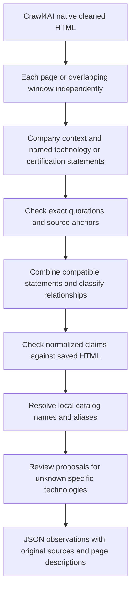

# Page descriptions before technology normalization

For the subsequent source-review and normalization fixes, see the
[0.12.1 follow-up](PAGE_STATEMENTS_REVIEW_RESULTS.md). This document preserves the
earlier experiment and its limitations.

The optional 0.11.1 prototype implements the requested separation: each page supplies
its own descriptions and quotations; a later pass combines compatible observations,
classifies relationships, excludes generic items and resolves catalog identities.
The default crawler still uses its existing extraction flow. This experiment does
not replace job, service, contact, ownership or other objective extraction.

## Prompts and flow

The editable prompts are in [statement_prompts.py](src/company_research/statement_prompts.py):

- `PAGE_STATEMENTS` asks how the named item relates to this company on this page.
  It preserves company/holder, application, section, job title, qualifiers and exact
  quotations. Unknown applications stay null. Skills, requirements, development,
  offerings, current use and future certification are explicitly distinguished.
- `NORMALIZE_STATEMENTS` receives the descriptions plus their quotations. It must
  account for every primary statement, keep different jobs/subjects/relationships
  separate, and preserve source names until catalog resolution. Company background
  cannot supply evidence for an unstated technology.



This describes the implemented prototype, not an accuracy guarantee. Quotation presence
is a mechanical check. Normalized claims receive the existing source-meaning review;
the generated page descriptions do not yet receive an independent semantic review.
The output marks that limitation explicitly. Generated context is omitted from the
source-meaning review input so it cannot substitute for source evidence.

`extract_page_statements(page, llm, root)` and
`consolidate_page_statements(statements, pages, catalog, llm, root)` are exposed by
[statements.py](src/company_research/statements.py). Both use the existing saved `Page`,
`OpenRouter`, `TechnologyCatalog` and research configuration objects. No new CLI mode
or automatic submission path is enabled.

## What is retained

This is an actual page description from the saved NOVELIC experiment, abbreviated
to its useful fields (the artifact also contains source URL, page/hash, quotations
and evidence status):

```json
{
  "kind": "technology",
  "subject_name": "NOVELIC",
  "subject_kind": "company",
  "source_name": "CATIA",
  "context": "NOVELIC lists CATIA as a tool in the 'Design and Modeling' work domain in its Mechanical Engineering Skills table.",
  "application_context": "Design and Modeling",
  "section_heading": "Mechanical Engineering Skills",
  "job_title": null,
  "qualifiers": []
}
```

Its appropriate normalized relationship is `advertised_expertise`. A source saying
the company uses a tool can support `stated_use`; a job requirement alone cannot.
Named products the company creates or offers can use `develops` or `offers` without
being counted as its internally deployed stack.

Another saved statement preserves that NOVELIC is working on prerequisites for
IATF 16949:2016 in automotive electronics design. That must remain `working_toward`,
with its scope, rather than become a current certificate. Credential holders can
be companies, people, products or facilities and cannot be exchanged at normalization.

Each normalized record retains `statement_ids` and `page_contexts` along with the
original evidence sources. Repeated compatible observations preserve all page
descriptions when merged. Unknown names proceed to the existing proposal process;
absence from the catalog is not an instruction to discard a specific product.

## Experiment provenance

Six saved NOVELIC pages were used: mechanical engineering, AMS/RF design, quality
management, analog design recruitment, data engineering recruitment and the ACAM
product page. Their native HTML totals **308,738 characters**. There were **zero new
page fetches**, no PDF work, no submissions and no database writes.

Frozen expectations cover 32 technology observations from the earlier run and three
credential claims. These are regression controls, not exhaustive labeled truth.

1. `data/novelic-page-statements-v1/` preserves the first attempt. Whole-page
   extraction and full re-extraction on quotation errors produced 221 statement
   versions, only ten mechanically source-matched. Both normalization attempts
   failed. It used 14 calls and $0.024109 of reported cost.
2. `data/novelic-page-statements-v1-recovered/` reuses the final extraction response
   for each page: **113 unchanged descriptions**. Exact anchors and quotation-only
   repairs increased mechanically matched descriptions from **45 to 104**. The
   nine remaining descriptions were kept for review. Repair cannot rewrite names,
   subjects, descriptions or qualifiers just to make a record pass.

The recovery is exploratory, not a controlled comparison: it changes evidence
handling, reduces normalization batches to twelve and enables low reasoning for
normalization and subsequent review. Page extraction and quotation repair used
reasoning disabled. Both phases use DeepSeek `deepseek/deepseek-v4-flash-0731` on
Wafer, a 65,536-token output allowance, 120-second call deadline and a shared 60-call
cap. Copied earlier calls are counted once in the cumulative cost.

The recovered page descriptions were generated by the earlier prompt. Later prompt
improvements, including observed heading choices and the explicit rule against
"likely" applications, have not been measured in a fresh full extraction. Each
phase contains its own implementation snapshot and call artifacts.

Final recovery results are in
[comparison.json](data/novelic-page-statements-v1-recovered/comparison.json), with
[manual audit](data/novelic-page-statements-v1-recovered/manual-audit.json) and
[complete output](data/novelic-page-statements-v1-recovered/statement-result.json):

| Measure | Result |
| --- | ---: |
| Page descriptions | 113 |
| Descriptions with mechanically matching quotations | 104 |
| Normalized technology records before final gates | 58 |
| Automatically accepted technology records | 25 |
| Technology regression controls retained | 20 / 32 |
| Credential regression controls retained | 0 / 3 |
| Statements awaiting normalization or quotation repair | 46 |
| Explicit exclusions | 2 |
| Page description data, excluding provenance | 43,590 characters |
| Statements including stored sources and repair history | 159,130 characters |
| Cumulative calls across both phases | 48 |
| Reported cost across both phases | $0.0898446 |
| Calls with unknown cost | 2 deadlines |

There were 46 successful responses, 551,071 reported input tokens and 179,398 output
tokens. The recovery added 34 calls and $0.0657356 reported cost to the initial phase,
plus the two calls of unknown cost. These cumulative development costs do not estimate
the cost of one clean production run. Smaller descriptions did not remove the cost of
raw-source review, retries or catalog processing.

Eighteen of nineteen engineering expertise controls and two of thirteen job controls
were retained. Quotation failures in generated alternative-group wording blocked
several job observations; a timeout and identity/ID errors held normalization batches.
Catalog resolution returned incomplete or unexpected names for additional records.
The three company credentials are present in the page descriptions, but their final
batch failed. These are workflow failures, not findings that the company lacks those
credentials or technologies.

The automatic total of 25 is **not verified accuracy**. It includes proposal drafts
that still need administrator review. The generic Cadence collection was correctly
excluded, but Norasoft's final group remains pending and AutoPLANT remains blocked at
catalog resolution. Thus this experiment does not establish that every previous
manual problem is fixed.

Final verification covered **110 Python tests**, including three real browser tests,
and **38 backoffice tests**, plus Ruff, ty, wheel/source builds, `git diff --check` and
all six saved-source hashes. The final implementation snapshot is separate from the
live-run snapshot. No active model run remains. The optional flow is **not ready to
replace the default crawler**.

Reproduce the initial experiment in a **new** output directory:

```sh
.venv/bin/python company_research/benchmarks/compare_page_statements.py --help
.venv/bin/python company_research/benchmarks/recover_page_statements.py --help
```

## Quality findings

- The per-page contexts retain useful distinctions that a flat name list loses:
  engineering expertise, job requirements, proprietary product context and the
  scope/status of certification claims.
- Quotation repair should operate independently from description generation.
  Re-extracting a whole page to fix quotation formatting introduces unnecessary
  versions and can change previously useful descriptions.
- A mechanically matched quotation does not validate its accompanying prose.
  The saved Python job statement added "likely including building data pipelines"
  to its application context. That inference should not be published as a verified
  use of Python. The new prompt explicitly forbids this, but that still needs testing.
- Normalization can misassign statement IDs and duplicate a standard version in
  both name and version. These failures must remain visible, with affected statement
  IDs pending. Final code provides specific identity mismatch feedback and a correct
  standard/version example. This was added after the live recovery started.
- Keeping vendor collections out of technologies and preserving named proprietary
  software remain manual audit cases. An automated review pass is not ground truth.

The next focused test should validate the page descriptions themselves against the
raw source, then retry only unfinished normalization groups. A single problematic
item currently prevents its entire normalization batch from being accepted. Smaller
record-level correction would reduce that failure impact before integration into the
default crawler.
