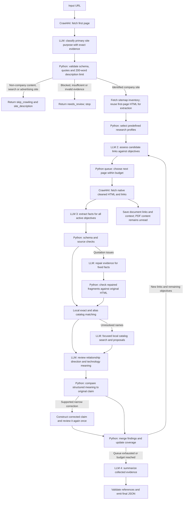

# Site classification, research profiles and final summaries

Design and implementation notes, updated for version 0.17.0 / schema 1.11. The URL crawler
implements first-page admission, profile-based objective priorities, ten objectives
including certifications and document links, and sourced summaries. All ten objectives remain available
on every page. Automatic later profile revisions, dynamic extraction schemas and PDF
inspection remain planned. No crawler pipeline deployment is part of this step.

## Request flow

The LLM assesses relevance and extracts information. Python selects the next URL,
enforces limits and chooses schemas from predefined profiles. Website content and
link labels remain untrusted data, including text inside apparent certificates.

The first supplied page is fetched before classification; redirects are recorded and
the destination determines sitemap scope after admission. Reuse that HTML for normal
extraction. Sitemap URLs are navigation hints, never classification evidence. An
unclear first page stops with `needs_review`; there is no fallback exploration of
about pages. This intentionally sacrifices some recall to prevent researching
unrelated sites. Model corrections use the same captured page only.

Admission requires a source-supported company or brand and a corporate/product/service
purpose. Company-owned stores, SaaS products and advertising agencies can qualify.
An incidental blog does not make a corporate site a content portal. Conversely,
publisher ownership, copyright, an About link and an advertising sales page do not
make a news, entertainment, community, search or classified-ad destination eligible.
A separate publisher's corporate website can qualify. The gate applies to the initial
target, not each subsequent evidence page or every external domain observation.

For skips, `result.json` has `status: "skip_crawling"`,
`stop_reason: "not_company_website"`, `site_description` (maximum 200 whitespace-delimited
words), the sourced `site_profile`, saved first-page provenance and usage. No detailed
records are extracted; every objective stays `not_assessed`. Uncertainty, fetch/model
failure and invalid evidence return `needs_review` without further crawling. Browser
rendering assets, redirects, robots checks and bounded retries are still permitted.

## What each LLM request receives

| Request | Input | Structured output |
| --- | --- | --- |
| Site classification | First page's complete native cleaned HTML and source URL only | Crawl decision, description ≤200 words, primary site types, operator/brand, activities and exact source fragments |
| Link assessment | Current site profile, active objective descriptions, coverage, candidate IDs/URLs/titles/anchor labels | Potential and direct/navigation role for each objective, plus a short reason |
| Page extraction | Native cleaned HTML window and URL, all objective schemas, attribution/evidence rules | Atomic findings with source names, exact fragments and attribution |
| Evidence repair | Fixed records with validation issues and the same HTML window | Exact quotation fragments only; unsupported values stay reviewable |
| Technology resolution | Extracted names/context, local exact/alias matches and initial search candidates; optional local search tool | Validated existing identity or administrator-review proposal |
| Interpretation review | Source-matched relationship/technology records and their quotations | Supported source parties, technology specificity and signal; code checks these against the claim |
| Bounded correction review | Same-source candidate with reversed parties or corrected technology signal | A second review decision; original record and correction lineage retained |
| Final summary | Validated findings, record IDs, source references, reviewed site profile and coverage gaps | Site summary, company overview when identifiable, grouped offerings, limitations and supporting record IDs |

The final summary uses collected evidence and may not introduce new company facts.
Validate its references against the findings actually supplied. For inputs that exceed
the summary budget, consolidate findings in bounded groups while preserving record IDs;
never silently discard the last pages. A failed summary request must preserve the
structured findings and report that the summary is unavailable.

## Site types and research profiles

Keep site purpose separate from the organization operating it. A news website may be
operated by a company selling advertising and subscriptions. A company can operate
both a service website and a community forum. Classify the supplied site's primary
purpose: a forum is skipped even if a company operates it. Mixed/unknown purposes
cannot proceed automatically. A later operator-initiated run can revisit the decision.

Use a small controlled vocabulary and predefined objective descriptions/schemas.
The model chooses supported labels and activities; it does not invent a new schema
or executable crawl instructions for each website.

| Profile | Additional focus | Useful page signals |
| --- | --- | --- |
| General admitted company | Purpose, operator, ownership and contact details | Homepage, about, contact, legal identity |
| Service provider | Services, target customers, industries, locations, credentials and explicit client relationships | Services, industries, case studies, certifications, quality, trust/security |
| Product/software company | Products, capabilities, integrations, business customers and credentials | Product pages, integrations, security/trust, pricing, partners |
| Manufacturer | Manufactured products, capabilities, facilities and quality credentials | Products, capabilities, factories, quality, certifications |
| News/media, entertainment, community, search or advertising portal | Return first-page description and `skip_crawling` | No follow-up pages |
| Mixed or unknown | Retain uncertainty with `needs_review` | No follow-up pages |

These are priorities, not assumptions that the information exists. Jobs, people,
contacts, company relationships and technology signals remain available where
applicable. Certifications are relevant to several profiles, not only service firms.

Check every fetched page for all active objectives regardless of why it was selected.
Also detect cues that justify adding a profile. Activate new objectives from evidence,
record the change and reassess previously saved HTML when those objectives were not
examined. Track that additional processing against the model budget. Never label a
disabled objective `not_found`; use `not_assessed` or a separately explained
`not_applicable` decision. Finding one service or certificate does not complete a
collection.

## Certifications and compliance claims

Add `certifications_compliance` as a structured objective. Preserve the website's
claim separately from independent verification of the credential.

Suggested observation fields:

- `subject_name` and `subject_kind`: company, product/service, facility, person or
  unknown. Associate the finding with the specific named entity, not every company
  or domain in the group.
- `standard_name`, `standard_version`: for example ISO 9001, ISO/IEC 27001 or PCI DSS;
  preserve the source wording and leave an unstated version unknown.
- `claim_type`: certification, compliance, working_toward or explicit_negative.
- `scope`: the actual covered organization, facility, activities or services when
  stated. A subsidiary's certificate does not establish group-wide certification.
- `issuer_or_assessor`, `certificate_or_report_id`, `issued_on`, `valid_until`:
  nullable source facts. Do not infer an issuer or a current validity period.
- `document_url` and `document_type`: certificate, AOC, ROC, SAQ or other explicitly
  identified supporting document. A link alone does not mean its content was checked.
- `verification_level`: website_claim, supporting_document_seen or
  issuer_record_checked. Only advance this through an actual recorded check;
  source text matching is not issuer verification.
- Existing source fields: URL, fetched time, HTML hash, evidence fragments and
  evidence status. Preserve contradictions and dated claims.

Examples to include in the extraction prompt:

| Source statement | Expected treatment |
| --- | --- |
| “Our managed hosting service is certified to ISO/IEC 27001.” | Certification claim, scoped to that service; issuer and validity unknown unless provided |
| “We help customers obtain ISO 9001 certification.” | A service offering; no credential claimed for the provider |
| “Our checkout uses a PCI DSS compliant payment provider.” | Claim attributed to the payment provider; no inferred compliance for the merchant |
| “We are working toward ISO 27001 certification.” | Working toward; no current certification asserted |
| “Certificate valid until 31 December 2024.” | Preserve the stated date; flag the supplied document as expired as of the run, without claiming no replacement exists |

ISO develops standards but does not issue certificates; record the certification
body when supported. [ISO certification guidance](https://committee.iso.org/certification.html).
For PCI DSS, retain the specific compliance claim and validation document type.
PCI SSC identifies ROC, AOC and SAQ documentation and does not recognize generic
“compliance certificates” as its validation documentation.
[PCI SSC guidance](https://www.pcisecuritystandards.org/faqs/1220/).

The current fetcher excludes PDFs. Certificate links can still be retained as evidence
links, but inspecting PDF documents requires a separately implemented document fetch
and text extraction path with its own size, page and request limits. Mark unfetched
documents as unexamined. Login-gated trust portals likewise leave a coverage gap.

## Result and implementation order

Add `site_profile` and `company_overview` to the research result alongside the existing
atomic findings, technology summary and objective coverage. Site profile remains
useful when no company can be identified. Company overview lists activities and
products/services with supporting record IDs and source URLs. Unknown information
stays explicit rather than being replaced by a generic marketing summary.

1. Add the classification, summary and certification schemas and prompt examples.
2. Add bootstrap classification and simple predefined profile selection.
3. Make selection, extraction and coverage operate on active objectives; preserve
   secondary information and record classification revisions.
4. Add final evidence-based consolidation, with reference validation and partial-run
   behavior.
5. Replay fixed fixtures covering a service firm, manufacturer, software product,
   news publisher, forum and mixed/unclear site. Include misleading ISO consulting
   text, payment-provider attribution, expired documents and unavailable certificates.

Save classification, active-profile revisions, link assessments, extraction calls
and summary calls as separate artifacts. This graph describes the workflow; those
artifacts explain what was actually sent to the LLM and why for each run.
