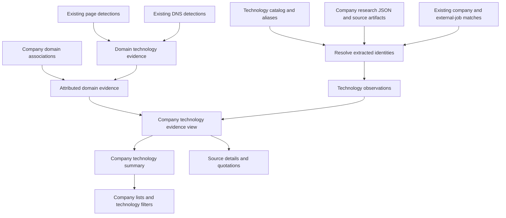

# Company technology evidence: implementation plan

Date: 7 September 2026. Status: proposed; this document does not deploy schema or change ingestion.

**Update, 16 September:** the user confirmed that raw technology mentions and
their source sections must be stored separately from later relationship
classifications. Read [the current storage contract](TECHNOLOGY_MENTION_STORAGE.md).
It supersedes the single interpreted-observation storage and initial table-count
assumptions below. `technology_observations` becomes the analytical projection of
selected classification revisions. Catalog keys, company identity pairs and the
separate domain-detection path remain applicable. No new migration is applied.

Build on the existing company–domain and domain–technology relationships. Add company
technology observations from extracted content, then publish a company-level summary
from both paths. Keep evidence available so every displayed association can be explained.

This plan covers technology intelligence. The other seven crawler objectives continue
to be returned as JSON; their eventual database models are separate work.

## 1. Decisions and scope

- Keep `technology_catalog` as the canonical vocabulary, using its existing `technology`
  name key. Add aliases without introducing a second catalog or migrating all names to IDs.
- Keep `commoncrawl_page_technologies` and `domain_signal_technologies` as source tables.
  Do not copy their historical detections into the new observations table.
- Keep company identity as `(country_code, company_id)` everywhere.
- Add `technology_observations` for claims from jobs and other company content.
- Add a logical `company_technology_evidence` view for compatible, attributed evidence.
- Add `company_technology_summary` for application reads, with one row per company and
  canonical technology. Keep the old `technology_companies` during the rollout.
- Resolve identities and rebuild summaries independently of crawling and LLM extraction.
- Use deterministic rules and reviewed mappings for initial identity resolution. An LLM
  may suggest candidates later, but must not invent catalog keys or registry IDs.

The initial release adds three tables (aliases, observations, summary), one evidence
view, and a small extension to `company_domains`. Extraction manifests remain in artifact
storage and DuckDB staging initially. No generic entity graph, new database service, or
company–technology write API is needed.

The diagram describes the logical data flow. The summary builder should aggregate and
filter raw detector branches early; it should not materialize the entire evidence view.

## 2. What the existing code requires us to account for

The [database review](CLICKHOUSE_MODEL_REVIEW.md) records live reads from 6 September.
Those counts are historical observations, not guarantees about today's database.

| Existing object | Consequence for this change |
|---|---|
| `technology_catalog` | Keep canonical detector names as identity keys; unique normalized matches handle Git/git, aliases handle genuine synonyms |
| `company_domains` | Multiple domains already work; current fields lack a precise website relationship classification |
| `technology_companies` | Its row key includes domain; it is an association rollup, not a distinct-company table |
| Current company publisher | Rebuilds through stage + exchange; does not filter rejected/inactive domains |
| Current company publisher dependencies | Declares catalog and DNS assets, but not the company-domain input it also reads |
| Backoffice Companies tab | Groups and counts company/domain combinations, so a company can appear more than once |
| External JobTech matching | Already stores candidate/accepted/rejected job-to-company matches; reuse accepted matches |
| Crawler JSON schema 1.1 | Contains source evidence and company names, but no resolved registry/catalog identities |

All company-domain associations inspected on 6 September were unreviewed. The rollout
must retain those as provisional rather than silently producing an empty domain result.
The inspected external JobTech match table was empty; implementing its lookup alone will
not create company attribution for those ads.

## 3. Technology catalog and aliases

### Proposed `technology_aliases`

One row is one reviewed alias candidate pointing to an existing catalog entry.

| Field | Suggested type / meaning |
|---|---|
| `alias` | `String`; original alias, e.g. `AWS` |
| `alias_key` | `String`; Unicode NFKC, case folding, and whitespace normalization; punctuation preserved |
| `technology` | `String`; exact existing catalog key |
| `match_mode` | `LowCardinality(String)`; `case_insensitive` equality on the normalized alias key |
| `review_status` | `LowCardinality(String)`; `accepted`, `candidate`, `rejected` |
| `mapping_version` | `String`; version of the curated mapping dataset |
| `source_reference` | `String`; explanation or reference supporting the equivalence |
| `updated_at` | `DateTime64(3, 'UTC')` |

Initial source of truth: a small version-controlled alias file beside the existing
custom catalog layer. Publish it through the existing catalog module. Keep alias changes
independent of the downloaded public catalog so a refresh cannot erase local decisions.

Resolution order:

1. Exact canonical name match.
2. Unique normalized canonical name match; Git/git/GIT need no alias.
3. If canonical normalization collides, return `ambiguous` with the candidate identities.
4. Otherwise try accepted case-insensitive synonym aliases; conflicting targets are
   ambiguous, and no match is unresolved.

Do not add aliases that duplicate normalized canonical names. Preserve the original
catalog key in resolved observations rather than changing the catalog's stored identity.

Preserve punctuation and meaningful distinctions: `C`, `C++`, and `C#` are different.
Do not automatically split `C/C++`, map a product to its vendor, or turn an AWS service
into an independent AWS usage claim. Preserve `AWS or Azure` as alternatives.

Validate all accepted targets against the catalog at publication. Unknown technologies
can be added through the existing custom catalog layer after review. A missing target
after a catalog refresh must surface as a mapping issue, not silently drop observations.

Use a small snapshot table, initially `MergeTree ORDER BY (alias_key, match_mode, technology)`.
Validate uniqueness and ambiguity rules before publishing; sorting is not a uniqueness constraint.

## 4. Company technology observations

### Row meaning

One row represents one technology claim about one source-described subject, supported
by one source version, from the selected extraction revision for that version.

A finding supported by three different pages becomes three evidence rows. Multiple
overlapping windows supporting the same claim in one source version become one row
with combined evidence references. Different signals, scopes, alternatives, or dates
remain different claims.

### Proposed fields

These are logical column contracts; implementation should keep the export column tuple
and migration synchronized. All timestamps use UTC. Unknown values remain unknown.

| Group | Columns and meaning |
|---|---|
| Identity | `observation_id`, `source_type`, `source_record_id`, `source_version_id` |
| Extracted subject | `company_name_original`, `job_employer_name_original`; preserve the named technology user separately from the employer |
| Resolved subject | Nullable `country_code`, `company_id`; both present together, or both absent |
| Company attribution | `attribution_status`, `attribution_method`, `attribution_reference`, `resolver_version`, `resolved_at` |
| Technology | `technology_raw`, nullable canonical `technology`, nullable `technology_version`, `technology_mapping_status`, `technology_mapping_version` |
| Claim | `relationship_type`, `scope`, `context_original`, nullable `alternative_group`, `claim_as_of_original` |
| Applicable website | Nullable `applicable_root_domain`, `applicable_hostname`; fill only when supported by the claim |
| Source | `source_url`, `source_domain`, `source_artifact_reference`, `source_locator` |
| Source timing | `source_published_at` when known, `first_observed_at`, `last_observed_at`; these do not mean adoption start/end |
| Evidence | `evidence_fragments` with individual match status and locators, `evidence_status`, `evidence_issues` |
| Review | `review_status`, `review_reference`; semantic review is separate from quotation validation |
| Job identity | Nullable `job_record_id`, `job_version_id`, `job_url`, `job_title_original`; job keys are source-namespaced |
| Job lifecycle | `job_status` (`active`, `expired`, `unknown`), preserving the source's meaning |
| Processing | `source_run_id`, `extraction_revision_id`, `extractor_version`, `extracted_at`, `extraction_status`, `updated_at` |
| Version selection | `is_latest_assessed_version`; derived from the ingestion manifest, not from row insertion order |

Use `String` for identifiers/text, `LowCardinality(String)` for controlled vocabularies,
and `Nullable(...)` where absence is meaningful. Do not put nullable fields in sort keys.
For quotations, prefer an array of named tuples over parallel arrays that can become
misaligned. Locator details can point to the existing artifact's page/window metadata.

Store the source snapshot hash in the artifact manifest; use its stable version reference
in ClickHouse. Avoid duplicating large HTML, whole model responses, or unused payload
hash columns. Preserve the model/provider/prompt configuration in the revision manifest.

### Claim vocabulary

Keep the extractor's current eight values:

`stated_use`, `required_experience`, `preferred_experience`, `planned_adoption`,
`past_use`, `being_replaced`, `explicitly_not_used`, `mentioned`.

Keep current scopes `company`, `team`, `role`, `client`, `unknown`. Add `website` only
when a text claim explicitly concerns a website. Domain detection branches can use
`website` and `domain_infrastructure` in the unified view without changing LLM output.

Use separate source types such as `company_page`, `job_ad`, `page_detection`,
`dns_detection`. A DNS `signal_type` such as `dns_mx` is a detection channel; do not
reuse it as the business relationship field.

### Identity and duplicate handling

Build IDs in ingestion code, never by asking the LLM to generate them.

- `source_record_id`: use a provider's stable record ID; otherwise a conservatively
  normalized canonical URL. Keep meaningful query parameters and namespace providers.
- `source_version_id`: use the provider's version ID or a snapshot-manifest version
  backed by the saved content digest. Re-fetching identical content updates seen metadata.
- `observation_id`: deterministic identifier from source identity/version and a
  conservative claim key: original subject, raw technology, relationship, scope, job
  identity, alternatives, and stated time. When two otherwise identical claims concern
  different teams/sections, use a stable source section anchor to distinguish them.
- Exclude resolved catalog/company IDs, run ID, chunk boundaries, and quotation
  formatting from that identity. Exclude model-written context prose and inferred source
  classification as well. A mapping correction must not create a new source claim.
- Normalize only proven-equivalent spacing/case for the relevant identity field.
  Merge only equivalent claims; keep uncertain duplicates for review.
- Combine repeated window evidence before generating export rows. The ingester must
  also enforce this because current package record IDs are not a database identity contract.

Use an internal digest/UUID for the deterministic observation ID; retain its canonical
input tuple in staging for collision/identity diagnostics. Test identity against frozen
overlap and reprocessing examples before freezing the schema.

Enforce these invariants in normalization and publication checks: company key fields
are both present or both absent; `technology_mapping_status = matched` has a catalog
target; an accepted company mapping has a retrievable mapping reference; every source
reference resolves; observation IDs are unique within the selected snapshot. Use
`matched`, `ambiguous`, `unresolved` for technology mapping and `unreviewed`, `accepted`,
`rejected` for semantic review. Database CHECK constraints should cover local field rules;
the publisher validates cross-table references and uniqueness.

Count distinct source/job identities, not observation rows, extraction runs, or page
versions. Mirrored ads on different providers remain separate observed job records until
there is a supported cross-provider vacancy identity. Label that metric accordingly.

### Reprocessing and partial runs

Maintain an ingestion manifest in durable artifact storage, mirrored in source-specific
DuckDB staging. For each source version it records extraction revisions, completion,
coverage, the selected revision, mapping versions, and publication status.

- Retry of the same revision is idempotent.
- A new complete revision replaces the selected claim set for that source version as a
  whole; omitted claims must not linger through an append-only union of reruns.
- Archive earlier extraction revisions so corrections remain auditable.
- A failed or partial rerun does not replace a previous complete revision. Keep its valid
  findings in the artifact for review. A first partial result may be published with its
  partial status because valid findings are still useful; it cannot prove absence.
- Source content changes create a new source version. Retain older source versions as
  history; mark the latest assessed version explicitly for current-source filtering.
- A later omission, failed fetch, or expired job never creates `explicitly_not_used`.

### Initial physical storage

Start with a snapshot-published `MergeTree` table ordered by
`(source_type, source_record_id, source_version_id, observation_id)`, without partitions.
Publish the deduplicated selected claim sets for all ingested source versions through a
stage table and exchange. This makes changed mappings, removed claims, and retry behavior
explicit without introducing mutable replacement keys.

This is a pilot choice for the new, relatively small content dataset. Measure full-build
cost before scaling. If partition replacement becomes necessary, use stable source-based
buckets and a complete bucket input; do not partition by nullable/mutable company mapping.
Partitioned Dagster staging must follow the existing per-partition DuckDB file rule.

## 5. Company and domain attribution

### Direct observations

Use `accepted`, `provisional`, `ambiguous`, `unresolved`, `rejected` attribution statuses.
Accepted means the subject-to-company mapping passed the attribution policy; it does not
mean the technology usage claim itself was independently verified.

Resolution priorities:

1. Explicit, verified registry identity in source data or a reviewed source/company mapping.
2. An accepted external-job/company match for the exact source job/version.
3. Supported company-domain and source subject evidence, with the association's uncertainty.
4. Name-only or conflicting candidates remain unresolved/ambiguous.

For the Swedish JobTech source, country `SE` comes from that source's schema contract,
not from a guessed employer name or source hostname. An employer match must not be reused
for a different client/subsidiary mentioned in the advertisement.

The input crawl URL is context, not blanket legal-entity attribution. Keep valid findings
when company resolution fails. Do not attach them to the job board or arbitrarily choose
the first candidate company.

For the pilot, prepare a reviewed, versioned source-subject/company mapping dataset for
the sample. This makes an empty existing match table an explicit work item. Reuse the
existing reviewed matching stores where applicable, and keep any pilot mapping artifact
replayable; hand-inserting rows into a derived ClickHouse table is not its source of truth.

### Domain associations

Extend `company_domains` with `relationship_type`, initially `unknown`, using a small
vocabulary: `official_website`, `brand_website`, `group_website`, `shared_website`, `unknown`.
Keep this separate from existing review status and confidence. Persist classification
through the existing suggestion/review publication path so a rebuild cannot erase it.

| Association | Handling in unified evidence |
|---|---|
| Rejected or inactive | Exclude from the current company evidence path |
| Confirmed official website | Attribute a domain detection to the company, preserving website scope |
| Confirmed related, brand, group, or shared website | Preserve an indirect association; do not promote it to company-wide use |
| Unreviewed/unknown | Include as provisional and expose that tier to filters |

Do not copy a company-level job claim onto every associated domain. `applicable_domain`
and `source_domain` remain separate even when the source is on the company's own site.

The initial feature answers: “What technology evidence is connected to this company
through its current domain associations?” Historical detections inherit that qualification.
It must not claim “the company owned this domain when this 2020 detection happened.”
An ownership-at-detection report would require a separate interval history; current
`first_seen_at`/`last_seen_at` are not proof of legal ownership dates. Defer that report.

## 6. Unified evidence contract

`company_technology_evidence` is a logical `UNION ALL` of:

1. Attributed `technology_observations` with a resolved canonical technology.
2. Existing page detections joined to eligible current company-domain associations.
3. Existing DNS detections joined to eligible current company-domain associations.

Common columns include company identity, canonical technology, `evidence_id`, origin,
relationship, scope, attribution tier/basis, applicable domain/hostname, source URL or
record reference, source version, observation time/basis, and review/validation status.
Unresolved company/technology records stay accessible in the observations review query.
Do not create a fake company or canonical technology to force them into this view.

Use `detected_on_website` and `detected_in_domain_infrastructure` as the two detector
relationship values. A successful HTML quotation match does not apply to DNS evidence:
preserve detector validation/confidence separately instead of fabricating LLM validation.

Use original WARC identifiers for page evidence, original DNS record/pattern references
for DNS evidence, and observation IDs for extracted evidence. Do not invent a page URL
for DNS records. Collapse physical replacement versions by the source table's real key;
do not count duplicate physical rows as independent detections.

Preserve observed timestamps when the source provides them. Common Crawl processing
`resolved_at` is not a crawl timestamp: use a supported capture date/metadata reference,
or expose the crawl-period label and unknown exact observation date. Do not fabricate
the first day of a crawl period as a precise detection date.

The view supports bounded drill-down. Production queries must push company/technology
and derived domain filters into each detector branch. Verify this with `EXPLAIN` and
measured reads. If the optimizer does not push them down, use explicit parameterized
branch queries in the serving code while keeping this same output contract.

## 7. Company technology summary and API behavior

One row in `company_technology_summary` has the key
`(country_code, company_id, technology)`. A proposed initial physical order is
`(technology, country_code, company_id)` for the existing technology-to-companies page.
Use snapshot-published `MergeTree`, with deduplication checked before exchange. Measure
company-profile queries before adding a second projection/index.

Core fields:

- Company identity and canonical technology.
- Distinct supporting domain count, source-record count, and observed job-record count.
- First/last observed timestamps where known; do not substitute computation time.
- Available relationships/scopes, and separate accepted/provisional/indirect evidence.
- A compact `evidence_breakdown` array of tuples keyed by origin, relationship, scope,
  attribution tier, latest/historical source status, and job lifecycle; each tuple has
  distinct evidence/job/domain counts and observed dates for that exact combination.
- `build_id`, `policy_version`, and `computed_at` to explain how the row was produced.

The structured breakdown matters: filtering for “accepted job evidence requiring Python”
must match one combination. Independent arrays saying “accepted exists” and “required
exists” could match unrelated evidence. Do not sum distinct counts across breakdown
tuples: the same job can support multiple relationships. Compute overall distinct counts
separately from the underlying identities.

Keep full URL, job, quotation, and observation ID lists in evidence queries. Do not build
unbounded arrays on each summary row. Request detailed counts for arbitrary date ranges
from bounded evidence queries initially; add time-bucketed serving data only if measured
usage requires it.

Summary eligibility: canonical technology resolved, company mapping accepted/provisional/
indirect under the policy, supported source evidence, and no explicit review rejection.
Questionable quotations and ambiguous attribution remain review data. Source-matched
but not manually reviewed claims can appear with their unreviewed semantic status.

Default application label: “Technology evidence” or “Technology signals.” Make users
able to distinguish website detections, stated use, hiring requirements, plans, and
explicit non-use. A technology with only negative/mentioned evidence must not be counted
as positive adoption. Conflicting evidence can coexist with its date and scope.

Keep the existing global domain adoption counts and domain rankings domain-based. Adding
job observations must not inflate `technology_adoption.domain_count` or top-domain lists.

## 8. Ingestion and publication flow

1. Import a completed or explicitly partial `ResearchResult` artifact. Validate its schema
   version and source references. Explode multi-source findings into source evidence rows.
2. Reuse the existing quote/window validation results and retain review issues. Make
   identity, alias, and company matching deterministic downstream work.
3. Record the source/revision manifest and normalize observations into a dedicated
   DuckDB staging file, with one concurrency pool on every reader and writer.
4. Resolve technology aliases and company attribution using versioned input datasets.
5. Build and validate the observations snapshot. Publish through migration-owned DDL and
   an explicit export column contract.
6. Build the company summary from compact domain evidence aggregates plus direct claims.
   Apply current company-domain state and retain relationship dimensions.
7. Validate and atomically exchange the summary. Expose its computation time and build ID.

Mapping edits, domain review changes, and catalog updates rerun resolution/publication;
they must not trigger paid extraction. Keep research execution separate from publication
jobs. Import frozen artifacts first; automated crawling is a later activation step.

For the first implementation, extend the existing technology catalog/publication module
and add focused ingestion/SQL files. Reuse existing ClickHouse and artifact resources.
Avoid a new generic integration framework. If a separate research source package becomes
necessary, add its required source design document before implementing that package.

Register dependencies for every actual input, including company domains and accepted
job matches. Initially run summary refreshes after successful relevant publication and
provide a separate scheduled reconciliation job, with a suggested daily cadence for the
pilot. Choose its actual schedule with the existing workload; do not rebuild raw page
detections or run the crawler merely to refresh attribution.

Use stage + exchange initially. Ordinary incremental ClickHouse materialized views do
not recalculate old rows when only a joined mapping table changes. A refreshable view is
an alternative later if it simplifies ownership of the scheduled build. See the
[incremental view documentation](https://clickhouse.com/docs/concepts/features/materialized-views/incremental-materialized-view)
and [refreshable view documentation](https://clickhouse.com/docs/concepts/features/materialized-views/refreshable-materialized-view).

An [exchange](https://clickhouse.com/docs/reference/statements/exchange) publishes one
table atomically. Observation, catalog, and summary exchanges are not a single multi-table
transaction. Keep generation metadata and retained artifacts so a summary remains
explainable during publication lag. Preserve the previous summary generation for rollback.

Guard empty builds using manifest completeness and expected scope. A valid zero-claim
source revision can replace that source's prior extraction; a failed fetch cannot. An
unexpected globally empty build must fail. Do not copy the current hard-coded minimum
company-row threshold into a small pilot or legitimate attribution cleanup.

Raw source snapshots and selected-revision manifests must survive cache cleanup for as
long as their observations are served. Document their retention/recovery policy explicitly;
re-downloading a changed public page cannot reproduce an old quotation. Keep credentials
out of all artifacts and reuse the existing environment/resource configuration.

## 9. Extraction package changes

The current technology prompt already distinguishes employer/client, requirements, actual
use, alternatives, and dates. Retain those examples and the native Crawl4AI cleaned HTML.

- Add optional website applicability only if the evidence explicitly identifies it.
  Absence is expected for most job claims.
- Keep LLM output source-faithful. Company IDs, canonical technologies, mapping statuses,
  and database observation IDs are ingestion output, not extra LLM responsibilities.
- Preserve source-level evidence through cross-page merging; the importer needs each
  page/version independently even when the package displays one combined finding.
- Introduce a documented schema version if output fields change. Keep an explicit schema
  1.1 importer. Schema 1.0 artifacts must retain “technologies not assessed,” not an empty
  successful technology assessment.
- The existing URL-based technology summary can remain a local research preview. The
  database summary has stronger entity and source identity rules and must not ingest that
  preview as though it were evidence.
- Keep objective coverage, failure states, and “not found” in the run manifest. They are
  not technology observations. A future coverage table can serve cross-run coverage
  analytics when the application needs that query.

## 10. Implementation sequence and acceptance gates

Each phase is an independently reviewable change. No production migration is part of
this planning task.

| Phase | Work | Completion gate |
|---|---|---|
| 1. Correct existing reads | Filter rejected/inactive company-domain mappings; fix Companies tab grouping/counts; preserve a list of domains per company | One company with three domains appears once; rejected/inactive links contribute nothing |
| 2. Identity contract | Finalize observation IDs, source/revision manifest rules, curated aliases, and golden fixtures | Overlap, retries, alias changes, and source-version changes produce the expected identities |
| 3. Additive schema | Add aliases/observations/summary tables and evidence view; add domain relationship classification; wire migration/export contracts | Migrations run in isolated ClickHouse; no nullable keys, invalid catalog targets, or duplicate summary keys |
| 4. Artifact ingestion | Import existing schema 1.1 results; resolve aliases and companies; publish observations to an isolated test target | Every input claim is exported or accounted for as review/unresolved/unsupported; provenance is retrievable |
| 5. Unified publication | Add domain evidence projection and summary build; declare dependencies and mapping-only refresh path | Synthetic source totals, attribution tiers, and relationship filters reconcile exactly |
| 6. Shadow pilot | Build the new summary beside the old one using bounded company/domain inputs | All changes from legacy results are explained; performance and source audits pass |
| 7. Backoffice cutover | Read new summary behind a reversible switch; add evidence drill-down, relationship labels, provisional state and freshness | List/count pagination agrees; job-only companies appear; no requirements presented as confirmed usage |
| 8. Operate and expand | Enable publication cadence, then bounded crawler runs; monitor quality/cost/coverage | Failed or partial runs preserve prior good data; mapping fixes require no extraction calls |

Phase 1 needs corresponding publisher and UI changes: the current publisher's output
shape is domain-level and cannot simply be relabeled as a company-level list.

Allocate the next available migration numbers when implementation begins. The highest
local migration seen during planning was `000387`; do not reserve a number in this doc
or edit historical migrations that may already have been applied.

## 11. Verification plan

### Deterministic cases

| Case | Required outcome |
|---|---|
| One company, three domains, same technology | One company summary row; three distinct domains |
| Same `company_id` in two countries | Two separate companies |
| External job board, named employer | Attribution to employer; source domain remains the job board |
| Agency advertisement describing a client | Client technology does not become agency usage |
| Unreviewed/shared/group domain | Provisional/indirect evidence survives with its classification |
| Domain review becomes rejected/inactive | Evidence leaves current summary after refresh without any LLM call |
| Git/git/GIT normalization; AWS synonym; C/C++/C# distinctions | Unique normalized names resolve automatically, genuine synonyms use aliases, punctuation and ambiguous catalog collisions remain distinct |
| AWS or Azure requirement | Both alternatives retained as requirements; neither asserted deployed |
| Same claim in overlapping chunks | One observation per source version with merged source references |
| Retry or identical-content fetch | No extra observation/job counts; seen metadata may advance |
| Complete re-extraction omits an earlier claim | Earlier extraction claim removed from selected set; archive retained |
| Partial rerun after complete result | Previous complete revision remains effective |
| New source version / expired job / absent page | History retained; no fabricated non-use statement |
| Incorrect quotation or company match | Retained in review data; no unsupported positive summary contribution |
| Mixed relationship and attribution facets | Combined filter matches one evidence combination, not unrelated arrays |
| Older detection on a newly linked domain | Clearly current association to historical evidence; no ownership-at-time assertion |
| Changed alias/company resolution | Same source observation identity; corrected summary; zero extraction calls |
| Missing/invalid artifact or interrupted publication | Prior serving table remains usable; failure identifies affected scope |

### Pilot data and checks

Start with deterministic synthetic records and existing saved research artifacts. Use the
controlled technology fixture and the real software-developer evidence, preserving their
different artifact formats: extraction-only diagnostic JSON is not a full ResearchResult.
Then run a proposed 20-company pilot chosen to include multiple domains, shared/group
sites, external recruiters, subsidiaries/clients, job-only technologies, and multilingual
ads. Selection is a future test task, not a claim that the sample has been collected.

Audit each pilot observation for technology, subject, relationship/scope, and source
support. Report unresolved technology/company rates separately from extraction accuracy.
Report exact denominators and unknowns; do not present source-presence checks as proof of
semantic accuracy or whole-site recall.

For legacy comparison, run the old and new domain-only logic against the same bounded
input generation. Explain differences caused by duplicate companies, inactive/rejected
associations, catalog mapping, or explicit policy changes. A larger total is not an
acceptance criterion.

Measure summary build duration, rows/bytes read, peak memory, and list/drill-down latency.
Suggested initial serving targets: under 1 second at p95 for summary pages and under
2 seconds at p95 for a bounded evidence page on representative infrastructure. Treat
these as targets to validate, not measured current performance. Apply query memory/time
budgets and avoid unrestricted scans of the historical detector tables.

Implementation checks include relevant Dagster pytest suites and `uv run dg check defs`,
package technology/browser tests when extraction changes, real isolated ClickHouse tests
for publication behavior, and Backoffice typecheck plus focused Vitest tests. Use no paid
model calls for alias, SQL, identity, or publication tests.

## 12. Code locations and deliverables

| Area | Existing anchor / intended deliverable |
|---|---|
| Schema | [Migrations directory](/Users/graovic/pulsarpoint/ppoint/companycollect/corpscout/clickhouse/migrations); additive migrations and export contracts |
| Existing catalog | [Catalog merge](/Users/graovic/pulsarpoint/ppoint/companycollect/corpscout/services/dagster_v3/src/dagster_v3/defs/technology_catalog/catalog.py), [custom entries](/Users/graovic/pulsarpoint/ppoint/companycollect/corpscout/services/dagster_v3/src/dagster_v3/defs/technology_catalog/custom/technologies.json); add curated alias input |
| Publishing | [Technology assets](/Users/graovic/pulsarpoint/ppoint/companycollect/corpscout/services/dagster_v3/src/dagster_v3/defs/technology_catalog/assets.py:641), [table contracts](/Users/graovic/pulsarpoint/ppoint/companycollect/corpscout/services/dagster_v3/src/dagster_v3/defs/technology_catalog/tables.py); focused importer/resolver/summary SQL files |
| Domain association | [Current schema](/Users/graovic/pulsarpoint/ppoint/companycollect/corpscout/clickhouse/migrations/000269_corpscout_company_domains.up.sql:3); preserve new classification through suggestion/review publishing |
| External-job matches | [JobTech schema](/Users/graovic/pulsarpoint/ppoint/companycollect/corpscout/clickhouse/migrations/000363_corpscout_se_jobtech_links_jobs.up.sql:226); accepted exact job/version lookup |
| Extractor schema | [Models](src/company_research/models.py), [prompts](src/company_research/prompts.py); source-faithful applicability and explicit schema versioning if changed |
| Local preview | [Analytics](src/company_research/analytics.py); keep preview semantics distinct from database resolution |
| Application reads | [Technology queries](/Users/graovic/pulsarpoint/ppoint/companycollect/corpscout/services/backoffice/app/lib/technologies.server.ts:396); corrected company grain and new summary/evidence queries |
| Database tests | [Migration tests](/Users/graovic/pulsarpoint/ppoint/companycollect/corpscout/services/dagster_v3/tests/test_clickhouse_migrations.py), [catalog tests](/Users/graovic/pulsarpoint/ppoint/companycollect/corpscout/services/dagster_v3/tests/test_technology_catalog.py); new identity/observation/publication fixtures |
| UI tests | [Technology serving tests](/Users/graovic/pulsarpoint/ppoint/companycollect/corpscout/services/backoffice/tests/technologies.server.test.ts); count, pagination, filters, evidence drill-down |

The first delivery should complete phases 1–5 using saved artifacts and isolated database
fixtures. Production rollout follows the shadow comparison, evidence audit, and performance
checks. Keep the legacy serving path and previous new-summary generation available during
the initial cutover; rollback switches readers back and preserves all imported evidence.
