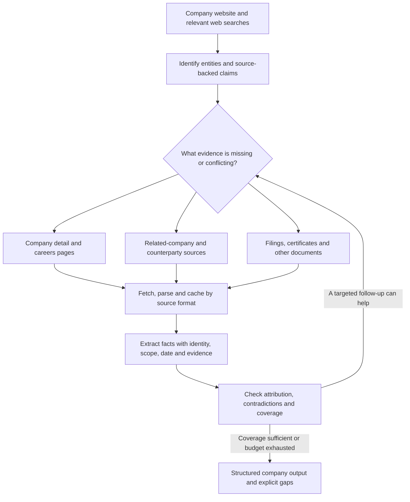

# Research patterns from “Analyze Novelic company”

Source: [Analyze Novelic company](codex://threads/01a07c8e-ebaf-7fa2-8dfc-f935cc279dd8). The user's request in that task was simply to make a full company analysis of novelic.com. The task was still in progress when inspected. No new Codex run was started, and the reference task was not steered.

[Observable trace snapshot](trace-snapshot.json) · [Machine-readable draft patterns](patterns.json) · [Reference task's report](/Users/graovic/pulsarpoint/ppoint/output/research/novelic-2026-09-07/novelic-company-analysis.md)

## Main finding

The reference illustrates an evidence-driven research loop: identify entities and claims, follow them to relevant sources, investigate discrepancies, and then synthesize. It is substantially broader than selecting and extracting pages on the initial website. The useful reusable behavior is conditional expansion into better sources, rather than an exact sequence of URLs or commands.

The inspected snapshot contains 66 observable items: 24 web events, 17 commands, 16 image inspections, six public assistant messages, one user request, one tool call and one file change. The web events include 11 search batches containing 35 queries, five page-open events, one find event and seven events whose target is not exposed. Commands perform additional downloads and HTML reads. These are event counts, not counts of unique crawled pages, verified facts or model requests.

The snapshot omits reasoning items. Eleven saved command-output excerpts are truncated, and some web targets are unavailable through this task-history view. This supports a behavior analysis, not a complete reconstruction of every action's inputs and outputs. No comparable token or cost total is available here.

## Observed behavior and possible reuse

| Observed behavior | Reusable decision | More efficient implementation |
|---|---|---|
| Opened the parent's subsidiary financial disclosures after researching ownership | Follow relevant related entities to subject-specific evidence | Relation extraction, targeted search, Crawl4AI HTML retrieval and document downloading |
| Searched partner domains and opened a counterpart partner page | Corroborate a precise relationship on the other party's site | Bounded domain searches and small-model extraction |
| Downloaded PDFs together, extracted text, rendered and rotated selected pages | Handle the source's actual format and escalate when text is insufficient | PDF parser, page-aware retrieval, targeted OCR/vision |
| Searched saved documents repeatedly with local tools | Fetch/parse once and reuse relevant passages | Source cache and local text search |
| Compared older production statements with newer parent guidance | Preserve and investigate temporal conflicts | Dated claim records, deterministic comparison and focused LLM review |
| Parsed Careers links into an external employer job board | Follow the actual recruitment destination | Link parsing plus bounded external job crawling |
| Kept accounting bases separate and calculated ratios in Python | Compute derived values only after matching definitions | Typed inputs and ordinary calculation code |
| Searched patents, funding, production and certification details later | Select new actions from remaining evidence gaps | Coverage tracking and small-model query selection |

## Proposed abstraction

This diagram is a proposed workflow inferred from observable actions. It is not the exact execution order or an export of internal reasoning.

## What should not be copied automatically

- **The initial parent hypothesis:** the first visible search already contains Sona Comstar. The trace does not establish where that hypothesis came from. A production system must verify such a hypothesis before treating it as a company relationship.
- **Every exploratory query:** broad reputation, competitor and investment-oriented research reflects the reference user's expansive request. These should be optional objectives, not mandatory overhead for a services/contact crawler.
- **Environment repair:** falling back from a missing BeautifulSoup dependency to HTMLParser is a runtime workaround. Provision reliable extraction dependencies rather than generating a new parser at every site.
- **Repeated visual inspection:** retain the ability to inspect difficult document pages, but trigger it from extraction uncertainty rather than copying a fixed number of image reads.
- **Narrative as accepted structured data:** partner, owner, customer, future production and actual shipments still need separate relationship/status fields and supporting evidence.
- **Raw action sequence as control flow:** chronological adjacency does not establish dependency. The draft patterns identify supporting event IDs, while their reusable triggers remain design proposals.
- **Full objective coverage:** the snapshot proves job-link enumeration, not complete job-description/technology extraction. The broad report is not a substitute for our current requirements for described services and specific named tools. XML/JSON and generic radar/FPGA capabilities remain outside technology identities.

## Suggested next use

Use the eight patterns below to propose a small set of pipeline capabilities, without adopting all eight as mandatory stages. Start with related-entity source expansion, counterpart verification, document handling, and dated claim reconciliation. Preserve Crawl4AI for HTML retrieval and use DeepSeek for bounded semantic decisions; cache retrieval, identity bookkeeping and calculations can run in ordinary code.

Validate the proposed triggers against several completed independent company analyses and sites with different structures. Compare source coverage, correct attribution, usable service descriptions, eligible named technologies, contradiction handling, latency and cost. One ongoing reference session does not establish a universal strategy or an accuracy score.

## Pattern: follow_related_entities

**Observed:** The session searched for acquisition/parent information, opened Sona's subsidiary-statements page, and downloaded NOVELIC and subsidiary filings.

**Proposed trigger:** A relevant parent, subsidiary, acquirer or related entity has been identified with evidence.

**Possible implementation:** DeepSeek entity/relation extraction plus targeted web search, Crawl4AI HTML retrieval and a bounded related-domain queue.

**Validation:** Distinguish a search hypothesis from a supported relationship, and direct ownership from ultimate economic interest.

Supporting observable event IDs: `exec-a0cf4618-993e-4e7f-80b0-1f7e5503942f`, `exec-daebf2b5-d0f0-4381-bde7-f6650777d662`, `exec-0188c008-e21e-4cdd-962c-92e93ac95f62`.

**Limit:** The first query already includes Sona; the visible trace does not establish where that initial hypothesis originated.

## Pattern: verify_relationship_on_counterparty_site

**Observed:** The session searched Infineon and other counterpart sites and opened an Analog Devices partner page.

**Proposed trigger:** A named partner/customer/owner claim needs corroboration.

**Possible implementation:** Small query generation and result assessment followed by source-specific extraction on Crawl4AI content.

**Validation:** A partner directory corroborates partnership, not customer revenue, ownership, exclusivity or internal tool deployment.

Supporting observable event IDs: `exec-3d73c2e6-9100-45b0-8e6c-eec77d865543`, `exec-90bb635b-7ac7-4bca-a993-6d16d371067f`.

**Limit:** The trace shows searches/opens, not a complete proof ledger for every relationship in the report.

## Pattern: route_documents_by_format

**Observed:** The session downloaded PDF statements, extracted text, rendered pages, rotated sideways pages and inspected images.

**Proposed trigger:** A selected source is a PDF or extracted text is insufficient to interpret a table.

**Possible implementation:** HTTP download plus a PDF parser; targeted OCR/vision fallback alongside Crawl4AI for HTML.

**Validation:** Retain page references, table headers, units, signs, accounting period and subject entity.

Supporting observable event IDs: `exec-0188c008-e21e-4cdd-962c-92e93ac95f62`, `exec-7f67751c-6a96-4040-b3c1-779742869558`, `exec-0e933e4e-51a9-431f-b947-9a0768b927e7`, `exec-8c9c666a-ed1e-4fc8-8937-3dd082b12b66`.

**Limit:** Sixteen image inspections in this snapshot are observed actions, not a recommended fixed inspection budget.

## Pattern: cache_sources_and_retrieve_passages

**Observed:** Downloaded documents were saved once and searched repeatedly with rg/sed; independent downloads were batched.

**Proposed trigger:** Multiple objectives or questions concern the same source documents.

**Possible implementation:** Cached source store, local text search and bounded excerpt extraction; concurrent independent fetches.

**Validation:** Every extracted claim must link to the original source and section/page. Reuse must not hide stale documents or cut away attribution.

Supporting observable event IDs: `exec-fec85a8f-6bd8-4989-bc5c-bb90958e9fd4`, `exec-83651422-877e-4de1-9b06-7b8733a3139f`, `exec-d592ed25-e1f5-4446-8546-1cf452d8f744`.

## Pattern: investigate_temporal_conflicts

**Observed:** The session compared an older production expectation with later parent earnings-call guidance and revisited the exact launch passage.

**Proposed trigger:** Two sources disagree about the same event, status, specification or date.

**Possible implementation:** Structured claim comparison in code; targeted search and a focused DeepSeek evidence comparison.

**Validation:** Newer does not automatically mean superseding. Do not turn an announced production plan into actual shipments.

Supporting observable event IDs: `msg_095d3ee96f7e11a7016a9edf9d39e487d29ff8db84d1146038`, `exec-5e2f1fc8-b3f9-4d1b-907a-e91e5acc64e2`, `exec-7f0ae362-fa11-4695-9419-d7622d1e1b2a`.

## Pattern: follow_external_recruiting_destination

**Observed:** The session parsed Careers links and found the external novelic.oneassessment.com job board.

**Proposed trigger:** A company's careers page links to hosted job advertisements.

**Possible implementation:** Crawl4AI links plus bounded same-employer external crawling; small-model job and named-tool extraction.

**Validation:** Job URLs can establish recruiting navigation. A job title alone does not establish a technology or commercial service.

Supporting observable event IDs: `exec-5013b88d-55b1-43b3-bfef-df723e7bb0cd`, `exec-9e5ef869-a991-4ab1-8e5d-fba6f637a7fb`.

**Limit:** Full individual-ad extraction is a proposed continuation; it is not demonstrated by these link-enumeration events.

## Pattern: derive_metrics_after_scope_alignment

**Observed:** The session separated accounting bases in its commentary and used Python to calculate changes and ratios from extracted values.

**Proposed trigger:** A requested metric can be derived from sourced inputs with matching entity, currency, units and period definitions.

**Possible implementation:** Typed extracted financial facts plus ordinary calculation code, with the LLM resolving textual definitions only where needed.

**Validation:** Do not combine Serbian calendar-year standalone and parent March-year-end consolidated figures as like-for-like observations.

Supporting observable event IDs: `msg_095d3ee96f7e11a7016a9edd46798487d28517b85884588f2f`, `exec-5e2f1fc8-b3f9-4d1b-907a-e91e5acc64e2`.

**Limit:** This is an optional financial-research capability beyond the current crawler's principal extraction objectives; calculations and inputs require separate verification.

## Pattern: expand_only_for_relevant_evidence_gaps

**Observed:** Later searches covered patents, EU research projects, certification, current production and competitors rather than repeating the first broad query.

**Proposed trigger:** An objective remains unresolved and a concrete source class or query could resolve it.

**Possible implementation:** Coverage and claim state in code, with small-model query selection and a bounded search/fetch loop.

**Validation:** Preserve not-found versus not-assessed; keep generic formats/capabilities out of technology identities. Avoid open-ended competitor/reputation research unless requested.

Supporting observable event IDs: `exec-77749668-6929-4ece-9ea4-3b0522983127`, `exec-c4169042-994e-4a94-92a0-0749d09d9e85`, `exec-a4968df5-b759-4c87-a046-fb5cee9100d7`, `exec-99a8c2bc-3930-4c9e-a728-981affad766e`.

**Limit:** A universal stopping policy cannot be inferred from one unfinished research session.
