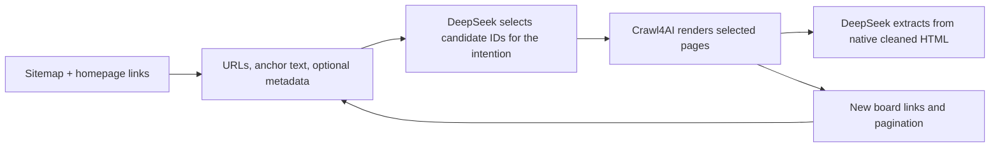

# How Crawl4AI chooses links, and where DeepSeek fits

**Scope update:** [Company research objectives](COMPANY_RESEARCH_OBJECTIVES.md)
extends the jobs examples below to company profiles, business contacts, locations,
people, offerings, relationships, and jobs, with shared selection/extraction goals.

Reviewed 6 September 2026. Installed Crawl4AI version: **0.9.3**. The installed
`adaptive_crawler.py` is byte-for-byte identical to the latest upstream version of
that file returned by GitHub at review time, commit
`3a75dd3f4cf3eac2d7d8a378380ce2f6309d4ff3`.

**Recommendation:** reuse Crawl4AI's discovery, metadata preview, and rendering
primitives. For our workflow, test DeepSeek as a direct judge of candidate links.
Its extraction results do not yet establish its ability to choose pages. The
built-in adaptive crawler is a useful comparison, but its current policies and
implementation need attention before using it to collect all jobs.

## Four related features

| Feature | Input and purpose | Role of a chat LLM |
| --- | --- | --- |
| `AsyncUrlSeeder` | Discover URLs from sitemaps/Common Crawl; optionally fetch metadata and rank it against a query | None in native seeding/scoring |
| `LinkPreviewConfig` and `score_links=True` | Describe links found on a page and attach metadata/relevance scores | None |
| `BestFirstCrawlingStrategy` | Visit discovered URLs in scorer priority order, with crawl policies and limits | Depends on a custom integration; built-in URL scorers use rules |
| `AdaptiveCrawler` | Start at a URL, follow promising links, and stop when collected content appears sufficient for a query | Query expansion in embedding mode; none in default statistical mode |

These are separate mechanisms. Supplying an extraction instruction to
`LLMExtractionStrategy` does not automatically make that instruction control link
selection. Likewise, using DeepSeek for query expansion does not ask DeepSeek to
judge every candidate URL. The official [adaptive crawling guide](https://docs.crawl4ai.com/core/adaptive-crawling/)
distinguishes statistical and embedding strategies and separates chat and embedding
model configuration.

## Discovery and inexpensive previews

`AsyncUrlSeeder` can build the sitemap inventory before browser crawling. Query
scoring requires metadata extraction; providing a query alone with
`extract_head=False` does not activate it. Sitemap discovery and the adaptive
walk are separate calls, rather than one built-in sitemap-to-adaptive pipeline.
See [URL seeding](https://docs.crawl4ai.com/core/url-seeding/).

A metadata preview makes a streaming HTTP **GET**, reads until `</head>` or a
roughly 64 KiB guard, and parses title, description, other meta tags, and available
JSON-LD. This is different from an HTTP HEAD request, which cannot return that
HTML. It avoids a full browser render but still makes network requests and can
miss metadata populated by JavaScript.

The seeder runs BM25 over metadata text: a keyword retrieval score accounting for
term frequency and document length. It uses URL string matching as a fallback
for eligible results without useful metadata. Scores are normalized within the
candidate batch. **They are rankings, not probabilities.** In a synthetic check,
two documents with no matching query terms both received `0.5`, because all-equal
raw scores map to that value. A fixed `0.5` threshold therefore does not prove
relevance and can change meaning between batches.

Separately, intrinsic link scoring uses attributes, anchor text, URL patterns,
depth, and surrounding page terms. The generic total score combines 70% intrinsic
score with 30% scaled contextual score when both are enabled. The adaptive
strategy uses its own scoring function instead of simply sorting by that total.

Local source: [metadata fetching and scoring](../.venv/lib/python3.12/site-packages/crawl4ai/async_url_seeder.py),
[link previews](../.venv/lib/python3.12/site-packages/crawl4ai/link_preview.py),
and [intrinsic/combined scores](../.venv/lib/python3.12/site-packages/crawl4ai/utils.py).

## The adaptive loop

The default statistical path crawls a starting page, gathers internal links with
preview data, ranks them, crawls a batch, and updates vocabulary statistics from
the returned Markdown. It repeats until a sufficiency heuristic or resource
limit stops the loop. Default configuration is 20 pages, three links per expansion,
and five expansion rounds; `max_depth` is a round counter here, not each URL's
distance from the start.

The actual default link formula is:

```text
score = 0.5 × relevance + 0.3 × novelty + 0.2 × 1.0
```

Relevance uses a positive preview contextual score when available, otherwise query
term overlap. Novelty is the fraction of preview terms absent from collected
content. Authority is fixed at `1.0` in the active code. The documentation's
multiplicative relevance/novelty/authority formula is not this implementation.

Statistical stopping combines vocabulary coverage, query-term co-occurrence, and
declining discovery of new terms. It does not verify extracted fields, enumerate
unseen jobs, or judge factual consistency. The confidence weights in this method
are hard-coded even though similarly named configuration fields exist.

The embedding path first uses a chat model to expand the intention into related
queries. It embeds queries, candidate-link descriptions, and collected content;
then prioritizes links estimated to improve coverage of poorly represented query
variations, with a penalty for similarity to existing content. Stopping uses
similarity, convergence, held-out query variations, and limits.

For DeepSeek, `query_llm_config` is the relevant chat configuration. A separate
embedding model or local sentence-transformers model is still required. The
installed implementation embeds only the first 5,000 characters of each page's
Markdown for its knowledge coverage calculation. This is separate from our
full native HTML used for extraction.

Implementation: [installed adaptive crawler](../.venv/lib/python3.12/site-packages/crawl4ai/adaptive_crawler.py).
The [upstream snapshot](https://github.com/unclecode/crawl4ai/blob/3a75dd3f4cf3eac2d7d8a378380ce2f6309d4ff3/crawl4ai/adaptive_crawler.py)
provides a stable reference; the [strategy documentation](https://docs.crawl4ai.com/advanced/adaptive-strategies/)
describes the intended algorithm.

## Consequences for our crawl goal

Consider the intention: find all current openings, including title, location,
department, and application URL.

- A `/careers` landing page may contain no jobs but lead to the correct board.
  Its value is navigational. It must not be rejected simply because it cannot
  directly fill the extraction schema.
- The board may be on Ashby, Greenhouse, Lever, or another external host. Following
  the company's discovered board is necessary; crawling unrelated tenants on that
  host is not. Company association and scope need explicit checks.
- A second listing page may look almost identical to the first while containing
  different jobs. A novelty penalty or topic-saturation stop can work against
  complete collection. Deduplicate by job identity, not semantic resemblance alone.
- A low-similarity homepage can still be the correct starting point for finding a
  careers link. The embedding strategy can stop after the starting page when it
  considers the query unrelated.
- Finding a good answer to a research question and collecting every matching
  record have different stopping conditions. For jobs, track board discovery,
  pagination/load-more coverage, failed pages, and unique job URLs. A displayed
  confidence score cannot substitute for those checks.

These are design implications for our task, not measured DeepSeek ranking results.
The official guide also identifies full-site archiving and some structured
extraction use cases as poor fits for adaptive sufficiency stopping.

## Installed implementation issues to address before adoption

Eight offline synthetic probes were recorded in
[probes.json](data/adaptive-analysis-v1/probes.json). No model or website requests
were made by these probes; HTTP and completion boundaries were replaced where
needed. They establish the listed behaviors, not real-site failure rates.

| Observation | Practical consequence |
| --- | --- |
| Adaptive previews set `include_external=False`; pending links are populated from internal links only | External career boards are outside its walk |
| Link preview truncates to the first 50 candidates before query scoring; the adaptive wrapper then removes links without `head_data` | A relevant 51st link, or one without preview data, can disappear before ranking |
| An unrelated link with zero relevance and entirely novel terms scored `0.5`, above the default `0.1` gain cutoff | Gain threshold is not a relevance gate |
| Two metadata documents with no keyword match both received BM25-normalized `0.5` | Scores cannot be interpreted as absolute confidence |
| Query expansion asks for a JSON array, requests JSON-object mode, and then indexes the result as `variations['queries']`; an array caused `TypeError` | Prompt, response schema, and parser disagree; explicit schema validation is needed |
| The active embedding score writes `coverage_score`, while the final display reads `learning_score`; a raw score of `1.0` displayed as `0.0` in the unvalidated probe | Final reported confidence can be misleading |
| A batch with URL A failing and URL B succeeding marked A as crawled, because filtered successful results are zipped against the original requests | Failed pages may be skipped and successful pages retried under the wrong bookkeeping |
| `max_pages=2`, after a seed and a three-link batch, produced four crawled URLs | The adaptive page cap is checked between batches, without clamping the next batch |

The first two policies were checked through both preview selection and the adaptive
wrapper. Source locations include `rank_links` around line 413, query expansion
around 726, embedding confidence around 988/1206, the orchestration loop around
1386–1443, and preview/batch processing around 1474–1533. The library was not patched.

## How I would use DeepSeek

Our `ex3` already separates discovery, selection, and crawling, and validates that
LLM-selected URLs belong to the supplied candidates. Keep that boundary and replace
the selection inference call for the experiment. The existing `ex4` selection lab
is a useful starting point. Its current requirements are company-research oriented,
so the new benchmark should supply an explicit crawl intention rather than silently
reuse those requirements.



Give DeepSeek bounded batches of candidate IDs, URLs, anchor text, titles,
descriptions, and discovery source. Ask for priority, expected page role, and a
brief reason grounded in that evidence. Distinguish direct data pages from useful
navigation pages. Return candidate IDs and map them back to stored URLs in Python
to avoid introducing URL-copy errors. Keep unknown metadata as uncertainty, not
an automatic exclusion.

Process the candidate inventory in batches before making hard cuts. Preserve
deferred candidates, validate every selected ID, and enforce crawl scope, page
budget, retries, and deduplication in Python. Candidate batching itself needs a
coverage check: no model can select a useful URL that was removed beforehand.

For a jobs intention, one useful decision example is:

```json
{
  "candidate_id": "c17",
  "priority": "high",
  "page_role": "navigation_to_jobs",
  "reason": "The Careers link may lead to the company's active job board."
}
```

This is a proposed output shape, not a schema already implemented in the crawler.
Priority would be an operational ordering, not a calibrated probability.

## Next ranking test

Use 10–20 company homepages with saved sitemap inventories and homepage links,
including external boards, misleading careers-related blog posts, missing metadata,
multilingual labels, generic link labels, empty boards, and pagination. The existing
40 job-list snapshots test extraction after discovery and are insufficient on their
own to measure how the crawler reaches those lists.

Compare the existing deterministic selector, Crawl4AI's metadata/BM25 ranking, and
direct DeepSeek selection using the same candidates and crawl budget. If testing
embedding-based adaptive crawling as an additional arm, first correct or explicitly
account for the implementation issues above and report its different candidate
discovery policy.

Measure whether the correct board is reached, how many irrelevant pages are fetched,
coverage of known relevant candidates, final unique jobs, request failures, metadata
preview traffic, latency, and total model cost. Include necessary navigation pages
in the relevance labels. Repeat DeepSeek selection to measure decision stability.
Use separate companies for prompt examples and held-out evaluation.

This analysis changed no production crawler behavior and made no paid inference
calls. It supports the experiment design; DeepSeek's link-selection quality remains
to be measured.
