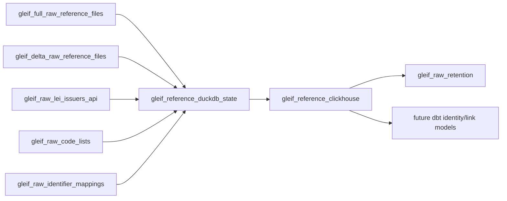

# GLEIF Data ClickHouse and Dagster Proposal

Date: 2026-06-20

## Scope

This document proposes how to ingest freely available GLEIF data into the existing `dagster_v3` project and publish normalized reference tables into the `corpscout` ClickHouse database.

The main recommendation is:

- Use GLEIF Golden Copy and mapping download files for a one-time full bootstrap load.
- Use Golden Copy delta files from a daily Dagster schedule after the full baseline exists.
- Use the public GLEIF API for discovery, small reference resources, targeted enrichment, and fallback API-only pulls.
- Store original raw files in object storage first.
- Parse raw files into DuckDB as a local staging database.
- Replace ClickHouse final reference tables atomically from DuckDB, following the existing Wikidata pattern.

GLEIF is excellent for legal entity identity, addresses, LEI status, registry authority identifiers, identifier mappings, and parent relationships. It is not a financial statements source and does not provide company websites for normal LEI records.

## Proposed ClickHouse DDL

Create this as a future migration, for example:

`clickhouse/migrations/000023_corpscout_gleif_reference_data.up.sql`

All tables belong in the existing `corpscout` database.

```sql
CREATE DATABASE IF NOT EXISTS corpscout;

CREATE TABLE IF NOT EXISTS corpscout.gleif_lei_records
(
    lei String,
    legal_name String,
    legal_name_language Nullable(String),
    entity_status LowCardinality(String),
    registration_status LowCardinality(String),
    jurisdiction Nullable(String),
    category Nullable(String),
    subcategory Nullable(String),
    legal_form_id Nullable(String),
    legal_form_other Nullable(String),
    registered_at_id Nullable(String),
    registered_at_other Nullable(String),
    registered_as Nullable(String),
    associated_entity_lei Nullable(String),
    associated_entity_name Nullable(String),
    successor_entity_lei Nullable(String),
    successor_entity_name Nullable(String),
    creation_date Nullable(DateTime64(3, 'UTC')),
    expiration_date Nullable(DateTime64(3, 'UTC')),
    expiration_reason Nullable(String),
    initial_registration_date Nullable(DateTime64(3, 'UTC')),
    last_update_date Nullable(DateTime64(3, 'UTC')),
    next_renewal_date Nullable(DateTime64(3, 'UTC')),
    managing_lou Nullable(String),
    corroboration_level Nullable(String),
    validated_at_id Nullable(String),
    validated_at_other Nullable(String),
    validated_as Nullable(String),
    conformity_flag Nullable(String),
    legal_address_country Nullable(String),
    headquarters_address_country Nullable(String),
    primary_country_iso2 Nullable(String),
    golden_copy_publish_date Nullable(DateTime64(3, 'UTC')),
    source_system LowCardinality(String),
    source_run_id String,
    retrieved_at DateTime64(3, 'UTC'),
    resolved_at DateTime64(3, 'UTC')
)
ENGINE = ReplacingMergeTree(resolved_at)
ORDER BY (lei);

CREATE TABLE IF NOT EXISTS corpscout.gleif_lei_names
(
    lei String,
    name_type LowCardinality(String),
    name String,
    name_normalized String,
    language Nullable(String),
    cdf_type Nullable(String),
    sequence UInt32,
    source_system LowCardinality(String),
    source_run_id String,
    retrieved_at DateTime64(3, 'UTC'),
    resolved_at DateTime64(3, 'UTC')
)
ENGINE = ReplacingMergeTree(resolved_at)
ORDER BY (lei, name_type, name_normalized, sequence);

CREATE TABLE IF NOT EXISTS corpscout.gleif_lei_addresses
(
    lei String,
    address_role LowCardinality(String),
    language Nullable(String),
    address_lines Array(String),
    address_number Nullable(String),
    address_number_within_building Nullable(String),
    mail_routing Nullable(String),
    city Nullable(String),
    region Nullable(String),
    country Nullable(String),
    postal_code Nullable(String),
    normalized_address Nullable(String),
    latitude Nullable(Float64),
    longitude Nullable(Float64),
    source_system LowCardinality(String),
    source_run_id String,
    retrieved_at DateTime64(3, 'UTC'),
    resolved_at DateTime64(3, 'UTC')
)
ENGINE = ReplacingMergeTree(resolved_at)
ORDER BY (lei, address_role);

CREATE TABLE IF NOT EXISTS corpscout.gleif_lei_identifiers
(
    lei String,
    identifier_type LowCardinality(String),
    identifier_value String,
    identifier_scope Nullable(String),
    mapping_source LowCardinality(String),
    is_primary UInt8,
    source_system LowCardinality(String),
    source_run_id String,
    retrieved_at DateTime64(3, 'UTC'),
    resolved_at DateTime64(3, 'UTC')
)
ENGINE = ReplacingMergeTree(resolved_at)
ORDER BY (identifier_type, identifier_value, lei);

CREATE TABLE IF NOT EXISTS corpscout.gleif_lei_relationships
(
    relationship_record_id String,
    start_node_lei String,
    start_node_type Nullable(String),
    end_node_lei String,
    end_node_type Nullable(String),
    relationship_type LowCardinality(String),
    relationship_status LowCardinality(String),
    valid_from Nullable(DateTime64(3, 'UTC')),
    valid_to Nullable(DateTime64(3, 'UTC')),
    initial_registration_date Nullable(DateTime64(3, 'UTC')),
    last_update_date Nullable(DateTime64(3, 'UTC')),
    registration_status Nullable(String),
    next_renewal_date Nullable(DateTime64(3, 'UTC')),
    managing_lou Nullable(String),
    corroboration_level Nullable(String),
    corroboration_documents Nullable(String),
    corroboration_reference Nullable(String),
    deleted_at Nullable(DateTime64(3, 'UTC')),
    source_system LowCardinality(String),
    source_run_id String,
    retrieved_at DateTime64(3, 'UTC'),
    resolved_at DateTime64(3, 'UTC')
)
ENGINE = ReplacingMergeTree(resolved_at)
ORDER BY (start_node_lei, relationship_type, end_node_lei, relationship_record_id);

CREATE TABLE IF NOT EXISTS corpscout.gleif_lei_relationship_periods
(
    relationship_record_id String,
    period_type LowCardinality(String),
    start_date Nullable(Date),
    end_date Nullable(Date),
    source_system LowCardinality(String),
    source_run_id String,
    retrieved_at DateTime64(3, 'UTC'),
    resolved_at DateTime64(3, 'UTC')
)
ENGINE = ReplacingMergeTree(resolved_at)
ORDER BY (relationship_record_id, period_type, ifNull(start_date, toDate('1970-01-01')));

CREATE TABLE IF NOT EXISTS corpscout.gleif_lei_reporting_exceptions
(
    exception_record_id String,
    lei String,
    parent_relationship_type LowCardinality(String),
    exception_category LowCardinality(String),
    exception_reason Nullable(String),
    exception_reference Nullable(String),
    initial_registration_date Nullable(DateTime64(3, 'UTC')),
    last_update_date Nullable(DateTime64(3, 'UTC')),
    registration_status Nullable(String),
    next_renewal_date Nullable(DateTime64(3, 'UTC')),
    managing_lou Nullable(String),
    source_system LowCardinality(String),
    source_run_id String,
    retrieved_at DateTime64(3, 'UTC'),
    resolved_at DateTime64(3, 'UTC')
)
ENGINE = ReplacingMergeTree(resolved_at)
ORDER BY (lei, parent_relationship_type, exception_category, exception_record_id);

CREATE TABLE IF NOT EXISTS corpscout.gleif_lei_issuers
(
    lei String,
    name String,
    marketing_name Nullable(String),
    website Nullable(String),
    accreditation_date Nullable(DateTime64(3, 'UTC')),
    jurisdictions Array(String),
    fund_jurisdictions Array(String),
    source_system LowCardinality(String),
    source_run_id String,
    retrieved_at DateTime64(3, 'UTC'),
    resolved_at DateTime64(3, 'UTC')
)
ENGINE = ReplacingMergeTree(resolved_at)
ORDER BY (lei);

CREATE TABLE IF NOT EXISTS corpscout.gleif_code_list_entries
(
    code_list LowCardinality(String),
    code String,
    label String,
    description Nullable(String),
    country_iso2 Nullable(String),
    valid_from Nullable(Date),
    valid_to Nullable(Date),
    source_system LowCardinality(String),
    source_run_id String,
    retrieved_at DateTime64(3, 'UTC'),
    resolved_at DateTime64(3, 'UTC')
)
ENGINE = ReplacingMergeTree(resolved_at)
ORDER BY (code_list, code);
```

Suggested down migration:

```sql
DROP TABLE IF EXISTS corpscout.gleif_code_list_entries;
DROP TABLE IF EXISTS corpscout.gleif_lei_issuers;
DROP TABLE IF EXISTS corpscout.gleif_lei_reporting_exceptions;
DROP TABLE IF EXISTS corpscout.gleif_lei_relationship_periods;
DROP TABLE IF EXISTS corpscout.gleif_lei_relationships;
DROP TABLE IF EXISTS corpscout.gleif_lei_identifiers;
DROP TABLE IF EXISTS corpscout.gleif_lei_addresses;
DROP TABLE IF EXISTS corpscout.gleif_lei_names;
DROP TABLE IF EXISTS corpscout.gleif_lei_records;
```

### Why this schema

`gleif_lei_records` is the current entity table. It is intentionally one row per LEI, not one row per company name or identifier. That makes exact joins simple:

- `wikidata_company_identifiers.identifier_type = 'LEI'` -> `gleif_lei_records.lei`
- listed security identifiers -> `gleif_lei_identifiers.identifier_type = 'ISIN'`
- BIC/MIC/S&P/OpenCorporates/QCC/GEM mappings -> `gleif_lei_identifiers`
- country analysis -> `primary_country_iso2`, legal address country, headquarters country, and jurisdiction

Nested repeating fields are split out:

- alternate names in `gleif_lei_names`
- legal and headquarters addresses in `gleif_lei_addresses`
- mapped identifiers in `gleif_lei_identifiers`
- parent ownership relationships in `gleif_lei_relationships`
- relationship accounting periods in `gleif_lei_relationship_periods`
- missing/non-public parent explanations in `gleif_lei_reporting_exceptions`

The raw JSON/XML/CSV should not be stored row-by-row in ClickHouse. Store full raw files and `manifest.json` files in S3/RustFS. ClickHouse should contain only normalized analytical/reference tables plus minimal source columns such as `source_run_id`, `golden_copy_publish_date`, `retrieved_at`, and `resolved_at`.

## What GLEIF Data Gives Us

GLEIF provides global LEI reference data. For Corpscout this is useful as a high-quality identity graph, not as a website crawler or financial statement feed.

Useful fields:

- LEI, legal name, alternate names, transliterated names
- registration authority ID and local registration number
- legal jurisdiction and legal form code
- legal address and headquarters address, including country
- entity status and LEI registration status
- managing LOU / LEI issuer
- validation/corroboration metadata
- BIC, MIC, S&P, OpenCorporates, QCC, GEM, OCID, and ISIN mappings where available
- direct and ultimate parent relationship records
- reporting exceptions explaining why parent data is missing

Not provided:

- company websites for normal entities
- revenue, assets, employees, or other financial metrics
- directors/officers/beneficial owners
- exhaustive local registry filing history

For financial data we still need SEC, XBRL, country registries, exchange feeds, or vendor/open securities datasets. GLEIF helps link those sources by LEI, ISIN, registry authority, legal name, and country.

## Current Data Volume

Checked against the live GLEIF API on 2026-06-20:

- `GET https://api.gleif.org/api/v1/lei-records?page[size]=1`
  - `meta.goldenCopy.publishDate`: `2026-06-20T08:00:00Z`
  - `meta.pagination.total`: `3,347,966` LEI records
- The API accepts page sizes up to 200.
  - Full API paging is therefore about `16,740` requests for LEI records only.
  - A sampled 200-record API page was about `479 KB` uncompressed JSON.
  - A full API-only LEI pull is roughly `8 GB` of uncompressed JSON responses, before relationship and mapping calls.
- `GET https://api.gleif.org/api/v1/lei-issuers?page[size]=1`
  - `meta.pagination.total`: `40` LEI issuers
- `GET https://api.gleif.org/api/v1/lei-records/HWUPKR0MPOU8FGXBT394/isins?page[size]=2`
  - Apple had `951` ISIN mappings exposed through the related endpoint.
  - This confirms ISIN is a one-to-many mapping and should not be stored as a scalar on the entity row.

Relationship and reporting exception totals should be measured from the Golden Copy file headers/manifests during the first implementation. The public API exposes relationship links per entity, but crawling relationships per LEI would be expensive and unnecessary for a full corpus load.

## Download Strategy

### Recommended bootstrap plus delta path

Use GLEIF Golden Copy and mapping files for the initial full bootstrap:

- Level 1 LEI-CDF Golden Copy: all LEI records and legal entity reference data
- Level 2 Relationship Record Golden Copy: direct and ultimate parent relationships where parent LEIs exist
- Level 2 Reporting Exceptions Golden Copy: explanations for missing/non-public parent relationships
- LEI issuer data: small public API resource
- Code lists: registration authorities, entity legal forms, accepted jurisdictions, organizational roles
- Mapping files: BIC-to-LEI, ISIN-to-LEI, MIC-to-LEI, S&P CIQ-to-LEI, OpenCorporates-to-LEI, QCC-to-LEI, GEM-to-LEI where available

After the full bootstrap succeeds, use daily delta files for the three Golden Copy datasets:

```text
https://goldencopy.gleif.org/api/v2/golden-copies/publishes/lei2/latest.json?delta=LastDay
https://goldencopy.gleif.org/api/v2/golden-copies/publishes/rr/latest.json?delta=LastDay
https://goldencopy.gleif.org/api/v2/golden-copies/publishes/repex/latest.json?delta=LastDay
```

The delta job must apply those files onto the existing current DuckDB state. It must not replace ClickHouse with only delta rows. The safe pattern is:

1. Full bootstrap creates the initial current DuckDB state from full ZIP files.
2. Daily delta downloads `LastDay` ZIP files.
3. Daily delta parses only changed/new/deleted records.
4. Daily delta upserts or deletes rows in the current DuckDB state.
5. The full current DuckDB tables are exported to ClickHouse with the existing table-swap helper.

If the DuckDB state is missing or corrupt, rerun the full bootstrap. Do not try to rebuild current state from only the latest daily delta.

Mapping files do not all follow the same delta model. For the first version, refresh mapping files on a separate full-file cadence:

- ISIN-to-LEI: daily full mapping file if needed for listed-company joins
- BIC/MIC/S&P/OpenCorporates/QCC/GEM mappings: weekly or monthly, depending on file cadence and size
- LEI issuers and code lists: daily is cheap, but weekly is enough unless downstream joins need same-day updates

### API-only fallback path

An API-only full pull is possible, but it should be a fallback:

```text
GET /api/v1/lei-records?page[size]=200&page[number]=1
GET /api/v1/lei-records?page[size]=200&page[number]=2
...
```

For correctness, the downloader must verify that `meta.goldenCopy.publishDate` remains the same across all pages. If the publish date changes mid-run, abort and restart, otherwise the snapshot can mix two Golden Copy versions.

Targeted API calls are still useful:

```text
GET /api/v1/lei-records/{lei}
GET /api/v1/lei-records/{lei}/direct-child-relationships
GET /api/v1/lei-records/{lei}/isins
GET /api/v1/lei-issuers
```

Use those for on-demand enrichment, debugging, small code/reference tables, and exact checks when a source gives us an LEI.

## Raw Object Storage Layout

Keep immutable raw files by load mode, GLEIF publish date, and Dagster run ID:

```text
gleif/raw/load_mode=full/publish_date=2026-06-20T16-00-00Z/run_id=<dagster_run_id>/file_kind=lei_records/source.json.zip
gleif/raw/load_mode=full/publish_date=2026-06-20T16-00-00Z/run_id=<dagster_run_id>/file_kind=relationships/source.json.zip
gleif/raw/load_mode=full/publish_date=2026-06-20T16-00-00Z/run_id=<dagster_run_id>/file_kind=reporting_exceptions/source.json.zip
gleif/raw/load_mode=full/publish_date=2026-06-20T16-00-00Z/run_id=<dagster_run_id>/file_kind=isin_lei_mapping/source.csv.zip
gleif/raw/load_mode=full/publish_date=2026-06-20T16-00-00Z/run_id=<dagster_run_id>/file_kind=bic_lei_mapping/source.csv.zip
gleif/raw/load_mode=full/publish_date=2026-06-20T16-00-00Z/run_id=<dagster_run_id>/file_kind=lei_issuers/page=000001.json
gleif/raw/load_mode=full/publish_date=2026-06-20T16-00-00Z/run_id=<dagster_run_id>/manifest.json

gleif/raw/load_mode=delta/delta=LastDay/publish_date=2026-06-21T16-00-00Z/run_id=<dagster_run_id>/file_kind=lei_records/source.json.zip
gleif/raw/load_mode=delta/delta=LastDay/publish_date=2026-06-21T16-00-00Z/run_id=<dagster_run_id>/file_kind=relationships/source.json.zip
gleif/raw/load_mode=delta/delta=LastDay/publish_date=2026-06-21T16-00-00Z/run_id=<dagster_run_id>/file_kind=reporting_exceptions/source.json.zip
gleif/raw/load_mode=delta/delta=LastDay/publish_date=2026-06-21T16-00-00Z/run_id=<dagster_run_id>/manifest.json
```

The manifest should include:

- load mode: `full`, `delta`, or `mapping_refresh`
- delta window: `LastDay`, `LastWeek`, `LastMonth`, `IntraDay`, or null
- file kind
- source URL
- S3 key
- byte size
- SHA-256 hash
- ETag and Last-Modified if available
- record count from file header when available
- Golden Copy publish date
- run ID
- pulled timestamp

Keep one small state object in S3/RustFS:

```text
gleif/state/current.json
```

It should hold the current baseline status:

- last full publish date applied
- last delta publish date applied
- last successful Dagster run ID
- current DuckDB state object/key if the DuckDB snapshot is also uploaded to object storage
- row counts by normalized table

This state belongs in object storage, not in ClickHouse. ClickHouse should remain focused on queryable GLEIF reference data.

Retention should be handled by a small cleanup asset after successful ClickHouse publication. Keep S3 manifests longer than raw blobs. A practical starting policy is:

- raw full files: keep 30 to 90 days
- raw daily delta files: keep 90 to 180 days, because they are small and useful for replay
- manifests: keep permanently or at least one year
- DuckDB staging files: replace per run

## Dagster Integration Proposal

Create a new package:

```text
dagster_v3/src/dagster_v3/defs/gleif/
  __init__.py
  assets.py
  source.py
  tables.py
```

Suggested constants:

```python
GROUP_NAME = "gleif"
GLEIF_DUCKDB_SCHEMA = "gleif"
GLEIF_DUCKDB_PATH = Path("data/gleif.duckdb")
GLEIF_RAW_BUCKET = "source-gleif-reference-data"
```

### Asset graph

Asset boundary decision:

- Use two raw download assets because full bootstrap files and daily delta files are different persisted raw objects in S3/RustFS.
- Use one DuckDB current-state asset because both full and delta runs update the same persisted current GLEIF state.
- Use one ClickHouse export asset because the final queryable result is always the current GLEIF reference dataset.
- Do not create separate final assets or ClickHouse tables for full versus delta. That would make Dagster show two assets for one logical current dataset.



### Asset 1: `gleif_full_raw_reference_files`

Purpose:

- Discover the latest Golden Copy publish date and file URLs.
- Download full Level 1, Level 2 relationships, and reporting exceptions ZIP files.
- Store unmodified files in object storage.
- Emit a manifest.

Implementation notes:

- Use `requests` with streaming downloads.
- Capture `ETag`, `Last-Modified`, `Content-Length` where provided.
- Compute SHA-256 while streaming to a temporary file.
- Upload the temporary file to `ObjectStoreResource`.
- Use retries with exponential backoff for transient HTTP failures.
- Do not parse records inside this asset.

This should be an unpartitioned asset. It is normally materialized manually as a bootstrap or recovery step, not scheduled daily.

### Asset 2: `gleif_delta_raw_reference_files`

Purpose:

- Download `LastDay` delta ZIP files for `lei2`, `rr`, and `repex`.
- Store unmodified delta files in object storage.
- Emit a manifest with `load_mode=delta`, the delta window, and the GLEIF publish date.
- Fail fast if `gleif/state/current.json` does not show that a full bootstrap has succeeded.

Implementation notes:

- Use the same streaming download helper as the full raw asset.
- Use `?delta=LastDay`.
- Store the `x-gleif-publish-date` response header in the manifest.
- If the publish date is already the last applied delta publish date, skip as an idempotent no-op.

### Asset 3: `gleif_raw_identifier_mappings`

Purpose:

- Download free LEI mapping files from GLEIF:
  - BIC-to-LEI
  - ISIN-to-LEI
  - MIC-to-LEI
  - S&P CIQ-to-LEI
  - OpenCorporates-to-LEI
  - QCC-to-LEI
  - GEM-to-LEI
- Store raw CSV/ZIP files in the same S3 snapshot folder.
- Add each file to the manifest.

These mappings should normalize into `gleif_lei_identifiers`.

### Asset 4: `gleif_raw_lei_issuers_api`

Purpose:

- Pull the small `lei-issuers` API resource.
- Store raw API pages in object storage.
- Normalize into `gleif_lei_issuers`.

The live API currently reports 40 issuers, so this is cheap and can be included in the bootstrap and daily delta job.

### Asset 5: `gleif_raw_code_lists`

Purpose:

- Download GLEIF code lists:
  - Registration Authorities List
  - ISO 20275 Entity Legal Forms
  - accepted legal jurisdictions
  - ISO 5009 official organizational roles, if needed
- Store raw files in object storage.
- Normalize into `gleif_code_list_entries`.

This allows later joins to convert legal form codes and registration authority IDs into readable labels.

### Asset 6: `gleif_reference_duckdb_state`

Purpose:

- Read the raw files from object storage.
- Create normalized DuckDB tables matching the ClickHouse schema.
- Maintain the current GLEIF state in DuckDB.
- Validate row counts and required fields.

Implementation notes:

- Prefer CSV Golden Copy files if the download format is straightforward, because DuckDB and Polars handle large CSVs well.
- If using JSON Golden Copy files, use `ijson`, already present in `dagster_v3`, so parsing can stream instead of loading multi-GB JSON into memory.
- Keep parsing deterministic and explicit. Do not rely on inferred nested dlt schemas for the full corpus.
- Write tables into `data/gleif.duckdb`, schema `gleif`.
- Add source columns in DuckDB: `source_system`, `source_run_id`, `retrieved_at`, `resolved_at`.
- In full mode, replace DuckDB state from the full Golden Copy files.
- In delta mode, read existing DuckDB state, apply inserts/updates/deletes from delta files, then update `gleif/state/current.json`.
- Deduplicate by:
  - `lei` for entity records
  - `(lei, address_role)` for addresses
  - `(lei, name_type, name_normalized, sequence)` for names
  - `(identifier_type, identifier_value, lei)` for identifier mappings
  - `relationship_record_id` for relationship records
  - `exception_record_id` for exceptions

Critical validation checks:

- LEI is 20 characters for rows where an LEI is required.
- `gleif_lei_records` row count equals the Level 1 file count.
- relationship rows have both start and end LEI when relationship status is active.
- exception rows have a child LEI and exception category.
- all mapping rows with invalid/empty LEI are rejected into a local audit table.
- delta mode refuses to run before a full bootstrap has initialized current state.
- delta mode is idempotent for a previously applied publish date.

### Asset 7: `gleif_reference_clickhouse`

Purpose:

- Assert ClickHouse tables exist in `corpscout`.
- Replace final ClickHouse tables from DuckDB using the existing helper:
  - `dagster_v3.defs.clickhouse.resolved.replace_duckdb_tables_in_clickhouse`

This helper already creates stage tables, inserts batches, and swaps tables with `EXCHANGE TABLES`. That is the right behavior for a current reference snapshot: the latest successful materialization replaces the previous current GLEIF view.

Recommended tables to export:

```python
GLEIF_TABLES = (
    "gleif_lei_records",
    "gleif_lei_names",
    "gleif_lei_addresses",
    "gleif_lei_identifiers",
    "gleif_lei_relationships",
    "gleif_lei_relationship_periods",
    "gleif_lei_reporting_exceptions",
    "gleif_lei_issuers",
    "gleif_code_list_entries",
)
```

Raw file manifests stay in S3/RustFS and Dagster materialization metadata. They are intentionally not exported to ClickHouse.

### Asset 8: `gleif_raw_retention`

Purpose:

- Run only after `gleif_reference_clickhouse` succeeds.
- Keep the newest successful raw snapshot and optionally the last N previous snapshots.
- Delete older raw files from the GLEIF bucket.
- Preserve S3 manifest objects and Dagster materialization metadata.

This matches the preferred operational model: ClickHouse stores the current normalized truth, S3 stores recent source snapshots for reproducibility, and old large blobs are pruned intentionally.

## Jobs and Schedules

Bootstrap job, run manually once and again only for recovery/rebuild:

```python
gleif_reference_bootstrap_job = dg.define_asset_job(
    name="gleif_reference_bootstrap_job",
    selection=[
        "gleif_full_raw_reference_files",
        "gleif_raw_identifier_mappings",
        "gleif_raw_lei_issuers_api",
        "gleif_raw_code_lists",
        "gleif_reference_duckdb_state",
        "gleif_reference_clickhouse",
        "gleif_raw_retention",
    ],
)
```

Daily delta job:

```python
gleif_reference_delta_job = dg.define_asset_job(
    name="gleif_reference_delta_job",
    selection=[
        "gleif_delta_raw_reference_files",
        "gleif_raw_lei_issuers_api",
        "gleif_reference_duckdb_state",
        "gleif_reference_clickhouse",
        "gleif_raw_retention",
    ],
)
```

Suggested daily schedule:

```python
gleif_reference_delta_schedule = dg.ScheduleDefinition(
    name="gleif_reference_delta_daily",
    job=gleif_reference_delta_job,
    cron_schedule="30 20 * * *",
    execution_timezone="UTC",
)
```

Reasoning:

- The first run must be the bootstrap job, because deltas only make sense against a current baseline.
- The daily job applies `LastDay` deltas and then republishes the full current ClickHouse tables.
- The schedule should run after the daily Golden Copy publish window we choose to track. The exact cron can be adjusted after observing `x-gleif-publish-date` in production.
- Avoid Dagster partitions for the first version. GLEIF `latest?delta=LastDay` is a moving source window, not a stable historical partition key.

## dbt and dlt Recommendation

Do not use dbt for downloading or raw parsing. dbt should start after the normalized data is already in DuckDB or ClickHouse.

Good dbt use cases:

- create a `gleif_current_companies` semantic model
- join `wikidata_company_identifiers` to `gleif_lei_records`
- build source priority models across Wikidata, SEC, country registries, and GLEIF
- create data quality views for missing country, missing registration authority, or lapsed LEIs

Do not use dlt for the full 3.35M-record Golden Copy load unless we accept dlt-generated nested schemas. For this source, explicit streaming parse into known tables is safer and easier to maintain. dlt is acceptable for small API resources such as `lei_issuers`.

## Linking to Existing Corpscout Data

High-confidence joins:

```sql
-- Wikidata company rows with LEI identifiers.
SELECT
    w.wikidata_id,
    w.identifier_value AS lei,
    g.legal_name,
    g.primary_country_iso2,
    g.registration_status
FROM corpscout.wikidata_company_identifiers AS w
INNER JOIN corpscout.gleif_lei_records AS g
    ON g.lei = w.identifier_value
WHERE w.identifier_type = 'LEI';
```

```sql
-- Listed companies with ISIN mapped to LEI.
SELECT
    l.wikidata_id,
    l.exchange_wikidata_id,
    l.ticker,
    l.isin,
    i.lei,
    g.legal_name
FROM corpscout.wikidata_company_listings AS l
INNER JOIN corpscout.gleif_lei_identifiers AS i
    ON i.identifier_type = 'ISIN'
   AND i.identifier_value = l.isin
INNER JOIN corpscout.gleif_lei_records AS g
    ON g.lei = i.lei
WHERE l.isin IS NOT NULL;
```

Country logic:

- `primary_country_iso2` should default to legal address country.
- Keep headquarters country separately.
- Keep `jurisdiction` separately because legal jurisdiction and physical address can differ.
- For domain country joins, prefer explicit country from the source company table. Use GLEIF country as enrichment, not as the only truth.

Domain logic:

- GLEIF does not give normal company websites, so it should not feed `company_website_domains` directly.
- It can enrich entities already linked to domains by Wikidata, national registries, SEC, or crawler output.

## Implementation Sequence

1. Add ClickHouse migration for the tables above.
2. Add `dagster_v3/src/dagster_v3/defs/gleif/tables.py` with table and column constants.
3. Add `source.py` with small clients:
   - `GleifApiClient`
   - `GleifDownloadClient`
   - manifest helpers
4. Add full-bootstrap raw S3 assets and daily-delta raw S3 assets.
5. Add stateful DuckDB normalization asset with full replace mode and delta upsert/delete mode.
6. Add ClickHouse export asset using `replace_duckdb_tables_in_clickhouse`.
7. Add manual bootstrap job and daily delta schedule.
8. Add dbt models only after the base tables materialize correctly.

## Tests

Unit tests should not download the full GLEIF dataset. Use fixtures:

- one LEI record with alternate names
- one LEI record with legal and headquarters addresses
- one relationship record with one period
- one reporting exception
- one issuer API page
- one mapping CSV row per mapping type
- one delta file that updates an existing LEI
- one delta file that deletes or retires a relationship record

Recommended test names:

```text
test_gleif_parse_lei_record_to_duckdb_tables
test_gleif_parse_relationship_record_to_duckdb_tables
test_gleif_parse_reporting_exception_to_duckdb_tables
test_gleif_parse_identifier_mapping_csv
test_gleif_apply_delta_updates_existing_duckdb_state
test_gleif_delta_refuses_without_bootstrap_state
test_gleif_clickhouse_columns_match_tables_constants
```

The important tests are schema contract tests: the DuckDB output columns must exactly match the ClickHouse export constants.

## Open Questions for Implementation

- Which Golden Copy format should we choose first: CSV, JSON, or XML? CSV is likely easiest for DuckDB, JSON is easiest to keep close to the API shape, XML is closest to CDF standards.
- The exact current Golden Copy and mapping download URLs should be resolved from the official GLEIF download pages during implementation, then encoded in the client with tests.
- Relationship and reporting exception counts should be recorded from the first downloaded files and added to Dagster metadata.
- Decide raw retention period: 30, 60, or 90 days.

## Sources

- GLEIF API: https://www.gleif.org/en/lei-data/gleif-api
- GLEIF API docs: https://api.gleif.org/docs
- GLEIF Golden Copy overview: https://www.gleif.org/en/lei-data/gleif-golden-copy
- Golden Copy download page: https://www.gleif.org/en/lei-data/gleif-golden-copy/download-the-golden-copy
- Level 1 LEI-CDF 3.1 format: https://www.gleif.org/en/lei-data/access-and-use-lei-data/level-1-data-lei-cdf-3-1-format
- Level 2 Relationship Record CDF 2.1 format: https://www.gleif.org/en/lei-data/access-and-use-lei-data/level-2-data-relationship-record-rr-cdf-2-1-format
- Level 2 Reporting Exceptions 2.1 format: https://www.gleif.org/en/lei-data/access-and-use-lei-data/level-2-data-reporting-exceptions-2-1-format
- LEI mapping overview: https://www.gleif.org/en/lei-data/lei-mapping
- ISIN-to-LEI relationship files: https://www.gleif.org/en/lei-data/lei-mapping/download-isin-to-lei-relationship-files
- Live LEI record count check: https://api.gleif.org/api/v1/lei-records?page%5Bsize%5D=1
- Live LEI issuer count check: https://api.gleif.org/api/v1/lei-issuers?page%5Bsize%5D=1
