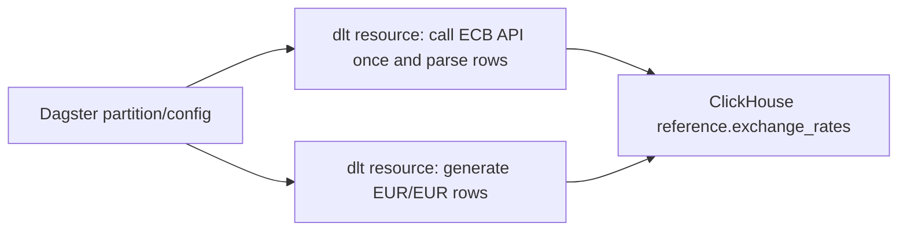

# Exchange Rates Direct dlt Resource Design

## Purpose

The exchange-rate source should be direct: call the ECB API once, parse the raw ECB JSON, and yield rows that dlt can load into ClickHouse. The current implementation hides that simple flow behind generated REST API configuration dictionaries and mapper factories.

This design replaces the config-builder layer with explicit dlt resources:

- one ECB resource calls the ECB API and yields final exchange-rate rows,
- one identity resource yields deterministic EUR/EUR rows,
- the Dagster dlt translator remains only for Dagster asset metadata.

## Current Problem

The current `exchange_rates_range_source` flow is:

```text
exchange_rates_range_source
  -> exchange_rate_range_rest_api_config
    -> rest_api_source
      -> processing_steps
        -> _ecb_range_mapper
          -> ecb_rate_rows_from_range_payload
```

This is too much indirection for one ECB endpoint. It also makes tests assert REST config dictionary shape instead of source behavior.

## Selected Approach

Use plain dlt resources that do the source-local extraction and transformation directly.



The dlt source returns:

```text
exchange_rates_ecb_<start>_<end>
exchange_rates_identity
```

Both resources produce rows for the same dlt table:

```text
exchange_rates
```

## Role Of `dagster_dlt_translator`

`dagster_dlt_translator` is not a data transformer. It maps dlt metadata into Dagster metadata:

- asset key,
- group,
- description,
- kinds,
- dependencies.

It should not call APIs, parse payloads, or produce rows.

## Source Design

### ECB Range Resource

`exchange_rates_range_source(...)` returns an ECB resource that:

1. builds the ECB URL from `currencies`,
2. calls the ECB API once with `startPeriod` and `endPeriod`,
3. calls the pure parser for the returned payload,
4. yields final rows shaped for `reference.exchange_rates`.

The HTTP call stays inside the resource because it is source extraction behavior.

### ECB Single-Date Source

`exchange_rates_source(...)` can keep its current public API for tests or future single-date loads, but it should also use direct ECB resources instead of REST config builders.

### Payload Parsing

ECB payload parsing should stay as pure Python transformation functions:

```python
ecb_rate_row_from_payload(...)
ecb_rate_rows_from_range_payload(...)
```

These functions should not import dlt, Dagster, requests, or ClickHouse clients.

### Identity Resource

The EUR identity resource remains internally generated data:

```text
EUR -> EUR = 1
```

This is not another external source. It is deterministic data inserted into the same `exchange_rates` table so downstream conversion logic does not need a special case for EUR amounts.

## ClickHouse Schema Ownership

ClickHouse table creation stays in migrations:

```text
corpscout/clickhouse/migrations/000002_reference_exchange_rates.up.sql
```

The dlt source emits rows compatible with that migrated table. It must not execute ClickHouse DDL and must not duplicate DDL constants in Python.

## Testing Strategy

Tests should verify behavior, not forwarding/config dictionary shape.

Remove tests that inspect:

```text
exchange_rate_rest_api_config
exchange_rate_range_rest_api_config
```

Add tests that verify:

- the ECB range resource calls the expected ECB URL with expected query params,
- the ECB range resource yields expected rows from a fake ECB payload,
- `exchange_rates_range_source` exposes direct ECB and identity resources,
- `exchange_rates_source` exposes direct ECB and identity resources for single-date loads,
- existing Dagster asset materialization test still passes,
- `uv run dg check defs` still loads definitions.

## Error Handling

The ECB HTTP call should call:

```python
response.raise_for_status()
```

The existing parser behavior should remain:

- single-date parsing raises `ValueError` if no observations are returned,
- range parsing yields rows only for available observations.

## Non-Goals

This change does not:

- add raw ECB payload persistence,
- add a DuckDB staging table,
- add another Dagster asset,
- add a dlt transformer,
- change ClickHouse migrations,
- change partition definitions,
- change the final `reference.exchange_rates` schema.

## Acceptance Criteria

- `rest_api_source` is no longer imported or used by the exchange-rate source.
- `exchange_rate_rest_api_config`, `exchange_rate_range_rest_api_config`, `_ecb_mapper`, and `_ecb_range_mapper` are removed.
- The exchange-rate source reads as direct dlt resources.
- The ECB API is called once per ECB resource execution.
- Exchange-rate tests pass.
- ClickHouse migration tests pass.
- Dagster definitions load successfully.
