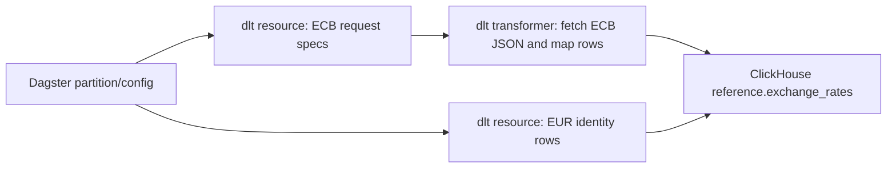

# Exchange Rates dlt Transformer Design

## Purpose

The exchange-rate source should be simple to read and operate. The current implementation hides a direct ECB API request and JSON-to-row conversion behind `rest_api_source`, generated REST config dictionaries, and mapper factory functions. That indirection does not pay for itself for this source.

This design replaces the generated REST config layer with explicit dlt resources and dlt transformers:

- one resource yields ECB request specs,
- one transformer fetches ECB payloads and yields final exchange-rate rows,
- one identity resource yields EUR identity rows.

The Dagster assets stay the orchestration boundary. The dlt source stays the API extraction and row transformation boundary.

## Current Problem

The current `exchange_rates_range_source` flow is:

```text
exchange_rates_range_source
  -> exchange_rate_range_rest_api_config
    -> rest_api_source
      -> processing_steps
        -> _ecb_range_mapper
          -> ecb_rate_rows_from_range_payload
```

For a single ECB endpoint this is too indirect. Important behavior is spread across config dictionaries and nested closure factories, so reading the source requires jumping through several layers before reaching the actual transformation.

The source does not need multiple Dagster assets because there is no durable intermediate state that operators need to inspect or retry independently. The intermediate ECB payload is source-local extraction state.

## Selected Approach

Use `dlt.resource` and `dlt.transformer` directly.



The dlt source will return two loadable resources:

```text
exchange_rates_ecb_<start>_<end>
exchange_rates_identity
```

`exchange_rates_ecb_<start>_<end>` is a transformer pipeline:

```text
ecb_exchange_rate_request_specs(...) | ecb_exchange_rate_rows(...)
```

The request-spec resource is not selected for loading. It only feeds the transformer.

## Alternatives Considered

### Option 1: Keep `rest_api_source`

This keeps dlt REST integration, but it preserves the config-builder and mapper-factory nesting. Tests also end up asserting config dictionary shape instead of business behavior. This is not a good fit for a source with one ECB endpoint and a custom SDMX payload parser.

### Option 2: Use Direct dlt Resources Only

This is simpler than the current code, but it mixes request construction, HTTP fetch, and row transformation in one resource. It is acceptable, but it does not use the dlt transformer abstraction that is designed for source-local transformations.

### Option 3: Use dlt Resource Plus dlt Transformer

This is the selected approach. It keeps the transformation visible as a first-class dlt step without promoting the raw payload to a separate Dagster asset or ClickHouse table.

## Source Design

### Request Spec Resource

The request-spec resource yields one or more dictionaries with enough information to fetch ECB payloads:

```python
{
    "resource_name": "exchange_rates_ecb_2024_12_01_2024_12_31",
    "source_url": "https://data-api.ecb.europa.eu/service/data/EXR/D.NOK+USD.EUR.SP00.A",
    "start_date": "2024-12-01",
    "end_date": "2024-12-31",
    "quote_currencies": ["NOK", "USD"],
    "source_run_id": "run-1",
    "pulled_at": "2026-06-16T00:00:00.000Z",
}
```

This resource is internal to the source and should be `selected=False` or only exposed through the pipe into the transformer. It should not create a destination table.

### Transformer

The transformer receives one request spec, performs the ECB HTTP call, and yields final rows for `reference.exchange_rates`.

It owns:

- HTTP request execution,
- status check,
- payload parsing,
- row generation,
- target dlt table hints.

The transformer should set:

```python
name=<stable resource name>
table_name="exchange_rates"
write_disposition="append"
primary_key=["rate_date", "base_currency", "quote_currency", "source"]
```

### Identity Resource

The EUR identity rows remain a plain dlt resource because they do not need an upstream request payload.

## Dagster Asset Design

No new Dagster assets are introduced.

The existing `exchange_rates_backfill` and `exchange_rates_daily` assets continue to call:

```python
exchange_rates_range_source(
    start_date=start_date,
    end_date=end_date,
    currencies=config.currencies,
    source_run_id=context.run_id,
)
```

The source returns dlt resources that produce final `exchange_rates` rows. Dagster remains responsible for:

- partition window selection,
- run config,
- deleting the ClickHouse date window before load,
- executing dlt.

## ClickHouse Schema Ownership

The dlt source does not own ClickHouse table DDL.

ClickHouse table creation stays in:

```text
corpscout/clickhouse/migrations/000002_reference_exchange_rates.up.sql
```

The dlt transformer should emit rows compatible with that migrated table. It should not execute `CREATE TABLE`, and it should not duplicate DDL constants in Python.

## Testing Strategy

Tests should verify behavior, not config forwarding.

Remove tests that inspect `exchange_rate_rest_api_config` and `exchange_rate_range_rest_api_config`.

Add tests that verify:

- the range transformer calls the expected ECB URL with expected query params,
- the transformer yields expected rows from a fake ECB payload,
- `exchange_rates_range_source` exposes the loadable ECB transformer resource and identity resource,
- `exchange_rates_source` for single-date loads exposes direct dlt resources for each requested date/currency plus identity rows,
- existing Dagster asset materialization test still passes with the fake dlt resource,
- `uv run dg check defs` still loads definitions.

## Error Handling

The HTTP fetch should call `response.raise_for_status()`.

If ECB returns no observations for a requested currency/date range, the parser should keep the current behavior:

- single-date parser raises `ValueError`,
- range parser yields no rows for missing series.

This keeps failures visible when a specific expected single-date rate is missing while allowing range calls to handle sparse ECB data.

## Non-Goals

This change does not:

- add a raw ECB payload table,
- add a DuckDB staging table,
- add another Dagster asset,
- change ClickHouse migrations,
- change partition definitions,
- change the final `reference.exchange_rates` schema.

## Open Decision

Use internal-only request specs and payloads. Do not persist raw ECB payloads unless a later operational need appears, such as audit replay or debugging external API changes.

## Acceptance Criteria

- `rest_api_source` is no longer imported or used by the exchange-rate source.
- `exchange_rate_rest_api_config`, `exchange_rate_range_rest_api_config`, `_ecb_mapper`, and `_ecb_range_mapper` are removed.
- Source code shows the flow directly as resource-to-transformer.
- Exchange-rate tests pass.
- ClickHouse migration tests pass.
- Dagster definitions load successfully.
