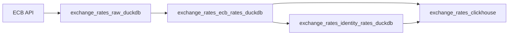

# Exchange Rates Staged DuckDB Design

## Goal

Exchange rates are shared reference data, so the pipeline should be auditable and staged like the other country/source flows. The source should first persist raw ECB API data locally, then transform that raw data into the two row sets we need, then publish the final table to ClickHouse.

## Selected Architecture

Use one daily-partitioned Dagster asset graph starting at `2023-01-01`. Daily partition ranges can be materialized for backfills, so we do not need separate backfill and daily asset definitions.



## Assets

### `exchange_rates_raw_duckdb`

This is a `@dlt_assets` asset. It calls the ECB API and stores one raw row per request in DuckDB.

Raw row fields:

- `start_date`
- `end_date`
- `quote_currencies_json`
- `source_url`
- `request_params_json`
- `source_payload_json`
- `source_payload_hash`
- `source_run_id`
- `pulled_at`

This asset owns remote extraction only. It does not produce final exchange-rate rows.

### `exchange_rates_ecb_rates_duckdb`

This is a regular Dagster asset. It reads raw payload rows from DuckDB, parses ECB SDMX JSON, and stores normalized ECB exchange-rate rows in DuckDB.

The output shape matches the ClickHouse final table columns, excluding dlt internal columns until final export fills them:

- `rate_date`
- `base_currency`
- `quote_currency`
- `rate`
- `source`
- `source_url`
- `source_payload_hash`
- `source_run_id`
- `pulled_at`
- `_dlt_load_id`
- `_dlt_id`

### `exchange_rates_identity_rates_duckdb`

This is a regular Dagster asset. It reads distinct `rate_date`, `source_run_id`, and `pulled_at` values from `exchange_rates_ecb_rates_duckdb` and generates deterministic EUR/EUR identity rows.

Identity rows are not from ECB. They are local reference rows with:

```text
base_currency = EUR
quote_currency = EUR
rate = 1
source = identity
```

### `exchange_rates_clickhouse`

This is a regular Dagster asset. It reads both transformed DuckDB tables, deletes the selected partition window from the migrated ClickHouse table, and inserts the union of ECB and identity rows.

It must not run ClickHouse DDL. ClickHouse table creation stays in:

```text
corpscout/clickhouse/migrations/000002_reference_exchange_rates.up.sql
```

## Partitioning

All assets use the same daily partitions:

```text
start_date = 2023-01-01
```

For a normal daily run, the partition window is one day. For a backfill, Dagster can pass a partition range and the code calls ECB once for the selected date window.

## dlt Usage

dlt is used only for the raw ECB extraction to DuckDB. It should not load directly to ClickHouse in this flow.

The final ClickHouse write is plain Python/DuckDB-to-ClickHouse code so tests can create dummy DuckDB tables and verify exactly what rows are inserted.

## Testing Strategy

Tests should verify:

- raw dlt source calls the ECB endpoint once with expected parameters,
- raw dlt source yields persisted raw payload metadata,
- ECB raw payload rows transform into normalized ECB rate rows in DuckDB,
- identity rows are generated from transformed ECB dates, not treated as external API data,
- final ClickHouse asset/export reads both DuckDB tables and inserts the expected union,
- no runtime ClickHouse table creation occurs,
- Dagster definitions load.

## Non-Goals

This change does not:

- add another external FX provider,
- change the final ClickHouse schema,
- add ClickHouse DDL to Dagster code,
- add a separate monthly backfill asset,
- persist every raw HTTP header or transport detail.

## Acceptance Criteria

- Exchange rates no longer use dlt direct-to-ClickHouse.
- The raw ECB API response is stored in DuckDB.
- ECB rates and identity rates are stored in separate DuckDB tables.
- The final ClickHouse asset depends on both transformed DuckDB assets.
- Final ClickHouse tests use dummy DuckDB tables and verify inserted row content.
- `uv run pytest tests/test_exchange_rates_assets.py tests/test_clickhouse_migrations.py -q` passes.
- `uv run dg check defs` passes.
