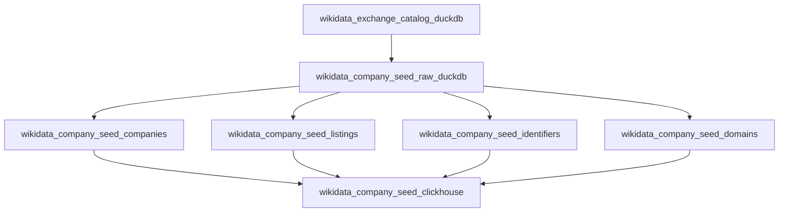

# Wikidata company seed Dagster and ClickHouse proposal

## Purpose

Add a Wikidata-based public-company seed source to `dagster_v3` and publish final company seed tables to ClickHouse. This source is meant to provide a searchable first list of listed companies, with candidate domains and financial identifiers that later enrichment jobs can use for domain validation, technology detection, SEC/GLEIF/OpenFIGI joins, and market-data enrichment.

The proposed implementation lives under:

```text
companycollect/corpscout/dagster_v3/src/dagster_v3/defs/wikidata_company_seed/
```

The ClickHouse DDL should live with the existing migrations:

```text
companycollect/corpscout/clickhouse/migrations/
```

## Recommendation

Use the existing project pattern:

1. Extract Wikidata SPARQL rows into DuckDB with dlt.
2. Use dbt inside `defs/wikidata_company_seed/dbt` to normalize final DuckDB tables.
3. Use ClickHouse migrations for physical ClickHouse table creation.
4. Use a final Dagster Python asset to atomically replace migrated ClickHouse tables from the dbt-produced DuckDB tables.

This matches the existing Finland/Norway resolved pattern. The project currently depends on `dbt-duckdb`, not `dbt-clickhouse`, so dbt should own the normalized DuckDB models. ClickHouse table DDL should remain migrations plus the existing `replace_duckdb_tables_in_clickhouse` export helper.

## Proposed asset graph



## Dagster assets

### `wikidata_exchange_catalog_duckdb`

Purpose: store the list of exchanges observed in Wikidata listing statements.

Implementation:

- dlt source or plain DuckDB SQL asset.
- Uses the exchange discovery SPARQL query.
- Stores one row per exchange.
- Materialization metadata:
  - `row_count`
  - `distinct_country_count`
  - `source_url`
  - `retrieved_at`

This asset is optional for MVP if we start with fixed NYSE/Nasdaq IDs, but it should be included before global rollout.

### `wikidata_company_seed_raw_duckdb`

Purpose: store raw listing rows returned by Wikidata.

Implementation:

- dlt source using SPARQL endpoint.
- One dlt table: `wikidata_company_seed.raw_company_listings`.
- Config:
  - `mode`: `us_mvp`, `exchange`, `global`
  - `exchange_ids`: optional list of Wikidata exchange QIDs
  - `limit`: optional dev limit
  - `request_timeout_seconds`
  - `user_agent`
- Uses dlt retry/backoff client and a descriptive User-Agent.

Important: this table is raw-ish but still row-normalized. Store source payload JSON as text for audit and future fields.

### dbt model `companies`

Purpose: one row per Wikidata company entity.

Input:

```text
source('wikidata_company_seed', 'raw_company_listings')
```

Rules:

- Deduplicate by `wikidata_id`.
- Use `official_name -> company_label -> ticker + exchange` as display-name priority.
- Do not require website.
- Keep Wikidata as source provenance, not final identity authority.

Dagster asset key:

```text
wikidata_company_seed_companies
```

### dbt model `listings`

Purpose: one row per company listing statement.

Rules:

- Preserve `listing_statement_id`.
- Preserve exchange QID/name, ticker, ISIN, and listing-current flag.
- Keep this separate from the company table because one company can have multiple tickers, share classes, exchanges, or stale listing statements.

Dagster asset key:

```text
wikidata_company_seed_listings
```

### dbt model `identifiers`

Purpose: normalized identifier rows for matching to other systems.

Rows:

```text
wikidata_qid
cik
lei
isin
ticker_exchange
```

Rules:

- Emit one identifier per row.
- Use `identifier_type`, `identifier_value`, and optional `identifier_scope`.
- Use this table for later joins to SEC, GLEIF, OpenFIGI, and market-data providers.

Dagster asset key:

```text
wikidata_company_seed_identifiers
```

### dbt model `domains`

Purpose: candidate domains from Wikidata official websites.

Rules:

- Normalize URL with existing `normalized_url`, `website_host`, `website_path`, and `root_domain` functions.
- Initial `confidence` is `medium`.
- `validation_status` starts as `unverified`.
- Later domain validation should update or create a separate validated-domain table, not overwrite this source table.

Dagster asset key:

```text
wikidata_company_seed_domains
```

### `wikidata_company_seed_clickhouse`

Purpose: export dbt-produced DuckDB tables to migrated ClickHouse final tables.

Implementation:

- Similar to `finland_ytj_resolved_clickhouse` and `norway_resolved_clickhouse`.
- Depends on the four dbt model assets.
- Calls `assert_clickhouse_tables_exist`.
- Calls `replace_duckdb_tables_in_clickhouse`.
- Returns row counts for each final table.

## Proposed package layout

```text
src/dagster_v3/defs/wikidata_company_seed/
  __init__.py
  assets.py
  source.py
  tables.py
  dbt_plugin.py
  dbt/
    dbt_project.yml
    profiles.yml
    models/
      sources.yml
      companies.sql
      listings.sql
      identifiers.sql
      domains.sql
```

Use `dbt_plugin.py` to register the existing URL/domain helper functions with dbt-duckdb, mirroring `norway_resolved/dbt_plugin.py`.

## DuckDB raw table contract

The dlt resource should declare columns explicitly:

```python
WIKIDATA_RAW_COMPANY_LISTINGS_COLUMNS = {
    "source_run_id": {"data_type": "text", "nullable": False},
    "source_record_id": {"data_type": "text", "nullable": False},
    "source_payload_hash": {"data_type": "text", "nullable": False},
    "retrieved_at": {"data_type": "timestamp", "nullable": False},
    "query_mode": {"data_type": "text", "nullable": False},
    "query_exchange_id": {"data_type": "text"},
    "wikidata_id": {"data_type": "text", "nullable": False},
    "wikidata_url": {"data_type": "text", "nullable": False},
    "company_label": {"data_type": "text"},
    "official_name": {"data_type": "text"},
    "listing_statement_id": {"data_type": "text", "nullable": False},
    "exchange_wikidata_id": {"data_type": "text", "nullable": False},
    "exchange_name": {"data_type": "text"},
    "ticker": {"data_type": "text"},
    "isin": {"data_type": "text"},
    "website_url": {"data_type": "text"},
    "cik": {"data_type": "text"},
    "lei": {"data_type": "text"},
    "headquarters_label": {"data_type": "text"},
    "industry_label": {"data_type": "text"},
    "raw_record": {"data_type": "text", "nullable": False},
}
```

## ClickHouse schema

Create one migration, for example:

```text
000013_corpscout_wikidata_company_seed.up.sql
000013_corpscout_wikidata_company_seed.down.sql
```

### `corpscout.wikidata_companies`

```sql
CREATE TABLE IF NOT EXISTS corpscout.wikidata_companies
(
    wikidata_id String,
    wikidata_url String,
    name String,
    name_normalized String,
    official_name Nullable(String),
    headquarters_label Nullable(String),
    industry_label Nullable(String),
    primary_website_url Nullable(String),
    primary_website_host Nullable(String),
    primary_root_domain Nullable(String),
    has_current_listing UInt8,
    listing_count UInt64,
    source_system LowCardinality(String),
    source_run_id String,
    source_record_id String,
    source_payload_hash FixedString(64),
    retrieved_at DateTime64(3, 'UTC'),
    resolved_at DateTime64(3, 'UTC')
)
ENGINE = ReplacingMergeTree(resolved_at)
ORDER BY (wikidata_id);
```

### `corpscout.wikidata_company_listings`

```sql
CREATE TABLE IF NOT EXISTS corpscout.wikidata_company_listings
(
    wikidata_id String,
    listing_statement_id String,
    exchange_wikidata_id String,
    exchange_name String,
    ticker Nullable(String),
    isin Nullable(String),
    is_current UInt8,
    source_system LowCardinality(String),
    source_run_id String,
    source_record_id String,
    source_payload_hash FixedString(64),
    retrieved_at DateTime64(3, 'UTC'),
    resolved_at DateTime64(3, 'UTC')
)
ENGINE = ReplacingMergeTree(resolved_at)
ORDER BY (exchange_wikidata_id, ticker, wikidata_id, listing_statement_id);
```

### `corpscout.wikidata_company_identifiers`

```sql
CREATE TABLE IF NOT EXISTS corpscout.wikidata_company_identifiers
(
    wikidata_id String,
    identifier_type LowCardinality(String),
    identifier_value String,
    identifier_scope Nullable(String),
    is_primary UInt8,
    source_system LowCardinality(String),
    source_run_id String,
    source_record_id String,
    source_payload_hash FixedString(64),
    retrieved_at DateTime64(3, 'UTC'),
    resolved_at DateTime64(3, 'UTC')
)
ENGINE = ReplacingMergeTree(resolved_at)
ORDER BY (identifier_type, identifier_value, wikidata_id);
```

Recommended `identifier_type` values:

```text
wikidata_qid
cik
lei
isin
ticker_exchange
```

For `ticker_exchange`, store `identifier_value` as the ticker and `identifier_scope` as the exchange Wikidata ID. This avoids ambiguous ticker-only joins.

### `corpscout.wikidata_company_domains`

```sql
CREATE TABLE IF NOT EXISTS corpscout.wikidata_company_domains
(
    wikidata_id String,
    website_url String,
    website_normalized_url String,
    website_host String,
    root_domain String,
    website_path Nullable(String),
    confidence LowCardinality(String),
    validation_status LowCardinality(String),
    is_primary_candidate UInt8,
    source_system LowCardinality(String),
    source_run_id String,
    source_record_id String,
    source_payload_hash FixedString(64),
    retrieved_at DateTime64(3, 'UTC'),
    resolved_at DateTime64(3, 'UTC')
)
ENGINE = ReplacingMergeTree(resolved_at)
ORDER BY (root_domain, wikidata_id, website_normalized_url);
```

Initial values:

```text
confidence = medium
validation_status = unverified
is_primary_candidate = true when it is the selected primary website for that Wikidata QID
```

### `corpscout.wikidata_seed_extraction_runs`

This table is optional for MVP, but recommended before scheduled production runs.

```sql
CREATE TABLE IF NOT EXISTS corpscout.wikidata_seed_extraction_runs
(
    source_run_id String,
    query_mode LowCardinality(String),
    query_exchange_id Nullable(String),
    query_hash FixedString(64),
    row_count UInt64,
    distinct_company_count UInt64,
    distinct_listing_count UInt64,
    companies_with_website_count UInt64,
    companies_with_cik_count UInt64,
    companies_with_lei_count UInt64,
    started_at DateTime64(3, 'UTC'),
    completed_at DateTime64(3, 'UTC'),
    source_system LowCardinality(String)
)
ENGINE = ReplacingMergeTree(completed_at)
ORDER BY (source_run_id, query_mode, query_exchange_id);
```

## Down migration

```sql
DROP TABLE IF EXISTS corpscout.wikidata_seed_extraction_runs;
DROP TABLE IF EXISTS corpscout.wikidata_company_domains;
DROP TABLE IF EXISTS corpscout.wikidata_company_identifiers;
DROP TABLE IF EXISTS corpscout.wikidata_company_listings;
DROP TABLE IF EXISTS corpscout.wikidata_companies;
```

## dbt model sketches

### `companies.sql`

```sql
{{ config(materialized='table') }}

with ranked as (
  select
    *,
    row_number() over (
      partition by wikidata_id
      order by
        case when website_url is not null and website_url != '' then 0 else 1 end,
        case when cik is not null and cik != '' then 0 else 1 end,
        exchange_name,
        ticker
    ) as row_priority,
    count(distinct listing_statement_id) over (partition by wikidata_id) as listing_count
  from {{ source('wikidata_company_seed', 'raw_company_listings') }}
),
selected as (
  select *
  from ranked
  where row_priority = 1
)
select
  wikidata_id,
  wikidata_url,
  coalesce(nullif(official_name, ''), nullif(company_label, ''), concat(ticker, ' ', exchange_name)) as name,
  lower(coalesce(nullif(official_name, ''), nullif(company_label, ''), concat(ticker, ' ', exchange_name))) as name_normalized,
  nullif(official_name, '') as official_name,
  nullif(headquarters_label, '') as headquarters_label,
  nullif(industry_label, '') as industry_label,
  nullif(normalized_url(website_url), '') as primary_website_url,
  nullif(website_host(website_url), '') as primary_website_host,
  nullif(root_domain(website_url), '') as primary_root_domain,
  true as has_current_listing,
  listing_count,
  'wikidata' as source_system,
  source_run_id,
  source_record_id,
  source_payload_hash,
  retrieved_at,
  now() as resolved_at
from selected
where wikidata_id is not null
  and wikidata_id != ''
```

### `listings.sql`

```sql
{{ config(materialized='table') }}

select distinct
  wikidata_id,
  listing_statement_id,
  exchange_wikidata_id,
  exchange_name,
  nullif(ticker, '') as ticker,
  nullif(isin, '') as isin,
  true as is_current,
  'wikidata' as source_system,
  source_run_id,
  source_record_id,
  source_payload_hash,
  retrieved_at,
  now() as resolved_at
from {{ source('wikidata_company_seed', 'raw_company_listings') }}
where wikidata_id is not null
  and wikidata_id != ''
  and listing_statement_id is not null
  and listing_statement_id != ''
```

### `identifiers.sql`

```sql
{{ config(materialized='table') }}

select
  wikidata_id,
  'wikidata_qid' as identifier_type,
  wikidata_id as identifier_value,
  cast(null as varchar) as identifier_scope,
  true as is_primary,
  'wikidata' as source_system,
  source_run_id,
  source_record_id,
  source_payload_hash,
  retrieved_at,
  now() as resolved_at
from {{ source('wikidata_company_seed', 'raw_company_listings') }}
where wikidata_id is not null and wikidata_id != ''

union all

select
  wikidata_id,
  'cik' as identifier_type,
  cik as identifier_value,
  cast(null as varchar) as identifier_scope,
  true as is_primary,
  'wikidata' as source_system,
  source_run_id,
  source_record_id,
  source_payload_hash,
  retrieved_at,
  now() as resolved_at
from {{ source('wikidata_company_seed', 'raw_company_listings') }}
where cik is not null and cik != ''

union all

select
  wikidata_id,
  'lei' as identifier_type,
  lei as identifier_value,
  cast(null as varchar) as identifier_scope,
  true as is_primary,
  'wikidata' as source_system,
  source_run_id,
  source_record_id,
  source_payload_hash,
  retrieved_at,
  now() as resolved_at
from {{ source('wikidata_company_seed', 'raw_company_listings') }}
where lei is not null and lei != ''

union all

select
  wikidata_id,
  'isin' as identifier_type,
  isin as identifier_value,
  exchange_wikidata_id as identifier_scope,
  false as is_primary,
  'wikidata' as source_system,
  source_run_id,
  source_record_id,
  source_payload_hash,
  retrieved_at,
  now() as resolved_at
from {{ source('wikidata_company_seed', 'raw_company_listings') }}
where isin is not null and isin != ''

union all

select
  wikidata_id,
  'ticker_exchange' as identifier_type,
  ticker as identifier_value,
  exchange_wikidata_id as identifier_scope,
  false as is_primary,
  'wikidata' as source_system,
  source_run_id,
  source_record_id,
  source_payload_hash,
  retrieved_at,
  now() as resolved_at
from {{ source('wikidata_company_seed', 'raw_company_listings') }}
where ticker is not null and ticker != ''
```

### `domains.sql`

```sql
{{ config(materialized='table') }}

with normalized as (
  select
    *,
    normalized_url(website_url) as website_normalized_url,
    website_host(website_url) as website_host,
    website_path(website_url) as website_path,
    root_domain(website_url) as root_domain
  from {{ source('wikidata_company_seed', 'raw_company_listings') }}
)
select distinct
  wikidata_id,
  website_url,
  website_normalized_url,
  website_host,
  root_domain,
  nullif(website_path, '') as website_path,
  'medium' as confidence,
  'unverified' as validation_status,
  true as is_primary_candidate,
  'wikidata_official_website' as source_system,
  source_run_id,
  source_record_id,
  source_payload_hash,
  retrieved_at,
  now() as resolved_at
from normalized
where wikidata_id is not null
  and wikidata_id != ''
  and website_normalized_url is not null
  and website_normalized_url != ''
  and root_domain is not null
  and root_domain != ''
```

## `tables.py` contract

Define explicit export order:

```python
WIKIDATA_COMPANIES_TABLE = "wikidata_companies"
WIKIDATA_COMPANY_LISTINGS_TABLE = "wikidata_company_listings"
WIKIDATA_COMPANY_IDENTIFIERS_TABLE = "wikidata_company_identifiers"
WIKIDATA_COMPANY_DOMAINS_TABLE = "wikidata_company_domains"

WIKIDATA_COMPANY_SEED_TABLES = (
    WIKIDATA_COMPANIES_TABLE,
    WIKIDATA_COMPANY_LISTINGS_TABLE,
    WIKIDATA_COMPANY_IDENTIFIERS_TABLE,
    WIKIDATA_COMPANY_DOMAINS_TABLE,
)
```

Then add `RESOLVED_TABLE_COLUMNS` matching the ClickHouse column order exactly, as existing resolved packages do.

## Scheduling

Start without a schedule. Manually materialize:

```text
wikidata_company_seed_raw_duckdb
wikidata_company_seed_clickhouse
```

After row counts are stable, add:

```text
wikidata_company_seed_weekly_job
wikidata_company_seed_weekly_schedule
```

Recommended cron:

```text
0 4 * * 0
```

Wikidata is not a high-frequency source for this use case. Weekly refresh is enough for the first version.

## Tests

Add focused tests before implementation:

```text
tests/test_wikidata_company_seed_source.py
tests/test_wikidata_company_seed_dbt.py
tests/test_wikidata_company_seed_assets.py
tests/test_clickhouse_migrations.py update
```

Required checks:

- dlt resource declares explicit columns.
- emitted row keys match the dlt table schema.
- dbt `companies` deduplicates multiple listings into one company.
- dbt `listings` preserves listing rows.
- dbt `identifiers` emits CIK, LEI, ISIN, and ticker/exchange identifiers.
- dbt `domains` normalizes URL, host, path, and root domain.
- `wikidata_company_seed_clickhouse` depends on all four dbt models.
- ClickHouse migration test includes the new migration and table columns.

Verification commands:

```bash
uv run pytest -v tests/test_wikidata_company_seed_source.py \
  tests/test_wikidata_company_seed_dbt.py \
  tests/test_wikidata_company_seed_assets.py \
  tests/test_clickhouse_migrations.py

uv run dg check defs
```

## Rollout plan

1. Implement US MVP query for NYSE and Nasdaq.
2. Materialize raw DuckDB and dbt assets locally with a small limit.
3. Add ClickHouse migration and export asset.
4. Export to ClickHouse and compare counts:
   - raw rows
   - distinct Wikidata companies
   - listing rows
   - identifiers by type
   - domain candidates
5. Add exchange catalog extraction.
6. Move from US MVP to per-exchange extraction.
7. Add weekly schedule.

## Open decisions

- Whether `wikidata_seed_extraction_runs` should be exported to ClickHouse in MVP or kept as materialization metadata only.
- Whether the first scheduled rollout should be US-only or all exchanges.
- Whether to add `dbt-clickhouse` later. For now, using dbt-duckdb plus migrations/export is lower-risk because it matches the project.

