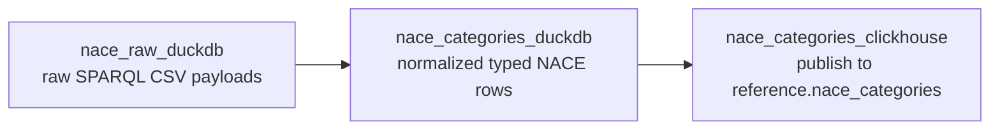

# NACE Staged DuckDB Design

## Goal

Rework NACE processing to follow the same staged model as `exchange_rates`:



The key change is that dlt should no longer load NACE directly into ClickHouse. dlt should only capture raw source payloads into DuckDB. Normalization and final publishing should be explicit Dagster assets with typed DuckDB schema contracts.

## Current State

Current files:

- `src/dagster_v3/defs/nace/source.py`
  - Fetches EU Publications Office SPARQL CSV for NACE Rev. 2 and Rev. 2.1.
  - Parses CSV and directly builds final NACE category rows.
  - Defines `nace_clickhouse_pipeline()`, a dlt ClickHouse destination pipeline.
- `src/dagster_v3/defs/nace/assets.py`
  - Defines one `@dlt_assets` asset, `nace_categories`.
  - Calls `prepare_nace_categories_table(clickhouse)` before dlt load.
  - Runs dlt directly into ClickHouse.
- `src/dagster_v3/defs/nace/clickhouse.py`
  - Creates `reference.nace_categories`.
  - Truncates the table before load.
- `src/dagster_v3/defs/nace/tables.py`
  - Defines ClickHouse final-table columns and DDL.

Problems:

- Final ClickHouse DDL is still created from Dagster code instead of migrations only.
- The Dagster asset does a destructive `TRUNCATE TABLE`.
- dlt directly owns the final ClickHouse write, so typed intermediate contracts are hidden.
- NACE normalized rows are not stored locally in a typed DuckDB table before publish.
- The existing `nace_clickhouse_pipeline()` helper repeats a pattern we intentionally removed from `exchange_rates`.

## Target Asset Graph

### `nace_raw_duckdb`

Type: `@dlt_assets`

Kinds: `{"python", "dlt", "duckdb", "reference"}`

Purpose:

- Fetch official SPARQL CSV payloads for every configured NACE scheme.
- Store raw payload metadata in DuckDB.
- Do not normalize categories in this asset.
- Do not write ClickHouse in this asset.

DuckDB database:

- `data/nace_source.duckdb`

DuckDB schema:

- `nace_stage`

DuckDB table:

- `raw_sparql_payloads`

Fields:

| Column | DuckDB Type | Meaning |
| --- | --- | --- |
| `classification_version` | `VARCHAR` | `NACE_REV_2` or `NACE_REV_2_1` |
| `source_scheme_uri` | `VARCHAR` | SKOS scheme URI queried |
| `source_url` | `VARCHAR` | SPARQL endpoint URL |
| `request_query` | `VARCHAR` | SPARQL query sent |
| `response_csv` | `VARCHAR` | Raw CSV response body |
| `source_payload_hash` | `VARCHAR` | SHA-256 of raw CSV body |
| `valid_from` | `DATE` | Scheme validity start |
| `valid_to` | `DATE` nullable | Scheme validity end |
| `is_current` | `UTINYINT` | Current-version marker |
| `source_run_id` | `VARCHAR` | Dagster run id |
| `pulled_at` | `TIMESTAMP` | Fetch timestamp |

Notes:

- The dlt resource should yield one row per scheme payload.
- `fetch_nace_scheme_rows(...)` should be split or supplemented with a raw fetch function that returns the CSV body and metadata before parsing.
- Existing parser functions can remain pure and be reused downstream.

### `nace_categories_duckdb`

Type: regular `@dg.asset`

Deps:

- `nace_raw_duckdb`

Kinds: `{"python", "duckdb", "reference"}`

Purpose:

- Read `nace_stage.raw_sparql_payloads`.
- Parse `response_csv`.
- Build normalized NACE category rows with `build_nace_rows(...)`.
- Store typed normalized rows in DuckDB.
- Expose `dagster/column_schema` metadata using `DuckDBTableContract`.
- Validate the DuckDB table schema on materialization.

DuckDB table:

- `nace_stage.nace_categories`

Fields:

| Column | DuckDB Type | ClickHouse Type |
| --- | --- | --- |
| `classification_version` | `VARCHAR` | `LowCardinality(String)` |
| `code` | `VARCHAR` | `String` |
| `normalized_code` | `VARCHAR` | `String` |
| `parent_code` | `VARCHAR` nullable | `Nullable(String)` |
| `level` | `VARCHAR` | `LowCardinality(String)` |
| `section_code` | `VARCHAR` nullable | `Nullable(String)` |
| `description_en` | `VARCHAR` | `String` |
| `concept_uri` | `VARCHAR` | `String` |
| `parent_concept_uri` | `VARCHAR` nullable | `Nullable(String)` |
| `source_scheme_uri` | `VARCHAR` | `String` |
| `source_url` | `VARCHAR` | `String` |
| `source_payload_hash` | `VARCHAR` | `FixedString(64)` |
| `valid_from` | `DATE` | `Date` |
| `valid_to` | `DATE` nullable | `Nullable(Date)` |
| `is_current` | `UTINYINT` | `UInt8` |
| `source_run_id` | `VARCHAR` | `String` |
| `pulled_at` | `TIMESTAMP` | `DateTime64(3, 'UTC')` |
| `_dlt_load_id` | `VARCHAR` | `String` |
| `_dlt_id` | `VARCHAR` | `String` |

Contract definition:

- Add `NACE_CATEGORIES_DUCKDB_CONTRACT` in `tables.py`.
- Keep `NACE_CATEGORIES_COLUMNS` as the column order authority.
- Derive `NACE_CATEGORIES_DUCKDB_COLUMN_TYPES` from the contract for compatibility with tests.

Validation:

- Use `create_duckdb_table_from_contract(...)`.
- Use `validate_duckdb_table_contract(...)`.
- Add row-level tests for date, nullable date, integer, and timestamp Python values.

### `nace_categories_clickhouse`

Type: regular `@dg.asset`

Deps:

- `nace_categories_duckdb`

Kinds: `{"python", "duckdb", "clickhouse", "reference"}`

Purpose:

- Publish typed DuckDB normalized rows to migrated ClickHouse table `reference.nace_categories`.
- Do not create ClickHouse tables.
- Do not run ClickHouse DDL.
- Replace data in a controlled way.

Recommended publish behavior:

- Because NACE is a small reference table, use full-table replacement through `replace_duckdb_tables_in_clickhouse(...)`.
- That helper creates a temporary stage table from the migrated final table, inserts DuckDB rows, and swaps tables.
- This avoids `TRUNCATE TABLE` and reduces the chance of leaving the reference table empty after a failed run.

Preconditions:

- The final ClickHouse table must be created by migrations.
- The helper should fail if `reference.nace_categories` does not exist.

## Jobs

Add two jobs, mirroring `exchange_rates`:

```python
nace_selection = dg.AssetSelection.assets("nace_categories_clickhouse").upstream()

nace_refresh_job = dg.define_asset_job(
    "nace_refresh_job",
    selection=nace_selection,
)

nace_backfill_job = dg.define_asset_job(
    "nace_backfill_job",
    selection=nace_selection,
)
```

NACE does not need a daily schedule. The classification changes rarely. Prefer manual refresh/backfill unless there is a clear operational need for a periodic reference-data refresh.

## Source Package Shape

Target `source.py` responsibilities:

- Constants for SPARQL endpoint, schemes, retry settings.
- Pure SPARQL query builder.
- Pure CSV parser.
- Raw fetch function:

```python
def fetch_nace_scheme_payload(...) -> dict[str, Any]:
    ...
```

- Raw dlt resource:

```python
@dlt.source(name="nace_raw")
def nace_raw_source(...) -> list[DltResource]:
    ...
```

- Pure normalization functions:

```python
def build_nace_rows(...) -> list[dict[str, Any]]:
    ...
```

Remove from `source.py`:

- `nace_clickhouse_pipeline`
- `clickhouse_destination_credentials_from_env`
- ClickHouse destination constants that only support dlt direct-to-ClickHouse

## Asset Package Shape

Target `assets.py` responsibilities:

- Define `NACE_DUCKDB_PATH = Path("data/nace_source.duckdb")`.
- Inline dlt DuckDB pipeline in the `@dlt_assets` decorator and in `dlt.run(...)`.
- Define:
  - `nace_raw_duckdb_asset`
  - `nace_categories_duckdb`
  - `nace_categories_clickhouse`
  - `nace_refresh_job`
  - `nace_backfill_job`
- Register all assets and jobs in `defs`.

Remove from `assets.py`:

- `prepare_nace_categories_table(clickhouse)`
- dlt direct-to-ClickHouse execution

## ClickHouse/Migration Model

`tables.py` can keep final ClickHouse table constants, but `NACE_CATEGORIES_DDL` should eventually be removed from Dagster code once migrations are the single authority.

Migration requirements:

- Ensure `reference.nace_categories` exists in `corpscout/clickhouse/migrations`.
- Engine should stay `ReplacingMergeTree(pulled_at)`.
- `ORDER BY (classification_version, normalized_code)`.

Dagster publish asset should call a table-existence assertion or rely on the insert/swap helper to fail clearly if migrations were not applied.

## Testing Plan

Update `tests/test_nace_categories.py`:

- Raw source tests:
  - `nace_raw_source` yields one raw payload row per scheme.
  - Raw payload row contains CSV body, query, payload hash, validity metadata, run id, and pulled timestamp.
- Normalization tests:
  - `normalize_nace_categories_duckdb(...)` reads raw payload rows and writes typed rows.
  - Assert `valid_from` is `date`, `valid_to` is `date | None`, `is_current` is `int`, `pulled_at` is `datetime`.
  - Assert parent and section code derivation still matches current behavior.
- Contract tests:
  - `NACE_CATEGORIES_DUCKDB_CONTRACT.column_names == NACE_CATEGORIES_COLUMNS`.
  - `nace_categories_duckdb` exposes `dagster/column_schema`.
  - Existing `DuckDBTableContract` validation rejects wrong table types.
- ClickHouse export tests:
  - Use a fake ClickHouse client to assert no `CREATE TABLE IF NOT EXISTS` and no `TRUNCATE TABLE`.
  - Assert exported rows use ClickHouse-driver-compatible Python types.
  - Assert publish helper inserts into stage/final table according to chosen replacement strategy.
- Repository tests:
  - `nace_raw_duckdb`, `nace_categories_duckdb`, and `nace_categories_clickhouse` are registered.
  - `nace_refresh_job` and `nace_backfill_job` are registered.
  - Old `nace_categories` dlt-to-ClickHouse asset key is absent.

## Implementation Steps

1. Add tests for the target asset graph and contracts.
2. Add NACE raw DuckDB constants and contracts in `tables.py`.
3. Refactor `source.py` to expose raw dlt source and pure normalizers only.
4. Replace direct dlt-to-ClickHouse asset with staged assets.
5. Implement `normalize_nace_categories_duckdb(...)`.
6. Implement `export_nace_categories_clickhouse(...)`.
7. Remove `prepare_nace_categories_table(...)` usage from the asset flow.
8. Update tests that currently assert direct dlt-to-ClickHouse behavior.
9. Run:

```bash
cd /Users/graovic/pulsarpoint/ppoint/companycollect/corpscout/dagster_v3
uv run pytest tests/test_nace_categories.py tests/test_duckdb_schema_contract.py tests/test_clickhouse_migrations.py -q
uv run dg check defs
```

## Open Decisions

- Whether to keep `clickhouse.py` as a small publish helper module or remove it after migrations fully own table creation.
- Whether `nace_categories_clickhouse` should full-replace with stage/swap every run or delete by `classification_version` before insert. Full replace is recommended because the table is small reference data.
- Whether to add a schedule. Recommended default: no schedule; manual refresh only.
