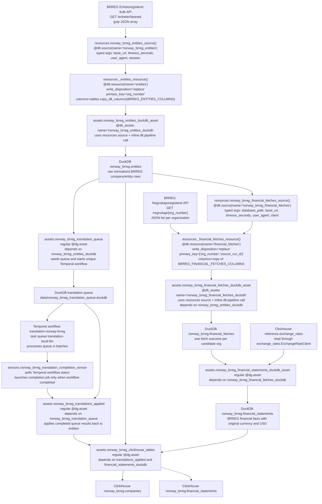

# Norway BRREG dlt Assets Implementation Plan

> **For agentic workers:** REQUIRED SUB-SKILL: Use superpowers:subagent-driven-development (recommended) or superpowers:executing-plans to implement this plan task-by-task. Steps use checkbox (`- [ ]`) syntax for tracking.

**Goal:** Convert Norway BRREG dlt ingestion to the project standard: fully typed dlt sources and child resources in `resources.py`, dlt assets in `assets.py`, and sensor definitions in `sensors.py`.

**Architecture:** `resources.py` owns only BRREG dlt source definitions, child dlt resources, HTTP protocols, row builders, and source parsing helpers. `assets.py` imports those sources/resources and owns the `DagsterDltTranslator`, two `@dlt_assets` with inline `dlt.pipeline` construction, plus regular Dagster assets for financial normalization, translation queue/workflow coordination, translation application, and ClickHouse export. `sensors.py` owns the Temporal-completion sensor and its sensor-only helper logic.

**Tech Stack:** Python 3.14, Dagster, dagster-dlt, dlt, DuckDB, ClickHouse, Temporal, local/remote LLM translation queue, shared `exchange_rates` ClickHouse client.

---

## Target Flow



## Source, Resource, and Asset Contracts

### `resources.py`

`src/dagster_v3/defs/norway_brreg/resources.py` is the only module that defines dlt sources and dlt child resources for Norway BRREG. It must not define `dlt.pipeline` objects, pipeline factory functions, `@dlt_assets`, or `DagsterDltTranslator` classes.

It should expose these typed public symbols:

| symbol | type/signature | purpose |
| --- | --- | --- |
| `COUNTRY` | `str` | Constant `NO`. |
| `DLT_DATASET_NAME` | `str` | Constant `norway_brreg`. |
| `ENTITIES_TABLE` | `str` | Constant `entities`. |
| `FINANCIAL_FETCHES_TABLE` | `str` | Constant `financial_fetches`. |
| `BRREG_BASE_URL` | `str` | Constant `https://data.brreg.no/enhetsregisteret/api`. |
| `BRREG_REGNSKAP_BASE_URL` | `str` | Constant `https://data.brreg.no/regnskapsregisteret/regnskap`. |
| `DEFAULT_TIMEOUT_SECONDS` | `int` | Default HTTP timeout, `120`. |
| `DEFAULT_USER_AGENT` | `str` | Default BRREG HTTP user agent. |
| `HttpSession` | `Protocol` with `headers: dict[str, str]` and `get(self, url: str, *, timeout: int) -> Any` | Testable HTTP session boundary. |
| `norway_brreg_entities_source` | `@dlt.source` returning `DltResource` | BRREG entity source. |
| `norway_brreg_financial_fetches_source` | `@dlt.source` returning `DltResource` | BRREG financial fetch source. |
| `build_entity_rows` | `(entities: list[dict[str, Any]], *, run_id: str) -> list[dict[str, Any]]` | Deterministic row builder used by tests and source resource. |

`norway_brreg_entities_source` wraps `_entities_resource`. `_entities_resource` downloads the BRREG bulk gzip JSON, streams each JSON object with `ijson`, converts each entity into the explicit `BRREG_ENTITIES_COLUMNS` schema, and emits rows to DuckDB table `norway_brreg.entities`.

`norway_brreg_financial_fetches_source` wraps `_financial_fetches_resource`. `_financial_fetches_resource` reads candidates from `norway_brreg.entities` in the same DuckDB file where `is_active = true`, `website` is non-empty, and `last_submitted_accounts_year` is non-empty. It calls BRREG financial API per candidate and emits success or failure rows to DuckDB table `norway_brreg.financial_fetches`.

### `assets.py`

`src/dagster_v3/defs/norway_brreg/assets.py` loads sources from `resources.py` and creates the two dlt assets directly with `@dlt_assets`. It must not define separate dlt pipeline factory functions such as `norway_brreg_entities_pipeline` or `norway_brreg_financial_fetches_pipeline`; the full `dlt.pipeline` call belongs inside each `@dlt_assets` decorator. The asset body must call `yield from dlt.run(context=context)` and must not repeat `dlt_source` or `dlt_pipeline`.

`NorwayBrregDltTranslator` belongs in `assets.py` because it maps dlt resources to Dagster asset specs:

| dlt resource | Dagster asset key | dependencies | group | kinds |
| --- | --- | --- | --- | --- |
| `entities` | `norway_brreg_entities_duckdb` | none | `norway_brreg` | `python`, `dlt`, `duckdb` |
| `financial_fetches` | `norway_brreg_financial_fetches_duckdb` | `norway_brreg_entities_duckdb` | `norway_brreg` | `python`, `dlt`, `duckdb` |

`assets.py` should expose only the translator as a local dlt/Dagster mapping helper:

| symbol | type/signature | purpose |
| --- | --- | --- |
| `NorwayBrregDltTranslator` | `DagsterDltTranslator` subclass | Maps dlt resource names to stable Dagster asset specs. |

It should define:

```python
@dlt_assets(
    dlt_source=resources.norway_brreg_entities_source(),
    dlt_pipeline=dlt.pipeline(
        pipeline_name="norway_brreg_entities",
        destination=dlt.destinations.duckdb(str(NORWAY_BRREG_DUCKDB_PATH)),
        dataset_name=DLT_DATASET_NAME,
        dev_mode=False,
    ),
    name="norway_brreg_entities_duckdb",
    dagster_dlt_translator=NorwayBrregDltTranslator(),
)
def norway_brreg_entities_duckdb_asset(
    context: dg.AssetExecutionContext,
    dlt: DagsterDltResource,
) -> Iterator[Any]:
    NORWAY_BRREG_DUCKDB_PATH.parent.mkdir(parents=True, exist_ok=True)
    yield from dlt.run(context=context)

@dlt_assets(
    dlt_source=resources.norway_brreg_financial_fetches_source(
        database_path=NORWAY_BRREG_DUCKDB_PATH,
    ),
    dlt_pipeline=dlt.pipeline(
        pipeline_name="norway_brreg_financial_fetches",
        destination=dlt.destinations.duckdb(str(NORWAY_BRREG_DUCKDB_PATH)),
        dataset_name=DLT_DATASET_NAME,
        dev_mode=False,
    ),
    name="norway_brreg_financial_fetches_duckdb",
    dagster_dlt_translator=NorwayBrregDltTranslator(),
)
def norway_brreg_financial_fetches_duckdb_asset(
    context: dg.AssetExecutionContext,
    dlt: DagsterDltResource,
) -> Iterator[Any]:
    NORWAY_BRREG_DUCKDB_PATH.parent.mkdir(parents=True, exist_ok=True)
    yield from dlt.run(context=context)
```

The body of each dlt asset should call `yield from dlt.run(context=context)`. Manual `dg.MaterializeResult` row counting should be removed from these dlt assets unless Dagster/dlt events do not provide enough metadata. The BRREG dlt source rows should not depend on `context.run_id`; dlt metadata columns such as `_dlt_load_id` should be used for load lineage inside dlt-managed staging tables.

Definition-time source configuration rule: because `dlt.run(context=context)` reuses the source and pipeline stored by `@dlt_assets`, BRREG dlt asset launch config cannot change source arguments such as `base_url`, `timeout_seconds`, or `user_agent`. Those values must be constants/defaults in `resources.py` or explicit arguments in the `@dlt_assets` `dlt_source` call. Do not keep `NorwayBrregFinancialFetchConfig` on the dlt asset unless the asset body also passes a rebuilt source to `dlt.run`, which this design intentionally forbids.

The remaining regular assets stay in `assets.py`:

| asset | kind | dependencies | responsibility |
| --- | --- | --- | --- |
| `norway_brreg_financial_statements_duckdb` | regular `@dg.asset` | `norway_brreg_financial_fetches_duckdb` | Reads `financial_fetches`, normalizes successful BRREG financial payloads, resolves USD rates through `ExchangeRateClient`, writes `norway_brreg.financial_statements` in DuckDB. |
| `norway_brreg_translation_queue` | regular `@dg.asset` | `norway_brreg_entities_duckdb` | Seeds free-text translation work into `data/norway_brreg_translation_queue.duckdb` and starts Temporal workflow `translation-norway-brreg`. |
| `norway_brreg_translations_applied` | regular `@dg.asset` | `norway_brreg_translation_queue`; materialized by completion sensor | Applies completed translation results back into `norway_brreg.entities`. |
| `norway_brreg_clickhouse_tables` | regular `@dg.asset` | `norway_brreg_translations_applied`, `norway_brreg_financial_statements_duckdb` | Recreates/clears ClickHouse target tables and inserts company and financial statement rows. |

### `sensors.py`

`src/dagster_v3/defs/norway_brreg/sensors.py` owns Dagster sensors and sensor-only helper logic. It should import the completion job and Temporal workflow constants from `assets.py`, but `assets.py` should not define `@dg.sensor`.

It should expose:

| symbol | type/signature | purpose |
| --- | --- | --- |
| `norway_brreg_translation_completion_sensor` | `@dg.sensor` | Polls Temporal workflow status and emits a run request for `norway_brreg_translation_completion_job` only once per completed Temporal run id. |
| `build_norway_brreg_translation_completion_sensor_result` | `(context: dg.SensorEvaluationContext, *, temporal_client: TemporalClient | None = None) -> dg.SensorResult` | Testable sensor decision helper. |
| `describe_norway_brreg_translation_workflow` | `(*, temporal_client: TemporalClient | None = None) -> dict[str, str]` | Reads Temporal workflow status for `translation-norway-brreg`. |

`assets.py` should keep `norway_brreg_translation_completion_job` because it is an asset job over `norway_brreg_translations_applied`. `sensors.py` should import that job and register the sensor against it.

## Table Contracts

### DuckDB `norway_brreg.entities`

Source schema: `tables.BRREG_ENTITIES_COLUMNS`. Final ClickHouse company export uses the same fields through `tables.COMPANIES_COLUMNS`.

| field | dlt type | nullable | description |
| --- | --- | --- | --- |
| `country_iso2` | `text` | yes | Constant `NO`. |
| `source_slug` | `text` | yes | Constant `norway_brregenhet`. |
| `source_run_id` | `text` | yes | Reserved source run id field; keep empty for dlt-managed loads and use `_dlt_load_id` for load lineage. |
| `source_line_number` | `bigint` | yes | 1-based source record number from bulk stream. |
| `source_record_id` | `text` | yes | BRREG organization number. |
| `source_payload_hash` | `text` | yes | SHA-256 hash of source entity JSON. |
| `org_number` | `text` | no | Norwegian organization number. |
| `vat_id` | `text` | yes | `NO{org_number}MVA` when VAT registered. |
| `legal_name` | `text` | yes | BRREG `navn`. |
| `legal_form_code` | `text` | yes | BRREG legal form code. |
| `legal_form_description_original` | `text` | yes | Norwegian legal form description. |
| `legal_form_description_en` | `text` | yes | Deterministic English legal form description when known. |
| `registration_date` | `text` | yes | BRREG registry registration date. |
| `incorporation_date` | `text` | yes | BRREG incorporation/foundation date. |
| `website` | `text` | yes | BRREG website/homepage. |
| `phone` | `text` | yes | BRREG phone number. |
| `nace1_code` | `text` | yes | Primary NACE code. |
| `nace1_description_original` | `text` | yes | Primary NACE description in original source language. |
| `nace1_description_en` | `text` | yes | English NACE description; should stay empty in staging and be resolved from NACE reference data at query/export time. |
| `nace2_code` | `text` | yes | Secondary NACE code. |
| `nace2_description_original` | `text` | yes | Secondary NACE description in original source language. |
| `nace2_description_en` | `text` | yes | English NACE description; should stay empty in staging and be resolved from NACE reference data at query/export time. |
| `nace3_code` | `text` | yes | Tertiary NACE code. |
| `nace3_description_original` | `text` | yes | Tertiary NACE description in original source language. |
| `nace3_description_en` | `text` | yes | English NACE description; should stay empty in staging and be resolved from NACE reference data at query/export time. |
| `articles_purpose_original` | `text` | yes | Original BRREG articles/purpose text. |
| `articles_purpose_en` | `text` | yes | English LLM translation of articles/purpose text. |
| `activity_text_original` | `text` | yes | Original BRREG activity text. |
| `activity_text_en` | `text` | yes | English LLM translation of activity text. |
| `company_description_original` | `text` | yes | Company description source text; initially same as activity text. |
| `company_description_en` | `text` | yes | English LLM translation of company description. |
| `employee_count` | `bigint` | yes | Employee count when published. |
| `has_registered_employee_count` | `bool` | yes | Whether BRREG reports registered employee count. |
| `business_address_lines` | `text` | yes | Joined business address lines. |
| `business_postal_code` | `text` | yes | Business postal code. |
| `business_city` | `text` | yes | Business postal city. |
| `business_municipality` | `text` | yes | Business municipality name. |
| `business_municipality_code` | `text` | yes | Business municipality code. |
| `business_country_code` | `text` | yes | Business country code. |
| `is_vat_registered` | `bool` | yes | VAT registry flag. |
| `is_enterprise_register_registered` | `bool` | yes | Foretaksregisteret registration flag. |
| `is_group_member` | `bool` | yes | Group membership flag. |
| `parent_org_number` | `text` | yes | Parent organization number when present. |
| `last_submitted_accounts_year` | `text` | yes | Last submitted annual-account year. |
| `status` | `text` | yes | Derived lifecycle status: `active`, `bankrupt`, `liquidation`, `compulsory_liquidation`. |
| `is_active` | `bool` | yes | True only when derived status is `active`. |
| `source_url` | `text` | yes | BRREG entity self URL. |
| `raw_entity` | `text` | yes | Compact JSON copy of original entity. |

### DuckDB `norway_brreg.financial_fetches`

Source schema: `financial_fetches.BRREG_FINANCIAL_FETCHES_COLUMNS`. This is a staging/outcome table, not final analytics data.

| field | dlt type | nullable | description |
| --- | --- | --- | --- |
| `country_iso2` | `text` | yes | Constant `NO`. |
| `source_slug` | `text` | yes | Constant `norway_brregregnskap_fetch`. |
| `source_run_id` | `text` | yes | Reserved source run id field; keep empty for dlt-managed loads and use `_dlt_load_id` for load lineage. |
| `source_line_number` | `bigint` | yes | 1-based candidate number. |
| `source_record_id` | `text` | yes | Organization number. |
| `source_payload_hash` | `text` | yes | SHA-256 hash of raw response for successful fetches, zero hash for failures. |
| `org_number` | `text` | no | Organization number. |
| `legal_name` | `text` | yes | Legal name copied from `entities`. |
| `website` | `text` | yes | Website copied from `entities`. |
| `last_submitted_accounts_year` | `text` | yes | Last submitted account year copied from `entities`. |
| `source_url` | `text` | yes | BRREG financial endpoint URL for organization. |
| `fetch_status` | `text` | yes | `success`, `not_found`, `server_error`, `network_error`, or `invalid_payload`. |
| `http_status` | `bigint` | yes | HTTP status code when available. |
| `error_type` | `text` | yes | Error class/category for failed fetches. |
| `error_message` | `text` | yes | Safe error message for failed fetches. |
| `attempt_count` | `bigint` | yes | Number of HTTP attempts represented by the row. |
| `fetched_at` | `timestamp` | yes | UTC fetch timestamp. |
| `raw_response` | `text` | yes | Compact JSON response for successful fetches, raw body or empty string for failures. |

### DuckDB `norway_brreg.financial_statements`

Source schema: `tables.BRREG_FINANCIAL_STATEMENTS_COLUMNS`. This table is produced by normalization from successful `financial_fetches` rows.

| field | dlt type | nullable | description |
| --- | --- | --- | --- |
| `country_iso2` | `text` | yes | Constant `NO`. |
| `source_slug` | `text` | yes | Constant for BRREG accounting normalization. |
| `source_run_id` | `text` | yes | Source run id from financial fetch row; empty when upstream dlt load does not set it. |
| `source_line_number` | `bigint` | yes | Row number within normalized financial records. |
| `source_record_id` | `text` | yes | Source record id/filing id. |
| `source_payload_hash` | `text` | yes | SHA-256 hash of raw financial record JSON. |
| `org_number` | `text` | no | Organization number. |
| `legal_name` | `text` | yes | Legal name copied from entity/fetch row. |
| `website` | `text` | yes | Website copied from entity/fetch row. |
| `last_submitted_accounts_year` | `text` | yes | Last submitted account year copied from entity/fetch row. |
| `filing_id` | `bigint` | yes | BRREG accounting filing id. |
| `journal_number` | `text` | yes | BRREG journal number. |
| `accounts_type` | `text` | yes | BRREG accounts type. |
| `legal_form_code` | `text` | yes | Legal form code from financial payload. |
| `is_parent_company` | `bool` | yes | Parent company flag from payload. |
| `period_start_date` | `date` | yes | Reporting period start date. |
| `period_end_date` | `date` | yes | Reporting period end date; used as FX rate date. |
| `fiscal_year` | `bigint` | yes | Fiscal year derived from period end date. |
| `currency` | `text` | yes | Original filing currency. |
| `liquidation_accounts` | `bool` | yes | Liquidation account flag. |
| `statement_layout` | `text` | yes | BRREG statement layout. |
| `is_not_audited` | `bool` | yes | Not-audited flag. |
| `opted_out_audit` | `bool` | yes | Audit opt-out flag. |
| `is_small_enterprise` | `bool` | yes | Small enterprise accounting flag. |
| `accounting_rules` | `text` | yes | Accounting rules code. |
| `operating_revenue_amount_original` | `decimal` | yes | Operating revenue in original currency. |
| `operating_revenue_amount_usd` | `decimal` | yes | Operating revenue converted to USD. |
| `operating_costs_amount_original` | `decimal` | yes | Operating costs in original currency. |
| `operating_costs_amount_usd` | `decimal` | yes | Operating costs converted to USD. |
| `operating_result_amount_original` | `decimal` | yes | Operating result in original currency. |
| `operating_result_amount_usd` | `decimal` | yes | Operating result converted to USD. |
| `net_financial_items_amount_original` | `decimal` | yes | Net financial items in original currency. |
| `net_financial_items_amount_usd` | `decimal` | yes | Net financial items converted to USD. |
| `pretax_result_amount_original` | `decimal` | yes | Pretax result in original currency. |
| `pretax_result_amount_usd` | `decimal` | yes | Pretax result converted to USD. |
| `net_result_amount_original` | `decimal` | yes | Net result in original currency. |
| `net_result_amount_usd` | `decimal` | yes | Net result converted to USD. |
| `total_assets_amount_original` | `decimal` | yes | Total assets in original currency. |
| `total_assets_amount_usd` | `decimal` | yes | Total assets converted to USD. |
| `current_assets_amount_original` | `decimal` | yes | Current assets in original currency. |
| `current_assets_amount_usd` | `decimal` | yes | Current assets converted to USD. |
| `fixed_assets_amount_original` | `decimal` | yes | Fixed assets in original currency. |
| `fixed_assets_amount_usd` | `decimal` | yes | Fixed assets converted to USD. |
| `equity_amount_original` | `decimal` | yes | Equity in original currency. |
| `equity_amount_usd` | `decimal` | yes | Equity converted to USD. |
| `total_debt_amount_original` | `decimal` | yes | Total debt in original currency. |
| `total_debt_amount_usd` | `decimal` | yes | Total debt converted to USD. |
| `current_liabilities_amount_original` | `decimal` | yes | Current liabilities in original currency. |
| `current_liabilities_amount_usd` | `decimal` | yes | Current liabilities converted to USD. |
| `long_term_liabilities_amount_original` | `decimal` | yes | Long-term liabilities in original currency. |
| `long_term_liabilities_amount_usd` | `decimal` | yes | Long-term liabilities converted to USD. |
| `fx_rate_to_usd` | `decimal` | yes | Exchange rate used for USD conversion. |
| `fx_rate_date` | `date` | yes | Exchange-rate date selected for conversion. |
| `fx_source` | `text` | yes | Exchange-rate source/provider. |
| `source_url` | `text` | yes | BRREG financial endpoint URL. |
| `raw_financial_record` | `text` | yes | Compact JSON copy of original financial record. |

### ClickHouse `norway_brreg.companies`

Target DDL: `tables.COMPANIES_DDL`. Fields are identical to `tables.COMPANIES_COLUMNS`, in this order:

```text
country_iso2, source_slug, source_run_id, source_line_number, source_record_id,
source_payload_hash, org_number, vat_id, legal_name, legal_form_code,
legal_form_description_original, legal_form_description_en, registration_date,
incorporation_date, website, phone, nace1_code, nace1_description_original,
nace1_description_en, nace2_code, nace2_description_original, nace2_description_en,
nace3_code, nace3_description_original, nace3_description_en, articles_purpose_original,
articles_purpose_en, activity_text_original, activity_text_en,
company_description_original, company_description_en, employee_count,
has_registered_employee_count, business_address_lines, business_postal_code,
business_city, business_municipality, business_municipality_code, business_country_code,
is_vat_registered, is_enterprise_register_registered, is_group_member, parent_org_number,
last_submitted_accounts_year, status, is_active, source_url, raw_entity
```

### ClickHouse `norway_brreg.financial_statements`

Target DDL: `tables.FINANCIAL_STATEMENTS_DDL`. Fields are identical to `tables.FINANCIAL_STATEMENTS_COLUMNS`, in this order:

```text
country_iso2, source_slug, source_run_id, source_line_number, source_record_id,
source_payload_hash, org_number, legal_name, website, last_submitted_accounts_year,
filing_id, journal_number, accounts_type, legal_form_code, is_parent_company,
period_start_date, period_end_date, fiscal_year, currency, liquidation_accounts,
statement_layout, is_not_audited, opted_out_audit, is_small_enterprise,
accounting_rules, operating_revenue_amount_original, operating_revenue_amount_usd,
operating_costs_amount_original, operating_costs_amount_usd,
operating_result_amount_original, operating_result_amount_usd,
net_financial_items_amount_original, net_financial_items_amount_usd,
pretax_result_amount_original, pretax_result_amount_usd,
net_result_amount_original, net_result_amount_usd, total_assets_amount_original,
total_assets_amount_usd, current_assets_amount_original, current_assets_amount_usd,
fixed_assets_amount_original, fixed_assets_amount_usd, equity_amount_original,
equity_amount_usd, total_debt_amount_original, total_debt_amount_usd,
current_liabilities_amount_original, current_liabilities_amount_usd,
long_term_liabilities_amount_original, long_term_liabilities_amount_usd,
fx_rate_to_usd, fx_rate_date, fx_source, source_url, raw_financial_record
```

### Translation Queue DuckDB Tables

These are stored in `data/norway_brreg_translation_queue.duckdb` and owned by the top-level `translations` package.

`translation_items`:

```text
item_id, source_duckdb_path, source_table, source_pk, source_field, source_text,
source_text_hash, target_language, status, attempt_count, leased_by, leased_at,
batch_id, last_error_category, last_error_message, created_at, updated_at
```

`translation_results`:

```text
item_id, translated_text, provider, completed_at
```

`translation_batch_attempts`:

```text
batch_id, worker_id, item_count, status, started_at, finished_at, duration_seconds,
error_category, error_message
```

### Shared Exchange Rates ClickHouse Table

Norway financial normalization reads this through `exchange_rates.ExchangeRateClient`.

Target table: `reference.exchange_rates`.

```text
rate_date, base_currency, quote_currency, rate, source, source_url,
source_payload_hash, source_run_id, pulled_at, _dlt_load_id, _dlt_id
```

## File Structure

- Modify `src/dagster_v3/defs/norway_brreg/resources.py`
  - Own dlt sources, child resources, HTTP protocol, source row builders, and source parsing helpers.
  - Do not define dlt pipelines, dlt pipeline factories, Dagster translators, or `@dlt_assets`.
- Modify `src/dagster_v3/defs/norway_brreg/assets.py`
  - Import `dlt`, `DagsterDltResource`, `DagsterDltTranslator`, `DltResourceTranslatorData`, `dlt_assets`, and the Norway source definitions from `resources.py`.
  - Put the full `dlt.pipeline` call directly in each `@dlt_assets` decorator.
  - Use `yield from dlt.run(context=context)` in each dlt asset body.
  - Do not repeat `dlt_source` or `dlt_pipeline` inside dlt asset bodies.
  - Do not define separate dlt pipeline factory functions or pipeline-running wrappers.
  - Define `NorwayBrregDltTranslator` in this module because it maps dlt resources to Dagster asset specs.
  - Replace manual `@dg.asset` dlt loads with direct `@dlt_assets`.
  - Remove `NorwayBrregFinancialFetchConfig` if it is only used by the dlt financial-fetch asset.
  - Remove `@dg.sensor` definitions and sensor-only helper functions.
  - Keep non-dlt assets in this file.
  - Remove source parsing helpers that belong to `resources.py`.
- Create `src/dagster_v3/defs/norway_brreg/sensors.py`
  - Own `norway_brreg_translation_completion_sensor`.
  - Own `build_norway_brreg_translation_completion_sensor_result`.
  - Own `describe_norway_brreg_translation_workflow`, `_describe_norway_brreg_translation_workflow`, and `_workflow_status_name`.
  - Import `norway_brreg_translation_completion_job`, `NORWAY_BRREG_TRANSLATION_WORKFLOW_ID`, and `TemporalClient` from asset/translation modules as needed.
- Create `src/dagster_v3/defs/norway_brreg/definitions.py`
  - Own final `dg.Definitions(...)` assembly for this source package.
  - Import assets/jobs from `assets.py` and sensors from `sensors.py`.
  - Avoid importing sensors back into `assets.py`.
- Modify `tests/test_norway_brreg_assets.py`
  - Assert dlt source/resource ownership in `resources.py`.
  - Assert Dagster definitions include dlt assets with stable keys and dependencies.
  - Test row building and source iteration directly through `resources.py`.
  - Test dlt load behavior through Dagster asset materialization or explicit inline `dlt.pipeline` calls in tests, not through production pipeline factory helpers.
  - Import and test sensor behavior from `dagster_v3.defs.norway_brreg.sensors`.

---

### Task 1: Add Tests For dlt Source Ownership And `@dlt_assets`

**Files:**
- Modify: `tests/test_norway_brreg_assets.py`

- [ ] **Step 1: Import the resources module**

Add this import:

```python
from dagster_v3.defs.norway_brreg import resources as brreg_resources
```

- [ ] **Step 2: Add a source ownership test**

Add:

```python
def test_norway_brreg_dlt_sources_are_defined_in_resources_module() -> None:
    assert brreg_resources.norway_brreg_entities_source().name == "norway_brreg_entities"
    assert (
        brreg_resources.norway_brreg_financial_fetches_source(
            database_path=brreg_assets.NORWAY_BRREG_DUCKDB_PATH
        ).name
        == "norway_brreg_financial_fetches"
    )
    assert "norway_brreg_entities_source" not in brreg_assets.__dict__
    assert "norway_brreg_financial_fetches_source" not in brreg_assets.__dict__
```

- [ ] **Step 3: Add a no-production-pipeline-helper test**

Add:

```python
def test_norway_brreg_assets_do_not_expose_pipeline_helpers() -> None:
    assert "norway_brreg_entities_pipeline" not in brreg_assets.__dict__
    assert "norway_brreg_financial_fetches_pipeline" not in brreg_assets.__dict__
    assert "run_norway_brreg_entities_dlt_pipeline" not in brreg_assets.__dict__
    assert "run_norway_brreg_financial_fetches_dlt_pipeline" not in brreg_assets.__dict__
    assert "norway_brreg_entities_pipeline" not in brreg_resources.__dict__
    assert "norway_brreg_financial_fetches_pipeline" not in brreg_resources.__dict__
    assert "run_norway_brreg_entities_dlt_pipeline" not in brreg_resources.__dict__
    assert "run_norway_brreg_financial_fetches_dlt_pipeline" not in brreg_resources.__dict__
```

- [ ] **Step 4: Add an asset registration/dependency test**

Add:

```python
def test_norway_brreg_dlt_assets_have_stable_keys_and_dependencies() -> None:
    repository = load_project_defs().get_repository_def()
    asset_graph = repository.asset_graph
    asset_names = {key.path[-1] for key in asset_graph.get_all_asset_keys()}

    assert "norway_brreg_entities_duckdb" in asset_names
    assert "norway_brreg_financial_fetches_duckdb" in asset_names
    assert "norway_brreg_financial_statements_duckdb" in asset_names

    financial_fetch_key = dg.AssetKey("norway_brreg_financial_fetches_duckdb")
    upstream_names = {
        key.path[-1] for key in asset_graph.get_parents(financial_fetch_key)
    }
    assert "norway_brreg_entities_duckdb" in upstream_names
```

- [ ] **Step 5: Run the new tests and verify failure**

Run:

```bash
uv run pytest tests/test_norway_brreg_assets.py::test_norway_brreg_dlt_sources_are_defined_in_resources_module tests/test_norway_brreg_assets.py::test_norway_brreg_assets_do_not_expose_pipeline_helpers tests/test_norway_brreg_assets.py::test_norway_brreg_dlt_assets_have_stable_keys_and_dependencies -q
```

Expected before implementation: FAIL because Norway `resources.py` does not yet expose typed dlt sources and `assets.py` still has manual dlt load assets.

---

### Task 2: Implement dlt Sources And Child Resources In `resources.py`

**Files:**
- Modify: `src/dagster_v3/defs/norway_brreg/resources.py`

- [ ] **Step 1: Add dlt source typing imports**

Add:

```python
from dlt.extract.resource import DltResource
```

- [ ] **Step 2: Convert entity iteration into a dlt source/resource pair**

Use this public source signature:

```python
@dlt.source(name="norway_brreg_entities")
def norway_brreg_entities_source(
    *,
    base_url: str = BRREG_BASE_URL,
    timeout_seconds: int = DEFAULT_TIMEOUT_SECONDS,
    user_agent: str = DEFAULT_USER_AGENT,
    session: HttpSession | None = None,
) -> DltResource:
    return _entities_resource(
        base_url=base_url,
        timeout_seconds=timeout_seconds,
        user_agent=user_agent,
        session=session,
    )
```

Use this child resource:

```python
@dlt.resource(
    name=ENTITIES_TABLE,
    write_disposition="replace",
    primary_key="org_number",
    columns=tables.copy_dlt_columns(BRREG_ENTITIES_COLUMNS),
)
def _entities_resource(
    *,
    base_url: str,
    timeout_seconds: int,
    user_agent: str,
    session: HttpSession | None,
) -> Iterator[dict[str, Any]]:
    yield from iter_brreg_entity_rows(
        base_url=base_url,
        timeout_seconds=timeout_seconds,
        user_agent=user_agent,
        session=session,
    )
```

- [ ] **Step 3: Convert financial fetch iteration into a dlt source/resource pair**

Use this public source signature:

```python
@dlt.source(name="norway_brreg_financial_fetches")
def norway_brreg_financial_fetches_source(
    *,
    database_path: str | Path,
    base_url: str = BRREG_REGNSKAP_BASE_URL,
    timeout_seconds: int = DEFAULT_TIMEOUT_SECONDS,
    user_agent: str = DEFAULT_USER_AGENT,
    client: Any | None = None,
) -> DltResource:
    return _financial_fetches_resource(
        database_path=database_path,
        base_url=base_url,
        timeout_seconds=timeout_seconds,
        user_agent=user_agent,
        client=client,
    )
```

Use this child resource:

```python
@dlt.resource(
    name=FINANCIAL_FETCHES_TABLE,
    write_disposition="replace",
    primary_key=["org_number", "source_run_id"],
    columns=tables.copy_dlt_columns(BRREG_FINANCIAL_FETCHES_COLUMNS),
)
def _financial_fetches_resource(
    *,
    database_path: str | Path,
    base_url: str,
    timeout_seconds: int,
    user_agent: str,
    client: Any | None,
) -> Iterator[dict[str, Any]]:
    yield from iter_brreg_financial_statement_fetch_rows(
        database_path=database_path,
        source_run_id="",
        base_url=base_url,
        timeout_seconds=timeout_seconds,
        user_agent=user_agent,
        client=client,
    )
```

---

### Task 3: Define Translator And Inline dlt Pipelines In `@dlt_assets`

**Files:**
- Modify: `src/dagster_v3/defs/norway_brreg/assets.py`

- [ ] **Step 1: Add dagster-dlt imports**

Add:

```python
from collections.abc import Iterator
import dlt
from dagster_dlt import DagsterDltResource, DagsterDltTranslator, dlt_assets
from dagster_dlt.translator import DltResourceTranslatorData
```

- [ ] **Step 2: Add `NorwayBrregDltTranslator`**

Add:

```python
class NorwayBrregDltTranslator(DagsterDltTranslator):
    def get_asset_spec(self, data: DltResourceTranslatorData) -> dg.AssetSpec:
        spec = super().get_asset_spec(data)
        if data.resource.name == ENTITIES_TABLE:
            return spec.replace_attributes(
                key="norway_brreg_entities_duckdb",
                deps=[],
                group_name=GROUP_NAME,
                description="Norway BRREG entity bulk data loaded to local DuckDB with dlt.",
                kinds={"python", "dlt", "duckdb"},
            )
        if data.resource.name == FINANCIAL_FETCHES_TABLE:
            return spec.replace_attributes(
                key="norway_brreg_financial_fetches_duckdb",
                deps=[dg.AssetKey("norway_brreg_entities_duckdb")],
                group_name=GROUP_NAME,
                description="Norway BRREG annual-account fetch outcomes loaded to local DuckDB with dlt.",
                kinds={"python", "dlt", "duckdb"},
            )
        return spec
```

- [ ] **Step 3: Replace `norway_brreg_entities_duckdb_asset`**

Replace the manual `@dg.asset` function with:

```python
@dlt_assets(
    dlt_source=resources.norway_brreg_entities_source(),
    dlt_pipeline=dlt.pipeline(
        pipeline_name="norway_brreg_entities",
        destination=dlt.destinations.duckdb(str(NORWAY_BRREG_DUCKDB_PATH)),
        dataset_name=DLT_DATASET_NAME,
        dev_mode=False,
    ),
    name="norway_brreg_entities_duckdb",
    dagster_dlt_translator=NorwayBrregDltTranslator(),
)
def norway_brreg_entities_duckdb_asset(
    context: AssetExecutionContext,
    dlt: DagsterDltResource,
) -> Iterator[Any]:
    """Load BRREG entity bulk data to local DuckDB with dlt."""
    NORWAY_BRREG_DUCKDB_PATH.parent.mkdir(parents=True, exist_ok=True)
    context.log.info(
        "Starting Norway BRREG entity dlt load: source_url=%s, duckdb_path=%s, dataset=%s, table=%s",
        f"{BRREG_BASE_URL}/enheter/lastned",
        NORWAY_BRREG_DUCKDB_PATH,
        DLT_DATASET_NAME,
        ENTITIES_TABLE,
    )
    yield from dlt.run(context=context)
```

- [ ] **Step 4: Replace `norway_brreg_financial_fetches_duckdb_asset`**

Replace the manual `@dg.asset` function with:

```python
@dlt_assets(
    dlt_source=resources.norway_brreg_financial_fetches_source(
        database_path=NORWAY_BRREG_DUCKDB_PATH,
    ),
    dlt_pipeline=dlt.pipeline(
        pipeline_name="norway_brreg_financial_fetches",
        destination=dlt.destinations.duckdb(str(NORWAY_BRREG_DUCKDB_PATH)),
        dataset_name=DLT_DATASET_NAME,
        dev_mode=False,
    ),
    name="norway_brreg_financial_fetches_duckdb",
    dagster_dlt_translator=NorwayBrregDltTranslator(),
)
def norway_brreg_financial_fetches_duckdb_asset(
    context: AssetExecutionContext,
    dlt: DagsterDltResource,
) -> Iterator[Any]:
    """Load BRREG annual-account fetch outcomes to local DuckDB with dlt."""
    NORWAY_BRREG_DUCKDB_PATH.parent.mkdir(parents=True, exist_ok=True)
    context.log.info(
        "Starting Norway BRREG financial fetch dlt load: source_url=%s, duckdb_path=%s, input_table=%s.%s, output_table=%s.%s",
        BRREG_REGNSKAP_BASE_URL,
        NORWAY_BRREG_DUCKDB_PATH,
        DLT_DATASET_NAME,
        ENTITIES_TABLE,
        DLT_DATASET_NAME,
        FINANCIAL_FETCHES_TABLE,
    )
    yield from dlt.run(context=context)
```

- [ ] **Step 5: Keep remaining assets unchanged**

Do not convert these in this plan:

```text
norway_brreg_financial_statements_duckdb_asset
norway_brreg_translation_queue
norway_brreg_translations_applied
norway_brreg_clickhouse_tables
```

---

### Task 4: Move Translation Completion Sensor To `sensors.py`

**Files:**
- Create: `src/dagster_v3/defs/norway_brreg/sensors.py`
- Create: `src/dagster_v3/defs/norway_brreg/definitions.py`
- Modify: `src/dagster_v3/defs/norway_brreg/assets.py`
- Modify: `tests/test_norway_brreg_assets.py`

- [ ] **Step 1: Add tests for sensor module ownership**

Add:

```python
from dagster_v3.defs.norway_brreg import sensors as brreg_sensors
```

Add:

```python
def test_norway_brreg_translation_sensor_is_defined_in_sensors_module() -> None:
    assert "norway_brreg_translation_completion_sensor" not in brreg_assets.__dict__
    assert "build_norway_brreg_translation_completion_sensor_result" not in brreg_assets.__dict__
    assert hasattr(brreg_sensors, "norway_brreg_translation_completion_sensor")
    assert hasattr(brreg_sensors, "build_norway_brreg_translation_completion_sensor_result")
```

- [ ] **Step 2: Create `sensors.py`**

Move these definitions from `assets.py` to `sensors.py`:

```text
norway_brreg_translation_completion_sensor
build_norway_brreg_translation_completion_sensor_result
describe_norway_brreg_translation_workflow
_describe_norway_brreg_translation_workflow
_workflow_status_name
```

`sensors.py` should import:

```python
import asyncio
from typing import Any

import dagster as dg
from temporalio.client import Client

from dagster_v3.defs.norway_brreg.assets import (
    NORWAY_BRREG_TRANSLATION_WORKFLOW_ID,
    norway_brreg_translation_completion_job,
)
from dagster_v3.defs.translations.assets import TemporalClient
```

- [ ] **Step 3: Move `Definitions` assembly into `definitions.py`**

Create `src/dagster_v3/defs/norway_brreg/definitions.py`:

```python
import dagster as dg

from dagster_v3.defs.norway_brreg.assets import (
    norway_brreg_clickhouse_tables,
    norway_brreg_entities_duckdb_asset,
    norway_brreg_financial_fetches_duckdb_asset,
    norway_brreg_financial_statements_duckdb_asset,
    norway_brreg_translation_completion_job,
    norway_brreg_translation_queue,
    norway_brreg_translations_applied,
)
from dagster_v3.defs.norway_brreg.sensors import (
    norway_brreg_translation_completion_sensor,
)


defs = dg.Definitions(
    assets=[
        norway_brreg_entities_duckdb_asset,
        norway_brreg_financial_fetches_duckdb_asset,
        norway_brreg_financial_statements_duckdb_asset,
        norway_brreg_translation_queue,
        norway_brreg_translations_applied,
        norway_brreg_clickhouse_tables,
    ],
    jobs=[norway_brreg_translation_completion_job],
    sensors=[norway_brreg_translation_completion_sensor],
)
```

Remove the existing `defs = dg.Definitions(...)` block from `assets.py`. Do not import `sensors.py` from `assets.py`.

- [ ] **Step 4: Re-export package definitions from `__init__.py` if required by project discovery**

If Dagster discovery expects `dagster_v3.defs.norway_brreg.defs`, update `src/dagster_v3/defs/norway_brreg/__init__.py`:

```python
"""Norway BRREG company data definitions."""

from dagster_v3.defs.norway_brreg.definitions import defs as defs
```

- [ ] **Step 5: Run focused sensor tests**

Run:

```bash
uv run pytest tests/test_norway_brreg_assets.py::test_norway_brreg_translation_sensor_is_defined_in_sensors_module -q
```

Expected: PASS after moving the sensor.

---

### Task 5: Remove Duplicate Source/Resource Code From `assets.py`

**Files:**
- Modify: `src/dagster_v3/defs/norway_brreg/assets.py`

- [ ] **Step 1: Keep only compatibility aliases for resource functions that tests use**

Keep direct aliases like:

```python
BRREG_BASE_URL = resources.BRREG_BASE_URL
BRREG_REGNSKAP_BASE_URL = resources.BRREG_REGNSKAP_BASE_URL
DLT_DATASET_NAME = resources.DLT_DATASET_NAME
ENTITIES_TABLE = resources.ENTITIES_TABLE
BRREG_ENTITIES_COLUMNS = resources.BRREG_ENTITIES_COLUMNS
BRREG_FINANCIAL_STATEMENTS_COLUMNS = resources.BRREG_FINANCIAL_STATEMENTS_COLUMNS
build_entity_rows = resources.build_entity_rows
iter_brreg_entity_rows = resources.iter_brreg_entity_rows
```

Do not keep `run_norway_brreg_entities_dlt_pipeline` or `run_norway_brreg_financial_fetches_dlt_pipeline` in `assets.py`; those wrappers are pipeline indirection and should be removed from production code.

- [ ] **Step 2: Remove entity source helpers from `assets.py`**

Remove these definitions from `assets.py` because `resources.py` owns them:

```text
source_payload_hash
_entity_row
_download_bytes
_stream_gzip_json_array
_entity_status
_source_url
_json_dumps
_json_default
_address_lines
_joined_text_lines
_dict
_list
_bool
_int_or_none
```

Keep `_string` in `assets.py` only if translation queue code still uses it directly.

- [ ] **Step 3: Verify source/resource construction no longer exists in `assets.py`**

Run:

```bash
rg -n "dlt\\.source|dlt\\.resource|def _entity_row|def _download_bytes|def _stream_gzip_json_array|@dg\\.sensor|def norway_brreg_translation_completion_sensor" src/dagster_v3/defs/norway_brreg/assets.py
```

Expected: no matches.

---

### Task 6: Validate

**Files:**
- No source file changes beyond prior tasks.

- [ ] **Step 1: Run focused Norway tests**

Run:

```bash
uv run pytest tests/test_norway_brreg_assets.py -q
```

Expected: PASS.

- [ ] **Step 2: Validate Dagster definitions**

Run:

```bash
uv run dg check defs
```

Expected: all Dagster definitions load successfully.

- [ ] **Step 3: Run package boundary checks**

Run:

```bash
uv run pytest tests/test_translation_package_boundaries.py tests/test_exchange_rate_package_boundaries.py -q
```

Expected: PASS.

Do not claim the full suite passes unless the known unrelated financial-fetch schema test is also fixed or verified passing.

---

## Self-Review

**Spec coverage:** This plan covers the requested Mermaid flow, every Norway BRREG source/resource, both `@dlt_assets`, all downstream regular assets and their dependencies, and the tables used by the flow.

**Completeness scan:** All sections contain concrete names, fields, commands, and code snippets required for implementation.

**Type consistency:** The source/resource names and inline dlt asset definitions used in tasks match the names described in the flow and contracts.
