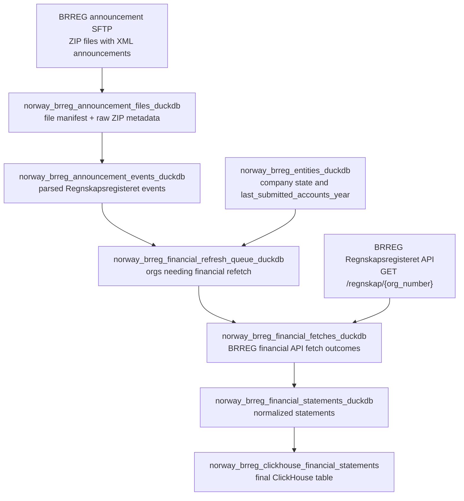

# Norway BRREG Financial Update Detection via Announcements

## Goal

Use Regnskapsregisteret announcements as the incremental signal for Norway financial statements, so the pipeline can fetch organizations whose annual-account data likely changed without crawling every candidate on every run.

This design fixes the current weakness in `norway_brreg_financial_fetches_duckdb`: today an `org_number` that exists in `norway_brreg.financial_fetches` is skipped forever. That is good for resuming an interrupted crawl, but bad for long-running updates.

## Source Facts

BRREG's open financial API supports lookup by organization number, with optional year and account type parameters, but it does not expose an `updated_since` or date-interval query for changed annual accounts.

Public references:

- Regnskapsregisteret OpenAPI: `https://data.brreg.no/regnskapsregisteret/regnskap/v3/api-docs`
- BRREG forum answer: `/regnskap/log` is only a log of imported mass files, and BRREG says it is not currently possible to fetch accounts by date interval. Their recommended path is to subscribe to Regnskapsregisteret announcements and then fetch the relevant accounts.
- Announcement subscription page: BRREG provides daily registration announcements in XML format. The delivery is a ZIP file over SFTP, with one XML file per announcement.
- Regnskapsregisteret announcements page: approved annual accounts are announced, normally around two days after approval. The announcement includes company identity, received date, accounting period, and parent-company flag.
- Subscription overview PDF: Regnskapsregisteret announcement types include `ARSO` for approved annual accounts, `MBAL` for approved interim balance sheets, `ANNR` for annulled approved annual accounts, and `VTOP` for forced-dissolution notice because annual accounts were not submitted.

Important caveat: the official XML announcement feed is an agreement/subscription product, not a public open API. We should not build this around scraping the public search website unless there is no other option.

## Target Architecture

Keep the implementation source-specific and explicit inside `src/dagster_v3/defs/norway_brreg/`. Do not create a generic announcement framework until a second country/source needs the same behavior.



The announcement pipeline should write durable DuckDB state. Dagster sensors may trigger jobs, but sensors should not be the only record of what was seen or processed.

## Dagster Shape

### `norway_brreg_announcement_files_duckdb`

Regular `@dg.asset`, kind `python`, `duckdb`, `sftp`.

Responsibility:

- Connect to the configured BRREG announcement SFTP account.
- List ZIP files in the configured inbound directory.
- Download files not already present in `norway_brreg.announcement_files`.
- Store file metadata and local path/hash.
- Do not parse XML in this asset.

Local development mode can read from a configured filesystem directory with sample ZIP files. That keeps tests deterministic and avoids requiring SFTP access locally.

### `norway_brreg_announcement_events_duckdb`

Regular `@dg.asset`, kind `python`, `duckdb`.

Dependencies:

- `norway_brreg_announcement_files_duckdb`

Responsibility:

- Read unprocessed ZIP files from `announcement_files`.
- Parse XML entries.
- Keep only Regnskapsregisteret events relevant to financial refresh policy.
- Store raw XML and normalized event fields.
- Mark source files as processed only after all entries are committed.

Relevant event types:

- `ARSO`: approved annual account. This is the primary refresh signal.
- `ANNR`: annulment/correction signal. Store it and enqueue a refetch or invalidate existing statement rows for the same org/report period.
- `MBAL`: interim balance sheet. Store for audit, but do not feed annual-account statements until we explicitly model interim balances.
- `VTOP`: forced-dissolution notice because annual accounts are missing. Store for status/audit, but do not fetch financial statements from it.

### `norway_brreg_financial_refresh_queue_duckdb`

Regular `@dg.asset`, kind `python`, `duckdb`.

Dependencies:

- `norway_brreg_announcement_events_duckdb`
- `norway_brreg_entities_duckdb`
- `norway_brreg_financial_fetches_duckdb` for current fetch state

Responsibility:

- Convert announcement events into organization-level refetch decisions.
- Dedupe by announcement event id and by target report key.
- Only enqueue organizations that we can fetch from the BRREG financial API.
- Keep queue rows even after processing for audit.

Primary queue rule:

```text
if announcement_type = 'ARSO'
  and org_number is present
  and announcement_event_id has not already produced a successful fetch for the same report key
then enqueue org_number for financial refetch
```

Secondary rules:

```text
if existing fetch status is network_error or server_error
then retry regardless of announcement age

if existing fetch status is invalid_payload
then retry after parser/provider fixes, controlled by explicit config

if existing fetch status is not_found
then retry only when an ARSO event exists after that not_found fetch

if current entity last_submitted_accounts_year is greater than stored successful report year
then enqueue even if no announcement event has been ingested yet
```

### `norway_brreg_financial_fetches_duckdb`

Keep this as the single asset that calls the BRREG financial API, but change candidate selection.

The runner should support two input modes:

1. Initial/backfill mode: fetch active companies with website and last submitted accounts year when no successful row exists for the current report key.
2. Incremental mode: fetch organizations from `norway_brreg.financial_refresh_queue` where status is `pending` or retryable.

The skip key must stop being just `org_number`. It should use a report key:

```text
org_number + report_year + regnskapstype
```

If the API response includes a stable `id`, store it and use it in addition to the report key:

```text
org_number + regnskap_id
```

The asset should update queue rows in the same transaction as fetch-row upsert when possible:

- `pending` -> `processed` after a successful fetch or permanent non-retryable result
- `pending` -> `retryable_failed` after network/server errors
- `pending` -> `invalid_payload` after response parsing failures

## DuckDB Tables

### `norway_brreg.announcement_files`

| Column | Type | Meaning |
| --- | --- | --- |
| `source_file_id` | text | Stable hash of SFTP path, size, mtime, and file hash. |
| `source_path` | text | SFTP path or local dev path. |
| `source_filename` | text | Filename from SFTP. |
| `source_modified_at` | timestamp | SFTP file modified time if available. |
| `source_size_bytes` | bigint | Source ZIP size. |
| `source_payload_hash` | text | SHA-256 of ZIP bytes. |
| `downloaded_at` | timestamp | Time we downloaded or discovered the file. |
| `processed_at` | timestamp nullable | Time all XML entries were parsed and committed. |
| `processing_status` | text | `downloaded`, `processed`, `failed`. |
| `error_message` | text | Parse/download error if failed. |
| `local_path` | text | Local stored ZIP path, if retained. |

### `norway_brreg.announcement_events`

| Column | Type | Meaning |
| --- | --- | --- |
| `announcement_event_id` | text | Stable id from XML if present, otherwise hash of normalized source fields + XML hash. |
| `source_file_id` | text | Parent ZIP file id. |
| `source_entry_name` | text | XML file name inside ZIP. |
| `source_payload_hash` | text | SHA-256 of raw XML bytes. |
| `register_name` | text | Expected `Regnskapsregisteret`. |
| `announcement_type_code` | text | `ARSO`, `ANNR`, `MBAL`, `VTOP`, etc. |
| `announcement_type_description_original` | text | Norwegian type label from XML or mapping. |
| `announcement_date` | date nullable | Public announcement date if present. |
| `received_date` | date nullable | Date BRREG received the annual account if present. |
| `org_number` | text | Organization number. |
| `legal_name` | text | Company name from announcement. |
| `legal_form_original` | text | Legal form text/code from announcement. |
| `business_address_raw` | text | Raw address text if present. |
| `accounting_period_start` | date nullable | Financial period start from announcement. |
| `accounting_period_end` | date nullable | Financial period end from announcement. |
| `is_parent_company` | boolean nullable | Parent-company flag from announcement. |
| `raw_xml` | text | Original XML for audit/reparse. |
| `parsed_at` | timestamp | Parse time. |

### `norway_brreg.financial_refresh_queue`

| Column | Type | Meaning |
| --- | --- | --- |
| `queue_id` | text | Stable hash of source event + org + report key. |
| `announcement_event_id` | text nullable | Event that caused the queue row. |
| `org_number` | text | Organization to fetch. |
| `reason` | text | `approved_annual_account`, `annulled_annual_account`, `entity_year_changed`, `retryable_failure`. |
| `report_year` | bigint nullable | Derived from accounting period end or entity field. |
| `accounting_period_end` | date nullable | From announcement. |
| `regnskapstype` | text nullable | `SELSKAP`, `KONSERN`, or null for default API lookup. |
| `status` | text | `pending`, `processing`, `processed`, `retryable_failed`, `invalid_payload`, `ignored`. |
| `attempt_count` | bigint | Number of fetch attempts caused by this queue row. |
| `queued_at` | timestamp | Queue creation time. |
| `last_attempted_at` | timestamp nullable | Last API attempt time. |
| `processed_at` | timestamp nullable | Completion time. |
| `last_error` | text | Last fetch or parse error. |

## Refresh Semantics

The pipeline should preserve history. Do not overwrite final financial statements blindly by org number.

Preferred final identity:

```text
country_iso2 + org_number + report_year + regnskapstype + source_record_id/regnskap_id
```

If BRREG changes/corrects an annual account for the same org/year/type, keep the newer fetch payload and normalized rows with a new source hash. ClickHouse final tables should use `ReplacingMergeTree` with a version timestamp or source hash version, not a full truncate/reload path.

## Sensors And Schedules

Use assets for durable state and sensors only for triggering.

Recommended automation:

- `norway_brreg_announcement_sync_schedule`: runs daily after expected SFTP delivery time.
- Optional `norway_brreg_announcement_file_sensor`: polls SFTP every 30-60 minutes and launches the announcement sync job when new file ids are seen. Cursor contains only the newest file ids/timestamps, not full event state.
- `norway_brreg_financial_refresh_queue_sensor`: checks DuckDB for pending queue rows and launches the financial incremental job when pending count is greater than zero.

The UI should show real asset materializations for:

- downloaded announcement files
- parsed announcement events
- generated refresh queue
- financial fetch outcomes
- normalized statements
- ClickHouse export

## Configuration

Dagster config should expose operational values only at the asset/job boundary:

```text
BRREG_ANNOUNCEMENTS_SOURCE_MODE=sftp|local
BRREG_ANNOUNCEMENTS_SFTP_HOST=
BRREG_ANNOUNCEMENTS_SFTP_PORT=22
BRREG_ANNOUNCEMENTS_SFTP_USERNAME=
BRREG_ANNOUNCEMENTS_SFTP_PRIVATE_KEY_PATH=
BRREG_ANNOUNCEMENTS_SFTP_REMOTE_DIR=
BRREG_ANNOUNCEMENTS_LOCAL_INBOX=data/brreg_announcements/inbox
BRREG_ANNOUNCEMENTS_LOCAL_ARCHIVE=data/brreg_announcements/archive
```

Runtime data structures passed between parsing/fetch helpers should not have duplicated defaults. Defaults belong in Dagster config classes or constants in the source-specific module.

## Testing Strategy

Tests should use local ZIP fixtures, not SFTP.

Required tests:

1. Parse an `ARSO` XML fixture and produce one normalized announcement event.
2. Parse a ZIP with multiple XML entries and dedupe by `announcement_event_id`.
3. Generate one queue row for a new `ARSO` event.
4. Do not generate a duplicate queue row when the same ZIP is processed twice.
5. `ANNR` produces an annulment queue reason and does not silently delete financial rows.
6. `MBAL` is stored as an event but not queued for annual-account fetch.
7. `VTOP` is stored as an event but not queued for financial fetch.
8. Financial fetch runner processes pending queue rows and updates queue status.
9. Retryable failures remain retryable and are not skipped forever.
10. `dg check defs` loads the new assets and sensors.

## Implementation Order

1. Add XML fixture ZIPs under `tests/fixtures/norway_brreg/announcements/`.
2. Add `announcements.py` with direct source-specific parsing and DuckDB write functions.
3. Add `announcement_files` and `announcement_events` DuckDB table definitions.
4. Add `financial_refresh_queue.py` with explicit queue creation rules.
5. Add assets for file ingest, event parse, and queue build.
6. Update `financial_fetches.py` candidate selection to use report-key skip logic and queue rows.
7. Add sensors/schedules after asset behavior is tested.
8. Update this package README after the implemented graph is real.

## Open Questions

- Confirm the exact XML schema/XSD from BRREG after subscription access is granted.
- Confirm whether `ARSO` XML includes a stable announcement id. If not, use hash-based ids.
- Confirm whether the annual-account API response `id` is stable across corrections.
- Decide whether `MBAL` should become a separate future financial table rather than only audit data.
- Decide how long to retain local ZIP files after raw XML has been stored in DuckDB.
