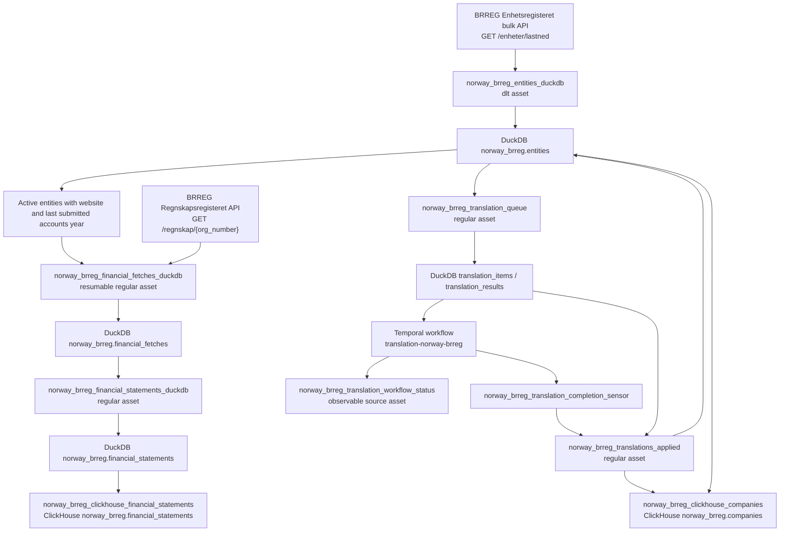

# Norway BRREG Processing Flow

This package defines the Dagster v3 processing flow for Norway company data from Bronnoysundregistrene (BRREG).

The implementation is source-local under `src/dagster_v3/defs/norway_brreg/` and produces:

- DuckDB staging tables in `data/norway_brreg_source.duckdb`
- a separate DuckDB translation queue in `data/norway_brreg_translation_queue.duckdb`
- final ClickHouse tables in database `norway_brreg`

## End-To-End Flow



## Source Files

| File | Responsibility |
| --- | --- |
| `assets.py` | Dagster assets, asset jobs, Temporal workflow status lookup, translation queue seeding/application, financial normalization, ClickHouse exports. |
| `resources.py` | dlt source/resource definitions for BRREG entity bulk data, plus entity row shaping. |
| `financial_fetches.py` | Resumable financial API candidate selection, fetch outcome upserts, and one fetch outcome row per organization. |
| `financial_normalize.py` | Converts successful financial fetch payloads into normalized financial statement rows and USD amounts. |
| `tables.py` | DuckDB/dlt schemas, ClickHouse column order, and ClickHouse DDL. |
| `clickhouse.py` | ClickHouse table preparation helpers using `dagster_clickhouse.ClickhouseResource`. |
| `sensors.py` | Temporal completion sensor for applying translation results after workflow completion. |
| `definitions.py` | Source-local Dagster `Definitions` assembly. |

## Dagster Assets

### `norway_brreg_entities_duckdb`

Type: `@dlt_assets`

Kinds: `python`, `dlt`, `duckdb`

Upstreams: none

Output:

- DuckDB file: `data/norway_brreg_source.duckdb`
- Dataset/table: `norway_brreg.entities`

This asset downloads the BRREG Enhetsregisteret bulk archive from:

```text
https://data.brreg.no/enhetsregisteret/api/enheter/lastned
```

The source is defined in `resources.norway_brreg_entities_source()`. The dlt resource streams the gzipped JSON array, converts each entity to the explicit `BRREG_ENTITIES_COLUMNS` schema, and writes the `entities` table with `write_disposition="replace"` and primary key `org_number`.

Important entity behavior:

- `status` is derived from BRREG bankruptcy/liquidation flags.
- `is_active` is true only when derived status is `active`.
- VAT id is created as `NO{org_number}MVA` when VAT registered.
- `legal_form_description_en` is populated from a deterministic local legal-form mapping.
- NACE `_en` fields are intentionally left empty; English NACE names should come from NACE reference data when needed.
- LLM-translated free-text fields start empty and are filled later by the translation workflow.
- `company_description_original` currently uses BRREG `aktivitet` text as the company description source.

Progress logging:

- download progress every 100 MiB by default
- entity row progress every 1000 rows by default

### `norway_brreg_financial_fetches_duckdb`

Type: regular `@dg.asset`

Kinds: `python`, `duckdb`

Upstreams:

- `norway_brreg_entities_duckdb`

Output:

- DuckDB file: `data/norway_brreg_source.duckdb`
- Dataset/table: `norway_brreg.financial_fetches`

This asset reads candidate organizations from `norway_brreg.entities` and calls BRREG Regnskapsregisteret once per missing candidate.

Candidate filter:

```sql
where is_active = true
  and nullif(trim(website), '') is not null
  and nullif(trim(last_submitted_accounts_year), '') is not null
```

Each API call writes a fetch outcome row directly to `norway_brreg.financial_fetches` in DuckDB. Successful responses preserve the full raw JSON response. Failures are also stored instead of aborting the whole load.

Fetch statuses:

- `success`
- `not_found`
- `server_error`
- `network_error`
- `invalid_payload`

The financial fetch table is both a durable checkpoint and an audit layer. On rerun, the asset skips `org_number` values that already exist in `norway_brreg.financial_fetches`, so an interrupted materialization resumes from missing organizations instead of starting the API crawl from the beginning.

### `norway_brreg_financial_statements_duckdb`

Type: regular `@dg.asset`

Python function: `norway_brreg_financial_statements_duckdb_asset`

Kinds: `python`, `duckdb`

Upstreams:

- `norway_brreg_financial_fetches_duckdb`

Output:

- DuckDB file: `data/norway_brreg_source.duckdb`
- Dataset/table: `norway_brreg.financial_statements`

This asset reads `financial_fetches`, ignores non-success fetch rows, parses successful BRREG financial response payloads, and writes normalized annual-account rows.

It resolves USD conversion rates through:

```python
ExchangeRateClient.from_env()
```

The exchange-rate lookup uses the financial report period end date as `fx_rate_date`, not the API pull date. Each amount is stored in two forms:

- original amount in the source currency
- converted amount in USD

Example amount pairs:

- `operating_revenue_amount_original`
- `operating_revenue_amount_usd`
- `total_assets_amount_original`
- `total_assets_amount_usd`
- `equity_amount_original`
- `equity_amount_usd`

The asset key is explicitly named `norway_brreg_financial_statements_duckdb` to avoid leaking the Python implementation suffix `_asset` into the Dagster graph.

### `norway_brreg_translation_queue`

Type: regular `@dg.asset`

Kinds: `python`, `duckdb`, `temporal`

Upstreams:

- `norway_brreg_entities_duckdb`

Output:

- DuckDB queue file: `data/norway_brreg_translation_queue.duckdb`
- Temporal workflow: `translation-norway-brreg`

This asset seeds translation queue items for Norwegian free-text company fields and starts or reuses the serialized Temporal translation workflow.

Translated fields:

| Source field | Target field |
| --- | --- |
| `articles_purpose_original` | `articles_purpose_en` |
| `activity_text_original` | `activity_text_en` |
| `company_description_original` | `company_description_en` |

Queue item identity includes:

- source DuckDB path
- source table
- organization number
- source field
- source text hash
- target language

This makes queue insertion idempotent. Existing queue items are not duplicated.

Configurable Dagster launch settings are defined in `NorwayBrregTranslationConfig`:

| Config | Default | Meaning |
| --- | ---: | --- |
| `batch_size` | `50` | Number of translation items per LLM batch. |
| `timeout_seconds` | `120` | Activity timeout for provider calls. |
| `max_batch_failures` | `0` | `0` means do not stop based on batch failure count. |
| `worker_id` | `translation-temporal-worker` | Worker id recorded in queue leases/attempts. |
| `max_tokens` | `4096` | LLM response token limit. |
| `extra_body_json` | `{"chat_template_kwargs":{"enable_thinking":false}}` | Extra OpenAI-compatible provider request body. |
| `initialize_timeout_seconds` | `300` | Temporal initialize activity timeout. |
| `batch_timeout_buffer_seconds` | `600` | Extra timeout buffer around batch translation and queue writes. |
| `summarize_timeout_seconds` | `30` | Queue summary activity timeout. |
| `activity_maximum_attempts` | `1` | Temporal activity retry maximum attempts. |
| `lease_timeout_seconds` | `1800` | Age after which stale leased queue rows can be reclaimed. |
| `temporal_address` | empty | Empty means the runtime default is used. |

### `norway_brreg_translation_workflow_status`

Type: `@dg.observable_source_asset`

Kinds/tags:

- `dagster/kind/temporal`
- `system=temporal`
- `temporal=true`
- `source_slug=norway-brreg`

Upstreams:

- External Temporal workflow `translation-norway-brreg`

This source asset represents external Temporal state in the Dagster asset graph. It is not a fake materializable completion asset. Observations include workflow metadata such as:

- workflow id
- workflow run id
- workflow status
- completion boolean
- error text when Temporal status is unavailable

The completion sensor also emits `AssetObservation` events for this asset on each tick so Dagster UI shows the latest observed workflow state.

### `norway_brreg_translations_applied`

Type: regular `@dg.asset`

Kinds: `python`, `duckdb`

Upstreams:

- `norway_brreg_translation_queue`
- `norway_brreg_translation_workflow_status`

Triggered by:

- `norway_brreg_translation_completion_sensor`

This asset applies completed translation results from `data/norway_brreg_translation_queue.duckdb` back into `data/norway_brreg_source.duckdb`.

It has an execution guard:

- if Temporal status is unavailable, it records metadata and does not mutate DuckDB
- if Temporal status is not `COMPLETED`, it records metadata and does not mutate DuckDB
- only completed workflows apply queue results

It updates only known Norway free-text fields. Results for other source tables or unknown fields are skipped and counted.

### `norway_brreg_clickhouse_companies`

Type: regular `@dg.asset`

Kinds: `duckdb`, `clickhouse`

Upstreams:

- `norway_brreg_translations_applied`

Output:

- ClickHouse table: `norway_brreg.companies`

This asset exports company rows from DuckDB `norway_brreg.entities` to ClickHouse. It depends on `norway_brreg_translations_applied` because the final company table contains `_en` fields populated by the translation workflow.

The asset prepares only the company table:

- creates database `norway_brreg` if needed
- creates `norway_brreg.companies` if needed
- inserts rows using `tables.COMPANIES_COLUMNS`

The ClickHouse table uses `ReplacingMergeTree` with `ORDER BY (org_number)`. The
export does not truncate the final table before insert, so a failed insert does
not leave the published table empty.

It does not touch the financial statements ClickHouse table.

### `norway_brreg_clickhouse_financial_statements`

Type: regular `@dg.asset`

Kinds: `duckdb`, `clickhouse`

Upstreams:

- `norway_brreg_financial_statements_duckdb`

Output:

- ClickHouse table: `norway_brreg.financial_statements`

This asset exports normalized financial statement rows from DuckDB to ClickHouse. It does not depend on `norway_brreg_translations_applied` because the current financial model has no LLM-translated free-text fields.

The asset prepares only the financial statements table:

- creates database `norway_brreg` if needed
- creates `norway_brreg.financial_statements` if needed
- inserts rows using `tables.FINANCIAL_STATEMENTS_COLUMNS`

The ClickHouse table uses `ReplacingMergeTree` with
`ORDER BY (org_number, period_end_date, accounts_type)`. The export does not
truncate the final table before insert, so a failed insert does not leave the
published table empty.

It does not touch the companies ClickHouse table.

## Sensors And Jobs

### `norway_brreg_translation_completion_job`

Defined asset job selecting:

- `norway_brreg_translations_applied`

This job is launched by the completion sensor after Temporal reports the workflow is complete.

### `norway_brreg_translation_completion_sensor`

Minimum interval: 60 seconds

Default status: `RUNNING`

The sensor polls Temporal workflow `translation-norway-brreg`.

Behavior:

- if workflow status is unavailable, emit an observation for `norway_brreg_translation_workflow_status` and skip
- if workflow status is not `COMPLETED`, emit an observation and skip
- if workflow status is `COMPLETED` for a new Temporal run id, emit an observation and launch `norway_brreg_translation_completion_job`
- if the same completed run id was already handled, emit an observation and skip

The sensor cursor is:

```text
translation-norway-brreg:{temporal_run_id}
```

Dagster may preserve sensor on/off state in the instance database. If the UI says the sensor has never run, manually enable `norway_brreg_translation_completion_sensor` once.

## Storage Model

### DuckDB Source Database

Path:

```text
data/norway_brreg_source.duckdb
```

Dataset:

```text
norway_brreg
```

Tables:

| Table | Produced by | Purpose |
| --- | --- | --- |
| `norway_brreg.entities` | `norway_brreg_entities_duckdb` | Company/entity staging table from BRREG Enhetsregisteret. |
| `norway_brreg.financial_fetches` | `norway_brreg_financial_fetches_duckdb` | One BRREG annual-account API fetch outcome per candidate organization. |
| `norway_brreg.financial_statements` | `norway_brreg_financial_statements_duckdb` | Normalized annual-account rows with original-currency and USD amounts. |

### Translation Queue Database

Path:

```text
data/norway_brreg_translation_queue.duckdb
```

Core tables are owned by the runtime `translations.queue.TranslationQueue` package.

Important tables:

| Table | Purpose |
| --- | --- |
| `translation_items` | Pending, leased, completed, and retryable translation work items. |
| `translation_results` | Completed translation outputs keyed back to source table, source primary key, and source field. |
| `translation_batch_attempts` | Batch execution audit records. |

The queue database is separate from the source DuckDB database so long-running translation work can be resumed independently.

### ClickHouse Database

Database:

```text
norway_brreg
```

Tables:

| Table | Produced by | Source |
| --- | --- | --- |
| `norway_brreg.companies` | `norway_brreg_clickhouse_companies` | DuckDB `norway_brreg.entities` after translation application. |
| `norway_brreg.financial_statements` | `norway_brreg_clickhouse_financial_statements` | DuckDB `norway_brreg.financial_statements`. |

## Table Schemas

Schemas are centralized in `tables.py`.

### Company Fields

Source and ClickHouse company fields are based on `BRREG_ENTITIES_COLUMNS` and `COMPANIES_COLUMNS`.

Field groups:

- source metadata: `country_iso2`, `source_slug`, `source_run_id`, `source_line_number`, `source_record_id`, `source_payload_hash`, `source_url`, `raw_entity`
- identifiers: `org_number`, `vat_id`
- names and classifications: `legal_name`, `legal_form_code`, legal-form descriptions, NACE codes/descriptions
- dates and contacts: `registration_date`, `incorporation_date`, `website`, `phone`
- translated text: `articles_purpose_*`, `activity_text_*`, `company_description_*`
- employment and address fields
- flags: VAT registration, Foretaksregisteret registration, group membership, active status
- hierarchy: `parent_org_number`
- financial availability hint: `last_submitted_accounts_year`

### Financial Fetch Fields

`financial_fetches` preserves both success and failure outcomes.

Field groups:

- source metadata
- organization context: `org_number`, `legal_name`, `website`, `last_submitted_accounts_year`
- request context: `source_url`, `attempt_count`, `fetched_at`
- outcome: `fetch_status`, `http_status`, `error_type`, `error_message`
- payload: `raw_response`

### Financial Statement Fields

Financial statement fields are based on `BRREG_FINANCIAL_STATEMENTS_COLUMNS` and `FINANCIAL_STATEMENTS_COLUMNS`.

Field groups:

- source metadata
- organization context
- filing identifiers: `filing_id`, `journal_number`, `accounts_type`
- reporting period: `period_start_date`, `period_end_date`, `fiscal_year`
- flags: parent company, liquidation accounts, audit flags, small enterprise
- accounting metadata: `statement_layout`, `accounting_rules`, `currency`
- amount pairs: original currency and USD for revenue, costs, result, assets, equity, and debt
- FX metadata: `fx_rate_to_usd`, `fx_rate_date`, `fx_source`
- raw payload: `raw_financial_record`

## Translation Policy

Translated with LLM:

- `articles_purpose_original` -> `articles_purpose_en`
- `activity_text_original` -> `activity_text_en`
- `company_description_original` -> `company_description_en`

Not translated with LLM:

- NACE descriptions. English names should come from NACE reference data.
- financial statement data. Current financial fields are numeric amounts, dates, flags, and categorical codes.
- `accounts_type`, `statement_layout`, and `accounting_rules`. If English display labels are needed later, add deterministic reference mapping/enrichment rather than sending them through the free-text translation queue.

## Financial Currency Policy

Financial amounts preserve original currency values and add USD conversions.

The FX rate date is the financial report period end date:

```text
period_end_date -> fx_rate_date
```

This means conversion reflects the report date, not the date the API was called.

Exchange rates are resolved through the shared `exchange_rates` package and `ExchangeRateClient.from_env()`. The financial normalizer requests all required currency/date pairs in bulk through `usd_rates`.

## Operational Run Order

Typical full load:

1. Materialize `norway_brreg_entities_duckdb`.
2. Materialize `norway_brreg_financial_fetches_duckdb`.
3. Materialize `norway_brreg_financial_statements_duckdb`.
4. Materialize `norway_brreg_translation_queue`.
5. Run the Temporal translation worker outside Dagster.
6. Keep `norway_brreg_translation_completion_sensor` enabled.
7. Let the sensor observe Temporal status and trigger `norway_brreg_translations_applied` when complete.
8. Materialize `norway_brreg_clickhouse_companies`.
9. Materialize `norway_brreg_clickhouse_financial_statements`.

The two ClickHouse exports are independent:

- company export waits for translations
- financial export waits for financial normalization only

## Validation Commands

From `companycollect/corpscout/dagster_v3`:

```bash
uv run dg check defs
uv run pytest tests/test_norway_brreg_assets.py -q
```

Useful graph inspection:

```bash
uv run python - <<'PY'
from dagster_v3.definitions import defs as load_project_defs

repo = load_project_defs().get_repository_def()
for key in sorted(repo.asset_graph.get_all_asset_keys(), key=lambda k: k.to_user_string()):
    name = key.to_user_string()
    if name.startswith("norway_brreg"):
        node = repo.asset_graph.get(key)
        parents = sorted(parent.to_user_string() for parent in node.parent_keys)
        print(f"{name} <- {parents}")
PY
```

Expected key financial edges:

```text
norway_brreg_clickhouse_financial_statements <- ['norway_brreg_financial_statements_duckdb']
norway_brreg_financial_fetches_duckdb <- ['norway_brreg_entities_duckdb']
norway_brreg_financial_statements_duckdb <- ['norway_brreg_financial_fetches_duckdb']
```

Expected translation edges:

```text
norway_brreg_translation_queue <- ['norway_brreg_entities_duckdb']
norway_brreg_translations_applied <- ['norway_brreg_translation_queue', 'norway_brreg_translation_workflow_status']
norway_brreg_clickhouse_companies <- ['norway_brreg_translations_applied']
```

## Design Notes

- dlt source/resource definitions live in `resources.py`; dlt pipelines are defined inline in the `@dlt_assets` decorators in `assets.py`.
- Long per-organization API crawls should not use dlt replace extraction unless there is a separate durable checkpoint. Norway financial fetches are a regular asset for this reason.
- There is no custom DuckDB Dagster resource. DuckDB paths are source constants and local connections are opened directly where needed.
- The translation workflow status is modeled as an observable source asset, not as a manually materializable "completed" asset.
- The financial ClickHouse export is independent from company translations.
- The Python function name `norway_brreg_financial_statements_duckdb_asset` is an implementation detail; the Dagster asset key is `norway_brreg_financial_statements_duckdb`.
- ClickHouse assets show source and destination kinds: `duckdb` and `clickhouse`.
