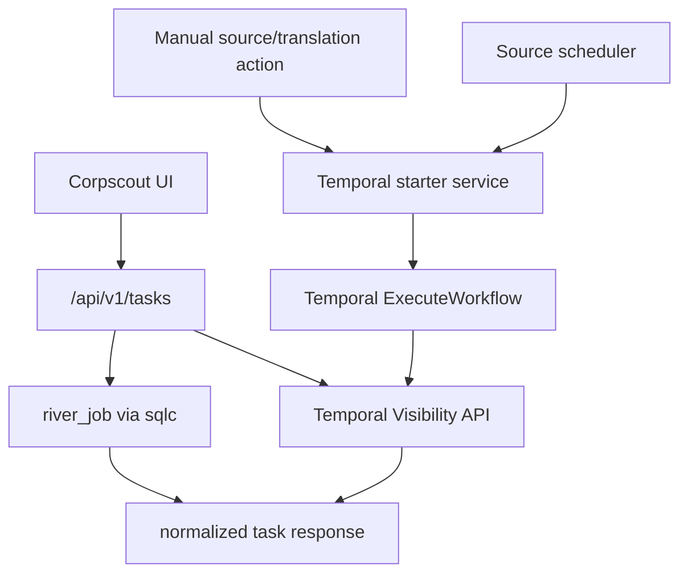

# Unified Tasks: Temporal + River Design

## Summary

Corpscout should use each executor as the source of truth for task state:

- Temporal workflows live in Temporal visibility.
- River jobs live in `river_job`.
- Corpscout does not create or maintain a local mirror table for Temporal workflow state.

This work comes before the BRREG source-flow page. The BRREG flow will later use the unified task API for edge counters and task drill-down links.

## Goals

- Start Temporal-backed source workflows directly from Corpscout through the Temporal SDK.
- Start translation workflows directly from Corpscout through the Temporal SDK.
- Remove the `temporal_executions` table and all code paths that write to it.
- Expose one normalized Tasks API that reads Temporal visibility and River jobs.
- Attach Temporal search attributes to every Corpscout-started workflow so source/action filters are reliable.
- Keep raw-input `run_id` columns for data lineage.

## Non-Goals

- Do not implement the BRREG flow page in this phase.
- Do not implement the company-suggestion creation workflow in this phase.
- Do not create a replacement local `source_action_tasks` or `temporal_executions` table.
- Do not migrate existing historical rows from `temporal_executions` into another local table.

## Current State

The app currently has three overlapping task concepts:

- `/api/v1/jobs` reads River jobs from `river_job`.
- `/api/v1/temporal-executions` reads a local `temporal_executions` table.
- Some Temporal workflows are started directly from HTTP handlers, while source pulls for Temporal-backed sources can be started through a River `data_task` job that then starts Temporal.

This creates inconsistent observability. A Temporal workflow may be visible in Temporal but absent from `temporal_executions`, or visible in `temporal_executions` but stale if Temporal status changed after start.

## Target Architecture

Corpscout starts Temporal workflows directly and then reads their state directly from Temporal visibility.



The only local database state retained for Temporal-backed data pipelines is data lineage, such as raw-input `run_id`.

## Temporal Search Attributes

Every Corpscout-started Temporal workflow must include these custom search attributes:

| Name | Type | Purpose |
| --- | --- | --- |
| `CorpscoutSource` | Keyword | Source name, such as `brreg`, `cvr`, `gleif`, `ariregister`, or `companies_house`. |
| `CorpscoutAction` | Keyword | Action, such as `download`, `translate`, or `create_suggestions`. |

The workflow should also include Memo fields for non-indexed context:

| Memo key | Purpose |
| --- | --- |
| `scope` | IDs, filters, mode, `fx_rate_date`, or other action scope values. |
| `trigger` | `manual`, `scheduled`, or another trigger label. |
| `source` | Source name for display even when search attributes are not shown in Temporal UI. |
| `action` | Action name for display even when search attributes are not shown in Temporal UI. |

The Temporal namespace `corpscout` must register `CorpscoutSource` and `CorpscoutAction` before production use. Corpscout should validate these attributes on startup with `Client.GetSearchAttributes`. If validation fails, the app should log a clear setup error and fail startup outside tests. Direct workflow-start endpoints should return `503` if Temporal is unavailable or search-attribute validation has failed.

## Direct Temporal Workflow Starts

Introduce a small Temporal starter service in the scheduler process. It owns workflow ID generation, search attributes, memo fields, and source-mode calculation.

For Temporal-backed source downloads:

- Manual source trigger calls the starter directly.
- Scheduled source trigger calls the same starter directly.
- River `data_task` is removed.
- No local `temporal_executions` row is created.
- The response returns `executor=temporal`, `workflow_id`, `workflow_run_id`, and `status=started`.

For legacy River-backed source downloads:

- Existing River `source_pull` behavior remains.
- The response returns `executor=river`, `river_job_id`, and `status=queued`.

The starter preserves current source-mode behavior:

- `brreg`: first run `bulk`, later `incremental`.
- `gleif`: first run `bulk`, later `delta`.
- `cvr`: first run `bulk`, later `incremental`.
- `ariregister`: first run `bulk`, later `refresh`.

The starter reads `source_sync_checkpoints` to decide mode. It passes the saved cursor, derived mode, and `incremental_from` into the Temporal input. Existing `corpscout_run_id` workflow input is set to the Temporal workflow ID for compatibility; it must not point to a local task table row.

After a Temporal source workflow starts successfully, Corpscout updates `data_sources.last_started_at` through the existing sqlc query so interval schedules do not repeatedly trigger the same source. Temporal workflow completion and checkpoint updates remain owned by the data pipeline.

## Workflow IDs

Workflow IDs should be human-readable and stable enough for debugging:

- Source download: `pull-<source>-<country-or-global>-<timestamp>`
- All-row translation singleton: `translate-<source>-all`
- Selected/filter translation: `translate-<source>-<timestamp>`

All-row translation workflows keep singleton IDs so a duplicate all-row translation returns a conflict while one is already running. Selected/filter workflows include a timestamp so separate subsets can run independently.

## Unified Task API

Add:

```text
GET /api/v1/tasks
GET /api/v1/tasks/stats
```

The existing `/api/v1/jobs` route can remain temporarily for compatibility, but the UI should move to `/api/v1/tasks`. `/api/v1/temporal-executions` is removed.

### List Filters

`GET /api/v1/tasks` accepts:

| Query parameter | Values |
| --- | --- |
| `executor` | `temporal`, `river`, or omitted for both. |
| `source` | Source name. |
| `action` | `download`, `translate`, `process`, `domain_resolve`, `enrich_company_financials`, or another normalized action. |
| `status` | `queued`, `running`, `completed`, `failed`, `cancelled`. |
| `kind` | Temporal workflow type or River job kind. |
| `before` | Optional RFC3339 timestamp cursor for older tasks. |
| `limit` | Default `50`, maximum `200`. |

The response shape:

```json
{
  "items": [
    {
      "id": "temporal:translate-brreg-all:run-id",
      "executor": "temporal",
      "source": "brreg",
      "action": "translate",
      "kind": "TranslateBrregRawInputs",
      "status": "running",
      "native_status": "Running",
      "workflow_id": "translate-brreg-all",
      "workflow_run_id": "run-id",
      "river_job_id": null,
      "subject": "brreg",
      "created_at": "2026-05-22T10:00:00Z",
      "started_at": "2026-05-22T10:00:00Z",
      "closed_at": null,
      "external_url": "http://localhost:8089/namespaces/corpscout/workflows/translate-brreg-all/run-id"
    }
  ],
  "next_before": "2026-05-22T09:59:00Z",
  "partial": false,
  "errors": []
}
```

When `executor` is omitted, the API queries both backends, normalizes rows, sorts by task time descending, and returns the newest `limit` rows. The `before` cursor filters older rows in both systems. If either backend is unavailable, the API returns available rows with `partial=true` and an error entry. Direct task-start endpoints still fail when their required executor is unavailable.

### Status Mapping

Temporal status mapping:

| Temporal status | Normalized status |
| --- | --- |
| Running | `running` |
| Completed | `completed` |
| Failed | `failed` |
| TimedOut | `failed` |
| Terminated | `failed` |
| Canceled | `cancelled` |

River status mapping:

| River state | Normalized status |
| --- | --- |
| pending, available, scheduled, retryable | `queued` |
| running | `running` |
| completed | `completed` |
| discarded | `failed` |
| cancelled | `cancelled` |

### Stats API

`GET /api/v1/tasks/stats` accepts `executor`, `source`, and `action` filters and returns grouped counters:

```json
{
  "items": [
    { "executor": "temporal", "source": "brreg", "action": "translate", "status": "running", "count": 1 },
    { "executor": "river", "source": "brreg", "action": "download", "status": "queued", "count": 0 }
  ],
  "partial": false,
  "errors": []
}
```

Temporal counters use Temporal visibility count/list APIs with `CorpscoutSource` and `CorpscoutAction` filters. River counters use sqlc queries over `river_job`.

## UI Changes

The existing Jobs page should become a unified Tasks page:

- One table for normalized tasks.
- Filter controls for executor, source, action, status, and kind.
- External link opens Temporal UI for Temporal tasks.
- Existing River details and cancellation behavior remain for River tasks.
- Temporal cancellation is not part of this phase. Listing and click-through are enough for this milestone.

The old Temporal executions table UI is removed because Temporal state now comes directly from Temporal.

## Database Changes

Add a new migration that drops:

- `temporal_executions`
- indexes on `temporal_executions`

Do not edit migration `000031_temporal_executions.up.sql`, because it also adds raw-input `run_id` lineage columns. A fresh database replay can create `temporal_executions` and then drop it in the new migration.

Remove:

- `database/queries/temporal_executions.sql`
- generated sqlc methods and models for `TemporalExecution`
- test stubs for removed sqlc methods

Add sqlc queries for River task list and River task stats instead of keeping inline SQL in the HTTP handler.

## Error Handling

- Workflow-start handlers log Temporal start errors once at the HTTP boundary and return safe messages.
- Task list APIs return partial results when one backend fails and include a structured error with `executor` and safe message.
- Startup validation failures for missing Temporal search attributes should include the missing attribute names and the Temporal namespace.
- No internal Temporal or database stack traces should be returned to clients.

## Testing

Backend tests:

- Temporal starter attaches `CorpscoutSource`, `CorpscoutAction`, and Memo scope.
- Manual trigger for Temporal-backed sources starts Temporal directly and does not insert River `data_task`.
- Scheduled trigger for Temporal-backed sources starts Temporal directly and updates `last_started_at`.
- Legacy River-backed source trigger still inserts River `source_pull`.
- `/api/v1/tasks` combines normalized Temporal and River tasks.
- `/api/v1/tasks/stats` combines Temporal and River counters.
- `temporal_executions` handler and sqlc methods are absent after regeneration.

Frontend tests/checks:

- Tasks page renders both Temporal and River rows.
- Filters build the expected `/api/v1/tasks` query parameters.
- Temporal rows link to Temporal UI.
- Existing River cancellation UI remains River-only.

Verification commands:

```bash
cd /Users/graovic/pulsarpoint/ppoint/corpscout/scheduler
GOWORK=off go test -count=1 ./...

cd /Users/graovic/pulsarpoint/ppoint/corpscout/ui
pnpm typecheck
pnpm build
```

## Rollout Order

1. Add Temporal search-attribute validation.
2. Add direct Temporal starter service and switch manual Temporal-backed source triggers.
3. Switch scheduled Temporal-backed source triggers.
4. Remove River `data_task` trampoline.
5. Add unified `/api/v1/tasks` and `/api/v1/tasks/stats`.
6. Move UI from `/temporal-executions` and River-only jobs to unified tasks.
7. Drop `temporal_executions` and regenerate sqlc.
8. Return to the BRREG source-flow implementation and use task stats for graph edge counters.
