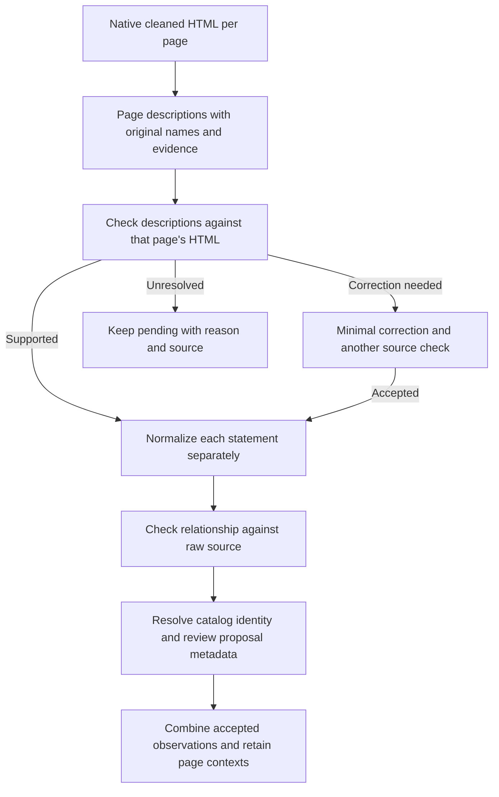

# Source review and individual normalization recovery

The 0.12.3 optional workflow checks page descriptions against native HTML and keeps
valid normalization records when another record fails. On six saved NOVELIC pages,
the final validated output recovers **31/32 technology controls and 3/3 company
credential controls**, compared with 20/32 and 0/3 in the previous experiment.

The dedicated output schema is `page-statements/1.1`; regular research results retain
schema 1.9. The page-statement workflow is not enabled in default extraction. Shared
catalog requests and acceptance guards for saved findings have changed.

This follows the [first page-statement experiment](PAGE_STATEMENTS_EXPERIMENT.md),
which retained only 20/32 technology controls and 0/3 credential controls.

## What changed

1. **Review each page's descriptions against its saved HTML.** Descriptions are
   explicitly claims to check. The reviewer checks application, relationship and
   important qualifications, including job requirements and future certification.
2. **Allow one minimal description correction.** It can change context, application
   context and qualifiers. Identity, company/holder, source name, section and job
   cannot change. A separate source check must accept the corrected version before
   normalization. Original descriptions and rejection reasons remain in the output.
3. **Bind approval to exact inputs.** The hash covers description fields and matched
   source records. Changing either invalidates the cached review. The saved HTML
   itself is checked against its snapshot hash before reuse.
4. **Require one decision under each statement ID.** The normalization response is
   a JSON object with required ID keys. The model selects technology/certification/
   exclusion/review and interprets the relationship. Code supplies the source name,
   company, job, reviewed context and original evidence. It splits literal `:year`
   credential versions, so a version cannot accidentally be duplicated by the model.
5. **Keep valid neighbors and retry only failed items.** Schema errors, incorrect
   quotations and missing decisions are tracked per statement. A timeout in one
   correction cannot remove another statement's result. Valid saved normalization
   records can also be reused after revalidating them against the current statements.
6. **Check final source meaning and catalog identity.** Normalized observations still
   receive the existing source-meaning and catalog/proposal checks. Reviewed company
   context does not prove an unstated technology. Final source review does not receive
   generated context as supporting evidence.
7. **Correct a relationship without rewriting the description.** When source review
   supplies a supported signal/scope interpretation, one linked correction is checked
   again against raw HTML. Job observations stay scoped to the role. The original
   rejected interpretation remains in the audit output.
8. **Require individual catalog decisions too.** Catalog requests bind short required
   keys to unchanged names in code. A malformed or missing decision only retries that
   item; an explicit null can abstain on a generic name. Proposed identities still
   need category/description review and administrator approval.
9. **Validate saved payloads at the acceptance boundary.** Generic processes, materials
   and capabilities cannot become accepted technologies by bypassing fresh model
   parsing. Credential metadata with a document type but no document URL is held.



The implemented prompts are in
[statement_prompts.py](src/company_research/statement_prompts.py), description review
in [statement_review.py](src/company_research/statement_review.py), and normalization
in [statements.py](src/company_research/statements.py).

An accepted description means an additional LLM source check passed. It is not
independent verification that a company actually holds a certificate or deploys a
technology. Proposal metadata remains an administrator-review draft.

## Saved-data test

The test reuses all 113 descriptions and six unchanged NOVELIC pages from the previous
experiment. It makes no page fetches, HTML extractions, PDF requests or database writes.
The same 32 technology and three credential regression controls were retained before
any new model calls; those controls are not exhaustive ground truth.

The source review corrected three descriptions:

- Python: removed the inferred application “likely including building data pipelines.”
  The statement still says the job requires strong Python skills.
- Cadence Virtuoso and Siemens Calibre: retained the required qualification while
  removing application context that the tool requirement did not establish.

All three corrected descriptions passed a second check against the saved source.

Four phases are preserved. `data/novelic-page-statements-v2/` contains 0.12.0 and the
description reviews. That run was deliberately interrupted after DeepSeek returned
only the first observation in a normalization array. Individual retries worked but
made the request format unnecessarily expensive. It saved 23 valid normalized
observations and all completed description reviews.

`data/novelic-page-statements-v2-resumed/` uses 0.12.1 and the required-key decision
format. It reuses those reviews and 23 observations, and counts inherited calls once.
Incomplete catalog responses and wrong company/role interpretations still blocked
many observations in that intermediate result.

`data/novelic-page-statements-v2-final/` uses 0.12.2 to finish those source and metadata
reviews. It creates 24 linked interpretation corrections and resolves all 56 requested
catalog names across seven batches. A resolved catalog request is not approval of a
new technology proposal. The finish harness reuses the preceding normalization and
does not regenerate descriptions.

`data/novelic-page-statements-v2-validated/` applies the final 0.12.3 acceptance guards
offline, with **zero additional model calls**. Six generic process/material/capability
records receive explicit policy holds; they were already excluded by other gates.
Two previously accepted product-compliance records are also held because their
document type has no document URL. They concern ACAM/ACAM200, not company credentials.
Their issuer/assessor metadata also needs explicit source support. The final result
contains explicit accepted record IDs so consumers need not infer acceptance from
the presence of a raw audit record.

This is an incremental recovery experiment, not a randomized comparison or a fresh
end-to-end crawl. Implementation snapshots distinguish the phases.

All live phases use DeepSeek `deepseek/deepseek-v4-flash-0731`, Wafer, low reasoning,
65,536 output tokens and a 120-second request deadline. The resumed experiment has an
80-call cap including the 30 calls inherited from the deliberately stopped phase.
The old 0.11.1 comparison experiment is a separate cost history.

## Final results

| Measure | Previous 0.11.1 result | Final 0.12.3 validated result |
| --- | ---: | ---: |
| Technology controls with correct accepted signal/scope | 20/32 | 31/32 |
| Company credential controls | 0/3 | 3/3 |
| Automatically accepted technology observations | 25 | 53 |
| Primary statements still pending | 46 | 9 |

The 113 original descriptions were retained. Of these, 104 passed description review,
including the three corrected and rechecked descriptions. Nine still lack matching
source evidence and remain pending. The 53 accepted technology observations retain
page contexts and sources; they are observations, not 53 unique catalog technologies.
There are 103 technology record versions in the full audit, including rejected
originals and linked corrections.

All checked technology names were found. **MCAP is the remaining relationship gap:**
the source describes both role usage and preferred experience, and the accepted
observation preserves `stated_use / role`. Its page description retains both meanings,
but the current one-relationship decision omits the separate `preferred_experience`
control. This is a normalization limitation, not a missing technology name.

The three accepted company credential claims are ISO 9001:2015 certification,
ISO 14001:2015 certification, and **working toward** IATF 16949:2016. The last is not
reported as an existing certification. These are supported website claims, not
external verification of certification validity.

AutoPLANT's accepted draft now describes plant-design CAD without the earlier
unsupported vendor attribution. Norasoft retains its in-cabin-monitoring application
and source URL. Its draft definition still contains internal catalog commentary that
should be removed during administrator review. Generic manufacturing processes and
capabilities remain source context instead of accepted technology identities.

## Artifacts, cost and validation

Start with [accepted-observations.json](data/novelic-page-statements-v2-validated/accepted-observations.json).
It contains the 53 accepted technology observations, three company credential claims,
source links, reviewed page contexts, pending IDs and policy holds. Full provenance is
in [statement-result.json](data/novelic-page-statements-v2-validated/statement-result.json),
with [comparison.json](data/novelic-page-statements-v2-validated/comparison.json) and
[manual-audit.json](data/novelic-page-statements-v2-validated/manual-audit.json).

Final result SHA256:
`a28d5c7f13e27818519d365d0c9ce20ec3ee64e24585cae82174a1a6c9b473cf`.
All six saved HTML hashes match their original snapshots.

The current recovery experiment made **73 calls**, including 64 successful responses:
**$0.09917655 reported**, with nine calls of unknown cost (eight 120-second deadlines
and one intentional interruption). Reported usage is 592,445 prompt and 188,605
completion tokens. Inherited calls are counted once; the 80-call cap was not reached.
These are development/recovery costs across changing implementations, not the cost of
a clean production run. The preceding 0.11.1 experiment's costs are separate.

Verification: the final 123-test run passed 120 tests and skipped the three opt-in
browser tests; those browser tests passed in the earlier full 121-test run before the
last two acceptance-guard tests were added. Ruff, source-package type checking and
focused type checking of the new statement tests/harnesses pass. The broader
`uvx ty check company_research` reports 19 diagnostics in benchmark scripts and tests;
it is not a clean package-wide type-check result. Both 0.12.3 wheel and source
distribution build successfully, and `git diff --check` passes.
No database submission, deployment, fresh crawl or PDF/OCR work was performed.

Remaining work before default integration: support multiple source-backed relationships
for one statement, recover the nine evidence failures, and test fresh page extraction
on other companies. The saved NOVELIC controls are useful regressions, not an exhaustive
accuracy benchmark.

To reproduce in new directories from the project root:

```sh
.venv/bin/python benchmarks/review_page_statements.py --help
.venv/bin/python benchmarks/finish_statement_reviews.py --help
```

The `--resume-from` option reads saved description reviews and the latest cumulative
normalization checkpoint. It rechecks source hashes and validates the saved records
before reusing them. Fresh runs need no resume argument.
