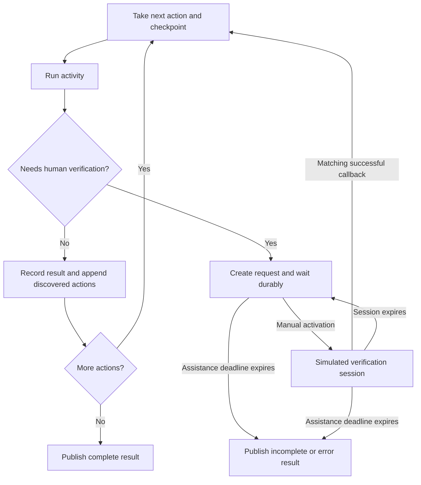

# Temporal domain-processing experiment

This is a standalone prototype of one durable workflow per domain. A simulated
homepage discovers additional actions at runtime. A simulated Brave search can
request human verification repeatedly, including twice inside the same action.
The workflow stops all further actions for that domain, preserves its checkpoint,
and waits for explicit activation and a verification callback.

Temporal is real. Crawling, Brave, and browser verification are simulated. Results
are published as real local JSON files, standing in for an S3 upload. This package
does not import, deploy, or change the running company-research service.

## Run it

Requires Python 3.12+ and `uv`. The first server start downloads Temporal's local
development-server binary through the SDK. Docker is not required.

From this directory:

```sh
uv sync --frozen
uv run --frozen domain-prototype serve
```

The private server listens on `127.0.0.1:17233`. Open the Temporal UI at
<http://127.0.0.1:18233>. The server persists its history in `.state/temporal.db`.
Keep this terminal open. Ctrl-C stops the server and worker; starting the same
command again recovers existing workflows from that database.

In another terminal, in the same directory:

```sh
uv run --frozen domain-prototype start example.com
uv run --frozen domain-prototype status example.com
```

The default scenario encounters two verification requests. `status` shows the
pending request, checkpoint, collected observations, and remaining actions.
Copy `pending_request.id` into the next command:

```sh
uv run --frozen domain-prototype activate example.com '<request-id>'
```

This creates a **simulated** verification session and prints its `session_id`.
Activation alone does not resume the crawl. Simulate a successful browser callback:

```sh
uv run --frozen domain-prototype verify example.com '<request-id>' '<session-id>'
uv run --frozen domain-prototype status example.com
```

The search resumes from its saved checkpoint and discovers another challenge.
Repeat activation and verification with the **new** request ID and session ID.
Then retrieve the final result:

```sh
uv run --frozen domain-prototype result example.com
```

The returned `artifact` points to a JSON file under `output/`. The file records the
outcome, collected observations, completed actions, and any unfinished actions.
Its stable key is derived from the Temporal run ID, so a retried publication writes
the same result rather than creating another artifact.

Temporal displays the workflow as `Running` while our application state is
`waiting` or `verifying`. Use the `status` workflow query or the CLI for that state.
An `incomplete` domain result is a successfully finalized workflow, so Temporal
displays it as `Completed`; the application outcome remains `incomplete`.

## Try different paths

```sh
# Complete without human intervention.
uv run --frozen domain-prototype start no-wait.example --challenges 0
uv run --frozen domain-prototype result no-wait.example

# Publish what was collected if nobody responds in five seconds.
uv run --frozen domain-prototype start timeout.example --wait-seconds 5
uv run --frozen domain-prototype result timeout.example

# A verification session expires after three seconds; it can be activated again.
uv run --frozen domain-prototype start short-session.example --verification-seconds 3

# A failed callback leaves the domain blocked.
uv run --frozen domain-prototype verify example.com '<request-id>' '<session-id>' --failed
```

For restart recovery, start a domain, wait until `status` says `waiting`, stop
`serve`, then start `serve` again. The pending request, observations, action
checkpoint, and original deadline survive. The deadline continues to elapse while
the server or worker is offline; publication happens when processing is available.

The default assistance window is 600 seconds, measured from the first challenge.
The same absolute deadline applies to subsequent challenges and activations.
Verification sessions last at most 60 seconds by default and never extend that
deadline. Both durations are CLI options on `start`.

The CLI normalizes domain case and a trailing root dot. Submitting the same domain
while its workflow is open returns the existing execution without changing its
input or priority. Submitting it after completion starts a new scan with a new run
ID and artifact. All work uses the separate `domain-prototype` Temporal task queue.

## How the dynamic wait works



- `models.py`: serializable actions, checkpoints, requests, and results.
- `activities.py`: runtime discovery and challenge simulation; local publication.
- `workflow.py`: action loop, waits, updates, signals, deadlines, and finalization.
- `cli.py`: private local server/worker plus manual controls.

The simulated search returns `needs_human` with its latest checkpoint. The
workflow has no fixed list of approval steps. `activate_verification` is an
Update, so the caller receives either the session or a rejection. The completion
callback is a Signal, correlated by both request ID and session ID. Stale,
unactivated, expired, and unsuccessful callbacks cannot release a wait. A Signal
acknowledgment means Temporal stored it, not that verification was accepted.

Actions run sequentially inside one domain; other domains can run while it waits.
Only transient activity failures retry automatically. A challenge returns normally
to the workflow and does not cause repeated automatic Brave requests. Publication
has its own retry policy, so retrying a failed write does not restart crawling.

## Tests

```sh
uv run --frozen pytest -q
uv run --frozen ruff check .
uv run --frozen ruff format --check .
```

The tests start private local Temporal servers on automatically selected ports.
They exercise real workers, histories, signals, updates, timers, and activities.
They cover dynamic discovery, repeated pauses, stale/failed callbacks, session
expiry, the fixed assistance deadline, worker capacity, duplicate starts, activity
and publication retries, error/partial results, and worker and server restarts.
Representative histories are replayed to check workflow determinism.

## Boundary before production integration

Production integration would replace simulated actions with resumable browser
activities, implement actual headed-session creation and cleanup, enforce the
shared Brave session block across domains, authorize browser callbacks, and replace
local publication with the existing S3 delivery logic. Browser processes and large
captured documents remain external; workflows should retain checkpoints and object
references. This prototype has small observations in workflow history.

The current heap queue and strict domain priority/FIFO admission are not connected
to this prototype. This experiment tests the processing lifecycle after admission.
It also does not establish production worker-versioning or cancellation policies.

References:

- [Temporal Python testing](https://docs.temporal.io/develop/python/best-practices/testing-suite)
- [Workflow messages](https://docs.temporal.io/develop/python/workflows/message-passing)
- [Approval with timeout](https://docs.temporal.io/design-patterns/approval)
