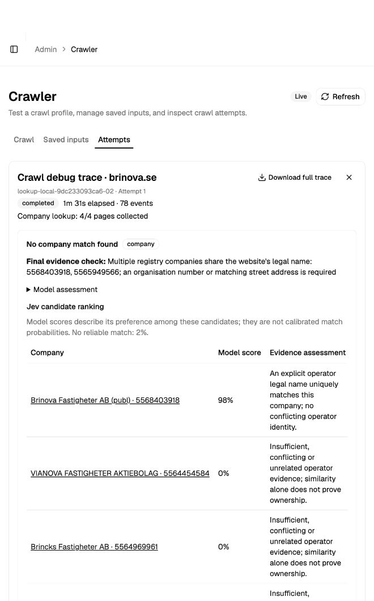

# Company lookup improvements — repeat benchmark, 27 September 2026

The frozen rerun produced **18 supported company matches versus 8 previously**, using the same 25 websites and actual local Qwen model. Two newly observed issues were corrected and checked in separate fresh attempts below. No company-domain associations were written.

## Frozen 25-site rerun, before follow-up corrections

| Reviewed outcome | Before | After |
|---|---:|---:|
| Exact reference match | 7 | 17 |
| Supported operator (different reporting company) | 1 | 1 |
| Category exclusion | 1 | 0 |
| No match / abstained | 10 | 1 |
| Technical failure | 6 | 4 |
| Unresolved site classification | 0 | 1 |
| Shop incorrectly processed (ID correct) | 0 | 1 |

Both runs used the endpoint-reported `nvidia/Qwen3.8-27B-NVFP4`, two concurrent crawls, four pages per website and the same saved model defaults. The saved model alias was corrected before this rerun. Expected IDs were withheld from requests. Jev was disabled in this comparison. System load, caching and model sampling were not controlled.

## Changes tested

- Discover labelled organisation/VAT numbers from page text and search exact IDs before model extraction; keep source quotations and ownership checks.
- Check supported ID, legal-name and address evidence independently of the model’s selected evidence label.
- Normalize Swedish legal forms including Investmentaktiebolaget, with exact normalized names ranked first.
- Preserve contact/legal excerpts, strip known cookie overlays, validate individual facts, and retry empty extraction once.
- Offer Jev candidate ranking independently of site classification, including all candidate scores and a no-match choice.
- Record and display both requested and reported processing-model names.

## Per-website results

| Website / exact attempt | Before | After | Returned ID | Seconds |
|---|---|---|---|---:|
| [addtech.se](http://localhost:5183/admin/crawls?tab=attempts&domain=addtech.se&source=rest&debug_request=lookup-local-c58818b7b0f8-01&debug_attempt=1) | Technical failure | Exact reference match | 5563029726 | 124.6 |
| [jm.se](http://localhost:5183/admin/crawls?tab=attempts&domain=jm.se&source=rest&debug_request=lookup-local-c58818b7b0f8-02&debug_attempt=1) | Exact reference match | Exact reference match | 5560452103 | 121.9 |
| [stendorren.se](http://localhost:5183/admin/crawls?tab=attempts&domain=stendorren.se&source=rest&debug_request=lookup-local-c58818b7b0f8-03&debug_attempt=1) | No match / abstained | Exact reference match | 5568254741 | 101.7 |
| [neobo.se](http://localhost:5183/admin/crawls?tab=attempts&domain=neobo.se&source=rest&debug_request=lookup-local-c58818b7b0f8-04&debug_attempt=1) | Exact reference match | Exact reference match | 5565802526 | 135.4 |
| [norion.se](http://localhost:5183/admin/crawls?tab=attempts&domain=norion.se&source=rest&debug_request=lookup-local-c58818b7b0f8-05&debug_attempt=1) | Technical failure | Technical failure | — | 1.7 |
| [instalco.se](http://localhost:5183/admin/crawls?tab=attempts&domain=instalco.se&source=rest&debug_request=lookup-local-c58818b7b0f8-06&debug_attempt=1) | No match / abstained | Exact reference match | 5590158944 | 130.3 |
| [studsvik.se](http://localhost:5183/admin/crawls?tab=attempts&domain=studsvik.se&source=rest&debug_request=lookup-local-c58818b7b0f8-07&debug_attempt=1) | Technical failure | Technical failure | — | 1.7 |
| [corem.se](http://localhost:5183/admin/crawls?tab=attempts&domain=corem.se&source=rest&debug_request=lookup-local-c58818b7b0f8-08&debug_attempt=1) | Exact reference match | Exact reference match | 5564639440 | 117.9 |
| [axfood.se](http://localhost:5183/admin/crawls?tab=attempts&domain=axfood.se&source=rest&debug_request=lookup-local-c58818b7b0f8-09&debug_attempt=1) | Technical failure | Exact reference match | 5565420824 | 119.7 |
| [spiltan.se](http://localhost:5183/admin/crawls?tab=attempts&domain=spiltan.se&source=rest&debug_request=lookup-local-c58818b7b0f8-10&debug_attempt=1) | Exact reference match | Exact reference match | 5562885417 | 120.2 |
| [humlegarden.se](http://localhost:5183/admin/crawls?tab=attempts&domain=humlegarden.se&source=rest&debug_request=lookup-local-c58818b7b0f8-11&debug_attempt=1) | Exact reference match | Exact reference match | 5566821202 | 115.3 |
| [elongroup.se](http://localhost:5183/admin/crawls?tab=attempts&domain=elongroup.se&source=rest&debug_request=lookup-local-c58818b7b0f8-12&debug_attempt=1) | Technical failure | Technical failure | — | 1.6 |
| [avanza.se](http://localhost:5183/admin/crawls?tab=attempts&domain=avanza.se&source=rest&debug_request=lookup-local-c58818b7b0f8-13&debug_attempt=1) | No match / abstained | Unresolved site classification | — | 34.9 |
| [ncc.se](http://localhost:5183/admin/crawls?tab=attempts&domain=ncc.se&source=rest&debug_request=lookup-local-c58818b7b0f8-14&debug_attempt=1) | No match / abstained | Technical failure | — | 66.0 |
| [fabege.se](http://localhost:5183/admin/crawls?tab=attempts&domain=fabege.se&source=rest&debug_request=lookup-local-c58818b7b0f8-15&debug_attempt=1) | No match / abstained | Exact reference match | 5560491523 | 111.7 |
| [arise.se](http://localhost:5183/admin/crawls?tab=attempts&domain=arise.se&source=rest&debug_request=lookup-local-c58818b7b0f8-16&debug_attempt=1) | No match / abstained | Exact reference match | 5562746726 | 117.8 |
| [mangold.se](http://localhost:5183/admin/crawls?tab=attempts&domain=mangold.se&source=rest&debug_request=lookup-local-c58818b7b0f8-17&debug_attempt=1) | Supported operator (different reporting company) | Supported operator (different reporting company) | 5565851267 | 122.3 |
| [byggmax.se](http://localhost:5183/admin/crawls?tab=attempts&domain=byggmax.se&source=rest&debug_request=lookup-local-c58818b7b0f8-18&debug_attempt=1) | Category exclusion | Shop incorrectly processed (ID correct) | 5566563531 | 225.3 |
| [lifco.se](http://localhost:5183/admin/crawls?tab=attempts&domain=lifco.se&source=rest&debug_request=lookup-local-c58818b7b0f8-19&debug_attempt=1) | Exact reference match | Exact reference match | 5564653185 | 113.7 |
| [brinova.se](http://localhost:5183/admin/crawls?tab=attempts&domain=brinova.se&source=rest&debug_request=lookup-local-c58818b7b0f8-20&debug_attempt=1) | No match / abstained | No match / abstained | — | 89.2 |
| [genova.se](http://localhost:5183/admin/crawls?tab=attempts&domain=genova.se&source=rest&debug_request=lookup-local-c58818b7b0f8-21&debug_attempt=1) | Technical failure | Exact reference match | 5568648116 | 93.3 |
| [latour.se](http://localhost:5183/admin/crawls?tab=attempts&domain=latour.se&source=rest&debug_request=lookup-local-c58818b7b0f8-22&debug_attempt=1) | No match / abstained | Exact reference match | 5560263237 | 95.3 |
| [hufvudstaden.se](http://localhost:5183/admin/crawls?tab=attempts&domain=hufvudstaden.se&source=rest&debug_request=lookup-local-c58818b7b0f8-23&debug_attempt=1) | No match / abstained | Exact reference match | 5560128240 | 106.2 |
| [indutrade.se](http://localhost:5183/admin/crawls?tab=attempts&domain=indutrade.se&source=rest&debug_request=lookup-local-c58818b7b0f8-24&debug_attempt=1) | No match / abstained | Exact reference match | 5560179367 | 91.1 |
| [medivir.se](http://localhost:5183/admin/crawls?tab=attempts&domain=medivir.se&source=rest&debug_request=lookup-local-c58818b7b0f8-25&debug_attempt=1) | Exact reference match | Exact reference match | 5562384361 | 89.0 |

## Timing, tokens and search audit

| Metric | Before | After |
|---|---:|---:|
| Wall minutes | 28.4 | 21.6 |
| Median fetched-site seconds | 139.1 | 114.5 |
| Model calls | 58 | 64 |
| Reported input tokens | 296,502 | 198,481 |
| Reported output tokens | 15,291 | 15,023 |

All 30 registry queries succeeded: 16 exact-ID searches (median 276 ms) and 14 name searches (median 6,567 ms).

Timed-out calls can consume unreported tokens. The local endpoint reports no monetary price. Timing differences include external-site and local inference variation.

## Follow-up corrections and fresh tests

The 25-site run was kept unchanged; its source hashes are in `v2-results.json`, and the final code hashes are in `repair-results.json` and `jev-results.json`. Its two newly observed issues were fixed only after the batch ended, then deployed and tested separately:

- NCC returned an empty explanation string. The parser now logs/omits blank explanations without discarding supported facts. Its exact failed response was replayed successfully, preserving two verified facts. A fresh crawl then completed normally but produced no verified operator facts: a legitimate abstention, not a match.
- Byggmax was incorrectly classified as a company. Classification now keeps product/navigation context instead of selecting legal-identity snippets, and explicitly prioritizes retail shopping over corporate footer information. Its fresh test stops as `online_store` after one page, with zero company queries.
- Same-name ambiguity now lists the conflicting registry IDs and the need for an organisation number or corroborating street address.

| Fresh local-model test | Outcome | Pages | Searches | Seconds |
|---|---|---:|---:|---:|
| [avanza.se](http://localhost:5183/admin/crawls?tab=attempts&domain=avanza.se&source=rest&debug_request=lookup-local-1ae830013ac2-01&debug_attempt=1) | Unresolved: insufficient rendered content | 1 | 0 | 15.6 |
| [ncc.se](http://localhost:5183/admin/crawls?tab=attempts&domain=ncc.se&source=rest&debug_request=lookup-local-1ae830013ac2-02&debug_attempt=1) | Completed; operator not identified | 4 | 0 | 75.4 |
| [byggmax.se](http://localhost:5183/admin/crawls?tab=attempts&domain=byggmax.se&source=rest&debug_request=lookup-local-1ae830013ac2-03&debug_attempt=1) | Correctly excluded online store | 1 | 0 | 63.9 |

These targeted attempts are not substituted into the frozen timing/token comparison above. The final service code was not rerun on all 25 domains after these corrections. Remaining unresolved reachable sites are Avanza (rendered content), NCC (operator extraction), and Brinova (same-name ambiguity). Norion, Studsvik and Elon Group still have homepage fetch failures.

No wrong accepted company ID was identified in this sample. Byggmax’s category error is counted separately; its returned ID was not counted as a successful company-site match. Mangold is supported by its operating subsidiary’s contact-page organisation number, which differs from the ESEF reporting parent. This small selected sample does not establish general matching accuracy.

Follow-up artifacts: `data/company-lookup-v2-repair-20260927/`; exact NCC response replay: `data/company-lookup-v2-20260927/ncc.se/blank-reason-replay.json`.

## Live Jev checks

Frozen baseline evidence was replayed through Jev 1.13 for JM, Avanza and Brinova. JM was accepted at 97%; Avanza’s leading candidate scored 50% (48% no match) and was rejected. Brinova scored 98%, but independent validation rejected ambiguous same-name evidence. All returned distributions were validated. Total reported cost: $0.000902328. These are uncalibrated provider scores, not measured matching accuracy.

Replay artifacts: `data/company-lookup-v2-jev-replay-20260927/`; reproduction: `replay_jev.py`.

### Full endpoint and Backoffice verification

Two additional fresh crawls used local Qwen for classification/extraction and Jev only for candidate ranking. Both completed through the deployed API:

| Website / exact attempt | Result | Jev top score | Final evidence check |
|---|---|---:|---|
| [addtech.se](http://localhost:5183/admin/crawls?tab=attempts&domain=addtech.se&source=rest&debug_request=lookup-local-9dc233093ca6-01&debug_attempt=1) | matched | 95% | Website organisation number matches the registry |
| [brinova.se](http://localhost:5183/admin/crawls?tab=attempts&domain=brinova.se&source=rest&debug_request=lookup-local-9dc233093ca6-02&debug_attempt=1) | not_found | 98% | Multiple registry companies share the website's legal name: 5568403918, 5565949566; an organisation number or matching street address is required |

Reported Jev cost for these two full-pipeline tests: $0.000242298; local-model inference cost was not reported. The UI shows candidate scores and an explicit no-match score, separates the model assessment from the final evidence check, and exposes the original full output and trace.

End-to-end artifacts: `data/company-lookup-v2-jev-20260927/`; [machine-readable Jev runs](jev-results.json).

## Validation and artifacts

- 54 crawler tests and 39 Backoffice tests passed; the changed lookup/Jev paths also passed 23 focused tests after the follow-up corrections; TypeScript validation and Python lint passed.
- Crawler deployed successfully; Backoffice controls and Addtech’s completed result verified in the browser.
- No company/domain associations or result rows were inserted into ClickHouse/PostgreSQL; no S3 publication. Normal local request history and debug artifacts were retained.
- [Machine-readable after results](v2-results.json), [baseline report](REPORT.md), [frozen 25-case cohort](rerun-cohort.json), [runner](run.py).
- Raw rerun artifacts: `data/company-lookup-v2-20260927/`; each case has result, status, full trace and summary files.
