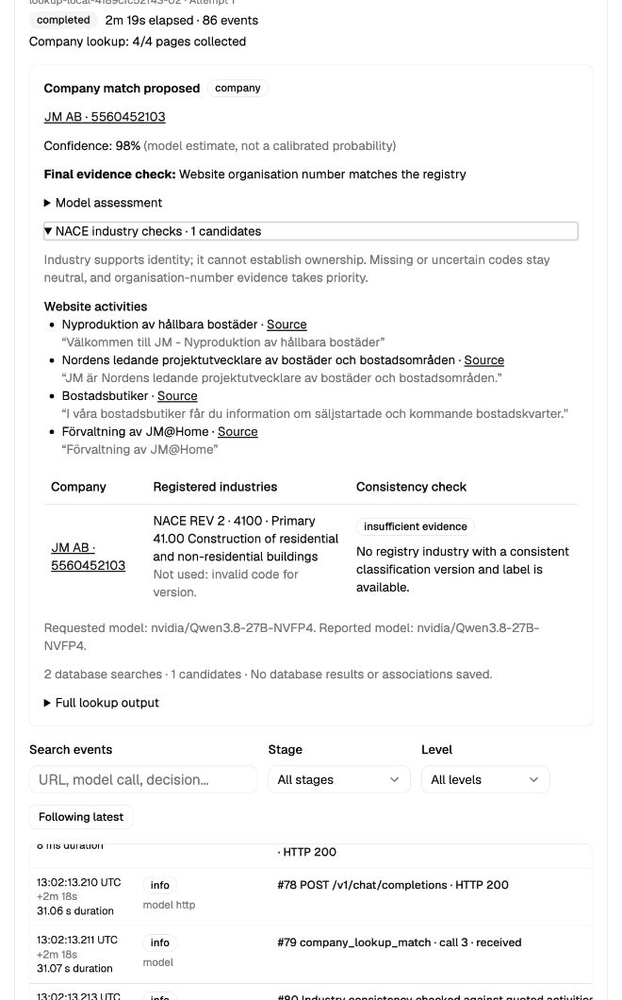

# NACE industry corroboration experiment — 27 September 2026

**NACE validation changed none of the 19 completed identity assessments in this
sample.** The frozen 25-site run produced 18 supported matches (16 exact reference
IDs and two evidenced operators different from the reference reporting company),
two unresolved cases, one correctly excluded online shop, and four technical
failures. No incorrect accepted ID was identified in the reviewed sample.

The previous full run also had 18 supported company-site matches. This run gained
Avanza after its full contact page became available, but lost Lifco to a truncated
local-model identity response. Neither change came from the NACE validation gate.
Lifco's separate retry is recorded below rather than substituted into this run.

Among the 18 accepted companies, 12 had consistent industry evidence and six
remained neutral. Across all 163 retrieved-candidate assessments, 44 were consistent,
109 neutral and 10 conflicting. Those conflicts were on unselected candidates and
did not change a final decision. Of 142 candidate industry rows, 33 had a code
absent from the declared revision and 19 had a conflicting label; all 52 were
excluded from model evidence. These are rows within this sample, not a population
estimate or counts of distinct companies across the database.

The check adds useful explanations and exposes registry-data problems. This
sample does **not** demonstrate increased match coverage or reduced false positives.
Keep it as supporting evidence, fix the source SNI/NACE version mapping, and
consider the measured model overhead before applying it across all domains.

## Frozen 25-site results

| Website / trace | Previous full run | Industry run | Accepted ID | Selected industry |
|---|---|---|---|---|
| [addtech.se](http://localhost:5183/admin/crawls?tab=attempts&domain=addtech.se&source=rest&debug_request=lookup-local-1ae2d1ec6ae3-01&debug_attempt=1) | Reference ID matched | Reference ID matched | 5563029726 | consistent |
| [jm.se](http://localhost:5183/admin/crawls?tab=attempts&domain=jm.se&source=rest&debug_request=lookup-local-1ae2d1ec6ae3-02&debug_attempt=1) | Reference ID matched | Reference ID matched | 5560452103 | insufficient evidence |
| [stendorren.se](http://localhost:5183/admin/crawls?tab=attempts&domain=stendorren.se&source=rest&debug_request=lookup-local-1ae2d1ec6ae3-03&debug_attempt=1) | Reference ID matched | Reference ID matched | 5568254741 | consistent |
| [neobo.se](http://localhost:5183/admin/crawls?tab=attempts&domain=neobo.se&source=rest&debug_request=lookup-local-1ae2d1ec6ae3-04&debug_attempt=1) | Reference ID matched | Reference ID matched | 5565802526 | insufficient evidence |
| [norion.se](http://localhost:5183/admin/crawls?tab=attempts&domain=norion.se&source=rest&debug_request=lookup-local-1ae2d1ec6ae3-05&debug_attempt=1) | Technical failure | Technical failure | — | — |
| [instalco.se](http://localhost:5183/admin/crawls?tab=attempts&domain=instalco.se&source=rest&debug_request=lookup-local-1ae2d1ec6ae3-06&debug_attempt=1) | Reference ID matched | Reference ID matched | 5590158944 | insufficient evidence |
| [studsvik.se](http://localhost:5183/admin/crawls?tab=attempts&domain=studsvik.se&source=rest&debug_request=lookup-local-1ae2d1ec6ae3-07&debug_attempt=1) | Technical failure | Technical failure | — | — |
| [corem.se](http://localhost:5183/admin/crawls?tab=attempts&domain=corem.se&source=rest&debug_request=lookup-local-1ae2d1ec6ae3-08&debug_attempt=1) | Reference ID matched | Reference ID matched | 5564639440 | consistent |
| [axfood.se](http://localhost:5183/admin/crawls?tab=attempts&domain=axfood.se&source=rest&debug_request=lookup-local-1ae2d1ec6ae3-09&debug_attempt=1) | Reference ID matched | Reference ID matched | 5565420824 | consistent |
| [spiltan.se](http://localhost:5183/admin/crawls?tab=attempts&domain=spiltan.se&source=rest&debug_request=lookup-local-1ae2d1ec6ae3-10&debug_attempt=1) | Reference ID matched | Reference ID matched | 5562885417 | consistent |
| [humlegarden.se](http://localhost:5183/admin/crawls?tab=attempts&domain=humlegarden.se&source=rest&debug_request=lookup-local-1ae2d1ec6ae3-11&debug_attempt=1) | Reference ID matched | Reference ID matched | 5566821202 | consistent |
| [elongroup.se](http://localhost:5183/admin/crawls?tab=attempts&domain=elongroup.se&source=rest&debug_request=lookup-local-1ae2d1ec6ae3-12&debug_attempt=1) | Technical failure | Technical failure | — | — |
| [avanza.se](http://localhost:5183/admin/crawls?tab=attempts&domain=avanza.se&source=rest&debug_request=lookup-local-1ae2d1ec6ae3-13&debug_attempt=1) | Unclassified | Supported operator | 5565735668 | consistent |
| [ncc.se](http://localhost:5183/admin/crawls?tab=attempts&domain=ncc.se&source=rest&debug_request=lookup-local-1ae2d1ec6ae3-14&debug_attempt=1) | Technical failure | Unresolved | — | — |
| [fabege.se](http://localhost:5183/admin/crawls?tab=attempts&domain=fabege.se&source=rest&debug_request=lookup-local-1ae2d1ec6ae3-15&debug_attempt=1) | Reference ID matched | Reference ID matched | 5560491523 | insufficient evidence |
| [arise.se](http://localhost:5183/admin/crawls?tab=attempts&domain=arise.se&source=rest&debug_request=lookup-local-1ae2d1ec6ae3-16&debug_attempt=1) | Reference ID matched | Reference ID matched | 5562746726 | consistent |
| [mangold.se](http://localhost:5183/admin/crawls?tab=attempts&domain=mangold.se&source=rest&debug_request=lookup-local-1ae2d1ec6ae3-17&debug_attempt=1) | Supported operator | Supported operator | 5565851267 | consistent |
| [byggmax.se](http://localhost:5183/admin/crawls?tab=attempts&domain=byggmax.se&source=rest&debug_request=lookup-local-1ae2d1ec6ae3-18&debug_attempt=1) | Shop incorrectly processed | Category excluded | — | — |
| [lifco.se](http://localhost:5183/admin/crawls?tab=attempts&domain=lifco.se&source=rest&debug_request=lookup-local-1ae2d1ec6ae3-19&debug_attempt=1) | Reference ID matched | Technical failure | — | — |
| [brinova.se](http://localhost:5183/admin/crawls?tab=attempts&domain=brinova.se&source=rest&debug_request=lookup-local-1ae2d1ec6ae3-20&debug_attempt=1) | Unresolved | Unresolved | — | — |
| [genova.se](http://localhost:5183/admin/crawls?tab=attempts&domain=genova.se&source=rest&debug_request=lookup-local-1ae2d1ec6ae3-21&debug_attempt=1) | Reference ID matched | Reference ID matched | 5568648116 | insufficient evidence |
| [latour.se](http://localhost:5183/admin/crawls?tab=attempts&domain=latour.se&source=rest&debug_request=lookup-local-1ae2d1ec6ae3-22&debug_attempt=1) | Reference ID matched | Reference ID matched | 5560263237 | consistent |
| [hufvudstaden.se](http://localhost:5183/admin/crawls?tab=attempts&domain=hufvudstaden.se&source=rest&debug_request=lookup-local-1ae2d1ec6ae3-23&debug_attempt=1) | Reference ID matched | Reference ID matched | 5560128240 | consistent |
| [indutrade.se](http://localhost:5183/admin/crawls?tab=attempts&domain=indutrade.se&source=rest&debug_request=lookup-local-1ae2d1ec6ae3-24&debug_attempt=1) | Reference ID matched | Reference ID matched | 5560179367 | consistent |
| [medivir.se](http://localhost:5183/admin/crawls?tab=attempts&domain=medivir.se&source=rest&debug_request=lookup-local-1ae2d1ec6ae3-25&debug_attempt=1) | Reference ID matched | Reference ID matched | 5562384361 | insufficient evidence |

The earlier NCC/Byggmax fixes are described in COMPARISON.md; they predate this industry change. The unresolved cases are NCC (no supported operator extraction) and Brinova (same-name registry ambiguity). Fetch failures remain Norion, Studsvik and Elon Group. Lifco failed in identity extraction before the industry lookup or assessment.

## Runtime, usage and database audit

| Metric | Previous full run | Industry run |
|---|---:|---:|
| Supported matches | 18 | 18 |
| Wall minutes | 21.6 | 32.7 |
| Median fetched-site seconds | 114.5 | 170.9 |
| Model calls | 64 | 81 |
| Reported input tokens | 198,481 | 247,718 |
| Reported output tokens | 15,023 | 27,715 |

The added industry stage made 17 local-model requests with 22,212 input and 6,965 output tokens. Its median duration was 29.6 seconds; it had no model-call errors. The longest many-candidate case, Neobo, took 111.4 seconds for industry assessment. The local endpoint does not report monetary cost.

All 50 database queries succeeded: 16 exact-ID, 15 name, and 19 batched industry queries. Industry queries had a median duration of 0.70 seconds. Full-run time/token differences also include fetched-content, extraction and inference-load variation; they are not all attributable to NACE.

Jev industry requests in the separate three eligible replays took 0.251–0.319 seconds. This small subset is an observed comparison, not a general latency guarantee.

## What changed

Company lookup now reads candidate industries in one parameterized, read-only
ClickHouse query. It checks codes and labels against the **declared NACE revision**,
extracts quoted website business activities, and returns an industry assessment
for each candidate. Backoffice and the ordinary crawler trace expose those facts,
codes, excluded mappings, model assessments and validated outcomes.

Industry is supporting evidence. A clear conflict can reject a name-only proposal;
it cannot override a verified operator organisation number. Missing activities,
unusable codes, uncertain revisions and unavailable model checks stay neutral.
Holding/head-office classifications cannot be rejected just because the website
describes the activities of operating subsidiaries. Industry agreement alone does
not prove ownership or resolve duplicate legal names.

## Regression caught and corrected during testing

The first implementation put identity and industry in one model request. That
experiment was stopped after it caused Instalco to be rejected because its NACE
data was missing, despite supported identity evidence. The model also described
an unrelated Neobo candidate as industry-conflicting because its **name** differed,
even while acknowledging that its industry was compatible.

The deployed implementation now separates those questions:

1. Identity matching receives no NACE codes or industry assessments.
2. A separate request receives only quoted activities, candidate IDs and reliable
   industry labels. It receives no candidate names or addresses. This request is
   skipped if activities or reliable codes are absent.
3. Deterministic validation applies the additional industry check after identity
   matching. Failed or malformed auxiliary model responses cannot erase a supported
   identity decision.

This requires up to one additional LLM request per eligible lookup. The first,
rejected implementation and its completed cases are preserved in
`data/company-lookup-industry-20260927/`, including its frozen source and the reason
the batch was interrupted. Only its own two active test requests were cancelled.

## Comparison method

- Same frozen 25 Swedish domains from `rerun-cohort.json`.
- Local model: `nvidia/Qwen3.8-27B-NVFP4`, saved profile revision 5.
- Four-page limit, 20-model-call budget, two concurrent requests, same runner.
- Full-run comparison against `v2-results.json`, with its three later repairs
  described separately in `COMPARISON.md`.
- Offline control removes only the industry check from each saved final assessment.
  The facts, registry candidates and identity-model response remain identical.
  Since identity matching already receives no NACE information, this directly
  measures whether the additional industry validation changed the accepted ID.
- Changes in fetched content or identity extraction between full runs are not
  attributed to NACE merely because they occurred after this change.

This is a selected sample dominated by listed companies, holding companies and
property groups. It is not a representative accuracy estimate for every `.se`
domain. Model confidence is not a calibrated probability.

### Reviewed Avanza change

Avanza was previously unclassified because its fetched homepage contained only
minimal rendered content. The new crawl retrieved the full site and contact page.
The contact page explicitly gives **Avanza Bank AB, organisation number
556573-5668**. The proposed ID `5565735668` is therefore supported by operator
evidence, although it differs from the cohort's reference reporting company,
Avanza Bank Holding AB (`5562748458`). This is counted as a supported different
operator, not an exact reference match. It is not credited as a NACE improvement:
the independent organisation-number check already establishes this match.
The saved quotation and URL are in `avanza.se/result.json` under the final raw artifacts.

## Industry data limitation

The serving data mixes some code/label revisions while reporting `NACE_REV2`.
The experiment excludes those uncertain rows instead of interpreting a number
under a guessed revision. See [observed examples and upstream source](INDUSTRY_DATA_NOTES.md).
Correcting that source mapping is necessary before industry evidence can be used
more broadly. This task does not modify or rematerialize the upstream pipeline.

## Jev verification

The same frozen local-model evidence was also passed to Jev using separate
identity and industry decisions. Addtech, JM, Neobo and Instalco all retained the
supported company IDs. Instalco was accepted despite its unusable NACE code.
JM had no usable industry code, so its industry request was skipped.

These four replays made seven Jev requests and reported $0.00105966 in provider
cost. They test Jev's decision path using saved evidence, rather than performing
four more fresh crawls. Artifacts: `data/company-lookup-industry-v2-jev-20260927/`;
reproduction: `replay_industry_jev.py`.

## Separate Lifco retry

The original Lifco attempt returned an incomplete identity response with `finish_reason=length`: only 97 reported output tokens despite a requested 65,536-token maximum. It failed before NACE processing, and remains a failure in the frozen 25-site statistics.

A [fresh retry](http://localhost:5183/admin/crawls?tab=attempts&domain=lifco.se&source=rest&debug_request=lookup-local-2bd7cb1fe7b3-01&debug_attempt=1) with the same code and local Qwen profile completed in 83.6 seconds and matched **5564653185**, supported by the website organisation number. The industry check was consistent. Including this separately reported retry gives **19 supported company matches across the 25 websites**, but the frozen-run count remains **18**. No response parser was relaxed and no code or settings changed for the retry.

The truncated-response incident remains an observed local-model reliability issue; one successful retry does not establish that it is fixed. Retry artifacts: `data/company-lookup-industry-retry-20260927/`; machine summary: [industry-retry-results.json](industry-retry-results.json).

## Validation and artifacts

- 50 crawler tests and 48 Backoffice tests passed; Python lint and TypeScript checks passed.
- Deployed crawler module hashes match the final benchmark manifest.
- Backoffice rendering verified against live JM and Addtech results.
- No company/domain associations or result rows written to ClickHouse/PostgreSQL;
  no S3 publication. Normal local SQLite request history and debug files remain.
- [Machine-readable full comparison](industry-results.json) and [Jev replays](industry-jev-results.json).
- Final raw artifacts: `data/company-lookup-industry-v2-20260927/`.
- Counterfactual control: `replay_without_industry.py`.
- Summary generator: `summarize_industry.py`.

