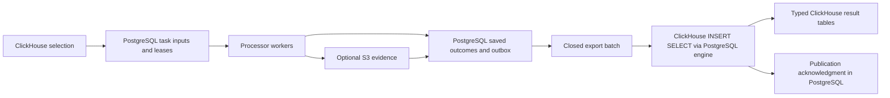

# Shared processing pattern: ClickHouse inputs, durable work, and bulk results

Analysis date: 2026-09-15. Historical engine comparison. The adopted Brave implementation
is documented in [company-brave-processing.md](company-brave-processing.md).
Its input selection stays in a physical ClickHouse table; PostgreSQL holds results
and progress, admitting only a bounded set of IDs as work proceeds. The original
proposal below to put full task membership/input values in PostgreSQL was superseded.
Other processors have not been migrated.

## Recommendation

Standardize a small work lifecycle across processors: **freeze selection → acquire work → process → durably save outcome → publish in batches → reconcile progress**. Keep translation, browser navigation, parsing, and their output schemas in their existing processors.

For a shared service supporting several workers or machines, the strongest candidate is **PostgreSQL for task membership, work leases, and a result outbox; ClickHouse's PostgreSQL engine for bulk SQL publication; existing RustFS/S3 for larger evidence objects**. An outbox here means committed result rows waiting to be copied into the final ClickHouse tables. A worker can save its result and completion state in one PostgreSQL transaction.

For one active coordinator per task, the existing **S3 manifest/result approach** remains a simpler viable option. It needs a common outcome format and recovery rules, not a new database merely for batching. The open deployment decision is whether multiple runs/machines should consume the same task; this analysis covers both arrangements.

Keeping import markers in ClickHouse is adequate for a serialized batch importer. A complete reusable work queue also needs ownership and recovery: import markers do not provide transactional claims, expired-worker recovery, or current per-task processing counts.

## 1. What the code actually does

| Flow | Work unit and selection | Durable processing state | Publication and progress | Reuse or change |
|---|---|---|---|---|
| Brave | Company ID/name, prompt version, freshness anti-join; lazy keyset pages from ClickHouse | Answer text in S3; each outcome indexed separately in ClickHouse | One metadata insert per response; counters in the active run; no frozen task denominator | Preserve bounded route workers. Add an immutable selection and common result identity. Make the saved response independently recoverable and batch publication. |
| Ratsit | Fixed company list in one of 128 hash partitions; source-specific freshness and retry rules | Per-company JSON, diagnostics when needed, and content-hash reuse | Results accumulate in a scan summary, then one ClickHouse insert after the selected scan finishes; live counts are in callbacks/logs | Preserve terminal `not_found`, selective 429 retries, and evidence reuse. Publish bounded completed batches to reduce the gap between saved evidence and queryable outcomes. |
| Webtech | Immutable S3 candidate manifest per partition; detector-aware freshness | Remote service writes every domain outcome before accepting replacement work; reconstructs saved outcomes on resubmission | Final manifest followed by validation and a bulk ClickHouse index; live task counts via scanner API | Closest existing model for remote recovery. Reuse stable submission/reattachment, result validation, and outcome-based counts. Consider intermediate completed batches rather than waiting for a whole scan. |
| Translation | Distinct source-text hash, source table/column and language pair, rather than one request per company | SQLite `input_items`, `output_items`, `failed_items`; one fixed Temporal workflow | Outputs are staged locally, flushed after configured processing batches and at queue-empty, then removed; Dagster waits on global queue counts | Already implements a durable output buffer. Add task membership and task-scoped progress before considering a backend migration. Preserve language-pair batching and distinct-text reuse. |
| Basic-info SQL extraction | Source-specific change selection | Scratch ClickHouse table containing selected IDs | Selection runs once; keyset pages read the scratch table, which is dropped in `finally` | Reuse the snapshot/pagination reasoning. Extend retention only when cross-run recovery is required. |

Code evidence:

- [Brave selection and persistence](/Users/graovic/pulsarpoint/ppoint/companycollect/corpscout/services/dagster_v3/src/dagster_v3/defs/company_domains/assets.py:46).
- [Ratsit per-result object writes](/Users/graovic/pulsarpoint/ppoint/companycollect/corpscout/services/dagster_v3/src/dagster_v3/defs/sweden_ratsit/assets.py:563), [whole-scan index insert](/Users/graovic/pulsarpoint/ppoint/companycollect/corpscout/services/dagster_v3/src/dagster_v3/defs/sweden_ratsit/assets.py:772).
- [Webtech recovery and processing](/Users/graovic/pulsarpoint/ppoint/companycollect/corpscout/services/webtech/scan_coordinator.py:441), [manifest validation and bulk index](/Users/graovic/pulsarpoint/ppoint/companycollect/corpscout/services/dagster_v3/src/dagster_v3/defs/webtech/storage.py:164).
- [Translation queue schema](/Users/graovic/pulsarpoint/ppoint/companycollect/corpscout/services/translator/internal/queuedb/schema.sql:1), [save output and flush](/Users/graovic/pulsarpoint/ppoint/companycollect/corpscout/services/translator/internal/engine/runtime.go:128), [Temporal workflow batching](/Users/graovic/pulsarpoint/ppoint/companycollect/corpscout/services/translator/internal/engine/workflow.go:37).
- [Translation global completion check](/Users/graovic/pulsarpoint/ppoint/companycollect/corpscout/services/dagster_v3/src/dagster_v3/defs/translator_load/resource.py:141). It compares a global failed count with a baseline and waits for the entire queue to drain. Another source's new failures or continuing work can affect this loader; it is not task-scoped accounting.
- [Selection snapshot helper](/Users/graovic/pulsarpoint/ppoint/companycollect/corpscout/services/dagster_v3/src/dagster_v3/defs/se_company/basic_info/extract.py:182). Its comments document repeated scans/sorts from paging a complex eligibility query directly.

These are different implementations of the same lifecycle, but they have different retry policies and different units of work. A shared implementation must preserve those differences.

## 2. What the integration engines help with

Integration engines expose an external system through a ClickHouse table interface. That is useful for data movement and SQL inspection; it does not itself supply a browser/LLM work scheduler. [Integration-engine overview](https://clickhouse.com/docs/reference/engines/table-engines/integrations/).

| Candidate | Useful role | Limits for this pattern | Assessment |
|---|---|---|---|
| PostgreSQL | Store frequent small result writes and transactional task state in PostgreSQL; bulk `INSERT … SELECT` into ClickHouse through an external table | Work claiming and multi-statement transactions must use PostgreSQL directly. The ClickHouse engine exposes SELECT/INSERT with separate remote transactions. | Best general candidate when shared work ownership and task-level progress are required. |
| S3 | Durable response/evidence files and explicit SQL imports of a known file set | No row-level work claiming, no append to an existing file, and no automatically maintained business progress. Individual writes create small objects. | Good existing foundation for browser evidence and serialized coordinators. |
| S3Queue | Automatically consume newly written S3 files into destination tables via a materialized view; tracks file ingestion | Tracks files, not unprocessed companies. Requires coordination state for tracked modes, with replay and retention behavior to configure. | Useful optional publisher after the worker protocol is established. |
| EmbeddedRocksDB | An embedded key/value staging table; inserts replace values for existing keys | One primary-key column; point lookups fit better than scanning pending work. The documented interface does not provide the transactional lease protocol required by this design. Local storage and recovery need evaluation. | Worth a bounded single-server experiment; not the preferred shared work ledger. |
| SQLite | Existing translator already uses it for a local input/output buffer | ClickHouse's SQLite engine accesses a database file in its own environment. It is not a remote connection to the translator's service database. Sharing a live file introduces deployment and concurrency coupling. | Keep service-owned SQLite while it meets the translator's needs; do not mount it into ClickHouse just to reuse this engine. |
| Kafka / RabbitMQ / NATS JetStream | Durable message delivery can transport work or results; ClickHouse engines can ingest result streams | Delivery offsets/acknowledgments do not tell us how many business items remain. Task accounting, idempotency, retry policy, and worker execution remain necessary. | Consider when a broker is already the chosen service boundary or measured throughput requires it. |
| Redis | Key/value access through ClickHouse | The engine is not a Redis Streams consumer or an atomic claim API. General scans may see duplicate/changing keys and require full scans without key predicates. | Does not simplify the desired lifecycle. |
| MaterializedPostgreSQL | Replication from PostgreSQL into ClickHouse | Different responsibility from a work queue; documented as experimental. | Not needed for an initial explicit result importer. |
| Other remote/lake engines | Access to their existing data sources | No direct advantage for the four inspected processors | Use when those systems are actual inputs, not as a new general queue. |

References: [PostgreSQL](https://clickhouse.com/docs/reference/engines/table-engines/integrations/postgresql), [S3](https://clickhouse.com/docs/reference/engines/table-engines/integrations/s3), [S3Queue](https://clickhouse.com/docs/reference/engines/table-engines/integrations/s3queue), [EmbeddedRocksDB](https://clickhouse.com/docs/reference/engines/table-engines/integrations/embedded-rocksdb), [SQLite](https://clickhouse.com/docs/reference/engines/table-engines/integrations/sqlite), [Kafka](https://clickhouse.com/docs/reference/engines/table-engines/integrations/kafka), [RabbitMQ](https://clickhouse.com/docs/reference/engines/table-engines/integrations/rabbitmq), [NATS](https://clickhouse.com/docs/reference/engines/table-engines/integrations/nats), [Redis](https://clickhouse.com/docs/reference/engines/table-engines/integrations/redis), [MaterializedPostgreSQL](https://clickhouse.com/docs/reference/engines/table-engines/integrations/materialized-postgresql).

Two alternatives outside the linked integration list also matter:

- **Async inserts with `wait_for_async_insert=1`** let ClickHouse buffer small inserts while returning success after a flush. This can address ingestion overhead without an external outbox, but does not provide work claims or task membership. Merely changing this setting on Brave's current serial writer does not ensure useful batching: that writer waits for one insert before submitting the next. [Async inserts](https://clickhouse.com/docs/optimize/asynchronous-inserts).
- **Buffer/Memory staging** is unsuitable as the sole record of an expensive completed response. The Buffer engine can lose buffered rows after an abnormal restart. [Buffer engine](https://clickhouse.com/docs/reference/engines/table-engines/special/buffer).

### Version and deployment evidence

A read-only check found production ClickHouse **26.5.1.882**. Its engine registry includes PostgreSQL, S3, S3Queue, EmbeddedRocksDB, SQLite, Kafka, RabbitMQ, NATS, and Redis. No tables in the `corpscout` database currently use those engines. Registry presence confirms availability, not configuration, external connectivity, capacity, or every feature described in newer documentation.

Current online documentation includes changes newer than the deployed release. Verify proposed settings against 26.5 before implementation, especially NATS JetStream acknowledgment behavior and newer S3Queue modes/settings. No broker or Keeper deployment was verified in this analysis.

## 3. A shared lifecycle and precise progress

### Identity

- `task_id`: the user's durable selection and processing intent; reused when resuming. A Dagster run ID identifies one orchestration attempt and must not replace it.
- `input_id`: stable identity within an input namespace. It is a company ID for Brave/Ratsit, a normalized domain for Webtech, and a distinct-text identity for translation.
- `work_id`: identifies the input plus its fingerprint and semantic processor settings/version. A renamed company, changed text, changed prompt, new detector, or different language pair can require different work.
- `result_id`: stable identity of a saved result across publication retries. Re-importing a saved result must not manufacture a new result ID or timestamp.
- `export_batch_id`: membership of a closed set of saved results. It is unrelated to input pagination order.

Separate shared result-cache identity from task membership: two tasks can reuse an existing successful result while retaining their own totals. Preventing simultaneous duplicate calls across different tasks is an additional ownership requirement; if needed, use a unique shared work record plus task membership. Do not assume a cache lookup alone provides that exclusion.

### Processing and publication are separate states

Processing states:

```text
queued → running → succeeded
                 → retry_wait → running
                 → terminal_failed
queued/running → cancelled
queued → skipped (explicitly reused or excluded by policy)
```

`succeeded` requires a durably saved accepted result. A response held only in worker memory is not a success checkpoint. A source-specific terminal outcome such as Ratsit `not_found`, or a successful Webtech report with zero technologies, still resolves one item.

Publication state is tracked separately for saved outcomes: **unpublished → assigned to closed batch → published**. A ClickHouse outage increases unpublished results; it must not cause already saved browser/LLM work to be reissued.

For a frozen task, count distinct items in mutually exclusive current states:

```text
total = queued + running + retry_wait + succeeded
        + terminal_failed + skipped + cancelled

remaining_processing = queued + running + retry_wait
unpublished_results = saved accepted result IDs not yet published
```

Show success, terminal failure, cancellation, remaining work, and publication backlog separately. A task with terminal failures can be finished processing without being successful. The requested asset's completion policy decides whether publication is also required for materialization.

Never derive processing progress from `max(input_id)`, S3 filename order, insertion sequence, or raw output-row count. Requests finish out of order, and an item can emit zero, one, or many facts. A database sequence allocated before transaction commit is not necessarily commit order either; advancing a high-water mark can skip a late-committing lower ID.

## 4. Recommended shared-service design

This is the target if multiple workers or machines must consume the same task. For a single coordinator, see section 5.



Proposed records, not yet created:

| Record | Purpose |
|---|---|
| `processing_tasks` | Processor/config version, immutable selection reference, preparation state, total items, task lifecycle |
| `processing_items` | Frozen input values or reference, task membership, current state, attempt number, next retry, lease owner/token/expiry, accepted result ID |
| `processing_results` | Committed outcome, stable result ID, small result content or evidence reference, assigned export batch |
| `processing_export_batches` | Closed membership/count, destination/schema version, publication status and acknowledgment |

One shared schema can hold these records; creating a table per task is unnecessary. Keep typed processor-specific result projections. Do not force Ratsit financial facts, translations, and technology detections into one universal fact table.

### Selection and execution

1. Run the source's explicit selection once, preserving all input fields used by the processor. Use a bounded transfer or persisted selection snapshot so complex joins are not reevaluated on every page. A task remains `preparing` until membership is complete and validated; only then expose it to workers.
2. Claim a small amount of eligible work using a **native PostgreSQL transaction**, record a lease/token, and commit before network calls. `FOR UPDATE SKIP LOCKED` is a documented technique for concurrent queue consumers. Do not hold database locks during a 60-second browser request. [PostgreSQL locking clauses](https://www.postgresql.org/docs/current/sql-select.html#SQL-FOR-UPDATE-SHARE).
3. Refill only available processor capacity. Browser route limits and translation language-pair batches remain explicit processor policies. Task ownership does not replace limits on shared external resources.
4. Save an accepted result and update item state in one PostgreSQL transaction, conditional on the current lease token. An expired worker must not overwrite a newer attempt. Large evidence can be saved to S3 first; database state then records its exact immutable key/checksum. An interrupted S3 write/acknowledgment path needs reconciliation.
5. Retry transient failures after a recorded delay; preserve source-specific terminal outcomes. Bound attempts where appropriate and keep permanent failures visible.

No storage arrangement guarantees that an external call happens exactly once: a process can die after receiving an answer but before saving it. The achievable contract is recoverable saved results, controlled retries, and no duplicate logical published results.

### SQL publication through the PostgreSQL engine

A publisher assigns a fixed set of committed result IDs to an export batch inside PostgreSQL. It then executes a ClickHouse `INSERT … SELECT` against an external PostgreSQL table/view, with an equality predicate on `export_batch_id`. Simple equality filters are pushed to PostgreSQL; relying only on an outer `LIMIT` would not bound the remote read in the same way. [Engine query behavior](https://clickhouse.com/docs/reference/engines/table-engines/integrations/postgresql#implementation-details).

Illustrative SQL after the proposed schema and projection exist:

```sql
INSERT INTO corpscout.company_brave_search_results
    (result_id, task_id, company_id, query_type, query, answer_text, fetched_at)
SELECT result_id, task_id, company_id, query_type, query, answer_text, fetched_at
FROM corpscout.processing_brave_results_pg
WHERE export_batch_id = {batch_id:UUID};
```

After successful import and reconciliation, acknowledge that exact batch through PostgreSQL. Keep its staged rows until the retention/recovery policy allows removal. Never delete all currently pending outputs: other workers may have completed new results while the import was running.

There is no distributed transaction spanning PostgreSQL and ClickHouse. A crash after import but before acknowledgment must replay safely. The target needs an explicit result-ID strategy, for example a ReplacingMergeTree key that includes stable result identity with readers using `FINAL`/a deduplicating view. Background merges alone do not guarantee immediately duplicate-free reads. Do not apply duplicate-sensitive additive aggregation before deduplication. [ReplacingMergeTree semantics](https://clickhouse.com/docs/reference/engines/table-engines/mergetree-family/replacingmergetree).

PostgreSQL connection pressure is already called out in the [project guide](/Users/graovic/pulsarpoint/ppoint/companycollect/corpscout/services/dagster_v3/CLAUDE.md:157). Use a dedicated application schema and bounded pool, keep transactions short, and measure the new workload alongside Dagster/Temporal before rollout. Do not write queue tables into Dagster's internal metadata schema.

## 5. Simpler S3 design for one active coordinator

The S3/SQL approach is sound for the publication portion:

1. Freeze task membership in a retained manifest or input snapshot.
2. Save each outcome with enough metadata to reconstruct its identity and status.
3. Reconcile saved outcomes against membership on restart; a saved answer awaiting import is already completed processing.
4. Close bounded batches by recording their exact object set. Uploads completing late belong to a later batch.
5. Import those objects through the S3 engine or `s3()` in ClickHouse SQL. Retain a batch acknowledgment and use the same result-ID replay rules as above.

Use task/batch prefixes or explicit object lists, not a wildcard over all historical output followed only by a row filter. One file per response favors immediate recovery but increases object count and read requests. Measure that cost; optional compaction into batch JSONL/Parquet can reduce it after individual results are safely saved.

This model does not atomically arbitrate competing coordinators. Enforce one owner through the existing service/pool boundary, or add an actual lease store. Multiple browser workers behind that owner are fine. Exact live progress comes from its current distinct outcomes, and is reconstructed from saved objects after restart; an imported-result count alone lags actual processing.

S3Queue can later replace explicit file ingestion. For unordered completion, use compatible unordered tracking; ordered mode can ignore a late file whose name sorts before the last processed name. Tracking TTL/limits must align with object retention, or previously handled files can become eligible again. It still cannot identify companies that never produced a file. [S3Queue modes and tracking](https://clickhouse.com/docs/reference/engines/table-engines/integrations/s3queue).

Our runbook currently treats S3 source artifacts as rebuildable cache. Promoting staged responses into the sole recovery record requires an explicit retention and recovery decision; do not delete them merely because an orchestration run ended.

## 6. What to generalize, and what to leave explicit

Share a minimal identity/outcome contract, task membership, current-state counts, claim/lease logic where needed, bounded publication, and crash-recovery tests. Python and Go services can share the schema/protocol without introducing a new orchestration framework or rewriting the translator in Python.

Keep these processor-owned:

- Selection filters, freshness and force-refresh semantics.
- Prompt rendering, model/detector/parser versions, validation of an answer.
- Provider-specific rate limits and route assignment.
- Translation batching by language pair and distinct text.
- Ratsit not-found and rate-limit retry rules, diagnostic HTML, and content reuse.
- Webtech zero-detection successes and scanner-owned browser lifecycle.
- Typed destination schemas and extraction SQL.

Avoid building interchangeable adapters for every engine in the comparison. Implement one chosen durable work backend and one publisher first. Add an S3 publisher only for actual file-backed outputs. Bulk country-file ingestion should continue using the established dlt/DuckDB/export path; this proposal targets external processing of selected records.

## 7. Adoption and validation

Start with **Brave**, since its response shape is small and its worker capacity is already bounded. Add stable task membership, preserve the exact rendered query, and prove saved-result recovery plus batch replay. Next apply the same progress/outcome contract to **Webtech**, which already has recovery objects and a remote execution boundary. Adapt **Ratsit** while preserving terminal policies and content reuse. For **translation**, first fix task-scoped accounting and retain its working SQLite/Temporal path; migrate its storage only if the shared-service requirements justify that change.

Before selecting a backend, run a small integration experiment on the deployed ClickHouse version with representative response sizes and expected worker concurrency. Compare PostgreSQL-outbox publication, S3 batches, and the existing direct-write baseline. Measure save latency, rows/bytes per import, parts created, database connections, object requests, restart recovery time, and publication lag. Current research does not establish throughput figures for any proposed backend.

Required correctness scenarios:

1. Source rows change after selection; task inputs and totals remain fixed.
2. Duplicate/empty input IDs and missing template variables are rejected before processing.
3. Four requests finish out of order; none are skipped by a cursor.
4. Two consumers claim concurrently; each task item has one accepted owner.
5. A lease expires and the old worker later replies; its stale update is rejected.
6. A result is saved but ClickHouse is unavailable; processing progress survives and publication catches up later.
7. Import partially succeeds or its acknowledgment is lost; replay yields the expected distinct results.
8. New outputs arrive during import; acknowledgment/cleanup touches only closed batch members.
9. Zero-output successes, not-found, terminal failures, retry waits, and cancellations produce correct task counts.
10. Two tasks overlap or share translated text; cache reuse and each task's denominator remain correct.
11. Cancellation/restart preserves saved outcomes and does not leak worker capacity.
12. Importer validation rejects missing/corrupt evidence and incompatible result versions.

Verification performed for this analysis: inspected code and relevant existing test cases, successfully listed the registered Dagster definitions, checked production ClickHouse version/engine metadata read-only, and reviewed the linked official engine references. No production materialization, ingestion benchmark, queue migration, or behavioral test of the proposed design was performed.


## Brave pilot implementation

The accepted PostgreSQL option is implemented for Brave. See [configuration, recovery and deployment](company-brave-processing.md) for the concrete task contract. The pilot uses the PostgreSQL table function with a server-owned named collection, synchronous per-response PostgreSQL commits, and closed export batches. Other processors are unchanged.
