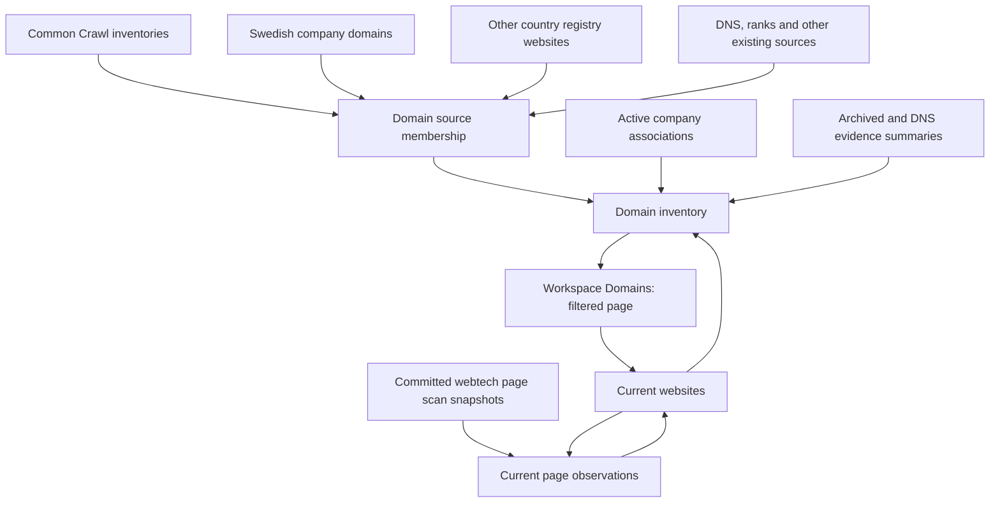

# Domain inventory and website/page technology model

> Scope correction, 2026-09-24: inventory membership uses `corpscout.commoncrawl_domains`, `corpscout.se_company_domain`, and (subsequently explicitly approved) published `corpscout.commoncrawl_domain_graph_nodes` as `commoncrawl_graph`. Graph ranks remain excluded. Broader source lists below are superseded. The user also retired `corpscout.domains`, `corpscout.company_website_domains`, and `domains_clickhouse`. See `docs/operations/domain-inventory.md` for the implemented scope.

Date: 2026-09-24  
Status: Design proposal for review; no implementation, migration or deployment authorized by this document.  
Scope: Workspace → Domains, its source inventory, and website/page technology observations.

## 1. Outcome and requirements

Replace the request-time union of large operational tables with a dedicated ClickHouse dataset for browsing and filtering domains. Keep one root domain per main-table row, expandable into websites and then pages.

The inventory must include company domains that never appeared in Common Crawl. Start with the explicit union of Common Crawl and the Swedish company-domain dataset, preserve other currently available sources, and support company registries from any country without redesigning the schema. A root domain has a sorted, deduplicated `sources` array; belonging to one source never excludes it from another.

Technologies belong to an observed page on a website. A website can have multiple pages, and a root domain can have multiple websites. Initially the live webtech scanner ordinarily produces one page per domain attempt. The model must accept more pages later without adding numbered page columns or changing the table key.

User-facing goals:

- Fast positive and negative filters, including webtech presence and company association.
- Sources visible and filterable, including domains present only in Swedish/company data.
- Accurate current technology counts without joining full scan history during page requests.
- Separate live webtech, archived-page technologies, and DNS-derived signals.
- Explicit scan status/freshness, including unscanned, failed, partial, and successfully empty results.
- Stable pagination and preserved company identity across countries.

Non-goals for this change: expanding the scanner to crawl many pages, changing DNS storage, deleting historical tables, changing the technology catalog, moving task coordination between databases, or treating an observed domain as verified company ownership.

## 2. What exists and what is causing the timeout

The implementation is in [workspace-domains.server.ts](/Users/graovic/pulsarpoint/ppoint/companycollect/corpscout/services/backoffice/app/lib/workspace-domains.server.ts). It queries seven source branches plus graph releases in parallel, obtains 26 roots per branch, merges them in Node, displays 25, and then queries four sets of evidence counts.

The `without webtech` predicate repeats a global `NOT IN (SELECT DISTINCT root_domain FROM webtech_domain_technologies_current)` in every branch. That ordinary view joins `webtech_domain_technologies FINAL` and `webtech_domain_scan_results FINAL`; the small page limit does not bound the work needed to build that set.

Observed on 2026-09-24:

| Evidence | Observation |
| --- | --- |
| Failing inventory request | Eight source queries reached their 20-second limit |
| Work per failing query | Approximately 5–10 million rows read; 955 MiB–1.6 GiB peak memory |
| `commoncrawl_domains` | Approximately 1.43 billion physical rows, including URLs/crawls and replacement versions |
| Common Crawl graph nodes | Approximately 119.7 million physical rows |
| Webtech technology history | Approximately 8.05 million physical rows |
| Webtech scan results | Approximately 2.70 million physical rows; 977,577 rows after `FINAL` in the measured check |
| Isolated 26-root lookup through current detections | 5.7 seconds in one measurement |
| Isolated 26-root lookup through positive scan counts | 1.4 seconds in one measurement; not yet a verified semantic substitute |

These are measurements, not distinct-domain totals or future performance guarantees.

There is **no physical `corpscout.se_domains` table** in the inspected database. The Swedish domain entity is `se_company_domain`; review overrides and active associations are available through `company_domains_resolved`. Cross-country registry websites are in `company_website_domains`.

The existing webtech “current” view is current **per `(crawl_id, root_domain, detector_version)`**, because that is the scan table's replacement key. It is not one globally latest scan per page. The new model must explicitly resolve across crawl IDs and detector versions within the same scanner family.

## 3. Chosen architecture and alternatives

Chosen: a physical domain inventory for list queries, plus physical website/page current tables derived from committed scan snapshots. Store detailed technologies at page level and only compact counts/status flags at domain level.

Alternatives considered:

| Approach | Decision |
| --- | --- |
| Rewrite bounded queries over the current union | Useful temporary mitigation, but does not provide the requested shared domain model or richer filters |
| One domain row with all page/technology data embedded | Reject: obscures host/page identity, grows wide, and makes page history and changes difficult |
| Dedicated inventory plus website/page data | Recommended: bounded list reads, correct observation scope, extensible to multiple pages |

No new database is needed. ClickHouse holds these datasets; Dagster builds and refreshes them using the existing ClickHouse resource and migration-owned schemas. This is an in-database serving transformation, so copying the warehouse through dlt/DuckDB is unnecessary. That is an intentional exception to the new external-source ingestion template.



## 4. Source inclusion and provenance

`sources` identifies inventory datasets, not proof that a site is alive and not the internal reason a company association was suggested. For example, `se_domains` is an inventory source; `brave`, `wikidata`, and reviewer evidence remain provenance on the company association.

| Stable source label | Input | Inclusion policy |
| --- | --- | --- |
| `commoncrawl` | `commoncrawl_domains` and graph-node inventories | Union of valid known roots; retain crawl/graph provenance internally |
| `se_domains` | `se_company_domain` | Include valid known Swedish entity roots, even if their company association is currently inactive; active company counts use reviewed associations separately |
| `company_registry` | `company_website_domains` | Current registry website records from all countries; preserve `source_slug`, country and original record identity |
| `company_domains` | `company_domains_resolved` | Active reviewed/resolved associations across supported countries |
| `domain_inventory` | Existing `domains` | Preserve existing domain coverage |
| `open_page_rank` | `open_page_rank_domains` | Preserve valid ranked roots |
| `dns` | `commoncrawl_domain_dns_scan` and hostname Maybe evidence | Preserve observed DNS roots/hosts |
| `webtech` | Committed webtech scan observations | Include observed/requested roots, including roots with zero detections |
| `website_crawl` | `website_crawl_results` | Preserve roots discovered by the website crawler |

Initial migration must at minimum satisfy `Common Crawl ∪ Swedish domains`. Including the remaining existing inputs avoids silently removing domains already visible in Workspace. Country support is data-driven, not another union branch per country.

Additional rules:

- `sources` is the set of memberships in the published inventory snapshot. Discovery/history evidence is retained upstream; source removal is an explicit adapter rule, not inferred from an incomplete import.
- A rejected company association does not erase the domain or unrelated sources. It removes that canonical company/domain pair from active company counts across all contributing association adapters; a raw registry row must not reintroduce a pair explicitly rejected by review. In the absence of a review decision, current registry associations remain eligible but are not presented as verified ownership.
- `company_count` counts canonical `(country_code, company_id)` identities after using existing identifier normalization. Preserve `company_id_type` on association detail; do not collapse different raw identifier schemes unless their canonical mapping is known.
- `company_countries` comes from active company associations. A `.se` suffix is not evidence of a Swedish company.
- Unknown country/identity mappings remain evidence and are reported; they must not silently become `SE` or count as a canonical company.
- Normalize and validate at ingestion using the existing IDNA/public-suffix policy. Strip a trailing DNS dot and lowercase hosts. Do not use a “last two labels” root-domain rule. Reject IP literals, email strings and invalid hostnames from this domain inventory, reporting rejection counts in asset metadata.

## 5. Identity: domain → website → page

| Entity | Natural identity | Example |
| --- | --- | --- |
| Root domain | Normalized registrable domain | `example.com` |
| Website | HTTP origin: scheme + canonical hostname + effective port | `https://shop.example.com` |
| Page | Website + normalized path + query | `https://shop.example.com/products?id=7` |
| Page scan | Page + scanner family + stable scan/result identity | One attempt on that page |

Website identity uses the origin because HTTP/HTTPS and non-default ports can serve different applications. The UI can visually group origins under the same hostname, but storage must not silently merge them. `www.example.com` and `shop.example.com` are separate websites.

URL normalization removes fragments, normalizes scheme/host/default ports, and makes an empty path `/`. Preserve path case, trailing slashes, query values/order and repeated query keys unless a later explicitly versioned canonicalization policy is introduced. Do not merge `/products` with `/products/`, or strip queries globally. Retain original URLs for evidence. Hash identifiers, if used, are accompanied by canonical strings and collision checks; the migration can use natural string keys initially.

A DNS-only hostname is not proof of an HTTP origin. Keep it as an observed hostname in the existing hostname dataset; show it as an unscanned hostname rather than fabricating an HTTPS website/page.

### Redirect attribution

Store both the requested target and the final observed page, plus `requested_root_domain`, `observed_root_domain`, and redirect information. Attribute detections to the final observed website/page. If `example.com` redirects to an unrelated platform, do not label the platform's technology as deployed on `example.com`. The requested domain can show “redirected to …” and link to the observation. Record the redirected target's domain membership as well.

Repeated requests reaching the same final page must not multiply current page or technology counts. Failed requests with no final page stay attached to their requested target for diagnostics, not to an invented observed page.

## 6. Proposed datasets

Names are proposed; check for collisions and use the next available migration numbers at implementation time. No assumption is made that migration 436 will remain available.

### A. `domain_source_membership`

A compact input for publishing the domain inventory: one logical row per `(source, root_domain)` in a completed source snapshot.

Fields: `source`, `root_domain`, `first_seen_at`, `last_seen_at`, `source_snapshot_id`, `source_run_id`. Source-specific record IDs/country/company details remain in the authoritative association tables; do not duplicate large evidence arrays here. Separate source contributions allow one source to refresh without rebuilding the 1.43-billion-row URL inventory.

Sorting supports `(source, root_domain)`. Source snapshots are built in staging and published atomically; incomplete input cannot remove memberships. Use source/release partitions where bounded, avoiding a partition per company/domain/scan. For Common Crawl, persist compact roots as part of each completed import and merge memberships, instead of repeatedly scanning all historical URLs for UI refreshes.

### B. `domain_inventory`

One physically published row per root domain, optimized for list/filter reads.

| Column/group | Meaning |
| --- | --- |
| `root_domain` | Primary identity and alphabetical pagination key |
| `sources Array(LowCardinality(String))` | Sorted, unique inventory source labels |
| `company_count`, `company_countries` | Canonical active association count and countries |
| `website_count`, `observed_hostname_count` | Known HTTP origins versus all observed hostnames; do not conflate these |
| `page_count`, `webtech_scanned_page_count` | Observed pages and pages with a committed live scan |
| `webtech_technology_count` | Distinct current live technology identities across observed pages, not sum of page counts |
| `archived_technology_count`, `dns_technology_count` | Separate evidence families; explicitly historical/evidence counts |
| `has_companies`, `has_webtech` | Precomputed filtering flags |
| `webtech_detected_page_count`, `webtech_empty_page_count`, `webtech_partial_page_count`, `webtech_failed_page_count` | Status summaries; detection and partial counts can overlap |
| `last_webtech_scan_at`, `last_complete_webtech_scan_at` | Freshness timestamps, nullable if unknown |
| `first_seen_at`, `last_seen_at` | Observation timestamps when available; do not substitute build time |
| `refreshed_at`, `build_id` | Serving snapshot metadata |

Do not put full company lists, all URLs, or large technology arrays in this row. Country and source arrays are bounded facets. The UI fetches detailed associations only for visible/expanded domains.

Use a physical `MergeTree` serving table, sorted by `root_domain`, with atomically published data rather than a request-time `FINAL`/history join. Proposed stable hash partitioning: `cityHash64(root_domain) % 128`, subject to the storage benchmark. Writers rebuild affected partitions with exactly one row per root and replace them atomically. This supports removal and zero-count updates without accumulating stale replacement rows on the UI path.

### C. `website_page_scans`

Immutable logical snapshots, one per page scan. A retry reuses the same scan key and payload; a new scan gets a new identity. Store complete technology arrays with the scan row so a successful zero-detection result has a durable row too.

Fields:

- Requested and observed root domains, original and normalized requested/final URLs.
- Observed website origin, hostname, port, page path/query; nullable observed identity when no page was reached.
- `scanner_family` (initially `webtech`), `detector_version`, `scan_id`, `crawl_id`, `scanned_at`, `recorded_at`.
- Fetch/analysis status, `analysis_complete`, error/stage, redirect status.
- `technologies Array(Tuple(...))`: stable technology key, nullable `technology_id`, detected name, version, confidence, category IDs/names, catalog-match status.
- `report_sha256`, object-store reference, `source_run_id`, deterministic result identity.

The existing `technology_catalog` remains canonical. Unmapped detections keep a namespaced detector identity and their original name; they must not disappear or share one null identity. Mapping several aliases to the same catalog ID produces one distinct technology in rollups, while page detail preserves versions/evidence.

A `ReplacingMergeTree` keyed by immutable scan identity can absorb identical insert retries. Exact folds deduplicate explicitly before choosing current state; background merges are not a uniqueness guarantee. Corrections use an explicit new revision, never silently change a result under the same identity/hash.

### D. `website_pages_current`

One physical observation row per `(observed website, page, scanner_family)`, with the selected scan metadata and its complete technology array. Add a `record_kind` discriminator to the storage key. Failed requested targets without a page use `record_kind=target_diagnostic`, their requested website/page identity, and `observation_available=0`; they do not increment observed `page_count`. Observation rows use `record_kind=observed_page`. This keeps diagnostic targets addressable without nullable/fabricated observed-page keys.

This is the requested “page + webtech” model: today one page can have `[WordPress, PHP]`; tomorrow `/shop` can independently have `[Shopify]`.

Publish with the same root-domain partition policy as the domain summary. Include lookup keys for both observed and requested root where necessary; redirect diagnostics must be queryable without attributing the target's technologies to the requester. This may be a small derived redirect/target projection if benchmarks show a second access path is needed.

### E. `websites_current`

One row per observed website origin, including its root, hostname, page counts, current distinct technology count, scan-status counts and freshness. Derived from current pages. It makes site expansion cheap and avoids grouping all page history on click.

### F. Optional later `website_page_technologies_current`

Flatten the current arrays into one row per page/technology when adding catalog technology/category/version filters. Sort an access path by `(technology_key, root_domain, website, page)` and retain root/page lookup. This is derived data, not another authority. It is not required for the first presence/status/source filtering release.

## 7. Current-state and history semantics

The winner is the latest committed scan for the **same requested page target and scanner family**, ordered by `(scanned_at, stable scan identity)` for deterministic ties. Resolve its final observed page. In a second fold, group these target winners by final observed page and scanner family and select the newest winner with the same timestamp/identity ordering. Never union two different scan snapshots into one page's current technology set. Maintain provenance of those targets so a later changed redirect can withdraw the old target's contribution without deleting observations independently supported by other targets.

Detector version and Common Crawl release are metadata, not separate simultaneous “current” keys. Archive parsing and live webtech remain separate scanner/evidence families. A site-wide latest scan must not erase unrelated targets/pages that were not visited. A formerly observed redirect destination with no remaining current target contribution leaves the current rollup but remains in scan history. Current website/page counts refer to these currently supported observation identities; historical URL inventories are separate.

| Latest attempt | Current behavior |
| --- | --- |
| Complete scan with technologies | Replace that target's previous set |
| Complete scan with zero technologies | Empty set; remove previous contribution; mark scanned-empty |
| Partial scan with some technologies | Expose those detections as partial, not proof that absent technologies were removed from the real site |
| Partial scan with zero technologies | Unknown/incomplete, not scanned-empty |
| Fetch/analysis failure | Latest status is failed; do not silently show old detections as current |
| No scan | Not scanned |
| New scan of another page | Update only that target/page |
| Changed redirect | Move that target's observation to its new final page; preserve previous evidence in history |
| Late publication of an older scan | Preserve history without overriding a newer observation |

An optional “last successful scan” may be shown separately for failed pages, clearly dated. It must not feed default current filters/counts. No age expiry is applied silently; freshness filters are explicit.

At website/domain level, statuses can be mixed. Store counts rather than one misleading success/failure enum. `has_webtech` means at least one stored technology in selected current observations, including explicitly marked partial scans. “Without detections” means count zero and is not a claim that the domain has no technology.

## 8. Refresh and publication

### Initial backfill

1. Create empty new tables through migrations; retain all existing readers/writers.
2. Build compact source memberships from completed source snapshots. Include company-only roots and every existing inventory source.
3. Backfill page snapshots by matching scan records and detections using domain, crawl, detector, scan ID and report checksum. Validate count/completeness before publication.
4. Recover additional history from retained object-store manifests where available. The existing scan table replaces older scans, so do not promise complete historical reconstruction from ClickHouse alone. Report recoverable coverage and gaps.
5. Fold current page targets/observed pages, then websites, then domain inventory partitions.
6. Validate content and performance in shadow mode before switching the route.

### Ongoing updates

- Extend completed Common Crawl imports to publish their compact domain memberships. Existing historical URL rows are read once for backfill, not on every update.
- Refresh Swedish/company membership and active association summaries after their corresponding publishes/review changes. Handle removals as well as additions.
- Extend the webtech materializer to append committed page snapshots only after the full report/detection set has been validated. The existing writer already saves detections before scan index rows; preserve that publication ordering during dual-write migration.
- Batch changed roots and rebuild affected page/website/domain partitions. Debounce updates so many single-IP/domain results do not cause per-record partition replacements.
- Merge unaffected roots from the old published partition with recomputed affected roots in staging. Use a single-writer pool for each publication group; never replace a partition using only the changed rows.
- Recompute full source/bucket scopes for removals or uncertain watermarks. Only advance a successful checkpoint after all required partitions are published; retries may safely repeat committed replacements.
- Combine broad updates into a full staged rebuild when most buckets are dirty. Benchmark the crossover instead of assuming bucket refreshes are always cheaper.
- Publish pages first, websites second, and domain summaries last. Partition replacement is atomic per table/partition, not a multi-table transaction. A brief summary/detail freshness difference is acceptable and shown via `refreshed_at`; never claim global atomic publication. If strict cross-table snapshots become necessary, add retained build generations and a reader-selected generation as a separate feature.
- Use Dagster materialization metadata for run/build IDs, source watermarks, counts, changed buckets and freshness. No custom PostgreSQL per-domain processing queue is required. Add a durable ClickHouse refresh ledger only if source watermark recovery cannot be represented safely by successful asset materializations.

Suggested assets: `domain_source_membership`, `website_page_scans`, `website_pages_current`, `websites_current`, `domain_inventory`. Use `deps`/external asset specs for lineage and explicit jobs/sensors for refresh; dependency declarations alone do not schedule work.

Proposed trigger policy: debounce relevant materializations for several minutes; periodic reconciliation for external writers and review changes; nightly completeness checks. Initial freshness target is ten minutes for webtech/company changes after upstream publication, subject to measured bucket rebuild capacity. Large new Common Crawl releases become visible after their inventory build completes, not on that same ten-minute promise.

## 9. Query and filtering design

The main list reads `domain_inventory` directly. Filtering precedes pagination, with no joins to raw technology history and no per-source fan-out. Example logical query:

```sql
SELECT root_domain, sources, company_count, company_countries,
       website_count, webtech_technology_count, last_webtech_scan_at
FROM corpscout.domain_inventory
WHERE root_domain > {after:String}
  AND has(sources, {source:String})
  AND has_webtech = {has_webtech:UInt8}
ORDER BY root_domain
LIMIT 26;
```

Only add predicates for selected filters; bind all user values. Keep the existing 25-row UI and keyset pagination. Changing filters resets the cursor. Live refreshes can change membership between page requests; document this ordinary browse behavior. Exports/bulk actions require a frozen selection/build, not repeated live pagination.

First release filters:

- Exact domain and domain prefix.
- Source multi-select, explicitly “any selected source” by default; optional “all selected”.
- With/without companies and associated company country.
- With/without current webtech detections.
- Scan conditions: never attempted, any complete-empty page, any failed page, any partial page.
- Last scan time range / older than a given age.

Show domain sources, company count, websites/pages, current live technology count, archived/DNS counts, and last scan. Domain expansion lists websites/origins; expanding a website lists pages and their individual technologies/status/date. Unscanned DNS hostnames appear separately. Reuse the existing technology display components with explicit domain/site/page scope.

Index plan:

- Primary root-domain order for prefix and cursor paging.
- Benchmark projections ordered by `(has_webtech, root_domain)`, `(has_companies, root_domain)` and, if common, `(has_webtech, has_companies, root_domain)`.
- Source/country arrays need measured plans; a bloom index is not automatically selective when nearly every row shares a source. Use a compact facet-to-domain access table if selective combined filters cannot meet the budget. Do not reintroduce raw-source unions to implement it.
- Add the flattened technology access table when technology/category/version filtering is delivered. Technology filtering rolls matches to distinct roots before applying the page limit.
- Keep count queries separate from row retrieval. Persist unfiltered totals/common facets; run arbitrary filtered totals with a budget and show “count unavailable” instead of blocking useful rows or labeling partial counts exact.

Target: warmed representative first/next pages under one second p95, cold pages under two seconds, bounded query memory under 256 MiB for the initial filter set. These are acceptance targets requiring full-volume measurements, not promises based on small fixtures.

## 10. Implementation sequence and deliverables

1. **Contracts and migrations:** finalize identities/columns, migration-owned tables, allowed source labels and source-removal policies. Specify normalized identity tests before backfill.
2. **Source membership adapters:** Common Crawl, Swedish domain entities, cross-country registry/reviewed domains, then remaining currently visible inventories. Verify company-only domains are included.
3. **Page scan writer and compatibility backfill:** build full snapshots, validate report hashes/counts, dual-write new storage, and compare old/new results. Preserve old writer/reader behavior until cutover.
4. **Current page/site folding:** implement the status/redirect/late-arrival rules and deterministic technology identity union.
5. **Domain publisher and refresh orchestration:** stage partitions, publish safely, validate watermarks/freshness and restart behavior. Add the lookup projections justified by benchmarks.
6. **Backoffice:** replace list-source fan-out, add source/country/status/date filters, then page-aware expansion. Preserve domain detail links and shared technology components.
7. **Shadow validation:** measure source coverage, expected latest-scan semantic differences, page/domain rollups and full-volume query plans.
8. **Deployment:** apply migrations, deploy dual writer, complete backfill, activate refresh, switch readers with a feature flag, and observe agreed performance/freshness targets.
9. **Cleanup later:** retire obsolete list queries after a stable observation period. Do not drop raw tables or rewrite historical migrations as part of this change.

Likely code locations:

- [ClickHouse migrations](/Users/graovic/pulsarpoint/ppoint/companycollect/corpscout/clickhouse/migrations)
- New `services/dagster_v3/src/dagster_v3/defs/domain_inventory/` package, with migration contracts and ClickHouse integration tests.
- [Webtech materialization](/Users/graovic/pulsarpoint/ppoint/companycollect/corpscout/services/dagster_v3/src/dagster_v3/defs/webtech/storage.py)
- [Swedish domain package](/Users/graovic/pulsarpoint/ppoint/companycollect/corpscout/services/dagster_v3/src/dagster_v3/defs/se_company/domain)
- [Domain list queries](/Users/graovic/pulsarpoint/ppoint/companycollect/corpscout/services/backoffice/app/lib/workspace-domains.server.ts), [filter parsing](/Users/graovic/pulsarpoint/ppoint/companycollect/corpscout/services/backoffice/app/lib/workspace-domains.ts), [route](/Users/graovic/pulsarpoint/ppoint/companycollect/corpscout/services/backoffice/app/routes/admin-domains.tsx), and the existing workspace domain/technology components.

## 11. Validation and acceptance

Correctness cases:

- Domain present only in Swedish/company data is visible without Common Crawl membership.
- Domain in multiple sources appears once with a stable sorted source array.
- Same company ID in two countries remains two companies; duplicate canonical association evidence counts once.
- Reviewer rejection removes an active company association while retaining other domain sources.
- `www`, `shop`, different schemes/ports, paths and queries retain the specified identities.
- Two pages with different technologies remain independent; root count is the distinct union, not a sum.
- New complete empty scan removes old detections from current state; history remains.
- Partial/error/late-arriving scans and repeated writes follow section 7.
- Cross-root redirect attributes technology to the observed site and remains visible as a redirect on the requester.
- Changes/removals and repeated partition rebuilds cannot delete unaffected roots or resurrect superseded scans.
- A failure before or during publication leaves the last completed partitions queryable and resumes safely.
- Invalid hostnames and unknown company mappings are counted and explained, not silently promoted.

Performance matrix: first/next/deep cursor pages; with/without webtech; with/without companies; combined source/country/presence filters; prefix/exact search; source intersections; hostname/page expansion; and concurrent requests during refresh. Record durations, rows read, peak memory, disk/part growth and refresh cost using realistic full-volume data and `system.query_log`/`EXPLAIN`.

Regression checks: Dagster definitions, new source/publisher integration tests against disposable ClickHouse, backoffice query and filter tests, type checking/build, and browser verification of pagination/expansion/filter persistence. Production checks are read-only comparisons until the explicit deployment stage.

Rollback: switch the route back to its previous reader, pause new refresh jobs, retain new datasets for diagnosis, and continue preserving raw scans. New table creation and dual writes must not require deletion of the old datasets. The old reader retains its known timeout limitation, so rollback is a correctness fallback, not the target performance solution.

## 12. Design choices to review

The plan proposes the following defaults rather than assuming they are already approved:

1. Retain all currently visible source families, with Common Crawl plus Swedish domains as the guaranteed minimum.
2. Website identity is an origin; the UI may group origins by hostname.
3. Current means latest attempt per requested page target/scanner family, with explicit redirect attribution, partial/failure status and no silent last-success fallback.
4. Preserve root history/source evidence when a company association is rejected; count only active canonical associations.
5. Use a published physical inventory with partition refreshes, accepting visible refresh lag rather than expensive synchronous joins on every page request.
6. Add technology-specific inverted access only when those filters are introduced; the initial page model already retains the full technology sets.

The main engineering uncertainty is refresh cost at full domain-inventory scale. Benchmark this before promising cadence or deciding final bucket/projection counts. Scan history completeness and canonical company-ID coverage must also be measured during backfill.
