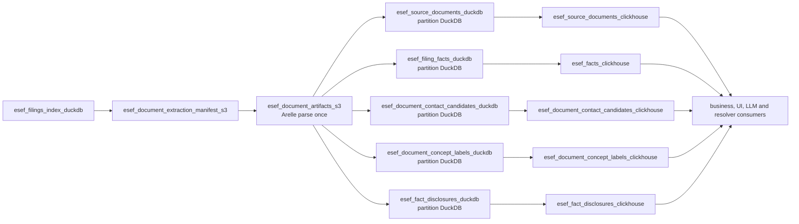

# ESEF parsing storage and ClickHouse migration proposal

**Status:** Shadow v2 implemented; backfill and cutover pending
**Date:** 2026-08-24
**Scope:** Deterministic outputs downstream of `esef_document_artifacts_s3`

## 1. Decision summary

Keep `esef_document_artifacts_s3` as the only Arelle parsing boundary and the
canonical, schema-versioned checkpoint. Fan that artifact out into five independent,
processed-week assets:

1. source documents;
2. XBRL facts;
3. contact candidates;
4. taxonomy labels; and
5. narrative disclosures.

Each asset owns its own DuckDB file for each processed-week partition. Each DuckDB
asset has one corresponding ClickHouse asset. Business and enrichment consumers depend
only on the ClickHouse assets; S3 remains the replay and audit boundary.

The migration is a rebuild from immutable S3 artifacts, not an in-place DuckDB data
migration. Production Dagster asset keys and ClickHouse table names remain stable at
cutover.

## 2. Goals

- Parse every ESEF package with Arelle once.
- Allow the five normalized outputs to materialize independently and concurrently.
- Remove cross-output DuckDB locking and retry coupling.
- Preserve document-level provenance, including filings that produce no facts.
- Make every ClickHouse table an independent Dagster asset with independent retries.
- Make processed-week ownership explicit in DuckDB and ClickHouse.
- Keep downstream consumers on stable `corpscout.esef_*` table names.
- Make backfills and reruns idempotent at processed-week granularity.
- Keep a rollback path until at least two successful scheduled refreshes have completed.

## 3. Non-goals

- Do not redesign `esef_document_artifacts_s3` or reimplement Arelle parsing.
- Do not change XBRL fact semantics, concept mapping, financial-metric selection, or
  currency conversion.
- Do not redesign the upstream filings index, reconciliation, manifest, or entity map in
  this migration.
- Do not move LLM company-information extraction into the deterministic parsing path.
- Do not rename production asset keys or production ClickHouse tables.
- Do not introduce dbt, a generic repository layer, or a new storage interface.

## 4. Target asset graph



The five DuckDB assets have no dependencies on one another. In particular,
`esef_fact_disclosures_duckdb` reads raw text facts and document identity directly from
the schema-versioned S3 artifact/result. It does not wait for, or join through,
`esef_filing_facts_duckdb` and `esef_source_documents_duckdb`.

## 5. Durable data contracts

### 5.1 Source document is the parent record

`esef_source_documents` remains a first-class table. It is the parent catalog for the
four extracted child datasets and preserves:

- `source_document_id` / `fxo_id`;
- company, LEI, country, and reporting-period identity;
- source URLs, package SHA-256, and S3 object keys;
- parser and artifact schema versions;
- archive/extraction status and validation counts; and
- documents that were selected but produced zero facts.

Removing this dataset would make zero-fact failures invisible and would force package
and parser provenance to be duplicated across every child row.

### 5.2 Stable row keys

The existing stable keys remain authoritative:

| Dataset | Stable row key |
|---|---|
| source documents | `source_document_id` |
| facts | `(fxo_id, fact_id)` |
| contact candidates | `candidate_id` |
| concept labels | `label_id` |
| disclosures | `disclosure_id` |

Every child row continues to carry `source_document_id` or `fxo_id`, plus the existing
package/document provenance fields required by its table contract.

### 5.3 Processed-week column

Add a non-nullable `processed_week Date` column to all five target DuckDB and ClickHouse
tables. The value comes from `context.partition_key`, not from fiscal `period_end`.

This column is required to prove that a partition DuckDB contains only the partition it
claims to contain and to support atomic ClickHouse `REPLACE PARTITION` publication.

### 5.4 Artifact compatibility

Every normalized asset validates:

- artifact/result schema version;
- `processed_week == context.partition_key`;
- package SHA-256 and parsed artifact object key;
- source-document membership for the partition; and
- its expected row count before publishing a completed DuckDB file.

An unsupported artifact version fails loudly. It must never silently emit an empty
table.

## 6. DuckDB storage design

### 6.1 One file per dataset per processed week

Use `defs/common/partition_duckdb.py` and the following target layout:

```text
data/esef_source_documents/duckdb/partition_key=<week>/data.duckdb
data/esef_filing_facts/duckdb/partition_key=<week>/data.duckdb
data/esef_document_contact_candidates/duckdb/partition_key=<week>/data.duckdb
data/esef_document_concept_labels/duckdb/partition_key=<week>/data.duckdb
data/esef_fact_disclosures/duckdb/partition_key=<week>/data.duckdb
```

Do not create one cumulative file for these partitioned assets. A ClickHouse exporter
must open the file derived from the same `context.partition_key` it is replacing.

The upstream cumulative `data/esef_filings_source.duckdb` stays in place during this
migration for the filing index, reconciliation, and explicitly out-of-scope enrichment
state. The five deterministic parsing tables stop using it.

### 6.2 One owner table per file

Each file contains:

- one production data table; and
- one internal `_partition_status` row recording `processed_week`, artifact/result key,
  artifact schema version, source-document count, expected row count, actual row count,
  source run ID, completion timestamp, and `complete=true`.

The ClickHouse exporter refuses to read a file without a complete, matching status row.
This makes an intentionally empty child dataset distinguishable from a partial or failed
write.

### 6.3 Atomic writes and bulk loading

For each materialization:

1. stream the relevant S3 artifact rows;
2. spool bounded Arrow/Parquet batches outside DuckDB;
3. build and validate a temporary DuckDB file;
4. write `_partition_status` only after validation succeeds;
5. close the connection; and
6. atomically replace the target partition file.

Do not use production `executemany` row loading. Use typed Arrow/Parquet plus DuckDB
`INSERT ... SELECT`/`COPY` so facts and wide text rows stay bounded and set-based.

Do not introduce dlt for this projection step. Extraction already completed at the
immutable artifact boundary, and these assets are deterministic file-to-table
projections. Adding dlt state here would not own an external ingest boundary.

### 6.4 Pools and concurrency

Use one pool per physical storage family, with the corresponding DuckDB writer and
ClickHouse reader sharing that pool:

```text
esef_source_documents_duckdb
esef_filing_facts_duckdb
esef_document_contact_candidates_duckdb
esef_document_concept_labels_duckdb
esef_fact_disclosures_duckdb
```

Each pool remains limit 1. This serializes writes/reads of one dataset while allowing the
five independent datasets to run concurrently. The existing `esef_arelle` pool continues
to bound package parsing. Disclosure XHTML parsing uses its asset's bounded
`parse_workers` configuration before opening the temporary DuckDB writer.

This is a documented deviation from using one pool for an entire source: the five chains
never open the same DuckDB file, and separate pools are the mechanism that permits the
agreed fan-out parallelism without weakening file-lock safety.

## 7. Asset changes

### 7.1 Split the DuckDB multi-asset

Replace the current non-subsettable `esef_document_extraction_duckdb` multi-asset with
three standalone assets while preserving its output asset keys:

- `esef_source_documents_duckdb`;
- `esef_document_contact_candidates_duckdb`; and
- `esef_document_concept_labels_duckdb`.

Keep `esef_filing_facts_duckdb` as a standalone asset but move its writes to its own
partition file.

Change `esef_fact_disclosures_duckdb` to consume `esef_document_artifacts_s3` directly.
It selects non-empty text facts, applies the existing deterministic disclosure parser in
bounded workers, and writes the disclosure partition file only after parsing completes.

### 7.2 Remove intermediate disclosure coordination assets

After parity is proven, remove from the core graph:

- `esef_fact_disclosure_inputs_s3`; and
- `esef_fact_disclosure_artifacts_s3`.

Their current responsibility moves into the independent disclosure projection. Existing
S3 objects are retained under the object-store lifecycle policy; the migration does not
delete historical objects.

### 7.3 Preserve production asset keys

The final production keys remain:

```text
esef_source_documents_duckdb
esef_filing_facts_duckdb
esef_document_contact_candidates_duckdb
esef_document_concept_labels_duckdb
esef_fact_disclosures_duckdb

esef_source_documents_clickhouse
esef_facts_clickhouse
esef_document_contact_candidates_clickhouse
esef_document_concept_labels_clickhouse
esef_fact_disclosures_clickhouse
```

Temporary `_v2` asset keys are allowed only during shadow backfill. They are removed at
cutover so consumers and operators see one durable asset per table.

## 8. ClickHouse design

### 8.1 One Dagster asset per table

Replace the current non-subsettable document-information ClickHouse multi-asset with four
standalone assets. Keep the existing standalone facts exporter. Each exporter:

1. depends only on its matching DuckDB asset;
2. uses the same processed-week partitions definition;
3. opens only that partition's DuckDB file;
4. verifies `_partition_status` and `processed_week` isolation;
5. loads a migration-owned ClickHouse stage table; and
6. atomically replaces exactly that processed-week partition.

The stage must contain either zero rows or rows for exactly one `processed_week`, and that
week must equal `context.partition_key`. The target partition is never derived from data
found in an unrelated file.

### 8.2 Migration-owned v2 tables

A forward ClickHouse migration creates shadow v2 tables with the current production
columns plus `processed_week Date`, using:

```text
PARTITION BY processed_week
```

The existing ordering keys and field semantics stay unchanged. The proposed shadow
tables are:

```text
corpscout.esef_source_documents_v2
corpscout.esef_facts_v2
corpscout.esef_document_contact_candidates_v2
corpscout.esef_document_concept_labels_v2
corpscout.esef_fact_disclosures_v2
```

The migration owns the full DDL and is registered in `EXPECTED_MIGRATIONS`. Python only
asserts table existence and supplies rows in the migration's exact column order.

### 8.3 Empty partition rules

- A missing DuckDB file or incomplete `_partition_status` is always an error.
- An empty source-document partition is accepted only when the upstream artifact result
  explicitly selected zero documents.
- Empty contact, label, or disclosure partitions are valid when their completed status
  row reports an expected count of zero.
- Facts must match the expected aggregate fact count for the selected source documents;
  an unexplained zero fails before ClickHouse publication.
- Replacing a populated ClickHouse partition with an expected zero-row result requires
  the completed status row; no generic `allow_empty=True` default is introduced.

### 8.4 Downstream dependency changes

Unpartitioned consumers use `AllPartitionMapping` when depending on the new partitioned
ClickHouse assets. This includes at least:

- `esef_financial_metrics_clickhouse` from `esef_facts_clickhouse`;
- concept-label translation assets from
  `esef_document_concept_labels_clickhouse`;
- source-record/document-observation assets from
  `esef_source_documents_clickhouse`; and
- manual LLM enrichment selection from `esef_source_documents_clickhouse`.

Business SQL continues to query the stable `corpscout.esef_*` tables.

## 9. Migration phases

### Phase 0 — baseline and safety preparation

1. Keep the production schedule stopped during controlled migration runs.
2. Cancel in-flight ESEF backfills before changing definitions or partition mappings.
3. Record the current asset graph with `uv run dg list defs --json`.
4. Capture per-processed-week and global row counts for all five production tables.
5. Capture deterministic row digests ordered by each table's stable key.
6. Inventory materialized `esef_document_artifacts_s3` partitions and supported artifact
   schema versions.
7. Identify any non-Dagster consumers of legacy OIM facts JSON or rendered XHTML before
   retiring or rescheduling those archive assets.

**Exit gate:** Baseline counts/digests and an S3 artifact coverage report are stored with
the migration runbook.

### Phase 1 — contracts and tests first

1. Add `processed_week` to the five Python/DuckDB/ClickHouse column contracts.
2. Add focused streaming readers that project one output family from the existing
   artifact/result without loading the whole weekly result into memory.
3. Add per-partition path and `_partition_status` tests.
4. Add tests proving each projection writes only its requested week.
5. Add a test proving all five DuckDB assets depend directly on
   `esef_document_artifacts_s3` and not on one another.
6. Add a test forbidding a non-subsettable multi-asset for these table outputs.

**Exit gate:** Tests fail against the old implementation for the intended reasons; no
production asset key or table has changed yet.

### Phase 2 — shadow DuckDB fan-out

1. Implement temporary `_v2` projection assets that write the target per-partition
   files.
2. Reuse the current fact, document, candidate, label, and disclosure row builders; do
   not fork business semantics during the storage migration.
3. Materialize a representative corpus before the full backfill:
   - a multilingual package;
   - an extension-taxonomy package;
   - one package shared by multiple source document IDs;
   - a filing with validation warnings/errors;
   - a document with zero candidates; and
   - an empty processed week.
4. Materialize the five shadow assets concurrently and confirm there are no DuckDB file
   lock collisions.
5. Rerun the same partitions and verify identical row digests.

**Exit gate:** Representative partitions match the old tables exactly, except for the
new `processed_week` column and approved deterministic disclosure-parser differences.

### Phase 3 — shadow ClickHouse tables and exporters

1. Add the forward migration that creates the five `*_v2` ClickHouse tables.
2. Add one temporary `_v2` ClickHouse asset per table.
3. Implement validated, partition-scoped stage-and-replace publication.
4. Add migration/column-order contract tests.
5. Add tests proving a mismatched or missing partition file cannot replace a ClickHouse
   partition.
6. Add tests for intentional empty child partitions and unexplained empty facts/documents.

**Exit gate:** Representative shadow ClickHouse partitions match their DuckDB sources
and leave production tables untouched.

### Phase 4 — full shadow backfill and parity

1. Backfill every processed week for which the canonical S3 artifacts exist.
2. Materialize missing artifact partitions first; existing artifacts must be reused.
   Do not download/reparse packages whose content-addressed artifact already exists.
3. Backfill the five shadow ClickHouse assets from their matching partition files.
4. Compare old and v2 tables per processed week and globally.
5. Investigate every mismatch; do not normalize mismatches away with permissive
   tolerances.
6. Run orphan and completeness checks across the shadow ClickHouse tables.

**Exit gate:** All required parity checks pass, all expected partitions are present, and
no unexplained orphan or count mismatch remains.

### Phase 5 — production cutover

1. Stop the ESEF schedule and cancel/finish all in-flight ESEF runs and backfills.
2. Materialize any processed weeks that arrived after the shadow baseline.
3. Re-run parity checks and record the final counts/digests.
4. Apply a second forward migration that preserves the old tables as `*_legacy` and
   promotes the validated v2 tables to the stable production names.
5. Deploy definitions in which the stable Dagster asset keys point to the new
   per-partition DuckDB and ClickHouse implementations.
6. Update jobs and partition mappings. The weekly job may publish the five ClickHouse
   partitions directly; a backfill job remains multi-run and throttled.
7. Run one bounded production partition end to end and execute post-cutover asset checks.
8. Resume the schedule only after the bounded run passes.

**Exit gate:** Stable production asset keys materialize the new storage layout, stable
ClickHouse names serve the v2 data, and downstream checks pass.

### Phase 6 — observation and cleanup

1. Keep the old shared DuckDB tables, legacy ClickHouse tables, and old code path for at
   least two successful scheduled refreshes or 30 days, whichever is longer.
2. After the retention gate, remove:
   - the old `esef_document_extraction_duckdb` multi-asset;
   - the old combined document ClickHouse multi-asset;
   - the disclosure input/artifact coordination assets;
   - obsolete shared-file fact/document/contact/label/disclosure writers; and
   - temporary `_v2` Dagster asset keys.
3. Stop selecting `esef_report_xhtml_s3` in the core parsing job. Keep it only in a
   separately named archive/search-corpus job if a real consumer exists.
4. Retire `esef_filing_facts_json_s3` only after confirming it has no external or manual
   comparison consumer. It is not an input to the production Arelle fact path.
5. Retain old S3 objects under lifecycle policy; do not perform a bulk destructive delete
   as part of cutover.
6. Update `esef_filings-design.md` from as-built v1 to the final v2 architecture.

**Exit gate:** `uv run dg list defs --json` contains no obsolete coordination assets,
tests contain no stale pool/shared-file assumptions, and the legacy tables have an
explicit operator-approved retirement record.

## 10. Validation and asset checks

### 10.1 Per-partition checks

| Check | Required result |
|---|---|
| DuckDB file path partition | equals `context.partition_key` |
| distinct `processed_week` values | zero for an expected-empty table, otherwise exactly one matching week |
| `_partition_status.complete` | `true` |
| `_partition_status.actual_row_count` | equals table row count |
| source-document count | equals artifact result document count |
| fact count | equals the artifact quality fact total expanded to source documents |
| candidate count | equals artifact result candidate count |
| concept-label count | equals artifact result label count |
| disclosure count | equals eligible non-empty text-fact count after deterministic parser rules |
| duplicate stable keys | zero |

### 10.2 Cross-table ClickHouse checks

- Every fact `fxo_id` has a matching source document.
- Every candidate, label, and disclosure `source_document_id` has a matching source
  document.
- Every child row's `processed_week` matches its parent document.
- Source documents with `extraction_status='not_parsed'` remain present even when they
  have no facts.
- Source-document fact/text/numeric counts agree with the fact table.
- Package SHA-256 and artifact schema/parser versions agree across parent and child rows.
- Production and shadow row digests match by stable key before cutover.

### 10.3 Operational metadata

Every materialization reports at least:

- processed week and target path/table;
- selected source-document and unique-package counts;
- expected and written row counts;
- S3 artifacts read/reused;
- bytes read and written;
- parse/project/load durations;
- parser/schema versions; and
- validation warning/error counts where applicable.

## 11. Test and verification plan

Update or add focused tests in:

- `tests/test_esef_ixbrl_segments.py`;
- `tests/test_esef_filings_assets.py`;
- `tests/test_esef_fact_disclosures.py`;
- `tests/test_esef_filings_client.py`;
- `tests/test_esef_enrichment_orchestration.py`;
- `tests/test_clickhouse_migrations.py`; and
- a new focused partition-storage/export test module if that is clearer than extending
  the existing large files.

Required coverage:

- target Dagster dependency graph and standalone asset definitions;
- one file per dataset per partition;
- atomic replacement and failure cleanup;
- typed bulk loading rather than `executemany`;
- deterministic reruns;
- artifact schema mismatch failure;
- duplicate-package expansion to multiple source documents;
- empty and zero-fact documents;
- disclosure parsing directly from artifacts;
- partition-isolated ClickHouse replacement;
- migration DDL and column-order contracts;
- downstream `AllPartitionMapping` edges; and
- absence of obsolete assets after cleanup.

Verification commands from `corpscout/services/dagster_v3`:

```bash
uv run pytest -v tests/test_esef_ixbrl_segments.py \
  tests/test_esef_filings_assets.py \
  tests/test_esef_fact_disclosures.py \
  tests/test_esef_filings_client.py \
  tests/test_esef_enrichment_orchestration.py \
  tests/test_clickhouse_migrations.py
uv run dg check defs
uv run dg list defs --json
```

Run the repository's DuckDB bulk-loading contract test as part of the implementation
change as well.

## 12. Rollback

### Before production cutover

Delete or ignore shadow materializations and continue running the old graph. Production
tables and asset keys are unchanged.

### After production cutover

1. Stop the ESEF schedule and cancel in-flight ESEF runs.
2. Apply a forward repair migration that exchanges the stable tables back to the retained
   `*_legacy` tables. Do not rewind the migration ledger.
3. Deploy the previously retained definitions that use the shared DuckDB implementation.
4. Resume only after the old bounded validation run passes.

A failure in one new projection before its ClickHouse replacement leaves that table's
existing partition untouched. It does not require rolling back the other four outputs.

## 13. Expected code areas

| Area | Planned change |
|---|---|
| `segment_assets.py` | keep artifact boundary; split document/contact/label projections or expose their existing row builders to standalone assets |
| `assets.py` | move facts to partition DuckDB; update jobs and downstream partition mappings; keep upstream index behavior out of scope |
| `disclosure_assets.py` | read artifacts directly and write the dedicated disclosure partition file; remove the two coordination stages after parity |
| `tables.py` | add `processed_week` and explicit target table contracts |
| `publish.py` | change facts export from cumulative full replace to validated processed-week replacement |
| `document_publish.py` | split the combined exporter into standalone table exporters |
| `defs/common/partition_duckdb.py` | clarify that validated date keys support weekly as well as monthly partitions if no code change is otherwise required |
| ClickHouse migrations | create v2 partitioned tables, then perform a separate forward cutover/legacy-preservation migration |
| ESEF tests | graph, storage, parity, empty-result, partition-isolation, and migration contracts |
| `esef_filings-design.md` | document final as-built design after cutover |

## 14. Acceptance criteria

The migration is complete when:

1. one Arelle artifact materialization fans out to five independent DuckDB assets;
2. the five assets can execute concurrently without sharing a DuckDB file or lock pool;
3. each processed week has one completed file per dataset;
4. each ClickHouse table is represented by its own independently retriable asset;
5. rerunning a week replaces only that week and produces identical row digests;
6. downstream business/enrichment assets depend on ClickHouse, not local DuckDB parsing
   tables;
7. source-document provenance and zero-fact documents remain queryable;
8. all parity, orphan, completeness, migration, and Dagster-definition checks pass; and
9. the old path remains recoverable for the agreed retention window before cleanup.
