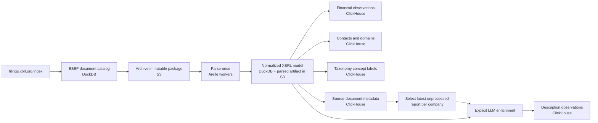

# ESEF filings design doc

> Per `docs/source-design-doc-template.md` / `docs/data-source-guidelines.md`. As-built
> (2026-07-20). Supersedes `docs/esef-filings-research.md`, which now points here.

## 1. Source overview

- **Source / scope**: filings.xbrl.org (XBRL International's public repository) is the
  canonical source for cross-country ESEF filings, facts, source documents, and
  company-information extraction. Duplicate copies embedded in Bolagsverket annual-
  report archives are not processed by the ESEF flow. This source closes the "listed
  company" blind spot every per-country source shares (0 of 298 Finnish listed companies
  have financials in `fi_financial_statements`; the same gap exists everywhere, since
  listed issuers file ESEF to national OAMs, not to company registers).
- **Module**: `defs/esef_filings/` · DuckDB `data/esef_filings_source.duckdb` (dataset
  `esef_filings`) · pool `esef_filings_duckdb`.
- **ClickHouse financial tables** (migration `000149_corpscout_esef_filings`):
  `corpscout.esef_filings`, `corpscout.esef_facts`, `corpscout.esef_financial_metrics`,
  `corpscout.esef_entity_registry_map`.
- **ClickHouse source-document tables** (migration
  `000243_corpscout_esef_source_documents`): `corpscout.esef_source_documents`,
  `corpscout.esef_document_contact_candidates`, and
  `corpscout.esef_document_company_information`. Migration
  `000246_corpscout_esef_document_concept_labels` adds the document-scoped
  taxonomy-label projection used by the UI.
- **Datasets used**:

  | dataset | url | format | size | cadence | auth? |
  |---|---|---|---|---|---|
  | filing index | `https://filings.xbrl.org/api/filings` | JSON:API, paginated (`page[size]=200`) | `meta.count` = 25,061 filings (2026-07-19 snapshot; FI = 1,168) | rolling (new filings added continuously) | none |
  | legacy per-filing facts | `json_url` (per filing, from the index) | OIM xBRL-JSON | varies/filing | registered comparison/fallback archive; not selected by routine jobs | none |
  | per-filing rendered report | `report_url` (per filing) | XHTML | ~2-8 MB/filing | fetched once, S3-cached | none |
| per-filing report package | `package_url` (per filing) | ESEF report-package ZIP containing iXBRL and taxonomy | varies/filing | processed-week extraction, fetched once by SHA-256 | none |

- **Entity key**: **LEI** (`lei`) everywhere in `esef_*` tables — national registry ids
  appear only in the match layer (`esef_entity_registry_map`), never as an ingestion
  filter. **`fxo_id`** is the filing-*version* key (see §9.3) — every table's `ORDER BY`
  includes it for exactly that reason.

## 2. Ingest mode — source-processed weekly increments + reconciliation

### Refactor target



The immutable package is archived before parsing. The parsed artifact is the
single deterministic contract: facts, taxonomy labels, contacts, disclosures,
and financial observations derive from it. The production
`esef_filing_facts_duckdb` asset was cut over to schema-v4 Arelle artifacts while
retaining its asset key and DuckDB/ClickHouse table contracts. The historical OIM
JSON archive remains registered for explicit comparison or fallback, but routine
refresh and backfill jobs do not select it. Arelle-to-OIM validation completed on
2026-08-04 across five multilingual,
multi-country packages: all 4,582 facts matched semantically and at the current
storage-value contract, and all standardized metric snapshots matched. Exact
lexical differences were limited to equivalent integral decimal spellings and
OIM-generated IDs for source facts without XHTML IDs. The detailed corpus table
and validator contract are in `docs/esef-ixbrl-segment-parser.md`.

- **Shared partition clock**: ingestion and deterministic document-evidence assets use
  `ESEF_PROCESSED_WEEK_PARTITIONS`, a UTC `TimeWindowPartitionsDefinition` with Sunday
  boundaries starting at `2023-01-01`. The key is the beginning of the source
  `processed` week, which describes when a filing version became available. It is
  deliberately independent of fiscal `period_end`: a 2021 report first processed on
  2026-07-22 belongs to the `2026-07-19` partition.
- **Index** (`esef_filings_index_duckdb`): fetches only its processed-time window through
  the API's JSON filter, ordered by `(processed, fxo_id)`, then upserts the cumulative
  DuckDB index by stable filing-version key `fxo_id`. An empty weekly window is valid and
  does not erase earlier weeks.
- **Facts + report-XHTML archive** (`esef_filing_facts_duckdb`,
  `esef_report_xhtml_s3`): the facts asset consumes the processed-week result from
  `esef_document_artifacts_s3`, downloads each content-addressed artifact once, and emits
  source-linked rows for every filing version represented by that artifact. Artifact reads
  use bounded threads; JSON normalization and independent Parquet spooling use four worker
  processes; the main process performs filing-scoped, bounded DuckDB inserts. Checkpoints
  include the parser contract (`arelle-artifact-v4`), so legacy OIM checkpoints cannot
  suppress the one-time cutover rewrite. The XHTML archive still reads the processed-week
  index directly and remains skip-existing in object storage. Both use
  `BackfillPolicy.multi_run(max_partitions_per_run=1)`.
- **Reconciliation** (`esef_filings_index_reconciliation_duckdb`): an intentionally
  unpartitioned full API sweep and atomic index replacement, isolated from the weekly
  incremental path. It reports new/removed ids and affected processed months and runs via
  a separate stopped-by-default monthly schedule. Its `affected_processed_months`
  metadata is a reconciliation summary, not an asset partition definition.

## 3. Loading

- **Client**: `EsefFilingsClient` (`client.py`) — `dlt.sources.helpers.requests` session
  (retry/backoff on connection errors and 429/5xx). `iter_filings()` does the whole
  JSON:API trick: entities arrive once per page in `included` (deduplicated by the API),
  each filing references its entity via `relationships.entity.data.id` — joined through a
  page-local `{entity_id: attributes}` map, **never by array position**.
  The legacy/fallback `download_json_facts(json_url, target)` path streams to a local path with a whole-download
  retry loop (mirrors `latvia_ur/resources.py:_download_to_path`: truncates `target`
  before every attempt, verifies `Content-Length` when present, retries
  `ChunkedEncodingError`/`ConnectionError`/`Timeout`). This same method is reused, URL and
  content agnostic, for the report-XHTML archive download in `esef_report_xhtml_s3`.
  Report XHTML is staged in `/tmp`, and each local file is unlinked immediately after its
  S3 upload attempt, so a partition never accumulates all downloaded reports locally.
- **Staging shape**: `esef_filings.filings_index` (one row per `EsefFilingRecord`,
  cumulative upsert by `fxo_id` in the active path) and `esef_filings.facts` (one row per
  parsed Arelle-artifact fact, filing-id-scoped delete+insert per processed-week partition).
  Both
  stage loosely-typed text
  columns (see `assets.py`'s `_FILINGS_INDEX_COLUMN_TYPES` / `_FACTS_COLUMN_TYPES`
  docstrings) — real typing/casting happens at ClickHouse export time (§5).
- No dlt row-resource, no CSV, no DuckDB bulk CSV reader: the source is JSON, not a bulk
  file, so none of `docs/data-source-guidelines.md` §3's CSV-reading guidance applies.
  `amount_original` is staged as **text**, not a DuckDB `DECIMAL` column — the `Decimal`
  value is already validated in Python at parse time (`facts.py`'s
  `EsefFact.amount_original`), and staging as text sidesteps DuckDB `DECIMAL` precision
  pitfalls; the ClickHouse export casts to `Decimal128(2)` explicitly.

## 4. Transform

- No SQL pivot/transform stage in DuckDB. Arelle parses the complete iXBRL report package
  once into a schema-versioned artifact. `facts.py:iter_artifact_facts` projects its
  OIM-shaped dimensions into the existing flat `EsefFact` contract; the same artifact
  supplies deterministic contacts, taxonomy labels, disclosures, and LLM evidence.
- The only real "transform" logic lives in ClickHouse: `esef_financial_metrics` is
  derived entirely from `esef_facts` + `esef_filings` + `exchange_rates` via one
  CTE-chained `SELECT` (`metrics.py`) — see §9 for the selection rules.

## 5. ClickHouse schema — deviations

- **Grain**: `esef_filings` and `esef_financial_metrics` are 1 row per filing *version*
  (`fxo_id`); `esef_facts` is 1 row per fact; `esef_entity_registry_map` is 1 row per LEI.
- **`ORDER BY`**: `esef_filings`/`esef_facts`/`esef_financial_metrics` all key on
  `(lei, period_end, fxo_id[, fact_id])` — `fxo_id` is in the key, not just
  `lei + period_end`, because one `(lei, period_end)` can carry **multiple filing
  versions** (§9.3). `esef_entity_registry_map` keys on
  `(country_iso2, registry_id, lei)`.
- **`period_duration_end Nullable(Date32)`** on `esef_facts` — added to the migration
  *in place* during Task 6 (not part of the original Task 1 DDL), the module's single
  most important correctness decision. See §9.1.
- **Sentinel dates**: `esef_filings.period_end`/`date_added` and `esef_facts.period_end`
  are declared **non-nullable** `Date32` (all three sit in an `ORDER BY`, so they can
  never become `Nullable`). A missing/malformed source date string sentinels to
  `DATE '1970-01-01'` at export time rather than reaching `clickhouse_driver` as Python
  `None` (which crashes the Date32 writer). See §9.2.
- Non-nullable `String` columns (`json_url`, `package_url`, `report_url`, `viewer_url`,
  `package_sha256`) coalesce `NULL → ''` at export time (CLAUDE.md house rule —
  `clickhouse_driver` calls `.encode()` per value and dies on `None`).
- **No `raw_*` / `source_payload_hash` columns at all** — unlike sources that added and
  later dropped them (`latvia_ur`), this module never staged full raw JSON payloads or a
  per-row hash in the first place: `facts.py` parses and validates every field
  (`amount_original` as `Decimal`) before it ever reaches a DuckDB column, so there was
  nothing bulky/incompressible to strip later.
- **Export subset**: `tables.py`'s `*_EXPORT_COLUMNS` tuples, contract-tested against the
  migration file's literal column order
  (`tests/test_esef_filings_client.py::test_export_columns_match_migration_000149_column_order`).

## 6. Translation — N/A

`entity_name`, `country`, `concept_qname` and friends are proper nouns / XBRL taxonomy
identifiers, not translatable free text — and this source carries no legal-form/status
field at all (it's a financial-report index, not a company register). No translation
loader is wired for this module.

## 6b. Source documents and company-information candidates

The filings.xbrl.org index carries no filer contact fields, but some underlying ESEF
report XHTML documents contain tagged contact facts, `mailto:`/`tel:` links, or visible
email, phone, URL, and domain text. The processed-week flow has three stages:
`esef_document_extraction_manifest_s3` snapshots the compact index/company-link worklist
under the single-writer DuckDB pool; `esef_document_artifacts_s3` deduplicates packages by
SHA-256 and parses them with four Arelle worker processes outside that pool; and the
`esef_document_extraction_duckdb` multi-asset performs only the short final publication of
`esef_source_documents`, normalized `esef_document_contact_candidates`, and
document-scoped `esef_document_concept_labels` rows. Website
hosts must resolve to a Public Suffix List eTLD+1; invalid/file-like hosts are rejected,
and legitimate external domains remain explicitly classified candidates.

`source_document_id` is the upstream `fxo_id`. It joins directly to `esef_facts.fxo_id`
and carries the GLEIF-derived `(country_iso2, company_id)` relation, so financial facts,
deterministic contacts, and all later enrichments retain the exact same source document.
Concept-label rows preserve the taxonomy namespace URI, local name, QName,
label role, submitted/report language, English label when present, extension
status, and exact source document. Raw packages and full parsed
fact/concept/segment artifacts remain in content-addressed
S3; the queryable tables retain their object keys and hashes rather than duplicating the
large artifact JSON in ClickHouse.

The paid, unpartitioned `esef_document_company_information_duckdb` asset reads
`corpscout.esef_source_documents FINAL` and ranks reports inside each resolved
`(country_iso2, company_id)`, selecting only the latest parsed XBRL report. Optional
country, company-ID, source-document-ID, and row-limit filters bound manual runs; a
source-document filter is applied after latest-report ranking. The asset skips a report
when the same parsed artifact already has output for the active model and prompt unless
refresh is explicitly requested.

Only selected narrative evidence is sent to DeepSeek to extract a company description,
people/roles, products/services, customer markets, operating geographies, business
segments, and material group relationships. The exact canonical API request is hashed
and written to a content-addressed S3 object before the call. The complete result
artifact is keyed by both package and request hashes. DuckDB retains the parsed
observations, request key/hash, and exact response text/hash against the specific
`source_document_id`.

The asset is never included in a routine refresh or backfill. A separate
`esef_document_company_information_clickhouse` asset publishes its cumulative DuckDB
rows, while `esef_document_observations_clickhouse` publishes normalized child rows for
descriptions, people, products and markets, geographies, segments, and group
relationships. The routine `esef_document_information_clickhouse` multi-asset remains
independent and publishes only deterministic document/contact/taxonomy/disclosure
tables. None of these assets updates a canonical company field; cross-source preferences
belong to a later resolver/UI layer.

## 7. Currency

- Native currency is preserved end-to-end: every fact carries `amount_original` +
  `currency` (the artifact's OIM-shaped `iso4217:<CCY>` unit), and `esef_facts` is never converted — only
  the derived `esef_financial_metrics` layer carries `_usd` columns.
- Unlike most sources, USD conversion is **not** a separate asset/pass over a DuckDB
  table — it's inlined directly into `metrics.py`'s single ClickHouse `SELECT`, because
  the metrics table has no DuckDB staging step to attach a second pass to (it's built
  entirely from already-exported ClickHouse tables). The *principle* (USD conversion is
  logically separate from native-currency ingestion) still holds; only the *mechanism*
  differs from the norm.
- Triangulates through `corpscout.exchange_rates` (EUR-based), generalizing
  `sweden_financial/metrics.py`'s nearest-date `argMaxIf`/`argMinIf` fallback from a fixed
  SEK/USD pair to an arbitrary filing currency: resolve the nearest EUR→USD rate and
  (unless the filing's currency IS EUR) the nearest EUR→`<currency>` rate around
  `period_end`, then `fx_rate_to_usd = eur_usd_rate / eur_ccy_rate`. EUR filings skip the
  second leg entirely (ratio reduces to `eur_usd_rate`); USD filings resolve both legs to
  the same EUR→USD lookup (ratio 1.0) with no special case. Facts span
  EUR/SEK/NOK/GBP/CHF/DKK/... per filer.

## 8. Jobs & schedules

| job | selection | partitioned? |
|---|---|---|
| `esef_filings_refresh_job` | weekly index, facts, XHTML, deterministic document/contact/disclosure evidence, then all cumulative ClickHouse/derived assets | yes — `ESEF_PROCESSED_WEEK_PARTITIONS`; downstream unpartitioned assets rebuild from cumulative DuckDB state |
| `esef_filings_backfill_job` | weekly ingestion and deterministic document/contact/disclosure evidence | yes — same processed-week definition; cumulative ClickHouse exports excluded |
| `esef_filings_reconciliation_job` | full-sweep reconciliation index only | no |
| `esef_document_company_information_job` | latest unprocessed final-ClickHouse XBRL per resolved company, optionally bounded by country/company/document/limit | no — explicit paid job only |

`esef_filings_refresh_weekly` runs at `10 5 * * 0`, timezone `Europe/Belgrade`, and is
stopped by default. Its resolver uses the source's UTC clock and emits exactly the last
fully closed Sunday-to-Sunday UTC week. A tick on 2026-07-26 therefore materializes
partition `2026-07-19`; the currently open week is never scheduled.

`esef_filings_reconciliation_monthly` runs at `25 5 2 * *`, timezone
`Europe/Belgrade`, and is also stopped by default. Keeping reconciliation in a separate
job prevents a full sweep from being an accidental prerequisite of every weekly refresh.

All weekly ingestion and deterministic-evidence assets share one partitions definition.
Each document still retains its own fiscal year and reporting period as data. The
ClickHouse exports remain
unpartitioned and full-replace from the cumulative local tables, so a weekly run exports
all weeks materialized so far, including the just-upserted week. Backfills exclude
exports; run the refresh job or individual exports once after the weekly ingest backfill
finishes.

## 9. Correctness decisions

### 9.1 `period_duration_end` anchor — the module's key correctness decision

`facts.py` stamps every fact row's `period_end` column with the **filing's own**
`period_end` (threaded through from the filing record), regardless of the fact's real OIM
period — this is necessary for joining, but means a prior-year **comparative** duration
fact (IFRS annual reports always carry last year's Revenue/ProfitLoss/... alongside this
year's) is *not* distinguishable from the current-year fact by `period_end` alone: both
would pass a `facts.period_end = filing.period_end` filter. This was Task 6's Finding 1
(Critical): the comparative fact could silently win the metrics tiebreak
(`argMaxIf(..., (decimals, fact_id))`), corrupting `revenue`/`operating_profit`/
`profit_loss` in `esef_financial_metrics`.

**Fix**: migration 000149 (amended in place — confirmed not yet applied anywhere, ledger
still at 148, so no backfill/re-migrate ordering hazard) adds
`period_duration_end Nullable(Date32)` to `corpscout.esef_facts`, immediately after
`period_instant`. `facts.py`'s `_split_period` now returns
`(period_start, period_instant, period_duration_end)`: for a duration period
(`"2022-01-01T00:00:00/2023-01-01T00:00:00"`), `period_duration_end` carries the fact's
own **true end date** (the second half of the OIM period string) — distinct from the
filing-level `period_end` stamped identically onto every fact.

**Finding C1 (Critical, found in final whole-branch review): the OIM end-of-day date
convention.** xBRL-JSON (OIM) canonicalizes an XBRL 2.1 "end of day" period boundary — an
instant, or a duration's end — to **midnight of the day AFTER** the intended calendar day.
A FY2022 filing (`period_end` = `2022-12-31`) therefore carries its *current* Assets
instant as `"period": "2023-01-01T00:00:00"`, and its *current* Revenue duration as
`"2022-01-01T00:00:00/2023-01-01T00:00:00"` — both one calendar day past the date a human
(and `filing.period_end`) would name. Before this fix, `_split_period` took the raw date
part with no adjustment, so `period_instant`/`period_duration_end` for a *current-period*
fact never equaled `filing.period_end` at all: `metrics.py`'s anchor matched nothing, every
`esef_financial_metrics` row got all-NULL amounts, and — because the row count still
equaled the filing count — no existing guard (refuse-on-empty, the shrink guard) ever
fired. See the real captured fixture, `tests/fixtures/esef_filings/facts_sample.json`, for
both shapes.

**Fix** (two sides, same finding):

1. **Parser** (`facts.py`'s `_split_period`/`_end_of_day_date_part`): `period_instant` and
   `period_duration_end` are both "end of day" values, so both go through
   `_end_of_day_date_part`, which subtracts one day off a midnight timestamp
   (`"2023-01-01T00:00:00"` → `"2022-12-31"`) to recover the human-conventional calendar
   date. `period_start` needs no such adjustment — a period's start is already midnight of
   its own first day (start-of-day semantics, not end-of-day), so it stays on the plain
   `_date_part`. A non-midnight time (shouldn't occur for an OIM period boundary) is kept
   as-is rather than guessed at.
2. **Metrics anchor** (`metrics.py`'s `current_facts` CTE): now tolerant of a
   non-canonical source, not just the parser's own exact output:

```sql
(facts.period_instant IS NOT NULL AND facts.period_instant IN (filing.period_end, addDays(filing.period_end, -1)))
OR (facts.period_instant IS NULL AND facts.period_duration_end IN (filing.period_end, addDays(filing.period_end, -1)))
```

   The **exact** match is the canonical case — once parsed by the fixed `facts.py`, a
   current-period fact's date already equals `filing.period_end`. The **`-1 day` branch**
   is tolerance for facts staged before this normalization existed (or any future fact
   source storing the raw, un-adjusted OIM value) — a structural guarantee, not a
   heuristic weakener: comparatives sit a full year (365/366 days) away from
   `filing.period_end`, never one day away, so widening the anchor by a single day can
   never admit a comparative into `current_facts`.

This **structurally** excludes a prior-year comparative duration fact (same stamped
`period_end`, earlier true `period_duration_end`) before the `(decimals, fact_id)`
tiebreak ever sees it — exactly like the instant-fact branch already excluded a
non-matching instant. It is a structural guarantee, not a heuristic: IFRS annual reports
are guaranteed to carry undimensioned prior-year comparatives, so this anchor is load-
bearing for metrics correctness, not an edge case. Verified with an EXECUTED (not just
SQL-text) DuckDB test —
`tests/test_esef_filings_metrics.py::test_current_period_anchor_matches_current_year_excludes_prior_year_comparative`
— that loads the real fixture through `parse_oim_facts`, stages the rows, and evaluates
the DuckDB translation of the anchor predicate.

### 9.2 Sentinel dates (`1970-01-01`)

`esef_filings.period_end`/`date_added` and `esef_facts.period_end` are non-nullable
`Date32` (all three sit in an `ORDER BY`). A missing or malformed source date string
(`try_cast(... as date)` would `NULL`) is coalesced to `DATE '1970-01-01'` at export time
instead of reaching `clickhouse_driver` as Python `None` (which crashes the Date32
writer — confirmed via a direct DuckDB check:
`try_cast('2022-99-99' as date) → NULL`, `coalesce(try_cast(NULL as date), DATE
'1970-01-01') → 1970-01-01`). `esef_financial_metrics` **excludes sentinel filings
entirely** (`WHERE period_end != toDate32('1970-01-01')` in `filings_in_scope`) — "no
meaningful fiscal year" filings never contaminate metrics — and returns the excluded
count as `excluded_sentinel_period_end_count` materialization metadata so the gap is
queryable, never silent. Genuinely `Nullable` columns
(`processed_at`, `period_start`/`period_instant`/`period_duration_end` on facts) are left
plain `try_cast` — `NULL` there is semantically meaningful ("this fact has no duration
end date"), not an error to sentinel away.

### 9.3 `fxo_id` versioning

Verified live against the real API: amendments to a filing arrive as a **new filing**
under a **new `fxo_id`** (suffix `-0`, `-1`, ...) rather than mutating the original — so
one `(lei, period_end)` can carry multiple filing *versions* simultaneously in the index.
Every `esef_*` table's `ORDER BY` includes `fxo_id` for exactly this reason (not just
`lei, period_end`), and `esef_financial_metrics` deliberately does **not** dedup down to
one row per `(lei, period_end)` — each version gets its own metrics row; consumers that
want only the latest version should **prefer the highest `fxo_id` suffix themselves**
(no "latest" flag is derived in v1). Facts join by `fxo_id` too, so a given metrics row's
facts are already scoped to exactly that filing version — no cross-version contamination
even without a dedup step. Because `fxo_id` is version-stable upstream, S3 object keys
for both the facts-JSON cache and the report-XHTML archive are keyed by `fxo_id`
(`esef_filings/fact_json/fxo_id=<fxo_id>/facts.json`,
`esef_filings/report_xhtml/fxo_id=<fxo_id>/report.xhtml`) and are therefore
**version-stable and skip-existing safe**: an existing object is guaranteed to be the
same bytes the filing would produce again, so no amendment can silently serve stale
cached content under a shared key.

### 9.4 Entity map matching

`esef_entity_registry_map` is built entirely in ClickHouse from
`corpscout.gleif_lei_records` (`registered_as` + `primary_country_iso2`), scoped to LEIs
that actually appear in `corpscout.esef_filings` (this map is ESEF-driven, not a general
LEI→registry-id table). `match_source = 'gleif_registered_as'` on every row. Normalizers
(v1, extend as backoffice consumers appear):

- **FI**: lowercase, strip spaces; 8 bare digits → `NNNNNNN-N` (insert a dash before the
  last digit); already-dashed FI ids pass through unchanged.
- **SE**: digits only (10-digit org numbers expected, not enforced).
- **all other countries**: trimmed raw passthrough.

Some filings carry a **non-LEI national id** in the `lei` field by construction of the
source (e.g. Ukrainian filers using an EDRPOU code) — these simply never match a
`gleif_lei_records` row and are **kept unmatched by design**, not raised as an error; the
scope is "match what can be matched," never "filter ingestion to what's matchable."
`ORDER BY lei, resolved_at DESC` + `LIMIT 1 BY lei` guards against un-merged
`ReplacingMergeTree` duplicates in `gleif_lei_records`, even though that table is already
one-row-per-lei post-merge.

### 9.5 `scope = 'consolidated_ifrs'` — why ESEF never feeds `company_financials_latest` in v1

Every row `metrics.py`'s `native_metrics` CTE produces is stamped a literal, hardcoded
`scope`:

```sql
'consolidated_ifrs' AS scope,
```

This is not a placeholder for a future enum — it's a load-bearing correctness fence.
ESEF filings are **consolidated GROUP IFRS** figures (the parent's group-wide financials,
prepared under IFRS as EU law requires for listed issuers), whereas the per-country
national-register sources this repo otherwise ingests (`finland_ytj`, `norway_brreg`,
`estonia_ar`, `latvia_ur`, ...) report **standalone STATUTORY** financials for the single
legal entity registered in that country, prepared under local GAAP. The same company/year
can legitimately show *different, both-correct* numbers under these two scopes — a
Finnish subsidiary's standalone revenue is not comparable to its Nordic parent group's
consolidated revenue, and conflating the two is a silent, undetectable data-quality bug,
not a rounding difference.

`company_financials_latest` (the cross-source "pick one financials row per company/year"
consumer) **does not read `esef_financial_metrics` in v1**, deliberately (see §10) — the
scope-preference rule (when both a national-register standalone row and an ESEF
consolidated row exist for the same company/year, which should `company_financials_latest`
prefer, and does it ever need to expose both?) has not been agreed yet. Wiring ESEF in
before that decision is made would let a consolidated-group figure silently overwrite or
outrank a standalone statutory figure (or vice versa) with no signal to a consumer that the
number's scope just changed underneath them. `scope='consolidated_ifrs'` on every
`esef_financial_metrics` row is what makes that distinction machine-readable and enforced
at the source, so the eventual `company_financials_latest` integration (or the planned
"Group (IFRS consolidated)" backoffice section, §10) can filter/branch on it explicitly
rather than rediscovering the distinction ad hoc.

### 9.6 Shrink & completeness guards across the ClickHouse exports (and the index crawl)

`replace_esef_financial_metrics_clickhouse` (`metrics.py`) runs **two** separate guards,
at two different points in its stage/insert/exchange sequence:

1. **Refuse-on-empty** — checked BEFORE the stage table is even created: `SELECT count()
   FROM (<scoped SELECT>)`; if 0, raises `ValueError` and the existing table is untouched.
   Same discipline as `publish.replace_esef_entity_registry_map_clickhouse`'s refuse-on-
   empty check and the shared DuckDB exporters' `allow_empty` guard.
2. **Shrink guard** (`guard_against_clickhouse_table_shrink`, `sweden_financial/clickhouse.py`,
   ratio `SHRINK_GUARD_MIN_RATIO = 0.5`) — checked AFTER the `INSERT ... SELECT` into the
   staged table but BEFORE `EXCHANGE TABLES`: compares the freshly-staged row count against
   the current live table's row count, and refuses the swap (raising `ValueError`) if the
   stage would leave the table with less than 50% of its current rows. Bypassable only via
   `EsefFinancialMetricsClickhouseExportConfig.allow_shrink` (default `False`, threaded
   through as explicit per-run config on `esef_financial_metrics_clickhouse` — never a
   standing default; see the config class's docstring in `assets.py`).

**`esef_filings_clickhouse` and `esef_facts_clickhouse` now carry the same shrink guard
too (Finding M1, found in final whole-branch review)** — an earlier revision of this
section described these two as relying on refuse-on-empty alone, deliberately, on the
theory that their row counts are structurally tied 1:1 to their upstream input every run.
That reasoning missed a real failure mode: a *truncated but nonzero* crawl, or a partial
year-file materialization, would shrink these tables silently past the empty-guard's
blind spot — exactly the failure class `guard_against_clickhouse_table_shrink` exists for
(see `sweden_financial/clickhouse.py`'s module docstring on the 2026-07-19 incident that
motivated it there). Sequenced differently than the metrics rebuild above, though: both
exports delegate their whole stage+`INSERT`+`EXCHANGE TABLES` sequence to the shared
`export_duckdb_connection_table_to_clickhouse` (`defs/clickhouse/resolved.py`), which
exposes **no pre-exchange hook** to compare row counts in between (confirmed by reading
it — the exchange runs unconditionally right after the insert, inside the same call), and
duplicating that exporter here just to get one would contradict this module's own
"reuse the shared exporter" design. So `publish.py`'s two export functions instead read
the ClickHouse target's CURRENT row count and the DuckDB SOURCE table's row count — which
the exporter turns 1:1 into the post-exchange target count, since it projects every
source row with no filtering/dedup — and call the guard on those two counts **before ever
calling the exporter**. A refusal there means the swap never runs at all, preserving the
same "refuse before touching the table" discipline as every other guard in this module,
computed from a different pair of counts than the metrics rebuild's staged-vs-existing
comparison. Bypassable per-export via `allow_shrink` (default `False`) on
`EsefFilingsClickhouseExportConfig`/`EsefFactsClickhouseExportConfig`.

`esef_entity_registry_map_clickhouse` is the one remaining ClickHouse-native export that
still relies on refuse-on-empty alone; it was out of scope for Finding M1 and may warrant
the same treatment in a future pass — the reasoning that its row count is tied 1:1 to
`esef_filings`/`gleif_lei_records` each run is unchanged, but so was the reasoning for the
other two before this finding.

**Crawl-completeness guard on index queries (Finding M1).** The client surfaces the
API's reported result count for the selected query (`EsefFilingsClient.last_reported_total`,
JSON:API `meta.count`, captured from the first page). Both a processed-week fetch and the
full reconciliation refuse before opening DuckDB when the crawled count falls below
`CRAWL_COMPLETENESS_MIN_RATIO` (90%) of that reported result count. This catches nonempty
but truncated pagination. A genuinely empty weekly query (`meta.count = 0`) is valid and
preserves the cumulative index; an empty full reconciliation is refused separately.
When the API does not report a count, the ratio guard is a no-op and metadata records the
missing baseline.

## 10. Deferred (v1 skips)

Verbatim from the plan's "Explicitly deferred" ledger — not built, not being built as part
of this task, tracked for a future pass:

- **Embeddings + LLM search over the archived report XHTML corpus** — a separate,
  not-yet-brainstormed plan (text extraction from the S3 XHTML archive, embedding
  generation on the existing Qwen3-Embedding-8B infra, vector search + LLM answering over
  annual-report content). `esef_report_xhtml_s3` (Task 9) is this pass's data
  prerequisite, built now specifically so the corpus exists when that plan starts.
- **Removal of the legacy OIM archive assets** — the registered
  `esef_filing_facts_json_s3` path is deliberately retained as an explicit comparison or
  emergency fallback until the Arelle artifact cutover has completed a production
  backfill and operational observation period. It is not selected by routine jobs.
- **`company_financials_latest` consuming ESEF rows** — blocked on agreeing the
  scope-preference rule first (§9.5: ESEF is consolidated-group IFRS, national-register
  statements are usually standalone statutory, and the two can legitimately disagree for
  the same company/year — never silently mix them; `scope='consolidated_ifrs'` on every
  `esef_financial_metrics` row is the enforcement mechanism this decision will key off).
- **Backoffice "Group (IFRS consolidated)" section** — a separate follow-up plan once
  data is live in production, mirroring the generic public-contracts section pattern;
  needs a `consolidatedFinancialsQuery` per country joining `esef_financial_metrics` ×
  `esef_entity_registry_map`.
- **Dual-listed dedup rule** (one LEI/group filing in two countries) — v1 keeps both
  filings; metrics are per-filing (`fxo_id`), so nothing double-counts today, but there is
  no cross-country aggregate yet either.
- **Registry-id normalizers beyond FI/SE** — every other country's `registry_id` is a
  trimmed raw passthrough (§9.4); add a normalizer only when a real backoffice consumer
  needs it for that country.

## 11. Issues found during processing

- **JSON:API entity join must be by id, never array position** — `included` entities are
  deduplicated by the API itself (fewer entities than filings on a page with repeat
  filers), so `iter_filings()` builds a page-local `{entity_id: attributes}` map and joins
  via `relationships.entity.data.id` rather than zipping arrays.
- **Comparative-year duration facts silently winning the metrics tiebreak** — Task 6's
  Finding 1 (Critical), fixed via the `period_duration_end` structural anchor; see §9.1.
  This is the single most consequential correctness fix in the module and the reason
  migration 000149 was amended in place rather than shipped as originally drafted.
- **Non-nullable Date32 crash on missing/malformed source dates** — Task 5's Finding 1;
  `AttributeError: 'NoneType' object has no attribute 'year'` from `clickhouse_driver`
  when a `try_cast(... as date)` NULLs. Fixed with the `1970-01-01` sentinel (§9.2); a
  genuinely `Nullable` column (`processed_at`, `period_start`/`period_instant`/
  `period_duration_end`) must **not** get the same treatment — `NULL` there is meaningful.
- **`dagster_duckdb.DuckDBResource.get_connection()` leaks its connection on an
  exception** — its `@contextmanager` body has no `try`/`finally` around `yield`, so
  `conn.close()` never runs if an exception escapes the caller's `with` block. Fixed at
  the shared definition site, `read_only_duckdb_connection()` in
  `defs/common/duckdb_resources.py` (Task 9's fix pass) — every read-only DuckDB call site
  in this module (the index-non-empty check, both partitioned assets' scope reads, both
  DuckDB-sourced ClickHouse exports) goes through this one helper, so the fix covers all
  five without per-call-site changes, and benefits ~13 other country modules that share
  the same helper.
- **An injected fake `ObjectStoreResource` does not survive `dg.materialize`** — Dagster
  reconstructs a `ConfigurableResource` from its resolved pydantic config fields alone, so
  a fake S3 client set via a private attribute is silently replaced by a real
  `boto3.client(...)` inside the asset. `run_esef_filing_facts_partition` /
  `run_esef_report_xhtml_partition` are split out as plain functions specifically so
  tests can call them directly with duck-typed fakes, bypassing `dg.materialize` entirely
  for this scenario (mirrors `sweden_financial`'s
  `extract_sweden_financial_report_xhtml_catalog` pattern).
- **Mixing a partitioned + unpartitioned asset selection in one job** — not actually a
  Dagster limitation once verified against the source (§8); flagged here so a future
  reader doesn't assume it needs sweden_financial's job-splitting treatment by default.
  Originally only checked by inspecting `job.partitions_def`/`job.asset_layer` (the
  definition's *static* shape) — a code-review fix pass added
  `test_refresh_job_executes_all_assets_for_partition`
  (`tests/test_esef_filings_assets.py`), which actually calls
  `job.execute_in_process(partition_key="2026-07-01")` on a real, un-mocked-away
  `esef_filings_refresh_job` and asserts all 7 asset keys materialize. That test hits the
  same `ObjectStoreResource`/`dg.materialize` reconstruction gotcha above, plus the
  ClickHouse equivalent for `ClickhouseResource` — both resources are monkeypatched at the
  CLASS level (not instance-injected) for exactly that reason.
- **OIM end-of-day date convention breaking the metrics anchor** — Finding C1 (Critical),
  found in the final whole-branch review pass, before this module's production deploy.
  xBRL-JSON canonicalizes an XBRL 2.1 instant/duration-end to midnight of the day AFTER
  the intended calendar date, so `facts.py`'s pre-fix parser never produced a
  `period_instant`/`period_duration_end` matching `filing.period_end` for a *current*-
  period fact — `metrics.py`'s anchor matched nothing, every `esef_financial_metrics` row
  got all-NULL amounts, and no existing guard fired (row count still equaled the filing
  count). Fixed on both sides: the parser now undoes the midnight-next-day shift
  (`facts.py`'s `_end_of_day_date_part`), and the anchor is widened with a ±1-day
  tolerance for any non-canonical source (`metrics.py`); see §9.1.
- **Silent-truncation exposure on the index crawl, and asymmetric export shrink-guard
  coverage** — Finding M1 (Major), same review pass. The index crawl asset had no way to
  detect a truncated/partial crawl that still returned a nonzero result (no comparison
  against the API's own reported total existed at all), and `esef_filings_clickhouse`/
  `esef_facts_clickhouse` relied on refuse-on-empty alone while
  `esef_financial_metrics_clickhouse` carried both refuse-on-empty AND the shrink guard.
  Fixed: `EsefFilingsClient.last_reported_total` (JSON:API `meta.count`) powers a new
  90%-completeness guard on the crawl itself, and the shrink guard is now wired into both
  DuckDB→ClickHouse exports too (sequenced differently than the metrics rebuild, since the
  shared exporter exposes no pre-exchange hook — see §9.6).
  `esef_entity_registry_map_clickhouse` still runs refuse-on-empty only; out of scope for
  this finding, tracked in §9.6 as a possible future pass, not an oversight.
- **Dead upstream links 404ing out an entire partition** (production incident,
  observed 2026-07-21, first server backfill on 2020/2021/2022): filings.xbrl.org's index
  advertises a `json_url`/`report_url` for a filing whose file no longer exists upstream
  (example: `EDRPOU-33669793`'s 2020-12-31 UA filing 404s at
  `.../33669793-2020-12-31.json`) — UA filings among others. Both per-filing download loops
  (`run_esef_filing_facts_partition` / `run_esef_report_xhtml_partition`) let
  `requests.exceptions.HTTPError` (via `dlt.sources.helpers.requests`, what
  `EsefFilingsClient.download_json_facts`'s `Session.request()` → `raise_for_status()`
  actually raises) propagate unconditionally, so one dead link failed the whole partition.
  Fixed: both loops now catch `HTTPError` per filing and inspect
  `exc.response.status_code` — a permanently-missing file (**404 or 410**) is logged
  (fxo_id + URL) and counted in a new `skipped_upstream_missing` metadata counter, then the
  loop continues to the next filing; the skip happens strictly before any S3 upload or
  fact-row insert, so a permanently-missing filing leaves neither a phantom S3 object nor
  facts rows behind. Every other `HTTPError` (5xx, or any other 4xx) still propagates and
  fails the partition loudly — that distinction is the point, not a blanket try/except.
  **`skipped_upstream_missing` is the number to watch** across future backfills/refreshes:
  a small, stable count per partition is expected background noise from an aging public
  index; a count that jumps run-over-run on the same partition, or that's large relative to
  `filings_in_scope`, means something upstream changed and is worth a closer look — it is
  never expected to reach zero permanently, since filings.xbrl.org's index is not curated
  to remove entries for files it no longer serves.
  **Client retry config was checked, not changed**: `EsefFilingsClient` builds its session
  via `dlt_requests.Client(request_timeout=120, request_max_attempts=5)`, which defaults
  `status_codes` to `(429, *range(500, 600))` (`dlt/sources/helpers/requests/retry.py`) —
  404/410 were never in that set, so the dlt wrapper was already not retrying them; the
  incident's cost was one wasted attempt per dead link, not five, and no retry-config
  change was needed alongside the asset-loop fix.
- **Fiscal-year partitions miss late discoveries** (correctness redesign, 2026-07-22;
  weekly refinement, 2026-08-03): the job previously materialized only the current fiscal
  `period_end` year. Live API rows processed in 2026 included filings whose fiscal period
  ended in 2021, so those filing versions could enter the full-replaced index but never
  reach facts/XHTML during the normal path. The first correction used source-processed
  months; the current graph uses smaller source-processed weeks for ingestion, facts,
  XHTML, and deterministic document evidence. `period_end_year` remains a document/fact
  attribute, never an orchestration clock. The cumulative index is still upserted by
  `fxo_id`, and the full sweep remains an explicit reconciliation asset. Both download
  loops retain progress
  logging every 100 filings plus completion metadata keyed by `partition_key` and the UTC
  processed window.

## 12. Verification

- **Tests** (all against `FakeClickHouseClient`/`FakeObjectStore` stubs and real
  short-lived DuckDB files — no live ClickHouse or network in any test):
  `tests/test_esef_filings_client.py`, `tests/test_esef_filings_facts.py`,
  `tests/test_esef_filings_assets.py`, `tests/test_esef_filings_publish.py`,
  `tests/test_esef_filings_metrics.py` (mapping/pivot/export/migration-column-order/
  job+schedule contracts). `uv run pytest tests/test_esef_filings_assets.py -q` →
  passing (job/schedule assertions cover asset-key coverage, the shared weekly
  partitions definition, schedule cron/timezone/status, last-closed UTC week resolution,
  and the
  lack of a static end-year ceiling; a code-review fix pass added
  `test_refresh_job_executes_all_assets_for_partition`, which actually EXECUTES
  core ingestion graph for `partition_key="2026-07-19"` rather than only inspecting its
  static definition — see §11). A later fix pass (2026-07-21, dead-upstream-links
  incident) added the `skipped_upstream_missing` coverage to both partitioned assets:
  404/410 skipped-and-counted with no S3 object/facts row for that filing, other filings
  in the same partition still processed, and a 500-shaped `HTTPError` still propagating
  and failing the partition loudly — see §11. `uv run dg check defs` passes.
- **Cron slot**: `esef_filings_refresh_weekly` moved from `50 5 * * 0` (drafted) to
  `10 5 * * 0` (shipped) after a code-review fix pass caught a `(minute, hour)` collision
  with `finland_verotax_schedule`. The ESEF `05:10` slot is unique. The repository-wide
  cron-uniqueness test currently reports unrelated collisions in other source schedules;
  they are untouched and out of scope for this module.
- **Deployment note for the weekly conversion**: changing the partition definition does
  not remove cumulative DuckDB, object-store, or ClickHouse data. Backfill the processed
  weeks from `2023-01-01`, then run the cumulative ClickHouse publications once and
  validate source-document/fact counts before enabling the stopped-by-default schedule.
  Existing hashes and document-scoped replacement make retries idempotent. The paid LLM
  job remains a separate, manually selected operation throughout this backfill.
