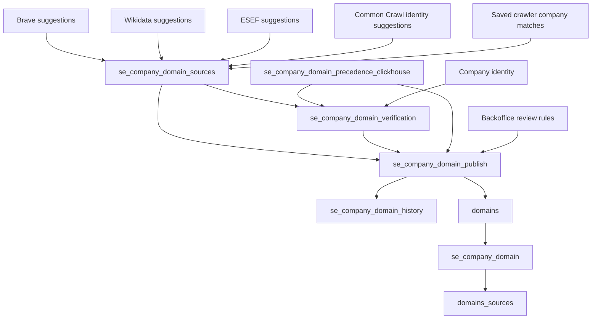

# Assets contributing to Swedish company-domain associations

Original deployment audited 2026-09-28 against `uv run dg list defs --json`, source SQL and live
ClickHouse view definitions. This is a dependency inventory, not a migration.
The destination is `corpscout.se_company_domain` (singular).

## Main pipeline

Local Task 4 changes (not deployed): five source assets write `se_company_domain_sources`.
Canonical labels come from the read view `se_company_domain_sources_resolved`:

| Asset | Data read | Contribution |
|---|---|---|
| `se_company_domain_suggestions_brave` | `se_company_brave_search_results_latest_success`, populated by `company_brave_search_results` | Domains extracted from successful Swedish `official_website` answers. Initially uncertain; the answer is retained as evidence. Writes extraction checkpoints too. |
| `se_company_domain_suggestions_wikidata` | `wikidata_company_domains`, `wikidata_company_identifiers`, `company_identifier`, `se_company_basic_info` | Current official-website claims linked by Swedish organisation number or LEI. |
| `se_company_domain_suggestions_esef_filing` | `se_esef_domains`, `se_esef_filings`, `se_company_basic_info` | Filing website evidence. Excludes references whose roles are only auditor, social media or external reference. Preserves previous observations for failed document extractions. |
| `se_company_domain_suggestions_common_crawl_identity` | `company_domain_suggestions_active`, `company_domain_suggestion_evidence_active`, `se_company_basic_info` | Existing identity-match candidates and their evidence. Does not crawl websites. |

| `se_company_domain_suggestions_crawler_lookup` | `website_company_lookup_results_latest`, populated by ordinary site-info/full crawls | Saved Swedish matches by requested website. Preserves skips/failures without creating evidence; explicit not-found withdraws prior claims. No network/model calls. |

Three assets apply association policy and publish:

| Asset | Output / responsibility |
|---|---|
| `se_company_domain_precedence_clickhouse` | Synchronizes the default field/source priorities in `se_company_domain_precedence`. |
| `se_company_domain_verification` | Optionally verifies uncertain or conflicting suggestions with an LLM and writes `se_company_domain_verification`. Also depends on all five extractors and precedence. |
| `se_company_domain_publish` | Reads suggestions, precedence, review rules, company identity and saved verification. Writes change history, registers missing `domains` parents, then publishes current `se_company_domain` rows with `domain_id`. Does not call an LLM. |

## Source-producing assets

- **Brave:** `company_brave_queue_input` → `company_brave_search_results` →
  `se_company_domain_suggestions_brave`. The browser service performs the batch
  execution and ClickHouse publication under the results asset.
- **Wikidata:** `wikidata_clickhouse_canonical_contacts` publishes the company-domain
  observations after `wikidata_snapshot_complete`. The actual identifier producer
  is the asset `wikidata_company_identifiers`, backed by the Python function named
  `wikidata_company_identifiers_clickhouse`. `company_identifier_clickhouse` supplies
  the company-to-LEI mapping used by the SQL. The shared Wikidata source pipeline
  explains the non-Swedish registry assets in the full dependency list below.
- **ESEF:** `esef_domains_clickhouse` consumes
  `esef_document_contact_candidates_clickhouse`, `esef_facts_clickhouse` and
  `esef_filings_clickhouse`. The live `se_esef_domains` view additionally joins
  `esef_entity_registry_map`, produced by `esef_entity_registry_map_clickhouse`,
  filtering to Swedish register-verified mappings.
- **Common Crawl:** `sweden_company_domain_suggestions_dbt_run` activates the
  completed output of `company_domain_suggestions_dbt`,
  `company_domain_suggestion_evidence_dbt` and
  `company_domain_identifier_matches_dbt`. Their staging/intermediate assets
  compare identifiers and exact address-plus-NACE evidence. The live `*_active`
  views select the latest activated dbt discovery run for each country.
- **Company identity:** `se_company_basic_info_fold` is the declared dependency.
  `se_company_basic_info_publish` and `se_company_basic_info_fold_companies` also
  write the same identity table and can change the context used for matching and
  verification. Basic-info source assets include `se_basic_info_suggestions_scb`,
  `se_basic_info_suggestions_bolagsverket`, `se_basic_info_suggestions_esef`,
  `se_basic_info_suggestions_wikidata`, `se_basic_info_suggestions_ratsit` and
  `se_basic_info_suggestions_llm`.

## Contributions outside normal asset dependencies

- Backoffice writes Swedish review decisions directly to `se_company_domain_rule`.
  Publication consumes these rules. The `se_company_domain_resolved` view applies
  the latest reviewer overlay immediately, without waiting for publication. Backoffice
  requests a country-based `domains_company_filter` refresh after each decision; the
  compact contribution index is independent of reviewer decisions.
- The initial migration `000408` imported existing associations and review rules.
  This is historical initialization, not an ongoing source asset.
- Global/company/domain precedence and retained source observations affect the fold;
  they must survive the proposed central-domain refactor.

## Missing or misleading dependency edges

1. **Crawler matching is now connected in local Task 4 code.** Its adapter depends on
   `website_company_lookup_results` and company identity. The result AssetSpec depends
   on site-info/full-crawl producers. The new adapter is included in sync/refresh jobs.
   Activation still requires migration/backfill; deployed behavior has not changed.
2. **Wikidata uses an outdated asset key.** The domain extractor declares
   `wikidata_company_identifiers_clickhouse`, but the registered executable asset
   is `wikidata_company_identifiers`. The old name appears as a non-executable
   external placeholder. This is a lineage/selection gap; it does not prove the
   underlying identifier table is empty or stale.
3. **Some SQL dependencies are not declared.** Examples are
   `company_identifier_clickhouse` for Wikidata LEI links,
   `esef_entity_registry_map_clickhouse` behind `se_esef_domains`, and the input
   datasets read by `web_domain_identity_features_clickhouse`.
   `se_company_basic_info_fold` also has no declared source dependencies, despite
   reading the basic-info suggestion table. Consequently, the registered ancestor
   list is not a complete refresh plan for every SQL input.

## Related assets that do not currently contribute upstream

- `sweden_company_domain_suggestions_duckdb` and
  `sweden_company_domain_suggestions_clickhouse` are the older suggestion branch.
  They write legacy suggestion tables. The live active views used by the current
  extractor select dbt tables, so this branch is not an input to the current fold.
- `domains`, `websites`, `pages`, `domains_search`,
  `sweden_companies_current_clickhouse` consume or project domain information downstream.
  They do not supply the five current association evidence sources.
- DNS, Webtech and Common Crawl graph rankings do not directly create Swedish
  company-domain associations in this pipeline.

## Jobs

- `se_company_domain_sync_job`: five source extractors plus precedence.
- `se_company_domain_refresh_job`: those six assets, verification and publication.
- `se_company_domain_brave_job`: Brave extraction plus precedence only.

These jobs select the listed steps; selecting them does not automatically run all
upstream source ingestion assets. For the central-domain change, preserve these
association responsibilities while registering domain/website identities centrally.

## Complete registered ancestor inventory

The snapshot contains **119 nodes including `se_company_domain_publish`**:
**108 executable assets and 11 external/non-executable nodes**. The inventory below
is generated by recursively following `dependency_keys` from that publication asset.
The additional SQL inputs and gaps above are deliberately listed separately.

| Asset key | Kind | Direct registered dependencies |
|---|---|---|
| `brazil_comp_rfb_clickhouse_companies` | Executable | `brazil_comp_rfb_companies_duckdb` |
| `brazil_comp_rfb_companies_duckdb` | Executable | `brazil_comp_rfb_empresas_duckdb`, `brazil_comp_rfb_estabelecimentos_duckdb`, `brazil_comp_rfb_reference_duckdb`, `brazil_comp_rfb_simples_duckdb` |
| `brazil_comp_rfb_empresas_duckdb` | Executable | `brazil_comp_rfb_snapshot_files_duckdb` |
| `brazil_comp_rfb_estabelecimentos_duckdb` | Executable | `brazil_comp_rfb_snapshot_files_duckdb` |
| `brazil_comp_rfb_raw_archives_s3` | Executable | — |
| `brazil_comp_rfb_reference_duckdb` | Executable | `brazil_comp_rfb_snapshot_files_duckdb` |
| `brazil_comp_rfb_simples_duckdb` | Executable | `brazil_comp_rfb_snapshot_files_duckdb` |
| `brazil_comp_rfb_snapshot_files_duckdb` | Executable | `brazil_comp_rfb_raw_archives_s3` |
| `company_brave_queue_input` | Executable | — |
| `company_brave_search_results` | Executable | `company_brave_queue_input` |
| `company_domain_identifier_matches_dbt` | Executable | `int_company_domain_identifier_candidates`, `int_company_domain_identifier_match_classification` |
| `company_domain_suggestion_evidence_dbt` | Executable | `int_company_domain_address_nace_matches`, `int_company_domain_candidates`, `int_company_domain_identifier_candidates`, `int_company_domain_identifier_match_classification` |
| `company_domain_suggestions_dbt` | Executable | `int_company_domain_candidates` |
| `corpscout/commoncrawl_domain_identifiers` | External | — |
| `corpscout/commoncrawl_domains` | External | — |
| `corpscout/commoncrawl_industries` | External | — |
| `corpscout/commoncrawl_page_jsonld` | External | — |
| `corpscout/gleif_lei_records` | External | — |
| `corpscout/se_bolagsverket_companies` | External | — |
| `corpscout/se_company_address` | External | — |
| `corpscout/se_company_basic_info` | External | — |
| `corpscout/se_industries` | External | — |
| `corpscout/se_scb_companies` | External | — |
| `czech_ares_clickhouse_companies` | Executable | `czech_ares_companies_duckdb` |
| `czech_ares_companies_duckdb` | Executable | `czech_ares_res_raw_duckdb` |
| `czech_ares_res_raw_duckdb` | Executable | — |
| `denmark_cvr_active_s3` | Executable | — |
| `denmark_cvr_backfill_s3` | Executable | — |
| `denmark_cvr_companies_duckdb` | Executable | `denmark_cvr_active_s3`, `denmark_cvr_backfill_s3` |
| `esef_document_artifacts_s3` | Executable | `esef_document_extraction_manifest_s3` |
| `esef_document_contact_candidates_clickhouse` | Executable | `esef_document_contact_candidates_duckdb` |
| `esef_document_contact_candidates_duckdb` | Executable | `esef_document_artifacts_s3` |
| `esef_document_extraction_manifest_s3` | Executable | `esef_filings_index_duckdb` |
| `esef_domains_clickhouse` | Executable | `esef_document_contact_candidates_clickhouse`, `esef_facts_clickhouse`, `esef_filings_clickhouse` |
| `esef_facts_clickhouse` | Executable | `esef_filing_facts_duckdb` |
| `esef_filing_facts_duckdb` | Executable | `esef_document_artifacts_s3` |
| `esef_filings_clickhouse` | Executable | `esef_filings_index_duckdb` |
| `esef_filings_index_duckdb` | Executable | — |
| `finland_ytj_all_companies_duckdb` | Executable | — |
| `finland_ytj_resolved_clickhouse` | Executable | `finland_ytj_resolved_fi_companies`, `finland_ytj_resolved_fi_company_addresses`, `finland_ytj_resolved_fi_industries`, `finland_ytj_resolved_fi_names`, `finland_ytj_resolved_fi_websites` |
| `finland_ytj_resolved_fi_companies` | Executable | `finland_ytj_all_companies_duckdb` |
| `finland_ytj_resolved_fi_company_addresses` | Executable | `finland_ytj_all_companies_duckdb` |
| `finland_ytj_resolved_fi_industries` | Executable | `finland_ytj_all_companies_duckdb` |
| `finland_ytj_resolved_fi_names` | Executable | `finland_ytj_all_companies_duckdb` |
| `finland_ytj_resolved_fi_websites` | Executable | `finland_ytj_all_companies_duckdb` |
| `france_sirene_clickhouse_companies` | Executable | `france_sirene_companies_duckdb` |
| `france_sirene_companies_duckdb` | Executable | `france_sirene_etablissement_siege_raw_duckdb`, `france_sirene_unite_legale_raw_duckdb` |
| `france_sirene_etablissement_siege_raw_duckdb` | Executable | — |
| `france_sirene_unite_legale_raw_duckdb` | Executable | — |
| `int_company_domain_address_matches` | Executable | `stg_se_company_match_features`, `stg_web_domain_match_features` |
| `int_company_domain_address_nace_candidates` | Executable | `int_company_domain_address_nace_matches` |
| `int_company_domain_address_nace_matches` | Executable | `int_company_domain_address_matches`, `stg_se_company_match_features`, `stg_web_domain_match_features` |
| `int_company_domain_candidates` | Executable | `int_company_domain_address_nace_candidates`, `int_company_domain_identifier_candidates` |
| `int_company_domain_identifier_candidates` | Executable | `int_company_domain_identifier_match_classification` |
| `int_company_domain_identifier_match_classification` | Executable | `int_company_domain_identifier_matches`, `web_domain_identity_features_clickhouse` |
| `int_company_domain_identifier_matches` | Executable | `stg_se_company_domain_identifier_features`, `web_domain_identity_features_clickhouse` |
| `latvia_address_buildings_duckdb` | Executable | — |
| `latvia_address_cities_duckdb` | Executable | — |
| `latvia_address_municipalities_duckdb` | Executable | — |
| `latvia_company_activity_duckdb` | Executable | — |
| `latvia_ur_clickhouse_companies` | Executable | `latvia_address_buildings_duckdb`, `latvia_address_cities_duckdb`, `latvia_address_municipalities_duckdb`, `latvia_company_activity_duckdb`, `latvia_ur_entities_duckdb` |
| `latvia_ur_entities_duckdb` | Executable | — |
| `norway_brreg_entities_snapshot_clickhouse` | Executable | `norway_brreg_entities_snapshot_no_companies_parquet`, `norway_brreg_entities_snapshot_no_company_addresses_parquet`, `norway_brreg_entities_snapshot_no_company_contacts_parquet`, `norway_brreg_entities_snapshot_no_industries_parquet`, `norway_brreg_entities_snapshot_no_websites_parquet` |
| `norway_brreg_entities_snapshot_no_companies_parquet` | Executable | `norway_brreg_entities_snapshot_s3` |
| `norway_brreg_entities_snapshot_no_company_addresses_parquet` | Executable | `norway_brreg_entries_snapshot_csv_raw_s3` |
| `norway_brreg_entities_snapshot_no_company_contacts_parquet` | Executable | `norway_brreg_entries_snapshot_csv_raw_s3` |
| `norway_brreg_entities_snapshot_no_industries_parquet` | Executable | `norway_brreg_entities_snapshot_s3` |
| `norway_brreg_entities_snapshot_no_websites_parquet` | Executable | `norway_brreg_entities_snapshot_s3` |
| `norway_brreg_entities_snapshot_s3` | Executable | `norway_brreg_entries_snapshot_raw_s3` |
| `norway_brreg_entries_snapshot_csv_raw_s3` | Executable | — |
| `norway_brreg_entries_snapshot_raw_s3` | Executable | — |
| `se_company_basic_info_fold` | Executable | — |
| `se_company_domain_precedence_clickhouse` | Executable | — |
| `se_company_domain_publish` | Executable | `se_company_domain_verification` |
| `se_company_domain_suggestions_brave` | Executable | `company_brave_search_results` |
| `se_company_domain_suggestions_common_crawl_identity` | Executable | `se_company_basic_info_fold`, `sweden_company_domain_suggestions_dbt_run` |
| `se_company_domain_suggestions_esef_filing` | Executable | `esef_domains_clickhouse`, `se_company_basic_info_fold` |
| `se_company_domain_suggestions_wikidata` | Executable | `se_company_basic_info_fold`, `wikidata_clickhouse_canonical_contacts`, `wikidata_company_identifiers_clickhouse` |
| `se_company_domain_verification` | Executable | `se_company_domain_precedence_clickhouse`, `se_company_domain_suggestions_brave`, `se_company_domain_suggestions_common_crawl_identity`, `se_company_domain_suggestions_esef_filing`, `se_company_domain_suggestions_wikidata` |
| `stg_se_company_domain_identifier_features` | Executable | `stg_se_company_match_features` |
| `stg_se_company_match_features` | Executable | `corpscout/gleif_lei_records`, `corpscout/se_bolagsverket_companies`, `corpscout/se_company_address`, `corpscout/se_company_basic_info`, `corpscout/se_industries`, `corpscout/se_scb_companies` |
| `stg_web_domain_match_features` | Executable | `corpscout/commoncrawl_domain_identifiers`, `corpscout/commoncrawl_domains`, `corpscout/commoncrawl_industries`, `corpscout/commoncrawl_page_jsonld` |
| `sweden_company_domain_suggestions_dbt_run` | Executable | `company_domain_identifier_matches_dbt`, `company_domain_suggestion_evidence_dbt`, `company_domain_suggestions_dbt` |
| `uk_companies_house_clickhouse_companies` | Executable | `uk_companies_house_companies_duckdb` |
| `uk_companies_house_companies_duckdb` | Executable | `uk_companies_house_raw_duckdb` |
| `uk_companies_house_raw_duckdb` | Executable | `uk_companies_house_register_archive_s3` |
| `uk_companies_house_register_archive_s3` | Executable | — |
| `web_domain_identity_features_clickhouse` | Executable | — |
| `wikidata_clickhouse_canonical_contacts` | Executable | `wikidata_snapshot_complete` |
| `wikidata_companies` | Executable | `wikidata_companies_duckdb` |
| `wikidata_companies_duckdb` | Executable | `wikidata_raw_snapshot` |
| `wikidata_company_identifiers` | Executable | `wikidata_company_identifiers_duckdb` |
| `wikidata_company_identifiers_clickhouse` | External | — |
| `wikidata_company_identifiers_duckdb` | Executable | `wikidata_raw_snapshot` |
| `wikidata_company_identifiers_raw` | Executable | `wikidata_company_pages_raw` |
| `wikidata_company_listings` | Executable | `wikidata_company_listings_duckdb` |
| `wikidata_company_listings_duckdb` | Executable | `wikidata_raw_snapshot` |
| `wikidata_company_pages_raw` | Executable | `wikidata_company_source_units` |
| `wikidata_company_people` | Executable | `wikidata_company_people_duckdb` |
| `wikidata_company_people_duckdb` | Executable | `wikidata_raw_snapshot` |
| `wikidata_company_people_raw` | Executable | `wikidata_company_pages_raw` |
| `wikidata_company_profiles_raw` | Executable | `wikidata_company_pages_raw` |
| `wikidata_company_relationships` | Executable | `wikidata_company_relationships_duckdb` |
| `wikidata_company_relationships_duckdb` | Executable | `wikidata_raw_snapshot` |
| `wikidata_company_relationships_raw` | Executable | `wikidata_company_pages_raw` |
| `wikidata_company_source_snapshot` | Executable | `wikidata_company_identifiers_raw`, `wikidata_company_pages_raw`, `wikidata_company_people_raw`, `wikidata_company_profiles_raw`, `wikidata_company_relationships_raw`, `wikidata_persons_raw` |
| `wikidata_company_source_units` | Executable | `brazil_comp_rfb_clickhouse_companies`, `czech_ares_clickhouse_companies`, `denmark_cvr_companies_duckdb`, `finland_ytj_resolved_clickhouse`, `france_sirene_clickhouse_companies`, `latvia_ur_clickhouse_companies`, `norway_brreg_entities_snapshot_clickhouse`, `se_company_basic_info_fold`, `uk_companies_house_clickhouse_companies`, `wikidata_exchanges_raw` |
| `wikidata_company_websites` | Executable | `wikidata_company_websites_duckdb` |
| `wikidata_company_websites_duckdb` | Executable | `wikidata_raw_snapshot` |
| `wikidata_exchanges` | Executable | `wikidata_exchanges_duckdb` |
| `wikidata_exchanges_duckdb` | Executable | `wikidata_raw_snapshot` |
| `wikidata_exchanges_raw` | Executable | — |
| `wikidata_persons` | Executable | `wikidata_persons_duckdb` |
| `wikidata_persons_duckdb` | Executable | `wikidata_raw_snapshot` |
| `wikidata_persons_raw` | Executable | `wikidata_company_people_raw` |
| `wikidata_raw_snapshot` | Executable | `wikidata_company_source_snapshot` |
| `wikidata_seed_extraction_runs` | Executable | `wikidata_seed_extraction_runs_duckdb` |
| `wikidata_seed_extraction_runs_duckdb` | Executable | `wikidata_raw_snapshot` |
| `wikidata_snapshot_complete` | Executable | `wikidata_companies`, `wikidata_company_identifiers`, `wikidata_company_listings`, `wikidata_company_people`, `wikidata_company_relationships`, `wikidata_company_websites`, `wikidata_exchanges`, `wikidata_persons`, `wikidata_seed_extraction_runs` |

## Retired serving copies (2026-09-28)

`company_domains`, `company_domain_current` and their two dbt build tables are
removed by migration 000464, after reader cutover in 000461. The shared
`company_serving_current` publisher continues to publish its other datasets.
`se_company_domain_resolved` is a read-only view over `se_company_domain` and
`se_company_domain_rule`, so new evidence and review decisions are visible
without a second domain publication. No global association table replaces the
removed copies. Migration 000462 introduces the separate `domains_sources`
contribution index and stable central `domain_id` references. Country publication
registers `domains` before its country association row. The separate index publisher
then derives one membership per domain/table. Company counts read country summaries.

## Task 4 copy and reference contracts (local only)

Normal writers target `se_company_domain_sources`; only the explicit
`se_company_domain_sources_backfill` reads the legacy suggestion table. The fold resolves
canonical labels from central inventory, retaining source scores, precedence, paid-answer
fingerprints and the independent review store. Task 5 prepares the compact
`domains_sources` publisher and copy. Production index and physical summary/history/review
key cutover remain pending; these local changes do not claim they are already migrated. See `domain-design.md` for replay and rollout ordering.
