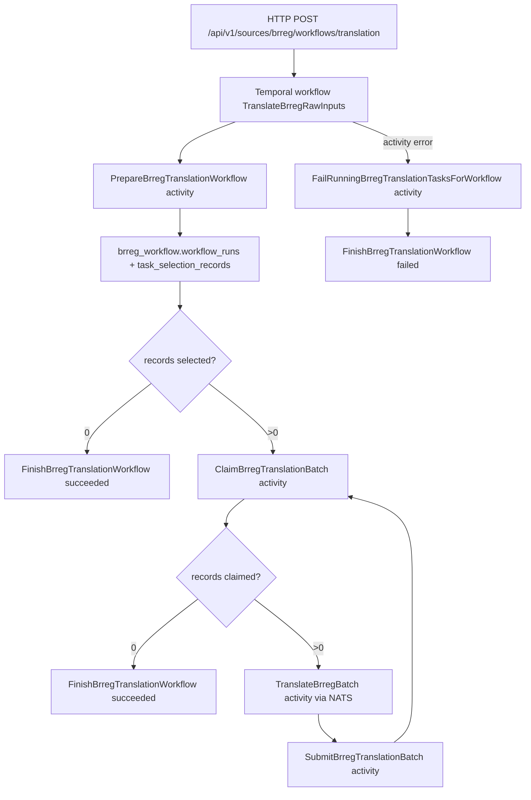

# BRREG Translation Workflow Implementation Plan

> **For agentic workers:** REQUIRED SUB-SKILL: Use superpowers:subagent-driven-development (recommended) or superpowers:executing-plans to implement this plan task-by-task. Steps use checkbox (`- [ ]`) syntax for tracking.

**Goal:** Replace the empty `TranslateBrregRawInputs` Temporal workflow with a real BRREG translation workflow that prepares a DB-backed selection, claims translation batches, sends each batch to the NATS-backed translation client, stores per-record results, and finishes the workflow run with useful counters.

**Architecture:** Corpscout owns BRREG workflow/task/artifact state in `brreg_workflow.*`. Temporal owns execution ordering and retries. The workflow stays source-specific and direct: it calls named activities in order, and the activities use the existing concrete `brregdb.Gateway` and `translationclient.Client`; no new generic workflow framework or unnecessary interfaces are added.

**Tech Stack:** Go, Temporal Go SDK, sqlc generated queries, pgx, `log/slog`, `github.com/cockroachdb/errors`, NATS-backed `translationclient`.

---

## Current State

`corpscout/scheduler/internal/brreg/workflow/translation.go` defines `TranslateBrregRawInputs`, but it returns `Status: "empty"` and does not execute activities.

`corpscout/scheduler/internal/brreg/actions/translation_actions.go` already has three concrete activities:

- `ClaimBrregTranslationBatch`
- `TranslateBrregBatch`
- `SubmitBrregTranslationBatch`

`corpscout/scheduler/internal/db/gen/brreg_workflow.sql.go` already has sqlc functions for the missing DB lifecycle pieces:

- `BeginBrregWorkflowRun`
- `CreateBrregWorkflowTaskSelection`
- `ClaimBrregWorkflowTaskSelectionBatch`
- `InsertBrregWorkflowTranslationResult`
- `FinishBrregWorkflowTaskAttempt`
- `FailRunningBrregWorkflowTasksForRun`
- `FinishBrregWorkflowRunWithStats`

The implementation should add thin source-specific glue around those existing query shapes, then make the workflow call those activities directly.

## File Structure

- Modify `corpscout/scheduler/internal/brreg/workflow/translation.go`
  - Owns the Temporal workflow, activity names, workflow defaults, result counters, and activity options.
- Create `corpscout/scheduler/internal/brreg/workflow/translation_test.go`
  - Uses the Temporal test suite to prove the workflow loops over batches, drains cleanly, and fails correctly when an activity fails.
- Create `corpscout/scheduler/internal/brreg/db/workflow_runs.go`
  - Adds concrete gateway methods for preparing a workflow run/selection, finishing a workflow run, and failing active tasks for a run.
- Create `corpscout/scheduler/internal/brreg/db/workflow_runs_test.go`
  - Tests deterministic selection definition/defaulting/hash behavior without needing a real database.
- Modify `corpscout/scheduler/internal/brreg/actions/translation_actions.go`
  - Adds BRREG translation workflow lifecycle activities: prepare, finish, and fail-running-tasks.
- Modify `corpscout/scheduler/internal/brreg/actions/translation_actions_test.go`
  - Adds unit tests for input validation and command construction for the new activities.
- Modify `corpscout/scheduler/internal/app/brreg_translation_temporal.go`
  - Registers the new activities by explicit names using `RegisterActivityWithOptions`.
- Modify `corpscout/scheduler/internal/httpapi/workflow_triggers.go`
  - Passes optional advanced translation workflow parameters through to the workflow input.
- Modify `corpscout/scheduler/internal/httpapi/workflow_triggers_test.go`
  - Verifies the HTTP trigger builds the expected workflow input.

## Defaults And Request Shape

Keep existing request fields and add optional advanced fields that can be hidden from the UI until needed:

```go
type TranslateBrregRawInputsInput struct {
	IDs         []string          `json:"ids,omitempty"`
	Filters     map[string]string `json:"filters,omitempty"`
	Limit       int               `json:"limit,omitempty"`
	BatchSize   int               `json:"batch_size,omitempty"`
	MaxAttempts int               `json:"max_attempts,omitempty"`
	Trigger     string            `json:"trigger,omitempty"`

	MaxParallelTasks int    `json:"max_parallel_tasks,omitempty"`
	LeaseSeconds     int    `json:"lease_seconds,omitempty"`
	Provider         string `json:"provider,omitempty"`
	Model            string `json:"model,omitempty"`
	PromptVersion    string `json:"prompt_version,omitempty"`
	SourceLang       string `json:"source_lang,omitempty"`
	TargetLang       string `json:"target_lang,omitempty"`
	MaxServiceRetries int   `json:"max_service_retries,omitempty"`
}
```

Use deterministic workflow defaults:

```go
const (
	defaultTranslationLimit            = 1000
	defaultTranslationBatchSize        = 50
	defaultTranslationMaxAttempts      = 3
	defaultTranslationLeaseSeconds     = 900
	defaultTranslationMaxParallelTasks = 50
	defaultTranslationServiceRetries   = 2
)
```

`Limit=0` means use the default. `BatchSize=0`, `MaxAttempts=0`, `LeaseSeconds=0`, and `MaxParallelTasks=0` also use defaults. Negative values remain invalid at the HTTP boundary.

## Workflow Data Flow



## Task 1: Add Failing Workflow Tests

**Files:**

- Create `corpscout/scheduler/internal/brreg/workflow/translation_test.go`
- Modify later: `corpscout/scheduler/internal/brreg/workflow/translation.go`

- [ ] **Step 1: Write a test for the drained workflow case**

```go
package workflow

import (
	"testing"

	"github.com/stretchr/testify/require"
	"go.temporal.io/sdk/activity"
	"go.temporal.io/sdk/testsuite"
)

func TestTranslateBrregRawInputsFinishesWhenSelectionIsEmpty(t *testing.T) {
	var suite testsuite.WorkflowTestSuite
	env := suite.NewTestWorkflowEnvironment()

	env.RegisterWorkflow(TranslateBrregRawInputs)
	env.RegisterActivityWithOptions(func(PrepareBrregTranslationWorkflowInput) (PrepareBrregTranslationWorkflowResult, error) {
		return PrepareBrregTranslationWorkflowResult{
			WorkflowRunID:   "9f03a113-0c1f-495e-98b8-bbc2dedc1d4c",
			SelectionHash:   "selection-empty",
			RecordsSelected: 0,
			BatchSize:       50,
			MaxAttempts:     3,
		}, nil
	}, activity.RegisterOptions{Name: "PrepareBrregTranslationWorkflow"})
	env.RegisterActivityWithOptions(func(FinishBrregTranslationWorkflowInput) (FinishBrregTranslationWorkflowResult, error) {
		return FinishBrregTranslationWorkflowResult{}, nil
	}, activity.RegisterOptions{Name: "FinishBrregTranslationWorkflow"})

	env.ExecuteWorkflow(TranslateBrregRawInputs, TranslateBrregRawInputsInput{Limit: 1000, BatchSize: 50})

	require.True(t, env.IsWorkflowCompleted())
	require.NoError(t, env.GetWorkflowError())

	var result TranslateBrregRawInputsResult
	require.NoError(t, env.GetWorkflowResult(&result))
	require.Equal(t, "drained", result.Status)
	require.EqualValues(t, 0, result.RecordsSelected)
	require.EqualValues(t, 0, result.RecordsClaimed)
}
```

- [ ] **Step 2: Run the test and verify it fails**

Run:

```bash
cd /Users/graovic/pulsarpoint/ppoint/companycollect/corpscout/scheduler
GOWORK=off go test ./internal/brreg/workflow -run TestTranslateBrregRawInputsFinishesWhenSelectionIsEmpty -count=1
```

Expected: FAIL because `PrepareBrregTranslationWorkflowInput`, `PrepareBrregTranslationWorkflowResult`, and the real workflow behavior do not exist yet.

- [ ] **Step 3: Write a test for multiple batches**

```go
func TestTranslateBrregRawInputsProcessesBatchesUntilClaimDrains(t *testing.T) {
	var suite testsuite.WorkflowTestSuite
	env := suite.NewTestWorkflowEnvironment()

	env.RegisterWorkflow(TranslateBrregRawInputs)
	env.RegisterActivityWithOptions(func(PrepareBrregTranslationWorkflowInput) (PrepareBrregTranslationWorkflowResult, error) {
		return PrepareBrregTranslationWorkflowResult{
			WorkflowRunID:   "9f03a113-0c1f-495e-98b8-bbc2dedc1d4c",
			SelectionHash:   "selection-two-batches",
			RecordsSelected: 3,
			BatchSize:       2,
			MaxAttempts:     3,
		}, nil
	}, activity.RegisterOptions{Name: "PrepareBrregTranslationWorkflow"})

	claimCalls := 0
	env.RegisterActivityWithOptions(func(input ClaimBrregTranslationBatchInput) (ClaimBrregTranslationBatchResult, error) {
		claimCalls++
		switch claimCalls {
		case 1:
			return ClaimBrregTranslationBatchResult{Records: []ClaimedTranslationRecord{
				{RawRecordID: "raw-1", TaskAttemptID: "attempt-1", OrganizationNumber: "111", RawPayload: []byte(`{"navn":"A"}`)},
				{RawRecordID: "raw-2", TaskAttemptID: "attempt-2", OrganizationNumber: "222", RawPayload: []byte(`{"navn":"B"}`)},
			}}, nil
		case 2:
			return ClaimBrregTranslationBatchResult{Records: []ClaimedTranslationRecord{
				{RawRecordID: "raw-3", TaskAttemptID: "attempt-3", OrganizationNumber: "333", RawPayload: []byte(`{"navn":"C"}`)},
			}}, nil
		default:
			return ClaimBrregTranslationBatchResult{}, nil
		}
	}, activity.RegisterOptions{Name: "ClaimBrregTranslationBatch"})

	env.RegisterActivityWithOptions(func(input TranslateBrregBatchInput) (TranslateBrregBatchResult, error) {
		results := make([]TranslationRecordResult, 0, len(input.Records))
		for _, record := range input.Records {
			results = append(results, TranslationRecordResult{
				RawRecordID:        record.RawRecordID,
				TaskAttemptID:      record.TaskAttemptID,
				OrganizationNumber: record.OrganizationNumber,
				Status:             "succeeded",
				TranslatedPayload:  map[string]any{"name": "translated"},
				Provider:           input.Provider,
				Model:              input.Model,
				PromptVersion:      "v1",
			})
		}
		return TranslateBrregBatchResult{
			Status:           "succeeded",
			RecordsSeen:      len(input.Records),
			RecordsCompleted: len(input.Records),
			Results:          results,
		}, nil
	}, activity.RegisterOptions{Name: "TranslateBrregBatch"})

	env.RegisterActivityWithOptions(func(input SubmitBrregTranslationBatchInput) (SubmitBrregTranslationBatchResult, error) {
		return SubmitBrregTranslationBatchResult{
			RecordsSubmitted: int32(len(input.Results)),
			RecordsCompleted: int32(len(input.Results)),
		}, nil
	}, activity.RegisterOptions{Name: "SubmitBrregTranslationBatch"})
	env.RegisterActivityWithOptions(func(FinishBrregTranslationWorkflowInput) (FinishBrregTranslationWorkflowResult, error) {
		return FinishBrregTranslationWorkflowResult{}, nil
	}, activity.RegisterOptions{Name: "FinishBrregTranslationWorkflow"})

	env.ExecuteWorkflow(TranslateBrregRawInputs, TranslateBrregRawInputsInput{Limit: 3, BatchSize: 2})

	require.True(t, env.IsWorkflowCompleted())
	require.NoError(t, env.GetWorkflowError())

	var result TranslateBrregRawInputsResult
	require.NoError(t, env.GetWorkflowResult(&result))
	require.Equal(t, "succeeded", result.Status)
	require.EqualValues(t, 3, result.RecordsSelected)
	require.EqualValues(t, 3, result.RecordsClaimed)
	require.EqualValues(t, 3, result.RecordsCompleted)
	require.EqualValues(t, 0, result.RecordsFailed)
	require.EqualValues(t, 2, result.BatchesProcessed)
}
```

- [ ] **Step 4: Run the workflow package tests and verify they fail**

Run:

```bash
cd /Users/graovic/pulsarpoint/ppoint/companycollect/corpscout/scheduler
GOWORK=off go test ./internal/brreg/workflow -count=1
```

Expected: FAIL because the workflow and workflow-local DTOs are not implemented.

## Task 2: Implement Workflow DTOs And Orchestration

**Files:**

- Modify `corpscout/scheduler/internal/brreg/workflow/translation.go`

- [ ] **Step 1: Add workflow activity DTO aliases and constants**

Add these imports and constants to `translation.go`:

```go
import (
	"time"

	"github.com/cockroachdb/errors"
	"go.temporal.io/sdk/temporal"
	temporalworkflow "go.temporal.io/sdk/workflow"

	"github.com/pulsarpoint/corpscout/scheduler/internal/brreg/actions"
)

const (
	TranslateBrregRawInputsTaskQueue    = "brreg-translation"
	TranslateBrregRawInputsWorkflowName = "TranslateBrregRawInputs"

	prepareBrregTranslationWorkflowActivity       = "PrepareBrregTranslationWorkflow"
	claimBrregTranslationBatchActivity            = "ClaimBrregTranslationBatch"
	translateBrregBatchActivity                   = "TranslateBrregBatch"
	submitBrregTranslationBatchActivity           = "SubmitBrregTranslationBatch"
	failRunningBrregTranslationTasksActivity      = "FailRunningBrregTranslationTasksForWorkflow"
	finishBrregTranslationWorkflowActivity        = "FinishBrregTranslationWorkflow"

	defaultTranslationLimit            = 1000
	defaultTranslationBatchSize        = 50
	defaultTranslationMaxAttempts      = 3
	defaultTranslationLeaseSeconds     = 900
	defaultTranslationMaxParallelTasks = 50
	defaultTranslationServiceRetries   = 2
)

type PrepareBrregTranslationWorkflowInput = actions.PrepareBrregTranslationWorkflowInput
type PrepareBrregTranslationWorkflowResult = actions.PrepareBrregTranslationWorkflowResult
type FinishBrregTranslationWorkflowInput = actions.FinishBrregTranslationWorkflowInput
type FinishBrregTranslationWorkflowResult = actions.FinishBrregTranslationWorkflowResult
type ClaimBrregTranslationBatchInput = actions.ClaimBrregTranslationBatchInput
type ClaimBrregTranslationBatchResult = actions.ClaimBrregTranslationBatchResult
type ClaimedTranslationRecord = actions.ClaimedTranslationRecord
type TranslateBrregBatchInput = actions.TranslateBrregBatchInput
type TranslateBrregBatchResult = actions.TranslateBrregBatchResult
type TranslationRecordResult = actions.TranslationRecordResult
type SubmitBrregTranslationBatchInput = actions.SubmitBrregTranslationBatchInput
type SubmitBrregTranslationBatchResult = actions.SubmitBrregTranslationBatchResult
type FailRunningBrregTranslationTasksForWorkflowInput = actions.FailRunningBrregTranslationTasksForWorkflowInput
type FailRunningBrregTranslationTasksForWorkflowResult = actions.FailRunningBrregTranslationTasksForWorkflowResult
```

- [ ] **Step 2: Extend workflow input and result**

```go
type TranslateBrregRawInputsInput struct {
	IDs         []string          `json:"ids,omitempty"`
	Filters     map[string]string `json:"filters,omitempty"`
	Limit       int               `json:"limit,omitempty"`
	BatchSize   int               `json:"batch_size,omitempty"`
	MaxAttempts int               `json:"max_attempts,omitempty"`
	Trigger     string            `json:"trigger,omitempty"`

	MaxParallelTasks int    `json:"max_parallel_tasks,omitempty"`
	LeaseSeconds     int    `json:"lease_seconds,omitempty"`
	Provider         string `json:"provider,omitempty"`
	Model            string `json:"model,omitempty"`
	PromptVersion    string `json:"prompt_version,omitempty"`
	SourceLang       string `json:"source_lang,omitempty"`
	TargetLang       string `json:"target_lang,omitempty"`
	MaxServiceRetries int   `json:"max_service_retries,omitempty"`
}

type TranslateBrregRawInputsResult struct {
	Status           string `json:"status"`
	WorkflowRunID    string `json:"workflow_run_id,omitempty"`
	SelectionHash    string `json:"selection_hash,omitempty"`
	RecordsSelected  int32  `json:"records_selected"`
	RecordsClaimed   int32  `json:"records_claimed"`
	RecordsCompleted int32  `json:"records_completed"`
	RecordsFailed    int32  `json:"records_failed"`
	RecordsSkipped   int32  `json:"records_skipped"`
	BatchesProcessed int32  `json:"batches_processed"`
}
```

- [ ] **Step 3: Add deterministic default helpers**

```go
func normalizeTranslateBrregInput(input TranslateBrregRawInputsInput) TranslateBrregRawInputsInput {
	if input.Limit <= 0 {
		input.Limit = defaultTranslationLimit
	}
	if input.BatchSize <= 0 {
		input.BatchSize = defaultTranslationBatchSize
	}
	if input.MaxAttempts <= 0 {
		input.MaxAttempts = defaultTranslationMaxAttempts
	}
	if input.MaxParallelTasks <= 0 {
		input.MaxParallelTasks = defaultTranslationMaxParallelTasks
	}
	if input.LeaseSeconds <= 0 {
		input.LeaseSeconds = defaultTranslationLeaseSeconds
	}
	if input.MaxServiceRetries <= 0 {
		input.MaxServiceRetries = defaultTranslationServiceRetries
	}
	if input.Trigger == "" {
		input.Trigger = "manual"
	}
	return input
}
```

- [ ] **Step 4: Implement activity options**

```go
func brregTranslationActivityContext(ctx temporalworkflow.Context) temporalworkflow.Context {
	return temporalworkflow.WithActivityOptions(ctx, temporalworkflow.ActivityOptions{
		StartToCloseTimeout: 5 * time.Minute,
		RetryPolicy: &temporal.RetryPolicy{
			InitialInterval:    2 * time.Second,
			BackoffCoefficient: 2,
			MaximumInterval:    30 * time.Second,
			MaximumAttempts:    1,
		},
	})
}

func brregTranslationServiceActivityContext(ctx temporalworkflow.Context, leaseSeconds int) temporalworkflow.Context {
	timeout := time.Duration(leaseSeconds) * time.Second
	if timeout < 10*time.Minute {
		timeout = 10 * time.Minute
	}
	return temporalworkflow.WithActivityOptions(ctx, temporalworkflow.ActivityOptions{
		StartToCloseTimeout: timeout,
		RetryPolicy: &temporal.RetryPolicy{
			InitialInterval:    5 * time.Second,
			BackoffCoefficient: 2,
			MaximumInterval:    1 * time.Minute,
			MaximumAttempts:    3,
		},
	})
}
```

- [ ] **Step 5: Implement the workflow loop**

```go
func TranslateBrregRawInputs(ctx temporalworkflow.Context, input TranslateBrregRawInputsInput) (TranslateBrregRawInputsResult, error) {
	input = normalizeTranslateBrregInput(input)
	ctx = brregTranslationActivityContext(ctx)

	workflowInfo := temporalworkflow.GetInfo(ctx)
	result := TranslateBrregRawInputsResult{Status: "running"}

	var prepared PrepareBrregTranslationWorkflowResult
	prepareInput := PrepareBrregTranslationWorkflowInput{
		TemporalWorkflowID: workflowInfo.WorkflowExecution.ID,
		IDs:                input.IDs,
		Filters:            input.Filters,
		Limit:              int32(input.Limit),
		BatchSize:          int32(input.BatchSize),
		MaxAttempts:        int32(input.MaxAttempts),
		Trigger:            input.Trigger,
	}
	if err := temporalworkflow.ExecuteActivity(ctx, prepareBrregTranslationWorkflowActivity, prepareInput).Get(ctx, &prepared); err != nil {
		return TranslateBrregRawInputsResult{}, errors.Wrap(err, "prepare brreg translation workflow")
	}

	result.WorkflowRunID = prepared.WorkflowRunID
	result.SelectionHash = prepared.SelectionHash
	result.RecordsSelected = prepared.RecordsSelected

	finished := false
	defer func() {
		if finished || result.WorkflowRunID == "" {
			return
		}
		disconnectedCtx, cancel := temporalworkflow.NewDisconnectedContext(ctx)
		defer cancel()
		_ = temporalworkflow.ExecuteActivity(disconnectedCtx, failRunningBrregTranslationTasksActivity, FailRunningBrregTranslationTasksForWorkflowInput{
			WorkflowRunID: result.WorkflowRunID,
			MaxAttempts:   int32(input.MaxAttempts),
			Error:         "translation workflow failed before all claimed records were submitted",
		}).Get(disconnectedCtx, nil)
		_ = temporalworkflow.ExecuteActivity(disconnectedCtx, finishBrregTranslationWorkflowActivity, FinishBrregTranslationWorkflowInput{
			WorkflowRunID:    result.WorkflowRunID,
			Status:           "failed",
			RecordsSeen:      result.RecordsClaimed,
			RecordsCompleted: result.RecordsCompleted,
			RecordsFailed:    result.RecordsFailed,
			Error:            "translation workflow failed",
		}).Get(disconnectedCtx, nil)
	}()

	if prepared.RecordsSelected == 0 {
		result.Status = "drained"
		if err := finishBrregTranslationWorkflow(ctx, result, "succeeded", ""); err != nil {
			return result, err
		}
		finished = true
		return result, nil
	}

	for {
		var claimed ClaimBrregTranslationBatchResult
		claimInput := ClaimBrregTranslationBatchInput{
			WorkflowRunID:    prepared.WorkflowRunID,
			SelectionHash:    prepared.SelectionHash,
			BatchSize:        prepared.BatchSize,
			MaxParallelTasks: int32(input.MaxParallelTasks),
			LeaseSeconds:     int32(input.LeaseSeconds),
			MaxAttempts:      prepared.MaxAttempts,
			WorkerID:         workflowInfo.WorkflowExecution.ID,
		}
		if err := temporalworkflow.ExecuteActivity(ctx, claimBrregTranslationBatchActivity, claimInput).Get(ctx, &claimed); err != nil {
			return result, errors.Wrap(err, "claim brreg translation batch")
		}
		if len(claimed.Records) == 0 {
			break
		}

		result.BatchesProcessed++
		result.RecordsClaimed += int32(len(claimed.Records))

		var translated TranslateBrregBatchResult
		serviceCtx := brregTranslationServiceActivityContext(ctx, input.LeaseSeconds)
		translateInput := TranslateBrregBatchInput{
			Records:       claimed.Records,
			Provider:      input.Provider,
			Model:         input.Model,
			PromptVersion: input.PromptVersion,
			SourceLang:    input.SourceLang,
			TargetLang:    input.TargetLang,
			MaxRetries:    input.MaxServiceRetries,
		}
		if err := temporalworkflow.ExecuteActivity(serviceCtx, translateBrregBatchActivity, translateInput).Get(serviceCtx, &translated); err != nil {
			return result, errors.Wrap(err, "translate brreg batch")
		}

		var submitted SubmitBrregTranslationBatchResult
		submitInput := SubmitBrregTranslationBatchInput{
			Results:     translated.Results,
			MaxAttempts: prepared.MaxAttempts,
		}
		if err := temporalworkflow.ExecuteActivity(ctx, submitBrregTranslationBatchActivity, submitInput).Get(ctx, &submitted); err != nil {
			return result, errors.Wrap(err, "submit brreg translation batch")
		}

		result.RecordsCompleted += submitted.RecordsCompleted
		result.RecordsFailed += submitted.RecordsFailed
		result.RecordsSkipped += submitted.RecordsSkipped
	}

	result.Status = "succeeded"
	if err := finishBrregTranslationWorkflow(ctx, result, "succeeded", ""); err != nil {
		return result, err
	}
	finished = true
	return result, nil
}
```

- [ ] **Step 6: Add workflow finish helper**

```go
func finishBrregTranslationWorkflow(
	ctx temporalworkflow.Context,
	result TranslateBrregRawInputsResult,
	status string,
	errorMessage string,
) error {
	input := FinishBrregTranslationWorkflowInput{
		WorkflowRunID:    result.WorkflowRunID,
		Status:           status,
		RecordsSeen:      result.RecordsClaimed,
		RecordsCompleted: result.RecordsCompleted,
		RecordsFailed:    result.RecordsFailed,
		Error:            errorMessage,
	}
	if err := temporalworkflow.ExecuteActivity(ctx, finishBrregTranslationWorkflowActivity, input).Get(ctx, nil); err != nil {
		return errors.Wrap(err, "finish brreg translation workflow")
	}
	return nil
}
```

- [ ] **Step 7: Run workflow tests**

Run:

```bash
cd /Users/graovic/pulsarpoint/ppoint/companycollect/corpscout/scheduler
GOWORK=off go test ./internal/brreg/workflow -count=1
```

Expected: PASS after the aliases and workflow logic compile.

## Task 3: Add DB Gateway Workflow Lifecycle Methods

**Files:**

- Create `corpscout/scheduler/internal/brreg/db/workflow_runs.go`
- Create `corpscout/scheduler/internal/brreg/db/workflow_runs_test.go`

- [ ] **Step 1: Write tests for defaulting and deterministic selection hash**

```go
package brregdb

import (
	"testing"

	"github.com/stretchr/testify/require"
)

func TestPrepareWorkflowDefinitionIsDeterministic(t *testing.T) {
	command := PrepareWorkflowCommand{
		Source:             "brreg",
		Action:             "translate",
		TaskType:           TaskTypeTranslate,
		Trigger:            "manual",
		WorkflowID:         "brreg-translation-test",
		IDs:                []string{"b", "a"},
		Filters:            map[string]string{"state": "raw", "query": "acme"},
		Limit:              0,
		BatchSize:          0,
		MaxAttempts:        0,
		DefaultLimit:       1000,
		DefaultBatchSize:   50,
		DefaultMaxAttempts: 3,
	}

	first, firstHash, err := workflowSelectionDefinition(command)
	require.NoError(t, err)
	second, secondHash, err := workflowSelectionDefinition(command)
	require.NoError(t, err)

	require.JSONEq(t, string(first), string(second))
	require.Equal(t, firstHash, secondHash)
	require.Contains(t, string(first), `"limit":1000`)
	require.Contains(t, string(first), `"batch_size":50`)
	require.Contains(t, string(first), `"max_attempts":3`)
}
```

- [ ] **Step 2: Run the DB tests and verify they fail**

Run:

```bash
cd /Users/graovic/pulsarpoint/ppoint/companycollect/corpscout/scheduler
GOWORK=off go test ./internal/brreg/db -run TestPrepareWorkflowDefinitionIsDeterministic -count=1
```

Expected: FAIL because `workflowSelectionDefinition` does not exist.

- [ ] **Step 3: Implement pure selection definition helpers**

```go
package brregdb

import (
	"context"
	"crypto/sha256"
	"encoding/hex"
	"encoding/json"
	"sort"

	"github.com/cockroachdb/errors"

	db "github.com/pulsarpoint/corpscout/scheduler/internal/db/gen"
)

type workflowSelectionPayload struct {
	Source      string            `json:"source"`
	Action      string            `json:"action"`
	TaskType    string            `json:"task_type"`
	Trigger     string            `json:"trigger"`
	WorkflowID  string            `json:"workflow_id"`
	IDs         []string          `json:"ids,omitempty"`
	Filters     map[string]string `json:"filters,omitempty"`
	Limit       int32             `json:"limit"`
	BatchSize   int32             `json:"batch_size"`
	MaxAttempts int32             `json:"max_attempts"`
}

func workflowSelectionDefinition(command PrepareWorkflowCommand) ([]byte, string, error) {
	normalized := normalizePrepareWorkflowCommand(command)
	payload := workflowSelectionPayload{
		Source:      normalized.Source,
		Action:      normalized.Action,
		TaskType:    normalized.TaskType.String(),
		Trigger:     normalized.Trigger,
		WorkflowID:  normalized.WorkflowID,
		IDs:         append([]string(nil), normalized.IDs...),
		Filters:     normalized.Filters,
		Limit:       normalized.Limit,
		BatchSize:   normalized.BatchSize,
		MaxAttempts: normalized.MaxAttempts,
	}
	sort.Strings(payload.IDs)

	data, err := json.Marshal(payload)
	if err != nil {
		return nil, "", errors.Wrap(err, "marshal brreg workflow selection definition")
	}
	sum := sha256.Sum256(data)
	return data, hex.EncodeToString(sum[:]), nil
}

func normalizePrepareWorkflowCommand(command PrepareWorkflowCommand) PrepareWorkflowCommand {
	if command.Trigger == "" {
		command.Trigger = "manual"
	}
	if command.Limit <= 0 {
		command.Limit = command.DefaultLimit
	}
	if command.BatchSize <= 0 {
		command.BatchSize = command.DefaultBatchSize
	}
	if command.MaxAttempts <= 0 {
		command.MaxAttempts = command.DefaultMaxAttempts
	}
	if command.Filters == nil {
		command.Filters = map[string]string{}
	}
	return command
}
```

- [ ] **Step 4: Implement gateway lifecycle methods**

```go
func (g *Gateway) PrepareWorkflow(ctx context.Context, command PrepareWorkflowCommand) (PreparedWorkflow, error) {
	if g.pool == nil {
		return PreparedWorkflow{}, errors.New("brreg workflow database pool not available")
	}
	command = normalizePrepareWorkflowCommand(command)
	if command.Source == "" {
		return PreparedWorkflow{}, errors.New("source is required")
	}
	if command.Action == "" {
		return PreparedWorkflow{}, errors.New("action is required")
	}
	if command.TaskType == "" {
		return PreparedWorkflow{}, errors.New("task type is required")
	}
	if command.WorkflowID == "" {
		return PreparedWorkflow{}, errors.New("workflow id is required")
	}

	selectionDefinition, selectionHash, err := workflowSelectionDefinition(command)
	if err != nil {
		return PreparedWorkflow{}, err
	}

	var prepared PreparedWorkflow
	err = g.withTx(ctx, func(q *db.Queries) error {
		workflowRunID, err := q.BeginBrregWorkflowRun(ctx, db.BeginBrregWorkflowRunParams{
			OrchestratorRunID: command.WorkflowID,
			RunType:           command.Action,
			Metadata:          selectionDefinition,
		})
		if err != nil {
			return errors.Wrap(err, "begin brreg workflow run")
		}

		row, err := q.CreateBrregWorkflowTaskSelection(ctx, db.CreateBrregWorkflowTaskSelectionParams{
			TaskType:            command.TaskType.String(),
			SelectedIds:         command.IDs,
			Query:               stringFilter(command.Filters, "query"),
			LifecycleState:      stringFilter(command.Filters, "state"),
			TranslationStatus:   stringFilter(command.Filters, "translation_status"),
			DomainStatus:        stringFilter(command.Filters, "domain_status"),
			FinancialStatus:     stringFilter(command.Filters, "financial_status"),
			EnhancedStatus:      stringFilter(command.Filters, "enhanced_status"),
			MaxAttempts:         command.MaxAttempts,
			Limit:               command.Limit,
			WorkflowRunID:       workflowRunID,
			SelectionHash:       selectionHash,
			SelectionDefinition: selectionDefinition,
		})
		if err != nil {
			return errors.Wrap(err, "create brreg workflow task selection")
		}

		prepared = PreparedWorkflow{
			WorkflowRunID:   workflowRunID,
			SelectionHash:   row.SelectionHash,
			RecordsSelected: row.RecordsSelected,
			BatchSize:       command.BatchSize,
			MaxAttempts:     command.MaxAttempts,
		}
		return nil
	})
	if err != nil {
		return PreparedWorkflow{}, err
	}
	return prepared, nil
}

func (g *Gateway) FinishWorkflowRun(ctx context.Context, command FinishWorkflowRunCommand) error {
	if g.pool == nil {
		return errors.New("brreg workflow database pool not available")
	}
	_, err := db.New(g.pool).FinishBrregWorkflowRunWithStats(ctx, db.FinishBrregWorkflowRunWithStatsParams{
		Status:           command.Status.String(),
		RecordsSeen:      command.RecordsSeen,
		RecordsCompleted: command.RecordsCompleted,
		RecordsFailed:    command.RecordsFailed,
		Error:            command.Error,
		ID:               command.WorkflowRunID,
	})
	if err != nil {
		return errors.Wrap(err, "finish brreg workflow run")
	}
	return nil
}

func (g *Gateway) FailRunningTasksForWorkflowRun(ctx context.Context, command FinishWorkflowRunCommand) (int32, error) {
	if g.pool == nil {
		return 0, errors.New("brreg workflow database pool not available")
	}
	maxAttempts := command.MaxAttempts
	if maxAttempts <= 0 {
		maxAttempts = g.maxAttempts
	}
	failedTasks, err := db.New(g.pool).FailRunningBrregWorkflowTasksForRun(ctx, db.FailRunningBrregWorkflowTasksForRunParams{
		MaxAttempts:   maxAttempts,
		Error:         command.Error,
		WorkflowRunID: command.WorkflowRunID,
	})
	if err != nil {
		return 0, errors.Wrap(err, "fail running brreg workflow tasks for run")
	}
	return failedTasks, nil
}

func stringFilter(filters map[string]string, key string) *string {
	if filters == nil {
		return nil
	}
	value := filters[key]
	if value == "" {
		return nil
	}
	return &value
}
```

- [ ] **Step 5: Run DB tests**

Run:

```bash
cd /Users/graovic/pulsarpoint/ppoint/companycollect/corpscout/scheduler
GOWORK=off go test ./internal/brreg/db -count=1
```

Expected: PASS.

## Task 4: Add Translation Workflow Lifecycle Activities

**Files:**

- Modify `corpscout/scheduler/internal/brreg/actions/translation_actions.go`
- Modify `corpscout/scheduler/internal/brreg/actions/translation_actions_test.go`

- [ ] **Step 1: Add activity DTOs**

```go
type PrepareBrregTranslationWorkflowInput struct {
	TemporalWorkflowID string            `json:"temporal_workflow_id"`
	IDs                []string          `json:"ids,omitempty"`
	Filters            map[string]string `json:"filters,omitempty"`
	Limit              int32             `json:"limit"`
	BatchSize          int32             `json:"batch_size"`
	MaxAttempts        int32             `json:"max_attempts"`
	Trigger            string            `json:"trigger,omitempty"`
}

type PrepareBrregTranslationWorkflowResult struct {
	WorkflowRunID   string `json:"workflow_run_id"`
	SelectionHash   string `json:"selection_hash"`
	RecordsSelected int32  `json:"records_selected"`
	BatchSize       int32  `json:"batch_size"`
	MaxAttempts     int32  `json:"max_attempts"`
}

type FinishBrregTranslationWorkflowInput struct {
	WorkflowRunID    string `json:"workflow_run_id"`
	Status           string `json:"status"`
	RecordsSeen      int32  `json:"records_seen"`
	RecordsCompleted int32  `json:"records_completed"`
	RecordsFailed    int32  `json:"records_failed"`
	Error            string `json:"error,omitempty"`
}

type FinishBrregTranslationWorkflowResult struct{}

type FailRunningBrregTranslationTasksForWorkflowInput struct {
	WorkflowRunID string `json:"workflow_run_id"`
	MaxAttempts   int32  `json:"max_attempts"`
	Error         string `json:"error"`
}

type FailRunningBrregTranslationTasksForWorkflowResult struct {
	FailedTasks int32 `json:"failed_tasks"`
}
```

- [ ] **Step 2: Add prepare activity**

```go
func (a *TranslationActions) PrepareBrregTranslationWorkflow(ctx context.Context, input PrepareBrregTranslationWorkflowInput) (PrepareBrregTranslationWorkflowResult, error) {
	if a == nil || a.gateway == nil {
		return PrepareBrregTranslationWorkflowResult{}, errors.New("brreg translation gateway not available")
	}
	slog.DebugContext(ctx, "preparing brreg translation workflow",
		"temporal_workflow_id", input.TemporalWorkflowID,
		"ids_count", len(input.IDs),
		"filters_count", len(input.Filters),
		"limit", input.Limit,
		"batch_size", input.BatchSize,
		"max_attempts", input.MaxAttempts,
		"trigger", input.Trigger,
	)
	prepared, err := a.gateway.PrepareWorkflow(ctx, brregdb.PrepareWorkflowCommand{
		Source:             "brreg",
		Action:             "translate",
		TaskType:           brregdb.TaskTypeTranslate,
		Trigger:            input.Trigger,
		WorkflowID:         input.TemporalWorkflowID,
		IDs:                input.IDs,
		Filters:            input.Filters,
		Limit:              input.Limit,
		BatchSize:          input.BatchSize,
		MaxAttempts:        input.MaxAttempts,
		DefaultLimit:       1000,
		DefaultBatchSize:   50,
		DefaultMaxAttempts: 3,
	})
	if err != nil {
		return PrepareBrregTranslationWorkflowResult{}, errors.Wrap(err, "prepare brreg translation workflow")
	}
	return PrepareBrregTranslationWorkflowResult{
		WorkflowRunID:   prepared.WorkflowRunID.String(),
		SelectionHash:   prepared.SelectionHash,
		RecordsSelected: prepared.RecordsSelected,
		BatchSize:       prepared.BatchSize,
		MaxAttempts:     prepared.MaxAttempts,
	}, nil
}
```

- [ ] **Step 3: Add finish and fail-running activities**

```go
func (a *TranslationActions) FinishBrregTranslationWorkflow(ctx context.Context, input FinishBrregTranslationWorkflowInput) (FinishBrregTranslationWorkflowResult, error) {
	if a == nil || a.gateway == nil {
		return FinishBrregTranslationWorkflowResult{}, errors.New("brreg translation gateway not available")
	}
	workflowRunID, err := uuid.Parse(input.WorkflowRunID)
	if err != nil {
		return FinishBrregTranslationWorkflowResult{}, errors.Wrap(err, "parse brreg translation workflow run id")
	}
	var workflowError *string
	if input.Error != "" {
		workflowError = &input.Error
	}
	if err := a.gateway.FinishWorkflowRun(ctx, brregdb.FinishWorkflowRunCommand{
		WorkflowRunID:    workflowRunID,
		Status:           brregdb.WorkflowRunStatus(input.Status),
		RecordsSeen:      input.RecordsSeen,
		RecordsCompleted: input.RecordsCompleted,
		RecordsFailed:    input.RecordsFailed,
		Error:            workflowError,
	}); err != nil {
		return FinishBrregTranslationWorkflowResult{}, errors.Wrap(err, "finish brreg translation workflow")
	}
	return FinishBrregTranslationWorkflowResult{}, nil
}

func (a *TranslationActions) FailRunningBrregTranslationTasksForWorkflow(ctx context.Context, input FailRunningBrregTranslationTasksForWorkflowInput) (FailRunningBrregTranslationTasksForWorkflowResult, error) {
	if a == nil || a.gateway == nil {
		return FailRunningBrregTranslationTasksForWorkflowResult{}, errors.New("brreg translation gateway not available")
	}
	workflowRunID, err := uuid.Parse(input.WorkflowRunID)
	if err != nil {
		return FailRunningBrregTranslationTasksForWorkflowResult{}, errors.Wrap(err, "parse brreg translation workflow run id")
	}
	errorMessage := input.Error
	failedTasks, err := a.gateway.FailRunningTasksForWorkflowRun(ctx, brregdb.FinishWorkflowRunCommand{
		WorkflowRunID: workflowRunID,
		MaxAttempts:   input.MaxAttempts,
		Error:         &errorMessage,
	})
	if err != nil {
		return FailRunningBrregTranslationTasksForWorkflowResult{}, errors.Wrap(err, "fail running brreg translation tasks for workflow")
	}
	return FailRunningBrregTranslationTasksForWorkflowResult{FailedTasks: failedTasks}, nil
}
```

- [ ] **Step 4: Run action tests**

Run:

```bash
cd /Users/graovic/pulsarpoint/ppoint/companycollect/corpscout/scheduler
GOWORK=off go test ./internal/brreg/actions -count=1
```

Expected: PASS.

## Task 5: Register New Activities Directly

**Files:**

- Modify `corpscout/scheduler/internal/app/brreg_translation_temporal.go`
- Modify `corpscout/scheduler/internal/app/temporal_test.go`

- [ ] **Step 1: Register lifecycle activities explicitly**

Add these registrations before the existing claim/translate/submit registrations:

```go
worker.RegisterActivityWithOptions(
	resources.translationActions.PrepareBrregTranslationWorkflow,
	activity.RegisterOptions{Name: "PrepareBrregTranslationWorkflow"},
)
worker.RegisterActivityWithOptions(
	resources.translationActions.FailRunningBrregTranslationTasksForWorkflow,
	activity.RegisterOptions{Name: "FailRunningBrregTranslationTasksForWorkflow"},
)
worker.RegisterActivityWithOptions(
	resources.translationActions.FinishBrregTranslationWorkflow,
	activity.RegisterOptions{Name: "FinishBrregTranslationWorkflow"},
)
```

- [ ] **Step 2: Run app tests**

Run:

```bash
cd /Users/graovic/pulsarpoint/ppoint/companycollect/corpscout/scheduler
GOWORK=off go test ./internal/app -count=1
```

Expected: PASS.

## Task 6: Pass Optional Advanced Input From HTTP

**Files:**

- Modify `corpscout/scheduler/internal/httpapi/workflow_triggers.go`
- Modify `corpscout/scheduler/internal/httpapi/workflow_triggers_test.go`

- [ ] **Step 1: Extend HTTP request DTO**

```go
type startBrregTranslationWorkflowRequest struct {
	IDs         []string          `json:"ids,omitempty"`
	Filters     map[string]string `json:"filters,omitempty"`
	Limit       int               `json:"limit,omitempty"`
	BatchSize   int               `json:"batch_size,omitempty"`
	MaxAttempts int               `json:"max_attempts,omitempty"`
	Trigger     string            `json:"trigger,omitempty"`

	MaxParallelTasks int    `json:"max_parallel_tasks,omitempty"`
	LeaseSeconds     int    `json:"lease_seconds,omitempty"`
	Provider         string `json:"provider,omitempty"`
	Model            string `json:"model,omitempty"`
	PromptVersion    string `json:"prompt_version,omitempty"`
	SourceLang       string `json:"source_lang,omitempty"`
	TargetLang       string `json:"target_lang,omitempty"`
	MaxServiceRetries int   `json:"max_service_retries,omitempty"`
}
```

- [ ] **Step 2: Pass values into workflow input**

```go
input := brregworkflow.TranslateBrregRawInputsInput{
	IDs:               req.IDs,
	Filters:           req.Filters,
	Limit:             req.Limit,
	BatchSize:         req.BatchSize,
	MaxAttempts:       req.MaxAttempts,
	Trigger:           req.Trigger,
	MaxParallelTasks:  req.MaxParallelTasks,
	LeaseSeconds:      req.LeaseSeconds,
	Provider:          req.Provider,
	Model:             req.Model,
	PromptVersion:     req.PromptVersion,
	SourceLang:        req.SourceLang,
	TargetLang:        req.TargetLang,
	MaxServiceRetries: req.MaxServiceRetries,
}
```

- [ ] **Step 3: Validate negative advanced numbers**

```go
if req.MaxParallelTasks < 0 {
	return startBrregTranslationWorkflowRequest{}, errors.New("max_parallel_tasks must be greater than zero when provided")
}
if req.LeaseSeconds < 0 {
	return startBrregTranslationWorkflowRequest{}, errors.New("lease_seconds must be greater than zero when provided")
}
if req.MaxServiceRetries < 0 {
	return startBrregTranslationWorkflowRequest{}, errors.New("max_service_retries must be greater than zero when provided")
}
```

- [ ] **Step 4: Run HTTP API tests**

Run:

```bash
cd /Users/graovic/pulsarpoint/ppoint/companycollect/corpscout/scheduler
GOWORK=off go test ./internal/httpapi -run 'TestStartBrregTranslation|TestDecodeStartBrregTranslation' -count=1
```

Expected: PASS.

## Task 7: End-To-End Verification With Unit Test Boundary

**Files:**

- No new files.

- [ ] **Step 1: Run focused packages**

```bash
cd /Users/graovic/pulsarpoint/ppoint/companycollect/corpscout/scheduler
GOWORK=off go test ./internal/brreg/workflow ./internal/brreg/actions ./internal/brreg/db ./internal/app ./internal/httpapi -count=1
```

Expected: PASS.

- [ ] **Step 2: Run scheduler tests**

```bash
cd /Users/graovic/pulsarpoint/ppoint/companycollect/corpscout/scheduler
GOWORK=off go test ./... -count=1
```

Expected: PASS.

- [ ] **Step 3: Build scheduler**

```bash
cd /Users/graovic/pulsarpoint/ppoint/companycollect/corpscout/scheduler
GOWORK=off go build ./cmd/scheduler
```

Expected: exits with code 0.

## Task 8: Manual Smoke Test

**Files:**

- No new files.

- [ ] **Step 1: Start local Corpscout stack with Temporal, NATS, and translation service configured**

Use the existing local compose flow for Corpscout. Confirm the scheduler logs show the BRREG translation worker started on task queue `brreg-translation`.

- [ ] **Step 2: Trigger translation from the UI or HTTP**

Use a small limit first:

```bash
curl -sS -X POST http://localhost:8094/api/v1/sources/brreg/workflows/translation \
  -H 'content-type: application/json' \
  -d '{"limit":10,"batch_size":5,"max_attempts":3,"trigger":"manual"}'
```

Expected response:

```json
{
  "status": "started",
  "workflow": "TranslateBrregRawInputs",
  "workflow_id": "brreg-translation-...",
  "workflow_run_id": "..."
}
```

- [ ] **Step 3: Check Temporal**

Open Temporal UI and verify:

- Workflow type is `TranslateBrregRawInputs`.
- Task queue is `brreg-translation`.
- Activities appear in this order: prepare, claim, translate, submit, claim, finish.

- [ ] **Step 4: Check Corpscout DB state**

Run:

```sql
SELECT status, records_seen, records_completed, records_failed, error
FROM brreg_workflow.workflow_runs
WHERE run_type = 'translate'
ORDER BY started_at DESC
LIMIT 5;

SELECT status, count(*)
FROM brreg_workflow.translation_results
GROUP BY status
ORDER BY status;

SELECT status, count(*)
FROM brreg_workflow.raw_record_task_states
WHERE task_type = 'translate'
GROUP BY status
ORDER BY status;
```

Expected:

- Latest workflow run is `succeeded` when all claimed records were submitted.
- `translation_results` has one row for each submitted translation result.
- `raw_record_task_states` has `succeeded`, `failed_retryable`, or `failed_terminal` according to service result status.

## Error Handling Rules

- Activity errors that mean infrastructure failed, such as NATS unavailable, should fail the workflow activity and let Temporal retry it.
- DB-mutating activities should use `MaximumAttempts=1` because the current prepare, claim, and submit SQL paths are not fully idempotent. BRREG task leases and retryable task states handle recovery after the workflow fails.
- Per-record translation failures returned by the translation service should be submitted to Corpscout as result rows. They should not fail the workflow by themselves.
- If the workflow fails after records were claimed and before they were submitted, the disconnected cleanup should call `FailRunningBrregTranslationTasksForWorkflow` and then mark the workflow run as `failed`.
- Lower layers wrap errors with `cockroachdb/errors`.
- Boundary layers log once with `slog`.
- Do not log raw payloads, API keys, NATS credentials, or full translated payloads.

## Done Criteria

- `TranslateBrregRawInputs` no longer returns `Status: "empty"`.
- The workflow prepares a DB selection exactly once for a run.
- The workflow loops until `ClaimBrregTranslationBatch` returns zero records.
- Each claimed batch is sent to `TranslateBrregBatch`.
- Each translation service result is persisted by `SubmitBrregTranslationBatch`.
- Workflow counters in the Temporal result match submitted activity counters.
- `brreg_workflow.workflow_runs` is finished with useful stats.
- Unit tests pass for workflow, DB helper, actions, app registration, and HTTP trigger.
- `GOWORK=off go test ./...` passes in `corpscout/scheduler`.
